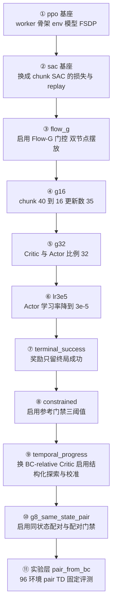

# 第 04 章 配置继承链 十层每层改了什么

> **前情提要**：前三章讲完了流程与数据流，里面出现了大量具体数字——96 个环境、chunk 长度 16、全局批 32、专家比例 0.25、每步 32 次更新。本章回答这些数字从哪来：它们分散在十层 Hydra 配置里，每一层只改几个键。读完本章你应该能拿着任意一份实验配置，自己推出第 03 章那些批大小。

**知识链接**：

- 上一章：[三种批与消费路径](./03_三种批与消费路径)
- 下一章：[chunk 语义与 Flow-G adapter](./05_chunk语义与FlowG适配器)

---

## 4.1 位置 为什么必须先讲配置

这条链路没有"一份实验配置"，只有一条**继承链**。最末端那个正式实验的 yaml 文件只有 20 行，其余上千行设置全部来自它的父配置。这带来两个后果：

1. **看单个文件无法知道实验在做什么**。你必须把整条链解析出来，才知道 `gamma` 到底是多少。
2. **改动的语义边界很清楚**。每一层只改自己那几个键，所以"这次实验和上次的差别"等于"最后一层改了什么"——这是这套组织方式真正的价值。



---

## 4.2 逐层看 每层引入了什么

### 第 1 层 PPO 基座

提供的是与算法无关的骨架：四类 worker 的分组名、环境任务配置的引用、GR00T 模型定义、FSDP 训练后端设置、以及最基础的环境参数。这一层已经定下了两个后面一直没变的数字：

```text
max_steps_per_rollout_epoch: 352
max_episode_steps: 350
```

第 01 章那个"一个 runner step ≈ 一个 episode"的结论，根源就在这两行。

### 第 2 层 SAC 基座

把损失类型从 PPO 换成 chunk SAC，随之引入一整套 off-policy 的东西：

| 键 | 值 | 含义 |
|---|---|---|
| `loss_type` | `embodied_groot_chunk_sac` | 决定用哪个 actor worker 实现 |
| `reward_type` | `chunk_level` | 奖励按 chunk 记账 |
| `gamma` | 0.99 | 折扣因子 |
| `tau` | 0.01 | 目标网络滑动平均系数 |
| `num_updates_per_step` | 4 | 每个 runner step 的更新次数 |
| `critic_actor_ratio` | 8 | 每 8 次 Critic 更新配 1 次 Actor 更新 |
| `actor_objective` | `awr_flow` | 默认的 Actor 目标是优势加权，不是直接爬 Q |
| `replay_buffer.*` | 缓存 2000 / 窗口 2000 / 最小 32 | replay 的容量与窗口 |
| `actor.global_batch_size` | 32 | 全局批 |
| `actor.micro_batch_size` | 2 | 微批 |
| `actor.optim.lr` | 3e-6 | Actor 学习率 |
| `actor.critic_optim.lr` | 1e-4 | Critic 学习率 |
| `chunk_length` | 40 | 动作块长度 |
| `denoising_steps` | 4 | Flow 去噪步数 |

注意这一层的 Actor 目标是 `awr_flow`（优势加权的流匹配），**不是**后面那个"直接最大化 Q"。目标函数是在第 3 层被换掉的。

### 第 3 层 flow_g 适配器层

这一层做了三件大事。

**一 换 Actor 目标为 `sac_flow_g`，并启用门控适配器。** 具体的门控结构是第 05 章的主题，这里只记住它引入了一个新的可训练模块和一套配置：

```text
flow_g: enabled true / freeze_pretrained_velocity true / hidden_dim 256 / gate_scale 2.0
```

**二 换成自动温度调节。** `alpha_type` 从固定值改为 `softplus` 自动调节，`target_entropy` 设为 0，`initial_alpha` 设为一个看起来很奇怪的 `4.0322580645e-6`。这个数不是拍的，第 06 章会推导它。

**三 定下两节点摆放。** env worker 在 4090 节点，rollout 和 actor 分别占 H20 节点的前四张和后四张卡。同时把训练环境数设为 48、评测环境数设为 48。

其余引入项：`critic_warmup_updates` 800、`sac_flow_bc_warmup_updates` 512、`sac_bc_coef` 0.1、`action_squash: tanh`、`path_density: sde_path`、`compute_path_log_prob: true`、`actor_backprop_steps: 4`。

### 第 4 层 g16

这一层名字里的 16 同时指两件事，容易混。

| 键 | 从 | 到 | 说明 |
|---|---:|---:|---|
| `chunk_length` 与 `num_action_chunks` | 40 | **16** | 动作块从 40 步缩到 16 步 |
| `critic_actor_ratio` | 8 | **16** | 每 16 次 Critic 更新配 1 次 Actor |
| `num_updates_per_step` | 4 | 35 | 每步更新次数大幅提高 |
| `initial_alpha` | 4.03e-6 | **1.008e-5** | 随 chunk 长度联动，见下 |
| `action_squash` | tanh | **none** | 不再对动作做 tanh 压缩 |
| `max_steps` | 440 | 50 | 短程实验 |
| `replay_buffer` | 2000/2000 | 缓存 384 / 专家缓存 256 / **窗口 512** | 第 03 章那个 512 就来自这里 |
| `save_episode_metrics` | 否 | **是** | 开始写逐布局 jsonl |
| 评测布局 | 无 | 48 个写死的 ID | 固定评测协议的起点 |
| 渲染 | 默认 | DLSS 抗锯齿 | 后面讨论评测抖动时会用到 |

`initial_alpha` 的联动不是巧合，配置校验里强制要求：

$$
\alpha_{\text{init}} = \frac{0.05}{5 \cdot H \cdot D}
$$

**这个公式在算什么**：把一个"每坐标 0.05"的温度换算成"整条去噪路径共 $5 \cdot H \cdot D$ 个坐标"时应该取的总温度。

| 符号 | 含义 | 本链路取值 |
|---|---|---|
| $H$ | 动作块长度 chunk_length | 16 |
| $D$ | 单步动作维度 | 62 |
| $5$ | 去噪步数 + 1，即 4 步转移加 1 个初始分布 | 5 |
| $0.05$ | 设计者选的"每坐标温度" | 0.05 |

**代入数字**：$5 \times 16 \times 62 = 4960$，于是 $\alpha_{\text{init}} = 0.05 / 4960 = 1.0080645 \times 10^{-5}$——正是配置里那个数。而 chunk 为 40 时 $5 \times 40 \times 62 = 12400$，$0.05/12400 = 4.032 \times 10^{-6}$，也正是第 3 层那个数。

**为什么要强制**：因为这条链路用的是**未归一化的路径对数密度**（第 06 章细讲），它的数值量级直接随 $H \cdot D$ 变化。如果换了 chunk 长度却不改温度，熵项在目标函数里的权重会跟着变几倍。配置校验用精确相等（相对容差 $10^{-9}$）把这个耦合钉死。

### 第 5 层 g32 与第 6 层 lr3e5

这两层很薄，各自只改一个东西：

- g32：`critic_actor_ratio` 16 → 32；
- lr3e5：Actor 学习率 1e-4 → **3e-5**。

Actor 学习率这个数会在第 17 章的位移预算核算里反复出现，它和"更新次数"共同决定了策略最多能走多远。

### 第 7 层 terminal_success

改奖励定义，同时把折扣因子改成 1.0：

```text
gamma: 1.0
bc_reward_mode: terminal_success
online_reward_mode: terminal_success
```

`gamma=1.0` 是这条链上第一个真正危险的隐性继承——它会一路传到下游，直到实验层显式改回 0.99。第 08 章会讲为什么在有限时域、且 Critic 输入不含剩余时间的情况下，不折扣会让价值函数定义不良。

### 第 8 层 constrained

启用 Actor 侧的参考门禁，一次引入四个数：

| 键 | 值 | 含义 |
|---|---:|---|
| `min_q_advantage` | 0.0 | 两个 Critic 都认为不比 BC 差才放行这个样本 |
| `max_critic_disagreement` | 0.1 | 双头分歧上限 |
| `max_action_mse` | 0.01 | 离 BC 动作的距离上限 |
| `action_mse_coefficient` | 1.0 | 靠近 BC 的正则权重 |

这四个数是第 16 章的主角。这里只强调一点：**门禁是逐样本的**，不通过的样本 Q 项被置零，但靠近 BC 那一项仍然生效。

### 第 9 层 temporal_progress

这是继承链上最重的一层，一次引入三个全新机制。

**一 换 Critic 架构。** `critic_architecture` 从扁平结构换成 `temporal_bc_relative`——把 Q 拆成状态价值与动作相对优势两部分，动作侧用一维卷积编码"与 BC 参考动作的差"。第 09 章专讲。

**二 启用结构化探索。** `structured_exploration.enabled: true`，候选数 4，时间相关系数 0.85，六个动作组各自的噪声尺度（位置 0.03、旋转 0.02、手 0.04），以及一个 `min_actor_delta_rms: 0.005` 的阈值。第 12 章专讲。

**三 启用 Critic 校准，而且阈值是"真的"。** 这一层的校准配置里，动作相关的四个门槛都设了实际数值：

```text
min_action_sensitivity: 0.02
min_advantage_progress_rank_correlation: 0.1
min_action_return_rank_gain: 0.0
min_action_shuffle_rank_drop: 0.02
```

记住这四行，第 10 层会把它们全部改成不生效的哨兵值——那是一次语义上很大的放宽，但从 diff 上看只是四个数字变了。

此外这一层把在线奖励改成带进度塑形的模式、专家比例设为 0.75、微批改成 8、环境数仍是 48。

### 第 10 层 g8_same_state_pair

启用同状态配对，并把 Critic 与 Actor 比例改回 8。关键引入项：

| 键 | 值 | 说明 |
|---|---|---|
| `same_state_ranking.enabled` | true | 早期的"只学符号"的配对排序损失 |
| `same_state_td` | 存在但 `enabled: false` | pair TD 的配置骨架先建好，此层不启用 |
| `sac_bc_coef` | **0.0** | 去掉 Actor 的 BC 锚 |
| `expert_cache_size` | **0** | 专家数据不再常驻内存缓存 |
| `critic_calibration.min_same_state_pair_*` | 256 / 0.65 / 0.25 | 留出配对窗口与判定阈值 |
| `min_action_sensitivity` 等四项 | **0.0 / -1.0 / -2.0 / -2.0** | 动作相关判据被改成哨兵值，实际不生效 |
| `require_fresh_pair_window_for_actor_after_critic_update` | true | Critic 更新后必须有新窗口才放行 Actor |

最后两行是这条链上最容易被忽略的语义变化：**校准门禁从"检验 Critic 会不会比较动作"退化成"检验 Q 能不能区分好坏状态 + 留出配对判定"**。第 18 章会说明为什么前者才是瓶颈。

### 第 11 层 实验层

真正跑的那几条实验在这一层，彼此只差几个键。

| 实验 | 关键改动 |
|---|---|
| `pair_from_bc_100step_fixed48` | 环境 48 → **96**，启用训练配对与 pair TD（批 64、系数 1.0、质量项 0.25），`gamma` 改回 **0.99**，更新数 32，专家比例 0.75，`sac_bc_coef` 回到 0.1，参考门禁重新启用，候选数改为 2，留出比例 0.25，env worker 占 4 张卡 |
| `relaxed_100step_fixed96` | 专家比例 0.75 → **0.25**，`sac_bc_coef` → **0.0**，参考门禁**关闭**，评测布局扩到 96 个，replay 落在临时目录且 checkpoint 不含 replay |
| `relaxed_200step_fixed96` | 上限 200 步，评测环境启用 PhysX 增强确定性 |
| `no_gate_resume_step50` | 从上一条的 checkpoint 续训；配对质量项系数 → **0.0**；校准**不再阻塞** Actor；评测复用训练环境；训练场景也启用增强确定性 |

到这里，第 03 章那些数字全部有了出处。

---

## 4.3 三条隐性继承的高风险项

"隐性继承"指的是：这个键在你正在看的文件里没有出现，但它的值会显著改变实验语义。

**一 折扣因子。** 第 7 层设为 1.0，一路传到第 10 层。如果一个新实验直接从第 10 层派生而忘了显式设置，它就会在不折扣的设定下训练。实验层里那行 `gamma: 0.99` 是必须存在的。

**二 专家缓存与采样窗口。** 第 4 层把窗口设成 512、第 10 层把专家缓存设成 0。这两个数不改变算法，但直接决定第 03 章那张复用强度表——也就是"每条数据被看多少次"。看到"expert_cache_size: 0"不要误解为"没有专家数据"，它只是不常驻内存缓存。

**三 奖励模式的两侧一致性。** 专家数据和在线数据各有自己的奖励模式键。第 9 层把在线侧改成带进度塑形，而专家侧仍是纯终局成功——两侧用不同的奖励函数却共享同一个 Q 网络。实验层把两侧都改回终局成功修掉了这个问题。第 10 章会算出这种不一致会造成多大的系统性偏移。

---

## 4.4 层之间的强制耦合校验

这条链路在配置解析阶段就会拒绝一批"看起来合法但语义矛盾"的组合。知道这些校验的存在，能省掉很多调试时间。

| 校验 | 内容 | 为什么 |
|---|---|---|
| 温度与 chunk | `initial_alpha` 必须精确等于 $0.05/(5HD)$ | 未归一化路径密度的量级随 $HD$ 变 |
| 回传步数 | `actor_backprop_steps` 必须等于 `denoising_steps` | Flow-G 目标要求整条去噪链可微 |
| 目标熵 | `sac_flow_g` 要求 `target_entropy = 0` | 路径密度不是终端动作密度，没有可用的启发式目标 |
| 固定温度 | 非 Flow-G 目标要求 `fixed_alpha = 0` | 同上，路径密度不能当熵用 |
| 动作压缩 | 只允许 `none` 或 `tanh` | 影响雅可比项的计算 |
| 全新配对起点 | `allow_fresh_pair_bc_start` 为真时要求关闭校准门禁 | 全新 Critic 不可能通过校准，否则 Actor 永不更新 |
| 留出窗口 | `min_same_state_pair_samples` 必须能被 actor rank 数整除 | 所有 rank 必须做同样次数的集合通信 |
| 零 BC 系数 | `sac_bc_coef = 0` 需要显式 `allow_online_zero_sac_bc_coef` | 防止无意中去掉唯一的锚 |

倒数第二行那条"全新起点与校准门禁互斥"是一个结构性问题：它意味着**你不能既从零训 Critic 又保留安全带**。第 18 章会讨论这两件事本不该互斥。

---

## 4.5 自己从配置推出批大小

给一份配置，按这个顺序推，五步就能算出第 03 章那张表。

**第一步 算 rank 数。** 从 `component_placement` 读出 actor 占几张卡，本链路是 4。

**第二步 算训练批。** 全局批 32，每 rank $32/4 = 8$；微批 8，所以梯度累积 $8/8 = 1$。

**第三步 算分层。** 专家比例 0.25，每 rank 每次更新 $\text{round}(8 \times 0.25) = 2$ 条专家 + 6 条在线。

**第四步 算 pair 批。** `same_state_td.batch_size` 是 64（全局），每 rank 16。

**第五步 算频率。** 每步 32 次更新；比例 8 意味着其中 4 次带 Actor；校准在预热期后跟着 Actor 更新走，也是 4 次；每次校准抽 `batch_size` 256 全局。

顺带算一下环境侧：训练环境 96 除以 env rank 数 4，得每 rank 24；`max_steps_per_rollout_epoch` 352 除以 chunk 16 得 22 次迭代。

---

## 4.6 旁支配置的用途

继承链上还挂着几条不用于正式训练的旁支，它们是这套工程实践里很有价值的一部分。

| 旁支 | 改了什么 | 用途 |
|---|---|---|
| `critic_warmup` | 单节点摆放、只训 Critic | 在正式训练前把 Critic 预热到可用状态 |
| `parity_eval` | `only_eval: true`，1 个 epoch | 同一份权重反复评测，用来量评测协议自身的抖动 |
| `train_mode_probe` | 1 步 1 epoch | 只跑一步，检查训练模式下的采样路径是否正常 |
| `smoke` | 2 步 | 启动前的冒烟测试，验证全链路能跑通 |
| `aggressive` | 提高更新强度 | 更新预算的对照实验 |
| `delayed` | 启用延迟训练管线 | 让采样与训练重叠的变体 |
| `stratified` | 启用分层采样 | 专家与在线比例的对照实验 |

`parity_eval` 尤其值得强调：它的存在说明设计者很早就意识到"同一份权重的评测结果会抖"这件事需要单独量化。第 19 章会用它的产物算噪声地板。

---

## 4.7 本章小结

| 问题 | 答案 |
|---|---|
| 一共几层 | 十一层，从 PPO 骨架一直到具体实验 |
| 哪层引入 Flow-G | 第 3 层，同时把 Actor 目标换成 `sac_flow_g` |
| chunk 16 从哪来 | 第 4 层，同时联动改了温度初值与动作压缩方式 |
| BC-relative Critic 与结构化探索从哪来 | 第 9 层 |
| 同状态配对从哪来 | 第 10 层启用配对机制，第 11 层才启用 pair TD |
| 最危险的隐性继承 | 折扣因子 1.0、专家与在线奖励模式不一致 |
| 校准门槛为何看着像开着实际没用 | 第 10 层把四条动作判据改成了哨兵值 |
| 怎么自己算批大小 | rank 数 → 全局批 → 分层比例 → pair 批 → 更新频率，五步 |

**下章预告**：配置讲完，进入模型侧。第 05 章讲策略：GR00T 的动作块到底是什么、为什么只训练一个乘性门控、门控如何做到初始化时完全等于原策略，以及那个"BC 参考动作"是怎么算出来的——后者的实现细节会推翻一个很容易犯的直觉错误。
