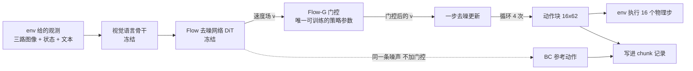

# 第 05 章 chunk 语义与 Flow-G 适配器

> **前情提要**：第 04 章把所有配置数字的出处理清了，其中第 3 层引入了一个叫 Flow-G 的门控适配器，第 4 层把动作块从 40 步缩到 16 步。本章讲这两件事：动作块到底是什么，以及为什么整个 VLA 只训练这一个小模块。

**知识链接**：

- [Flow Matching 与连续归一化流](/前置知识/000g_前置知识_Flow_Matching与连续归一化流)
- [FSDP 全分片数据并行](/前置知识/001i_前置知识_FSDP全分片数据并行)
- 上一章：[配置继承链](./04_配置继承链_十层每层改了什么)
- 下一章：[路径 log 密度与熵温度](./06_路径log密度与熵温度)

---

## 5.1 位置 策略在链路里的哪一格

先定位。策略这件事发生在 **rollout worker** 上，它在链路里的位置是：



上游给它的是观测，下游拿到的是一个动作块加一批元数据。整条链路里可训练的参数只有两块：**这个门控**，和 Critic。视觉语言骨干、动作编码器、去噪网络、动作解码器全部冻结。

---

## 5.2 动作块是什么 为什么是 16

### 5.2.1 形状与执行方式

GR00T 一次推理输出的不是一个动作，而是一个矩阵：

```text
形状 [16, 62]
16 = 动作块长度 chunk_length，即未来 16 个控制步
62 = 单步动作维度，双臂各含位置 旋转 手部
```

这 16 步会被**完整执行完**才重新推理一次。所以从环境角度看，策略的决策粒度不是"一步"而是"16 步一组"。这就是"chunk 级 SAC"的全部来源：状态转移被定义为"给定当前观测，执行一整个动作块，到达 16 步之后的观测"。

按第 01 章的时间尺度，一个动作块覆盖 $16 \times 0.00833 \approx 0.13$ 秒。

### 5.2.2 有效步掩码 为什么必须存在

episode 不会好心地在动作块边界结束。如果第 5 个控制步就成功了，剩下 11 步是填充出来的。所以每条记录都带一个长度 16 的布尔掩码 `chunk_sac_valid`，标记哪些步真的执行了。

后面所有涉及"这个 chunk 里发生了什么"的计算，第一件事都是乘这个掩码：奖励重标注只在有效步上生成、进度差只取第一个和最后一个有效步、动作编码时无效步被清零。第 08 章的 Bellman 方程里也会出现它。

### 5.2.3 为什么从 40 缩到 16

第 04 章记录了这个变化，这里给理由。动作块长度同时影响三件事：

| 变长的影响 | 变短的影响 |
|---|---|
| 一次推理管更久，rollout 计算更省 | 决策更频繁，策略能更快响应变化 |
| TD 的 bootstrap 跨度更大，价值传播更慢 | 单个 episode 里的决策点更多，样本更多 |
| 单条记录里"动作"这个对象的维度更高 | 动作空间维度更低，Critic 更容易学 |

第三行是关键。一个动作块被 Critic 当成一个整体输入，它的维度是 $H \times D$。40 步时是 $40 \times 62 = 2480$ 维，16 步时是 $16 \times 62 = 992$ 维。**让 Critic 在 2480 维空间里判断"这个动作好不好"比 992 维困难得多**，而这条链路的核心困难恰好就在这里（第 13 章、第 22 章会反复回到这个点）。

---

## 5.3 为什么不直接微调整个 VLA

在讲门控之前，要先说清楚为什么不用最直接的办法。

**参数量与显存。** 骨干是 20 亿参数级的视觉语言模型，加上 DiT。要在 RL 里训练它，需要同时放下参数、梯度、Adam 的两组动量，还要为整条 4 步去噪链保留激活值。

**BC 先验很容易被破坏。** 起点是一个已经能完成任务的策略，它的能力来自大规模模仿学习。RL 阶段的梯度信号（稀疏的成功奖励，经过一个刚开始训练的 Critic 转手）质量远低于模仿学习的监督信号。直接拿这种梯度更新整个网络，最可能的结果是先把已有能力破坏掉。

**Flow 策略的结构性困难。** 一个 Flow 策略输出动作要走 4 步去噪，动作对参数的依赖要穿过整条链。直接把 Q 的梯度传回整条链，梯度路径长、方差大。

于是这条链路选了一个很克制的方案：**冻结整个预训练策略，只在它的速度场输出上乘一个可学习的门。**

---

## 5.4 门控的定义

### 5.4.1 它插在哪一步

去噪网络在每一步会输出一个"速度场" $v_t$，形状和动作块一样是 $[H, D]$，含义是"当前的中间动作状态应该往哪个方向走多快"。原本这个 $v_t$ 直接进入去噪更新公式。Flow-G 在它和更新公式之间插了一个逐元素的乘性门：

$$
v_t^{\text{gated}} = g_\theta(v_t, x_t, t) \odot v_t
$$

**这个公式在做什么**：它不改变去噪网络的判断方向，只按元素调节"这一步该走多远"。门大于 1 表示放大原本的更新，小于 1 表示压缩。

| 符号 | 数学含义 | 在本链路中具体是什么 | 形状或典型值 |
|---|---|---|---|
| $v_t$ | 冻结去噪网络输出的速度场 | 预训练策略的原始判断 | $[B, 16, 62]$ |
| $x_t$ | 当前去噪中间状态 | 第 $t$ 步的中间动作 | $[B, 16, 62]$ |
| $t$ | 连续时间坐标 | 第 $i$ 步对应 $i/4$，取值 0、0.25、0.5、0.75 | 标量 |
| $g_\theta$ | 门控网络 | 三层小 MLP，唯一可训练的策略参数 | 输出 $[B,16,62]$ |
| $\odot$ | 逐元素相乘 | 每个时间步、每个动作维度各有自己的门 | — |
| $\theta$ | 门控参数 | 约十万量级参数 | — |

**为什么门是逐元素而不是一个标量**：62 维动作里位置、旋转、手部开合的物理量纲完全不同，16 个时间步在一次抓取里也处于不同阶段（接近、接触、施力）。逐元素允许策略学出"接触阶段的手部维度慢一点、自由移动阶段的位置维度快一点"这类调整。

**为什么门的输入要带 $x_t$ 和 $t$**：只看 $v_t$ 的话，网络无法区分"现在处于去噪早期还是末期"，也无法区分"当前动作已经到哪了"。带上这两项，每个去噪步可以有不同的策略。

### 5.4.2 门的具体形式

$$
g_\theta(v_t, x_t, t) = s \cdot \sigma\big(\mathrm{MLP}_\theta([v_t; x_t; t])\big)
$$

**这个公式在算什么**：把三样输入拼成一个向量，过一个小 MLP，用 sigmoid 压到 $(0,1)$，再乘一个尺度常数 $s$，得到门值。

| 符号 | 含义 | 取值 |
|---|---|---|
| $[v_t; x_t; t]$ | 沿最后一维拼接 | 维度 $62 + 62 + 1 = 125$ |
| $\mathrm{MLP}_\theta$ | 线性 125→256、SiLU 激活、线性 256→62 | 隐藏维 256 |
| $\sigma$ | sigmoid，把实数压到 $(0,1)$ | — |
| $s$ | 门尺度 `gate_scale` | 2.0 |

**门的取值范围**：因为 sigmoid 的值域是开区间 $(0,1)$，所以

$$
g \in (0, 2)
$$

这个上下界是硬的：门最多把速度放大到 2 倍，最少压缩到 0 倍（完全不动）。**策略能做的调整被结构性地限制在"沿原方向缩放"这一族里**——它不能让机器人往完全不同的方向动，只能改变每个维度每个时刻的推进力度。这既是安全性的来源，也是能力上限的来源。

**代入数字**：设某个坐标上 MLP 输出 $z = 0.3$，则

$$
g = 2 \times \sigma(0.3) = 2 \times \frac{1}{1 + e^{-0.3}} = 2 \times 0.5744 = 1.1488
$$

也就是这个坐标这一步的更新被放大约 15%。反之 $z = -0.3$ 给出 $g = 0.851$，压缩约 15%。

### 5.4.3 恒等初始化 为什么起点必须严格等于原策略

这是整个设计里最重要的工程细节。**训练刚开始时，门必须严格等于 1**，否则策略在第一步就偏离了那个已经能完成任务的 BC 起点。

做法是把 MLP 最后一层的权重全部置零、偏置置为 `gate_bias`（配置是 0）：

$$
z = W_2 \cdot \mathrm{SiLU}(W_1 u + b_1) + b_2 = 0 \cdot (\cdot) + 0 = 0
$$

$$
g = 2 \cdot \sigma(0) = 2 \times 0.5 = 1.0
$$

**逐项说明**：$W_2 = 0$ 让任何输入都得到零输出，所以 $z$ 与输入完全无关，恒为 0；`gate_bias = 0` 保证 $\sigma$ 落在中点 0.5；`gate_scale = 2.0` 把这个 0.5 抬回 1.0。三者缺一不可——这就是为什么尺度是 2 而不是 1。

**梯度方向**：注意 $W_2 = 0$ 只让**输出**为零，第一层权重是正常随机初始化的，所以 $\partial z / \partial W_2 \ne 0$，梯度可以正常流动。这是"零初始化最后一层"的标准技巧：**输出是恒等的，但不是死的**。

**日志佐证**：训练日志里 `flow_g_gate_mean` 在恢复训练的最初两步严格等于 `1.0`，`flow_g_gate_deviation`（门与 1 的平均绝对偏差）严格等于 `0.0`，之后才开始缓慢爬升。到第 91 步时门均值约 1.011、偏差约 0.0074，也就是**训练 41 步之后策略平均只把速度调整了 1%**。第 17 章会把这个位移量换算成"以当前学习率和更新次数，最多能走多远"。

---

## 5.5 实现要点

不贴代码，只讲实现上必须知道的五件事。

**一 可训练参数集合。** 门控模块加 Critic，两者由两个独立的优化器管理（学习率分别是 3e-5 和 1e-4，梯度裁剪阈值分别是 0.1 和 1.0）。冻结部分不建优化器状态。

**二 FSDP 包装单元。** 配置里显式指定把 `ChunkSACCritic` 和 `FlowGVelocityAdapter` 作为包装单元。这决定了参数怎么分片、以及"取消梯度同步"的作用范围。

**三 门在每个去噪步都被调用一次。** 4 步去噪就调用 4 次，每次输入不同的 $v_t$、$x_t$、$t$。日志里的门均值是对这 4 次、对所有时间步与动作维度取平均后的结果。

**四 门控是否生效由一个开关控制。** 同一个前向函数可以选择"应用门控"或"不应用门控"，后者用于算下面要讲的 BC 参考动作。

**五 恒等重置是一个可调用的操作。** 从一个非 Flow-G 的 checkpoint 恢复时，可以显式把门重置回恒等（配置里有 `repair_stage1_flow_g_identity` 这样的开关）。这是"换目标函数续训"时保证起点不变的手段。

---

## 5.6 BC 参考动作 一个容易犯的直觉错误

这条链路里到处都在用一个叫"BC 参考动作"的东西：Critic 用它做基线（第 09 章），探索候选用它做起点（第 12 章），Actor 的距离约束用它做锚（第 16 章）。它的算法很值得单独讲，因为**直觉很容易搞错**。

**它是什么**：在同一次前向里，除了走"带门控"的那条去噪路径，还并行走一条"不带门控"的路径，两条路径**共享完全相同的随机性**：

| 共享的东西 | 说明 |
|---|---|
| 初始噪声 | 两条路径从同一个 $x_T$ 出发 |
| 每一步注入的转移噪声 | 第 $i$ 步用的是同一个高斯样本 |
| 观测与条件 | 同一份视觉语言特征和状态特征 |
| 冻结的去噪网络 | 同一个网络 |
| **唯一的差别** | 一条应用门控，一条不应用 |

**推论一 起点期两者严格相等。** 门恒等于 1 时，两条路径的每一步计算完全相同，输出**逐比特相同**。所以"策略动作与 BC 参考动作的差"在训练刚开始时严格为零。

日志能验证这一点：`exploration/actor_delta_rms` 在恢复训练的最初两步是精确的 `0.0`，第三步才出现 `6.6e-05`。如果 BC 参考动作是"另采一次"，这个量就会是一个由采样噪声决定的非零值，绝不可能精确为零。

**推论二 这个差值是门控效果的纯粹度量。** 因为两条路径的所有随机性都被对消了，`actor_delta_rms` 里不含任何采样噪声，它 100% 来自门控偏离恒等的程度。这让它成为一个非常干净的诊断量：

```text
actor_delta_rms = 0        门还没动
actor_delta_rms 缓慢上升   门在往某个方向持续偏移
actor_delta_rms 跳变       门被大梯度推了一下
```

**推论三 那个"候选动作阈值"的真实含义。** 第 12 章会讲探索候选的选择逻辑里有一个 `min_actor_delta_rms = 0.005` 的阈值。现在可以理解它在判断什么了：**它在问"门控偏离恒等的程度是否已经足够大，值得把策略动作当成一个独立的探索候选"**。在门还几乎是恒等的阶段，策略动作和 BC 动作差别微乎其微，把它当候选没有意义。

**代价**：并行走两条路径意味着每次推理要多跑一遍去噪网络（4 次前向）。这是"BC 相对"这套设计的固定开销。

---

## 5.7 这个设计在当前配置下是否站得住

按本系列的惯例，每章末尾做一次判定。

**站得住的部分**

- 恒等初始化是严格的，起点不会破坏 BC 能力，日志可验证；
- 门的值域被结构性地限制在 $(0,2)$，策略不可能跑到离原策略很远的地方，这在没有其他信任域约束时是唯一的安全带；
- BC 参考动作共享噪声，使"策略偏离量"成为一个无噪声的可观测量，这是很好的工程设计。

**需要标注的部分**

**问题 A 表达能力被限制在"沿原方向缩放"。** 门只能改变速度的大小，不能改变方向。如果任务失败的原因是"动作方向本身不对"，Flow-G 结构上无法修正。这是一个有意的取舍，但读实验结果时必须记住：**这条链路的改进上限受限于"BC 的方向大体正确、只是力度或时机不对"这个假设是否成立**。

**问题 B 位移速度非常慢。** 41 步之后门的平均偏差只有 0.0074，也就是千分之七。以观测到的速度线性外推，需要几百步才能到达"门均值偏离 5% 以上"这种可能产生行为差异的量级。这不是门控设计本身的问题，而是它与"更新次数 × 学习率"这个预算的组合问题，第 17 章会算清楚。

**问题 C 门的输入不含状态信息。** 门只看 $v_t$、$x_t$、$t$，不看观测。也就是说门无法学出"在这种状态下要更用力"，只能学出"当速度长这样、去噪到这个阶段时要更用力"。这限制了它做状态相关调整的能力。是否需要把状态特征加进门的输入，是一个可以做对照实验的方向。

---

## 5.8 本章小结

| 问题 | 答案 |
|---|---|
| 动作块是什么 | `[16, 62]` 的矩阵，一次推理管 16 个控制步，约 0.13 秒 |
| 为什么需要有效步掩码 | episode 不在块边界结束，尾部要填充，所有统计必须先掩码 |
| 为什么 chunk 从 40 缩到 16 | 决策更频繁、样本更多，且把 Critic 的动作输入从 2480 维降到 992 维 |
| 策略哪些参数在训练 | 只有门控适配器，加上 Critic；骨干与去噪网络全冻结 |
| 门的形式 | 逐元素乘性门，`2 · sigmoid(MLP([v, x, t]))`，值域 $(0,2)$ |
| 怎么保证起点不变 | MLP 末层权重置零、偏置为 0，配合尺度 2 得到门恒等于 1 |
| BC 参考动作怎么算 | 同一次前向并行走一条不加门控的路径，共享全部随机性 |
| 为什么这很重要 | 策略与 BC 的差值里没有采样噪声，是门控效果的纯粹度量 |
| 主要局限 | 只能沿原方向缩放，不能改方向；门不看状态 |

**下章预告**：Actor 的目标函数里除了 Q 还有一项熵。但这条链路的策略是 4 步去噪，没有普通 SAC 那种终端高斯分布，"熵"从何而来？第 06 章讲路径对数密度的构造、它的归一化口径、以及那个被配置强制钉死的温度初值——并且会用真实日志说明这条链路的温度其实**没有平衡点**，它在单调上升。
