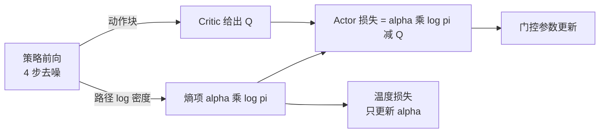

# 第 06 章 路径 log 密度与熵温度

> **前情提要**：第 05 章讲了策略是"冻结去噪网络 + 一个乘性门控"，动作要走 4 步去噪才产生。本章处理由此带来的一个麻烦：SAC 的目标函数里有一项熵，可是这个策略没有普通 SAC 那种终端高斯分布，"熵"要从哪里算？

**知识链接**：

- [SAC Soft Actor Critic](/前置知识/000k_前置知识_SAC_Soft_Actor_Critic)
- [随机微分方程 SDE 直觉与扩散模型的联系](/前置知识/001c_前置知识_随机微分方程SDE直觉与扩散模型的联系)
- 上一章：[chunk 语义与 Flow-G 适配器](./05_chunk语义与FlowG适配器)
- 下一章：[train 与 eval 两条采样路径](./07_train与eval两条采样路径)

---

## 6.1 位置 熵项在链路里的哪一格

Actor 的损失一共两项。本章只讲第二项。



$$
L_{\text{actor}} = \mathbb{E}\big[\alpha \log \pi(\mathbf{a}|s) - \min_j Q_j(s, \mathbf{a})\big]
$$

**这个公式在做什么**：让策略产生 Q 更高的动作，同时不要让自己的动作分布过于集中。

| 符号 | 含义 | 在本链路里是什么 | 实测量级 |
|---|---|---|---|
| $\mathbf{a}$ | 一整个动作块 | `[16, 62]` 的矩阵 | — |
| $\min_j Q_j$ | 双头 Critic 取较小值 | 保守估计，抑制高估 | 约 0.19 |
| $\log \pi$ | 策略对这个动作的对数密度 | **本章要构造的东西** | 约 +4137 |
| $\alpha$ | 熵温度，自动调节 | 一个可学习标量 | 约 $1.0 \times 10^{-5}$ |
| $\mathbb{E}$ | 对批取平均 | 每次 Actor 更新用一个微批的样本 | 每 rank 8 条 |

**代入数字**：$\alpha \log \pi = 1.0\times10^{-5} \times 4137 = 0.041$，于是

$$
L_{\text{actor}} = 0.041 - 0.19 = -0.149
$$

日志里 `actor_loss_on_update` 实测约 $-0.149$，`actor_q_on_update` 约 $0.19$，两者完全吻合。也就是说熵项在损失数值里占了约 22%，不是可以忽略的小量——这一点在 6.5 节会有一个反转。

---

## 6.2 为什么不能用普通 SAC 的熵

标准 SAC 的策略是一个高斯分布：网络输出均值和标准差，动作从这个高斯里采一次，$\log \pi(a|s)$ 就是这个高斯在该点的对数密度。熵有明确定义，`target_entropy` 通常取 $-\dim(\mathcal{A})$ 这类启发式值。

这条链路的策略结构完全不同：

```text
x_4 ~ N(0, I)                        初始噪声
x_3 = mean(x_4) + std_0 · eps_0      第 1 步转移
x_2 = mean(x_3) + std_1 · eps_1      第 2 步转移
x_1 = mean(x_2) + std_2 · eps_2      第 3 步转移
x_0 = mean(x_1) + std_3 · eps_3      第 4 步转移
a   = x_0 的前 16x62 个坐标
```

动作是**四次随机转移复合**的结果。它的边缘密度 $\pi(\mathbf{a}|s)$ 需要对所有中间状态积分，没有解析形式。

工程上的处理方式是：**不算边缘密度，算整条路径的联合密度**。

---

## 6.3 路径密度的构造

$$
\log p_{\text{path}} = \underbrace{\log p(x_4)}_{\text{初始分布}} + \underbrace{\sum_{i=0}^{3} \log p(x_{3-i} \mid x_{4-i})}_{\text{四次转移}} - \underbrace{\log\left|\det \frac{\partial \mathbf{a}}{\partial x_0}\right|}_{\text{终端变换的雅可比}}
$$

**这个公式在算什么**：把"从初始噪声一路走到最终动作"这条完整轨迹当成一个随机变量，算它的联合对数密度。

**逐项拆解**：

**第一项 初始分布。** $x_4$ 从标准正态采样，逐坐标的对数密度是

$$
\log p(x_4) = -\frac{1}{2}\left(x_4^2 + \log 2\pi\right)
$$

对 $H \times D = 992$ 个坐标求和。取期望时 $\mathbb{E}[x^2] = 1$，所以每坐标平均是 $-\frac{1}{2}(1 + 1.8379) = -1.419$。

**第二项 四次转移。** 每一步转移是一个各坐标独立的高斯，均值由去噪网络（经门控）给出、标准差由噪声调度给出：

$$
\log p(x_{i+1} \mid x_i) = -\log \sigma_i - \frac{1}{2}\log 2\pi - \frac{1}{2}\left(\frac{x_{i+1} - \mu_i}{\sigma_i}\right)^2
$$

| 符号 | 含义 | 本链路取值 |
|---|---|---|
| $\mu_i$ | 第 $i$ 步的转移均值 | 由门控后的速度场算出，第 07 章给公式 |
| $\sigma_i$ | 第 $i$ 步的转移标准差 | 由噪声调度决定，四步分别是 0.100、0.0866、0.050、0.0289 |
| $x_{i+1}$ | 采样得到的下一中间状态 | $\mu_i + \sigma_i \varepsilon_i$ |

**第三项 终端雅可比。** 如果最后对动作做了 tanh 压缩，就要减掉这个变换的对数雅可比行列式。本链路的配置是 `action_squash: none`，**所以这一项不存在**。记住这一点，6.5 节会用到。

**代入数字完整算一遍**（每坐标的期望值）：

| 项 | 计算 | 每坐标值 |
|---|---|---:|
| 初始分布 | $-0.5(1 + 1.8379)$ | $-1.419$ |
| 转移 1 | $-\log 0.100 - 0.919 - 0.5$ | $+0.884$ |
| 转移 2 | $-\log 0.0866 - 0.919 - 0.5$ | $+1.027$ |
| 转移 3 | $-\log 0.050 - 0.919 - 0.5$ | $+1.577$ |
| 转移 4 | $-\log 0.0289 - 0.919 - 0.5$ | $+2.126$ |
| 合计 | — | $+4.195$ |

乘上坐标数 992：

$$
\log p_{\text{path}} \approx 4.195 \times 992 = 4162
$$

日志里 `path_log_pi_on_update` 实测约 **4137**，与手算差 0.6%。这个吻合说明我们对构造的理解是对的，也顺带说明**这个量在这条链路里非常稳定**——它主要由噪声调度决定，几乎不随训练变化。

**为什么会是正数**：这是连续分布的**密度**而不是概率。标准差远小于 1 时（本链路是 0.03 到 0.1），单点密度大于 1，取对数就是正数。$-\log 0.05 \approx 3.0$ 这一项就贡献了主要部分。所以"$\log \pi$ 为正"不是异常，而是小方差的必然结果。相应地，日志里的 `path_entropy_estimate` 定义为 $-\log \pi$，是一个很大的负数（约 $-4137$），也不是异常。

---

## 6.4 归一化与两个可选口径

原始路径密度的量级是几千，直接乘进损失会完全压过 Q（Q 的量级是 0.2）。所以还定义了一个归一化版本：

$$
\log \pi_{\text{norm}} = \frac{\log p_{\text{path}}}{(N+1) \cdot H \cdot D}
$$

| 符号 | 含义 | 取值 |
|---|---|---|
| $N$ | 去噪步数 | 4 |
| $N+1$ | 转移数加初始分布 | 5 |
| $H \cdot D$ | 每步的坐标数 | $16 \times 62 = 992$ |
| 分母 | 求和里的项数总数 | $5 \times 992 = 4960$ |

也就是"每一项的平均对数密度"。代入实测：$4137 / 4960 = 0.834$，与日志里 `normalized_path_log_pi` 完全一致。

配置里有一个开关 `path_density` 决定用哪个：

| 取值 | 用哪个量 | 量级 |
|---|---|---:|
| `normalized_sde_surrogate` | 归一化版本 | 约 0.83 |
| `sde_path` | **原始未归一化版本** | 约 4137 |

**本链路用的是 `sde_path`**，也就是那个几千的原始值。这个选择直接解释了第 04 章那个奇怪的温度初值：既然 $\log \pi$ 被放大了 4960 倍，温度就必须相应缩小 4960 倍，才能让 $\alpha \log \pi$ 保持在合理量级。这就是那条强制校验

$$
\alpha_{\text{init}} = \frac{0.05}{5 H D}
$$

的来历——它等价于"在归一化口径下用 0.05 的温度"。$0.05 \times 0.834 \approx 0.042$，正是我们在 6.1 节算出的熵项数值。

---

## 6.5 判定一 熵项对策略参数的梯度是零

现在做本章最重要的一次检查。把转移项的公式和采样方式放在一起看：

```text
采样：  x_{i+1} = mu_i + sigma_i · eps_i
密度：  log p = -log sigma_i - 0.5 log 2pi - 0.5 · ((x_{i+1} - mu_i) / sigma_i)^2
```

把采样式代入密度式的括号里：

$$
\frac{x_{i+1} - \mu_i}{\sigma_i} = \frac{(\mu_i + \sigma_i \varepsilon_i) - \mu_i}{\sigma_i} = \varepsilon_i
$$

$\mu_i$ **被完全消掉了**。于是

$$
\log p(x_{i+1}\mid x_i) = -\log \sigma_i - \frac{1}{2}\log 2\pi - \frac{1}{2}\varepsilon_i^2
$$

右边只含噪声调度给的 $\sigma_i$ 和已经采好的固定噪声 $\varepsilon_i$，**不含任何门控参数**。同理初始分布项只含 $x_4$，也与参数无关。而终端雅可比项本来是唯一含参数的部分（它作用在最终动作上），但本配置 `action_squash: none` 把它去掉了。

结论：

> 在当前配置下，$\log \pi$ 对 Actor 参数的梯度**解析上恒为零**。熵项只是给损失加了一个常数偏移，Actor 实际执行的是纯粹的 Q 上升。

三点补充说明：

**一 这不是 bug，是重参数化的固有性质。** 在这种"固定噪声、只学均值"的采样方案下，路径密度天然与均值无关。普通 SAC 之所以能有熵梯度，是因为它的标准差也是网络输出的；这条链路的标准差来自固定的噪声调度。

**二 它解释了一个观察结果。** 第 22 章会讲到这条链路的 Actor 表现为"稳定地沿某个方向前进"，没有任何熵项带来的探索压力。现在知道原因了：熵项从来没有对策略施加过力。

**三 它是一次层间副作用。** 第 04 章记录过，第 3 层配置用的是 `action_squash: tanh`，第 4 层改成了 `none`。在 tanh 之下终端雅可比项存在且依赖参数，熵项**是有梯度的**；改成 `none` 之后这个梯度悄悄消失了。从配置 diff 上看这只是一个字符串的变化，语义上却移除了目标函数里唯一有效的熵约束。这类"改一个键、去掉一整项梯度"的情况，是继承链式配置最需要警惕的地方。

**这里需要说清我的验证边界**：以上是从公式与实现的代码路径推出的结论，我没有在运行时打印过熵项对门控参数的梯度范数来直接确认。要确认的话，最直接的实验是把 `path_entropy_coef` 或温度调大若干个数量级，观察 `flow_g_gate_deviation` 的轨迹是否有任何变化——如果完全不变，就证实了梯度为零。

---

## 6.6 温度是怎么自动调节的

尽管熵项不影响策略，$\alpha$ 自己仍然在被优化。它的损失是：

$$
L_\alpha = -\alpha \cdot \big(\mathbb{E}[\log \pi] + \mathcal{H}_{\text{target}}\big)
$$

**这个公式在做什么**：标准 SAC 的温度自适应——当策略的熵低于目标时抬高温度加强探索，高于目标时降低温度。

| 符号 | 含义 | 本链路取值 |
|---|---|---|
| $\alpha$ | 温度，用 softplus 参数化保证正值 | 初值 $1.008\times10^{-5}$ |
| $\mathbb{E}[\log \pi]$ | 批平均路径对数密度，**无梯度** | 约 $+4137$ |
| $\mathcal{H}_{\text{target}}$ | 目标熵 | 被配置校验强制为 **0** |
| 优化器 | 独立的 Adam，学习率 3e-4，裁剪 10 | — |

**目标熵为什么被强制为 0**：普通 SAC 用 $-\dim(\mathcal{A})$ 这类启发式，前提是 $\log \pi$ 是终端动作密度。这条链路用的是路径密度，量级和含义都不同，没有可用的启发式，所以设计者干脆强制为 0 并在配置校验里拒绝其他值。

---

## 6.7 判定二 温度没有平衡点

把实测值代进温度损失：

$$
L_\alpha = -\alpha \times (4137 + 0) = -4137\,\alpha
$$

**梯度方向**：这个损失对 $\alpha$ 单调递减。为了减小损失，优化器会**一直把 $\alpha$ 推大**。平衡点要求 $\mathbb{E}[\log \pi] = 0$，而我们在 6.3 节算过，这个量由噪声调度决定、恒为 $+4000$ 量级，不可能变成 0。

于是：

> 在当前配置下温度没有平衡点，$\alpha$ 单调上升。

日志佐证：`train/sac/alpha` 从 $1.0\times10^{-5}$ 涨到 $1.2\times10^{-5}$，42 个 runner step 涨了约 20%。

**这会带来什么后果**：熵项在损失里的数值份额会持续增长。当前 $\alpha \log \pi = 0.041$ 对 $Q = 0.19$，占 22%；按观测速度线性外推，几百步后熵项会超过 Q 项。因为 6.5 节已经证明熵项对策略无梯度，所以这**不会直接影响策略更新方向**，但它会：

1. 让 `actor_loss` 这条曲线的绝对值持续漂移，使"损失在下降"这类判断失去意义——读 Actor 损失时必须减掉熵项，或者直接看 `actor_q`；
2. 如果后续有人把 `action_squash` 改回 tanh、或者启用 `path_entropy_coef`，那个已经涨上去的 $\alpha$ 会突然变成一个很强的力，把策略往高熵方向推。

**建议的处理**：既然目标熵在这个口径下没有意义，正确做法是**把温度固定住**（`fixed_alpha` 加一个显式常数），或者把目标熵设成实测 $\log \pi$ 的量级从而给出真正的平衡点。这条属于本系列汇总的整改项之一。

---

## 6.8 本章小结

| 问题 | 答案 |
|---|---|
| 为什么不能用普通 SAC 的熵 | 动作是 4 次随机转移复合的结果，边缘密度没有解析形式 |
| 用什么替代 | 整条去噪路径的联合对数密度 |
| 它由哪三部分组成 | 初始分布 + 四次转移 + 终端变换雅可比，本配置下第三项不存在 |
| 为什么它是正数 | 转移标准差远小于 1，密度大于 1，对数为正 |
| 实测值多少 | 原始约 4137，归一化后约 0.834，手算可复现 |
| 归一化除以多少 | $(N+1) H D = 5 \times 992 = 4960$，即求和项数 |
| 温度初值为什么是那个奇怪的数 | 因为用了未归一化口径，温度必须缩小 4960 倍，等价于归一化口径下的 0.05 |
| 熵项对策略有影响吗 | **没有**，梯度解析为零；Actor 实际是纯 Q 上升 |
| 温度会收敛吗 | **不会**，目标熵为 0 而 $\log \pi$ 恒为正，$\alpha$ 单调上升，实测 42 步涨 20% |
| 读日志要注意什么 | Actor 损失含一个持续漂移的常数偏移，判断进展要看 `actor_q` 而不是 `actor_loss` |

**下章预告**：本章多次提到"转移标准差由噪声调度决定"。第 07 章把这个调度写清楚，并处理一个更重要的分叉：训练时策略是随机的，评测时策略是**完全确定的**。这个分叉是理解"为什么固定 96 个布局的评测结果还会自己抖 5 个点"的前提。
