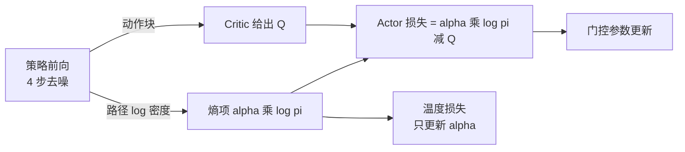

# 第 06 章 路径 log 密度与熵温度

> **前情提要**：第 05 章讲了策略是"冻结去噪网络 + 一个乘性门控"，动作要走 4 步去噪才产生。本章处理由此带来的一个麻烦：SAC 的目标函数里有一项熵，可是这个策略没有普通 SAC 那种终端高斯分布，"熵"要从哪里算？

**知识链接**：

- [SAC Soft Actor Critic](/前置知识/000k_前置知识_SAC_Soft_Actor_Critic)
- [随机微分方程 SDE 直觉与扩散模型的联系](/前置知识/001c_前置知识_随机微分方程SDE直觉与扩散模型的联系)
- 上一章：[chunk 语义与 Flow-G 适配器](./05_chunk语义与FlowG适配器)
- 下一章：[train 与 eval 两条采样路径](./07_train与eval两条采样路径)

---

## 6.1 位置 熵项在链路里的哪一格

Actor 的损失一共两项。本章只讲第二项。


```mermaid
flowchart LR
    A["策略前向<br/>4 步去噪"] -- "动作块" --> Q["Critic 给出 Q"]
    A -- "路径 log 密度" --> H["熵项 alpha 乘 log pi"]
    Q --> L["Actor 损失 = alpha 乘 log pi 减 Q"]
    H --> L
    L --> OPT["门控参数更新"]
    H --> AL["温度损失<br/>只更新 alpha"]
```

$$
L_{\text{actor}} = \mathbb{E}\big[\alpha \log \pi(\mathbf{a}|s) - \min_j Q_j(s, \mathbf{a})\big]
$$

**这个公式在做什么**：让策略产生 Q 更高的动作，同时不要让自己的动作分布过于集中。

::: details 📐 公式详解（点击展开）

| 子表达式 | 它是谁 | 它在干嘛 |
|---------|--------|---------|
| $\min_j Q_j(s,\mathbf{a})$ | **保守判官** | 双头 Critic 取较小值，抑制对动作价值的过度乐观估计，实测约 0.19 |
| $\log \pi(\mathbf{a}\mid s)$ | **本章要构造的东西** | 策略对这个动作块的路径对数密度，实测约 +4137 |
| $\alpha \log \pi(\mathbf{a}\mid s)$ | **探索奖励项** | 温度乘以对数密度，理论上鼓励策略不要过于集中，实测约 0.041 |
| $\alpha$ | **温度旋钮** | 一个可学习标量，控制熵项的力度，本链路初值约 $1.0\times10^{-5}$ |
| $\mathbb{E}[\cdot]$ | **微批平均** | 每次 Actor 更新用一个微批的样本取平均，每 rank 8 条 |

**用人话读**："策略损失 = 温度乘以动作的对数密度，减去保守估计的 Q 值——目标是把 Q 项往上推，同时用温度项控制探索力度。"

**为什么是这个形式**：这是标准 SAC 的 actor 损失结构，唯一的区别是 $\log \pi$ 在这里不是终端高斯密度，而是整条去噪路径的联合密度（6.3 节会构造它）。
:::

**代入数字**：$\alpha \log \pi = 1.0\times10^{-5} \times 4137 = 0.041$，于是

$$
L_{\text{actor}} = 0.041 - 0.19 = -0.149
$$

**这个公式在做什么**：把上面的抽象损失代入本链路的实测数值，验证公式和日志是否吻合。

::: details 📐 公式详解（点击展开）

| 子表达式 | 它是谁 | 它在干嘛 |
|---------|--------|---------|
| $0.041$ | **熵项的实际贡献** | $\alpha \log \pi$ 代入实测值后的结果 |
| $0.19$ | **Q 项的实际贡献** | $\min_j Q_j$ 的实测均值 |
| $-0.149$ | **最终损失** | 两项相减，是 `actor_loss_on_update` 日志读到的值 |

**用人话读**："把温度乘对数密度算出来是 0.041，减去 Q 的 0.19，损失就是 -0.149，和日志完全对上。"

**为什么是这个形式**：这只是数值代入，用来交叉验证 6.1 节的公式和实际训练日志一致，不是新的设计。
:::

日志里 `actor_loss_on_update` 实测约 $-0.149$，`actor_q_on_update` 约 $0.19$，两者完全吻合。也就是说熵项在损失数值里占了约 22%，不是可以忽略的小量——这一点在 6.5 节会有一个反转。

---

## 6.2 为什么不能用普通 SAC 的熵

标准 SAC 的策略是一个高斯分布：网络输出均值和标准差，动作从这个高斯里采一次，$\log \pi(a|s)$ 就是这个高斯在该点的对数密度。熵有明确定义，`target_entropy` 通常取 $-\dim(\mathcal{A})$ 这类启发式值。

这条链路的策略结构完全不同：

```text
x_4 ~ N(0, I)                        初始噪声
x_3 = mean(x_4) + std_0 · eps_0      第 1 步转移
x_2 = mean(x_3) + std_1 · eps_1      第 2 步转移
x_1 = mean(x_2) + std_2 · eps_2      第 3 步转移
x_0 = mean(x_1) + std_3 · eps_3      第 4 步转移
a   = x_0 的前 16x62 个坐标
```

动作是**四次随机转移复合**的结果。它的边缘密度 $\pi(\mathbf{a}|s)$ 需要对所有中间状态积分，没有解析形式。

工程上的处理方式是：**不算边缘密度，算整条路径的联合密度**。

---

## 6.3 路径密度的构造

$$
\log p_{\text{path}} = \underbrace{\log p(x_4)}_{\text{初始分布}} + \underbrace{\sum_{i=0}^{3} \log p(x_{3-i} \mid x_{4-i})}_{\text{四次转移}} - \underbrace{\log\left|\det \frac{\partial \mathbf{a}}{\partial x_0}\right|}_{\text{终端变换的雅可比}}
$$

**这个公式在做什么**：把"从初始噪声一路走到最终动作"这条完整轨迹当成一个随机变量，算它的联合对数密度。

::: details 📐 公式详解（点击展开）

| 子表达式 | 它是谁 | 它在干嘛 |
|---------|--------|---------|
| $\log p(x_4)$ | **起点的密度** | 初始噪声 $x_4$ 从标准正态采样，贡献路径密度的第一部分 |
| $\sum_{i=0}^{3} \log p(x_{3-i}\mid x_{4-i})$ | **四步转移的密度累加** | 每一步去噪都是一次带条件的高斯采样，把四步的对数密度加起来 |
| $\log\left\lvert\det \frac{\partial \mathbf{a}}{\partial x_0}\right\rvert$ | **变量替换的修正项** | 如果最终动作是 $x_0$ 经过某个变换（如 tanh）得到的，需要减掉这个变换的雅可比修正 |

**用人话读**："整条轨迹的联合密度 = 起点密度 + 每一步转移密度的累加，再减去终点变换带来的修正。"

**为什么是这个形式**：这是标准的链式法则（马尔可夫链的联合密度分解），把一个没有解析形式的边缘密度问题，转化成一系列有解析形式的条件密度之和。
:::

**逐项拆解**：

**第一项 初始分布。** $x_4$ 从标准正态采样，逐坐标的对数密度是

$$
\log p(x_4) = -\frac{1}{2}\left(x_4^2 + \log 2\pi\right)
$$

**这个公式在做什么**：算标准正态分布在某一点的对数密度，是上面路径密度公式里"初始分布"这一项的具体展开。

::: details 📐 公式详解（点击展开）

| 子表达式 | 它是谁 | 它在干嘛 |
|---------|--------|---------|
| $x_4^2$ | **偏离原点的程度** | 采样点离均值 0 有多远，越远密度越小 |
| $\log 2\pi$ | **归一化常数** | 保证概率密度积分为 1 所需的常数项，约 1.8379 |
| $-\frac{1}{2}(\cdot)$ | **取对数并翻转** | 高斯密度公式取对数后自然产生的系数 |

**用人话读**："标准正态分布某点的对数密度，就是那一点坐标的平方加上一个常数，再取负一半。"

**为什么是这个形式**：这是标准正态分布 $\mathcal{N}(0,1)$ 概率密度函数 $\frac{1}{\sqrt{2\pi}}e^{-x^2/2}$ 取对数后的直接结果。
:::

对 $H \times D = 992$ 个坐标求和。取期望时 $\mathbb{E}[x^2] = 1$，所以每坐标平均是 $-\frac{1}{2}(1 + 1.8379) = -1.419$。

**第二项 四次转移。** 每一步转移是一个各坐标独立的高斯，均值由去噪网络（经门控）给出、标准差由噪声调度给出：

$$
\log p(x_{i+1} \mid x_i) = -\log \sigma_i - \frac{1}{2}\log 2\pi - \frac{1}{2}\left(\frac{x_{i+1} - \mu_i}{\sigma_i}\right)^2
$$

**这个公式在做什么**：算一次高斯转移（从 $x_i$ 走到 $x_{i+1}$）的对数密度，是路径密度公式里"四次转移"这一项的具体展开。

::: details 📐 公式详解（点击展开）

| 子表达式 | 它是谁 | 它在干嘛 |
|---------|--------|---------|
| $-\log \sigma_i$ | **尺度修正** | 标准差越小，单点密度越大，这一项会变大 |
| $-\frac{1}{2}\log 2\pi$ | **归一化常数** | 高斯密度的固定常数项 |
| $\left(\frac{x_{i+1}-\mu_i}{\sigma_i}\right)^2$ | **标准化偏差** | 把实际偏差换算成"多少个标准差"，再平方 |

**用人话读**："这一步转移的对数密度，取决于噪声调度给的标准差有多小、以及实际采样点离均值差了几个标准差。"

**为什么是这个形式**：这是条件高斯分布 $\mathcal{N}(\mu_i, \sigma_i^2)$ 的对数密度公式，标准差 $\sigma_i$ 由噪声调度预先给定，均值 $\mu_i$ 由去噪网络计算。
:::

| 符号 | 含义 | 本链路取值 |
|---|---|---|
| $\mu_i$ | 第 $i$ 步的转移均值 | 由门控后的速度场算出，第 07 章给公式 |
| $\sigma_i$ | 第 $i$ 步的转移标准差 | 由噪声调度决定，四步分别是 0.100、0.0866、0.050、0.0289 |
| $x_{i+1}$ | 采样得到的下一中间状态 | $\mu_i + \sigma_i \varepsilon_i$ |

**第三项 终端雅可比。** 如果最后对动作做了 tanh 压缩，就要减掉这个变换的对数雅可比行列式。本链路的配置是 `action_squash: none`，**所以这一项不存在**。记住这一点，6.5 节会用到。

**代入数字完整算一遍**（每坐标的期望值）：

| 项 | 计算 | 每坐标值 |
|---|---|---:|
| 初始分布 | $-0.5(1 + 1.8379)$ | $-1.419$ |
| 转移 1 | $-\log 0.100 - 0.919 - 0.5$ | $+0.884$ |
| 转移 2 | $-\log 0.0866 - 0.919 - 0.5$ | $+1.027$ |
| 转移 3 | $-\log 0.050 - 0.919 - 0.5$ | $+1.577$ |
| 转移 4 | $-\log 0.0289 - 0.919 - 0.5$ | $+2.126$ |
| 合计 | — | $+4.195$ |

乘上坐标数 992：

$$
\log p_{\text{path}} \approx 4.195 \times 992 = 4162
$$

**这个公式在做什么**：把每坐标的平均对数密度乘以总坐标数，得到整条路径的总对数密度估计值，用来和训练日志交叉验证。

::: details 📐 公式详解（点击展开）

| 子表达式 | 它是谁 | 它在干嘛 |
|---------|--------|---------|
| $4.195$ | **单坐标平均密度** | 前面表格里"初始分布+四次转移"五项相加的结果 |
| $992$ | **坐标总数** | $H \times D = 16 \times 62$，动作块里独立坐标的个数 |
| $4162$ | **手算的路径总对数密度** | 用来对照实测日志值 |

**用人话读**："每个坐标平均贡献 4.195 的对数密度，一共 992 个坐标，乘起来大约是 4162。"

**为什么是这个形式**：因为各坐标在这个模型假设下相互独立，联合密度的对数就是各坐标对数密度的求和，等价于"平均值乘坐标数"。
:::

日志里 `path_log_pi_on_update` 实测约 **4137**，与手算差 0.6%。这个吻合说明我们对构造的理解是对的，也顺带说明**这个量在这条链路里非常稳定**——它主要由噪声调度决定，几乎不随训练变化。

**为什么会是正数**：这是连续分布的**密度**而不是概率。标准差远小于 1 时（本链路是 0.03 到 0.1），单点密度大于 1，取对数就是正数。$-\log 0.05 \approx 3.0$ 这一项就贡献了主要部分。所以"$\log \pi$ 为正"不是异常，而是小方差的必然结果。相应地，日志里的 `path_entropy_estimate` 定义为 $-\log \pi$，是一个很大的负数（约 $-4137$），也不是异常。

---

## 6.4 归一化与两个可选口径

原始路径密度的量级是几千，直接乘进损失会完全压过 Q（Q 的量级是 0.2）。所以还定义了一个归一化版本：

$$
\log \pi_{\text{norm}} = \frac{\log p_{\text{path}}}{(N+1) \cdot H \cdot D}
$$

**这个公式在做什么**：把量级几千的原始路径密度压缩成"每一项的平均对数密度"，避免它在损失里完全压过 Q 项。

::: details 📐 公式详解（点击展开）

| 子表达式 | 它是谁 | 它在干嘛 |
|---------|--------|---------|
| $\log p_{\text{path}}$ | **原始路径密度** | 6.3 节算出的几千量级的总量 |
| $(N+1)$ | **求和的项数** | 去噪步数 $N=4$ 加上初始分布这一项，共 5 项 |
| $H \cdot D$ | **每项的坐标数** | 动作块的坐标总数，$16\times62=992$ |
| 分母整体 | **归一化系数** | $5\times992=4960$，路径密度公式里所有求和项的总个数 |

**用人话读**："把路径的总对数密度除以求和里一共加了多少项，得到每一项平均贡献多大。"

**为什么是这个形式**：路径密度本质上是 4960 个独立同分布项的求和，除以项数就还原成"平均单项密度"的量级，方便和 Q 值放在同一数量级里比较。
:::

也就是"每一项的平均对数密度"。代入实测：$4137 / 4960 = 0.834$，与日志里 `normalized_path_log_pi` 完全一致。

配置里有一个开关 `path_density` 决定用哪个：

| 取值 | 用哪个量 | 量级 |
|---|---|---:|
| `normalized_sde_surrogate` | 归一化版本 | 约 0.83 |
| `sde_path` | **原始未归一化版本** | 约 4137 |

**本链路用的是 `sde_path`**，也就是那个几千的原始值。这个选择直接解释了第 04 章那个奇怪的温度初值：既然 $\log \pi$ 被放大了 4960 倍，温度就必须相应缩小 4960 倍，才能让 $\alpha \log \pi$ 保持在合理量级。这就是那条强制校验

$$
\alpha_{\text{init}} = \frac{0.05}{5 H D}
$$

**这个公式在做什么**：反过来推导出温度的初值应该设成多小，才能在使用未归一化的路径密度时，让熵项的量级仍然等价于"归一化口径下 0.05 的温度"。

::: details 📐 公式详解（点击展开）

| 子表达式 | 它是谁 | 它在干嘛 |
|---------|--------|---------|
| $0.05$ | **归一化口径下的目标温度** | 如果用归一化的 $\log \pi_{\text{norm}}$，温度本该设成这个常见量级 |
| $5HD$ | **未归一化放大的倍数** | 就是上一个公式里的分母 4960，$\log \pi$ 被这个倍数放大了 |
| $\alpha_{\text{init}}$ | **实际要设的温度初值** | 把目标温度按放大倍数反向缩小，抵消掉未归一化带来的放大 |

**用人话读**："既然路径密度被放大了 4960 倍，温度就要反过来缩小 4960 倍，两者相乘抵消，效果等价于用归一化口径下 0.05 的温度。"

**为什么是这个形式**：这是一条配置强制校验规则，目的是保证不管选归一化还是未归一化口径，熵项 $\alpha\log\pi$ 在损失里的实际数值量级保持一致。
:::

的来历——它等价于"在归一化口径下用 0.05 的温度"。$0.05 \times 0.834 \approx 0.042$，正是我们在 6.1 节算出的熵项数值。

---

## 6.5 判定一 熵项对策略参数的梯度是零

现在做本章最重要的一次检查。把转移项的公式和采样方式放在一起看：

```text
采样：  x_{i+1} = mu_i + sigma_i · eps_i
密度：  log p = -log sigma_i - 0.5 log 2pi - 0.5 · ((x_{i+1} - mu_i) / sigma_i)^2
```

把采样式代入密度式的括号里：

$$
\frac{x_{i+1} - \mu_i}{\sigma_i} = \frac{(\mu_i + \sigma_i \varepsilon_i) - \mu_i}{\sigma_i} = \varepsilon_i
$$

**这个公式在做什么**：把重参数化采样公式代入标准化偏差项，检验均值 $\mu_i$ 是否会在计算中被抵消。

::: details 📐 公式详解（点击展开）

| 子表达式 | 它是谁 | 它在干嘛 |
|---------|--------|---------|
| $\mu_i + \sigma_i \varepsilon_i$ | **采样公式** | 重参数化技巧下 $x_{i+1}$ 的生成方式，$\mu_i$ 是网络算出的均值 |
| $(\mu_i+\sigma_i\varepsilon_i) - \mu_i$ | **抵消过程** | 把采样式代入分子后，两个 $\mu_i$ 正好抵消 |
| $\varepsilon_i$ | **剩下的东西** | 抵消后只剩下最初采样时用的固定噪声 |

**用人话读**："把采样公式代进标准化偏差里，均值项正好加了又减掉，最后只剩下原始的随机噪声。"

**为什么是这个形式**：这是重参数化采样的代数恒等式，是判断"密度是否依赖网络参数"这一问题的关键计算步骤。
:::

$\mu_i$ **被完全消掉了**。于是

$$
\log p(x_{i+1}\mid x_i) = -\log \sigma_i - \frac{1}{2}\log 2\pi - \frac{1}{2}\varepsilon_i^2
$$

**这个公式在做什么**：把上面消掉 $\mu_i$ 的结果代回密度公式，证明这一步转移的对数密度实际上不含任何可学习参数。

::: details 📐 公式详解（点击展开）

| 子表达式 | 它是谁 | 它在干嘛 |
|---------|--------|---------|
| $-\log \sigma_i$ | **调度给的常数** | $\sigma_i$ 由噪声调度预先设定，不是网络输出 |
| $\varepsilon_i^2$ | **固定噪声的平方** | 采样时已经抽好的随机数，训练过程中不再变化 |
| 整个右边 | **与参数无关的常数** | 不含 $\mu_i$，也就不含任何门控参数 |

**用人话读**："这一步转移的对数密度，只由噪声调度的标准差和当时抽到的随机噪声决定，和网络要学的参数完全没关系。"

**为什么是这个形式**：这正是"固定噪声、只学均值"这种重参数化方案的代数后果——密度对均值的依赖被结构性地消除了。
:::

右边只含噪声调度给的 $\sigma_i$ 和已经采好的固定噪声 $\varepsilon_i$，**不含任何门控参数**。同理初始分布项只含 $x_4$，也与参数无关。而终端雅可比项本来是唯一含参数的部分（它作用在最终动作上），但本配置 `action_squash: none` 把它去掉了。

结论：

> 在当前配置下，$\log \pi$ 对 Actor 参数的梯度**解析上恒为零**。熵项只是给损失加了一个常数偏移，Actor 实际执行的是纯粹的 Q 上升。

三点补充说明：

**一 这不是 bug，是重参数化的固有性质。** 在这种"固定噪声、只学均值"的采样方案下，路径密度天然与均值无关。普通 SAC 之所以能有熵梯度，是因为它的标准差也是网络输出的；这条链路的标准差来自固定的噪声调度。

**二 它解释了一个观察结果。** 第 22 章会讲到这条链路的 Actor 表现为"稳定地沿某个方向前进"，没有任何熵项带来的探索压力。现在知道原因了：熵项从来没有对策略施加过力。

**三 它是一次层间副作用。** 第 04 章记录过，第 3 层配置用的是 `action_squash: tanh`，第 4 层改成了 `none`。在 tanh 之下终端雅可比项存在且依赖参数，熵项**是有梯度的**；改成 `none` 之后这个梯度悄悄消失了。从配置 diff 上看这只是一个字符串的变化，语义上却移除了目标函数里唯一有效的熵约束。这类"改一个键、去掉一整项梯度"的情况，是继承链式配置最需要警惕的地方。

**这里需要说清我的验证边界**：以上是从公式与实现的代码路径推出的结论，我没有在运行时打印过熵项对门控参数的梯度范数来直接确认。要确认的话，最直接的实验是把 `path_entropy_coef` 或温度调大若干个数量级，观察 `flow_g_gate_deviation` 的轨迹是否有任何变化——如果完全不变，就证实了梯度为零。

---

## 6.6 温度是怎么自动调节的

尽管熵项不影响策略，$\alpha$ 自己仍然在被优化。它的损失是：

$$
L_\alpha = -\alpha \cdot \big(\mathbb{E}[\log \pi] + \mathcal{H}_{\text{target}}\big)
$$

**这个公式在做什么**：标准 SAC 的温度自适应——当策略的熵低于目标时抬高温度加强探索，高于目标时降低温度。

::: details 📐 公式详解（点击展开）

| 子表达式 | 它是谁 | 它在干嘛 |
|---------|--------|---------|
| $\mathbb{E}[\log \pi]$ | **当前熵的反面** | 批平均路径对数密度，对 Actor 无梯度，但对 $\alpha$ 有梯度，实测约 +4137 |
| $\mathcal{H}_{\text{target}}$ | **期望达到的熵水平** | 目标熵，本链路被配置校验强制为 0 |
| $\mathbb{E}[\log \pi] + \mathcal{H}_{\text{target}}$ | **偏离量** | 当前对数密度和目标熵的差距 |
| $-\alpha \cdot (\cdot)$ | **温度调节方向盘** | 用负号把"偏离量"转成让优化器推动 $\alpha$ 变化的信号 |

**用人话读**："如果当前的对数密度加目标熵大于零，优化器就会把温度往上推；小于零就往下压——温度朝着让两者接近的方向调节。"

**为什么是这个形式**：这是标准 SAC 的温度自适应损失，用一个独立的优化器只更新 $\alpha$，不影响 Actor 的其他参数。
:::

| 符号 | 含义 | 本链路取值 |
|---|---|---|
| $\alpha$ | 温度，用 softplus 参数化保证正值 | 初值 $1.008\times10^{-5}$ |
| $\mathbb{E}[\log \pi]$ | 批平均路径对数密度，**无梯度** | 约 $+4137$ |
| $\mathcal{H}_{\text{target}}$ | 目标熵 | 被配置校验强制为 **0** |
| 优化器 | 独立的 Adam，学习率 3e-4，裁剪 10 | — |

**目标熵为什么被强制为 0**：普通 SAC 用 $-\dim(\mathcal{A})$ 这类启发式，前提是 $\log \pi$ 是终端动作密度。这条链路用的是路径密度，量级和含义都不同，没有可用的启发式，所以设计者干脆强制为 0 并在配置校验里拒绝其他值。

---

## 6.7 判定二 温度没有平衡点

把实测值代进温度损失：

$$
L_\alpha = -\alpha \times (4137 + 0) = -4137\,\alpha
$$

**这个公式在做什么**：把本链路的实测值代入温度损失，检验温度是否存在一个能让损失稳定的平衡点。

::: details 📐 公式详解（点击展开）

| 子表达式 | 它是谁 | 它在干嘛 |
|---------|--------|---------|
| $4137$ | **代入的实测对数密度** | 本链路的 $\mathbb{E}[\log \pi]$ 实测值 |
| $0$ | **目标熵** | 被配置强制为 0 |
| $-4137\,\alpha$ | **关于 $\alpha$ 的线性函数** | 损失对 $\alpha$ 的依赖关系变成了一条斜率为 $-4137$ 的直线 |

**用人话读**："代入实测数字后，温度损失就是负 4137 乘温度——这是一条永远向下倾斜的直线，没有最低点。"

**为什么是这个形式**：因为 $\mathbb{E}[\log\pi]$ 恒为正且量级固定（由噪声调度决定，不随 $\alpha$ 变化），损失对 $\alpha$ 退化成线性函数，不存在极值点。
:::

**梯度方向**：这个损失对 $\alpha$ 单调递减。为了减小损失，优化器会**一直把 $\alpha$ 推大**。平衡点要求 $\mathbb{E}[\log \pi] = 0$，而我们在 6.3 节算过，这个量由噪声调度决定、恒为 $+4000$ 量级，不可能变成 0。

于是：

> 在当前配置下温度没有平衡点，$\alpha$ 单调上升。

日志佐证：`train/sac/alpha` 从 $1.0\times10^{-5}$ 涨到 $1.2\times10^{-5}$，42 个 runner step 涨了约 20%。

**这会带来什么后果**：熵项在损失里的数值份额会持续增长。当前 $\alpha \log \pi = 0.041$ 对 $Q = 0.19$，占 22%；按观测速度线性外推，几百步后熵项会超过 Q 项。因为 6.5 节已经证明熵项对策略无梯度，所以这**不会直接影响策略更新方向**，但它会：

1. 让 `actor_loss` 这条曲线的绝对值持续漂移，使"损失在下降"这类判断失去意义——读 Actor 损失时必须减掉熵项，或者直接看 `actor_q`；
2. 如果后续有人把 `action_squash` 改回 tanh、或者启用 `path_entropy_coef`，那个已经涨上去的 $\alpha$ 会突然变成一个很强的力，把策略往高熵方向推。

**建议的处理**：既然目标熵在这个口径下没有意义，正确做法是**把温度固定住**（`fixed_alpha` 加一个显式常数），或者把目标熵设成实测 $\log \pi$ 的量级从而给出真正的平衡点。这条属于本系列汇总的整改项之一。

---

## 6.8 本章小结

| 问题 | 答案 |
|---|---|
| 为什么不能用普通 SAC 的熵 | 动作是 4 次随机转移复合的结果，边缘密度没有解析形式 |
| 用什么替代 | 整条去噪路径的联合对数密度 |
| 它由哪三部分组成 | 初始分布 + 四次转移 + 终端变换雅可比，本配置下第三项不存在 |
| 为什么它是正数 | 转移标准差远小于 1，密度大于 1，对数为正 |
| 实测值多少 | 原始约 4137，归一化后约 0.834，手算可复现 |
| 归一化除以多少 | $(N+1) H D = 5 \times 992 = 4960$，即求和项数 |
| 温度初值为什么是那个奇怪的数 | 因为用了未归一化口径，温度必须缩小 4960 倍，等价于归一化口径下的 0.05 |
| 熵项对策略有影响吗 | **没有**，梯度解析为零；Actor 实际是纯 Q 上升 |
| 温度会收敛吗 | **不会**，目标熵为 0 而 $\log \pi$ 恒为正，$\alpha$ 单调上升，实测 42 步涨 20% |
| 读日志要注意什么 | Actor 损失含一个持续漂移的常数偏移，判断进展要看 `actor_q` 而不是 `actor_loss` |

**下章预告**：本章多次提到"转移标准差由噪声调度决定"。第 07 章把这个调度写清楚，并处理一个更重要的分叉：训练时策略是随机的，评测时策略是**完全确定的**。这个分叉是理解"为什么固定 96 个布局的评测结果还会自己抖 5 个点"的前提。
