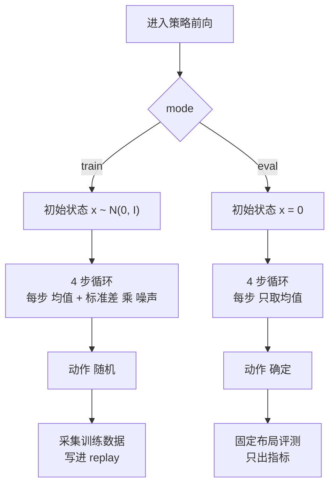

# 第 07 章 train 与 eval 两条采样路径

> **前情提要**：第 06 章反复用到"转移标准差由噪声调度决定"。本章把这个调度写出来，并处理一个更重要的分叉——训练时策略是随机的，评测时策略是**完全确定的**。这个分叉是理解"为什么固定 96 个布局的评测结果还会自己抖几个点"的前提。

**知识链接**：

- [常微分方程 ODE 直觉与数值求解](/前置知识/001b_前置知识_常微分方程ODE直觉与数值求解)
- [随机微分方程 SDE 直觉与扩散模型的联系](/前置知识/001c_前置知识_随机微分方程SDE直觉与扩散模型的联系)
- 上一章：[路径 log 密度与熵温度](./06_路径log密度与熵温度)

---

## 7.1 位置 同一个函数的两种模式

策略前向函数带一个 `mode` 参数，取值 `train` 或 `eval`。它不是两套代码，而是同一条 4 步循环里的几个分支：



两条路径分别服务于第 01 章的两件事：训练 rollout（每步都跑）和固定布局评测（每 10 步跑一次）。

---

## 7.2 一步去噪更新到底在算什么

不管哪种模式，一步更新都是先用速度场推出两个端点预测，再做加权。

$$
\hat{x}_0 = x_t - v_t \cdot t, \qquad \hat{x}_1 = x_t + v_t \cdot (1 - t)
$$

**这两个式子在算什么**：把当前中间状态沿速度场线性外推到时间轴的两端。$\hat{x}_0$ 是"如果一路匀速倒推回 $t=0$ 会到哪"，$\hat{x}_1$ 是"如果一路匀速前推到 $t=1$ 会到哪"。

| 符号 | 含义 | 取值 |
|---|---|---|
| $x_t$ | 当前中间动作状态 | `[B, 16, 62]` |
| $v_t$ | 门控后的速度场 | 第 05 章的 $g \odot v$ |
| $t$ | 当前时间坐标 | 4 步分别是 0、0.25、0.5、0.75 |
| $\Delta$ | 步长 | 恒为 0.25 |

然后按权重合成下一状态的均值：

$$
\mu_t = w_0 \hat{x}_0 + w_1 \hat{x}_1
$$

### 7.2.1 eval 模式 就是标准 Euler 积分

评测模式的权重是 $w_0 = 1 - (t + \Delta)$、$w_1 = t + \Delta$，标准差为零。把两个端点预测代进去展开：

$$
\mu_t = (x_t - v_t t)\big(1 - t - \Delta\big) + \big(x_t + v_t(1-t)\big)(t + \Delta)
$$

$x_t$ 的系数是 $(1-t-\Delta) + (t+\Delta) = 1$；$v_t$ 的系数是

$$
-t(1-t-\Delta) + (1-t)(t+\Delta) = -t + t^2 + t\Delta + t + \Delta - t^2 - t\Delta = \Delta
$$

于是

$$
x_{t+\Delta} = x_t + v_t \cdot \Delta
$$

**这说明什么**：评测路径就是对流匹配 ODE 做**步长 0.25 的显式 Euler 积分**，一共 4 步。没有任何随机性。

**代入数字**：设某坐标 $x_t = 0.30$、门控后速度 $v_t = 0.80$，则 $x_{t+\Delta} = 0.30 + 0.80 \times 0.25 = 0.50$。四步累加就得到最终动作坐标。

### 7.2.2 train 模式 在同一条轨迹上叠加 SDE 噪声

训练模式做两处修改。

**修改一 注入噪声。** 标准差不再为零：

$$
\sigma^{\text{step}}_i = \sqrt{\Delta} \cdot \sigma_i, \qquad \sigma_i = \eta \sqrt{\frac{1 - t_i}{t_i}}
$$

| 符号 | 含义 | 取值 |
|---|---|---|
| $\eta$ | 噪声强度 `noise_level` | 0.1 |
| $t_i$ | 第 $i$ 步的时间坐标；$t_0 = 0$ 时用 $t_1 = 0.25$ 代入避免除零 | 0.25、0.25、0.5、0.75 |
| $\sqrt{\Delta}$ | 步长的平方根，来自布朗运动的尺度 | 0.5 |

**代入数字，四步全算出来**：

| 步 | $t_i$ | $\sigma_i$ | 实际注入标准差 $\sqrt{\Delta}\sigma_i$ | 漂移修正系数 $\dfrac{\sigma_i^2 \Delta}{2(1-t_i)}$ |
|---:|---:|---:|---:|---:|
| 0 | 0 | $0.1\sqrt{1/0.25} = 0.200$ | 0.100 | 0.0050 |
| 1 | 0.25 | $0.1\sqrt{0.75/0.25} = 0.173$ | 0.087 | 0.0050 |
| 2 | 0.50 | $0.1\sqrt{0.5/0.5} = 0.100$ | 0.050 | 0.0025 |
| 3 | 0.75 | $0.1\sqrt{0.25/0.75} = 0.058$ | 0.029 | 0.0017 |

注意噪声是**递减**的：早期步注入多、末期步注入少。这符合扩散模型的一般直觉——越接近最终样本，越不该再大幅扰动。

**修改二 漂移修正。** $\hat{x}_0$ 的权重多减去表格最后一列那个量：

$$
w_0 = 1 - (t + \Delta) - \frac{\sigma_i^2 \Delta}{2(1-t)}
$$

**这一项为什么存在**：加了噪声之后，如果均值还按 ODE 那样走，最终分布就会偏离目标分布。这个修正项是让"带噪声的离散更新"在分布层面与目标一致所需的补偿（对应 SDE 采样里的 score 修正）。从数值上看它很小（最大 0.005），所以训练路径的均值与评测路径的均值差别不大，主要差别是那份注入的噪声。

### 7.2.3 训练时的动作随机性有多大

把四步注入的噪声在最终动作上累加。因为每步更新是加法形式（$x + v\Delta$），第 $i$ 步注入的扰动会近似原样保留到最后，所以逐坐标的总标准差约为

$$
\sqrt{0.100^2 + 0.087^2 + 0.050^2 + 0.029^2} = \sqrt{0.0208} \approx 0.144
$$

动作在归一化空间的取值范围是 $[-1, 1]$，所以**训练时同一个观测下两次采样的动作，逐坐标差异在 0.14 量级，约占动作幅度的 7%**。

把这个数和第 05 章那个门控效果并排看：

```text
采样噪声带来的动作扰动    约 0.144
门控偏离恒等带来的动作差   约 0.0099（该 run 当前值）
```

**采样噪声比门控效果大一个数量级以上。** 这个对比在后面几章会反复用到，它意味着：如果你想比较"策略动作"和"BC 动作"的好坏，绝对不能各采一次然后比结果——两次采样自身的差异会把门控效果彻底盖住。

这条链路的解决办法在第 05 章已经出现了：**BC 参考分支共享同一份噪声**。同理，第 13 章会讲到同状态配对的两个分支执行的动作也是从同一行前向派生出来的，共享同一条噪声路径。所以在这两处比较里，那 0.144 的采样噪声被完全对消，剩下的差异纯粹来自门控。

---

## 7.3 eval 模式的三处确定性

评测路径要做到"同样的观测给出逐比特相同的动作"，需要三件事同时成立，配置里都显式设了：

| 设置 | 值 | 作用 |
|---|---|---|
| `eval_initial_noise` | `zero` | 初始状态取全零而不是采样 |
| 转移标准差 | 0 | 每步只取均值 |
| `actor.seed` | 0 | 评测环境的布局顺序固定 |

再加上评测布局 ID 是写死在配置里的 96 个数、`auto_reset` 关闭、每个 episode 上限 350 步，整个评测协议在**策略侧**是完全可复现的。

**由此得到一个很强的推论**：

> 固定布局评测的结果如果在两次之间发生变化，而策略权重没变，那么变化不可能来自策略。

第 19 章会用这个推论去定位评测抖动的真实来源（物理非确定性、渲染的时域抖动、布局在 worker 间的分区方式）。这里先记住这个逻辑链条：**先证明策略是确定的，才能把抖动归因给环境**。

---

## 7.4 梯度只在训练路径上流动

第 06 章提到过一个配置校验：`actor_backprop_steps` 必须等于 `denoising_steps`。本链路两者都是 4，所以**四步去噪全部参与反向传播**。

实现上每一步会判断是否需要保留梯度：

```text
需要梯度 = 外层允许梯度 且 mode 是 train 且 当前步在回传窗口内
```

回传窗口是"最后 $k$ 步"，$k$ 就是 `actor_backprop_steps`。窗口之外的步在前向后被 detach。当 $k$ 等于总步数时窗口覆盖全部，detach 不发生。

**为什么要有这个机制**：如果去噪步数很多（比如 10 步以上），整条链的激活值会占满显存，而且梯度经过长链会失真。只回传最后几步是一个常见折中。这条链路把步数压到 4，因此可以全部回传，也因此配置校验直接要求两者相等——半程回传会让"路径密度"的语义变得不清晰。

**评测路径完全不参与梯度**：`mode == eval` 时无论外层是否允许梯度，每一步都不追踪。

---

## 7.5 这个设计在当前配置下是否站得住

**站得住的部分**

- 训练路径的噪声调度是递减的、有漂移修正的，符合 SDE 采样的一般做法；
- 评测路径严格确定，让"评测抖动归因"这件事在逻辑上可做；
- 回传窗口与去噪步数被强制一致，避免了半程回传带来的语义模糊。

**需要标注的部分**

**问题 A 评测的初始状态不是先验样本。** 训练时 $x_4 \sim \mathcal{N}(0, I)$，评测时 $x_4 = \mathbf{0}$。全零向量是标准正态的**众数**，但它不是一个典型样本——在 992 维空间里，典型样本的范数约为 $\sqrt{992} \approx 31.5$，而零向量范数为 0。也就是说评测时喂给去噪网络的初始状态，落在训练时几乎不可能出现的位置上。

这带来两个后果：

1. 评测策略不是训练策略的均值，也不是它的众数，而是**另一条确定性映射**。用它衡量"训练策略变好了没有"，隐含假设是两者单调相关，而这个假设没有被验证过；
2. 如果门控在训练分布上学到了某些补偿，这些补偿在零初始状态下未必成立。

一个可做的对照实验：把 `eval_initial_noise` 改成 `random` 并固定随机种子。这样评测既保持可复现，又落在训练分布内。代价是评测结果会依赖那个种子，需要多种子平均。

**问题 B 噪声强度是一个没有被扫过的关键超参。** $\eta = 0.1$ 决定了训练时动作扰动的幅度（0.144）。这个量同时决定两件事：探索范围有多大，以及第 13 章那个"同状态两个动作的差异"相对于环境自身随机性的比例。它是本链路最值得做敏感性分析的单个参数，但目前的实验谱系里没有它的对照。

**问题 C 训练与评测的分岔让"策略变化"难以观测。** 训练时的动作 = 确定性均值路径 + 0.144 的噪声；评测时的动作 = 零初始的确定性路径。门控目前带来的变化是 0.0099。也就是说，**门控引起的行为变化被埋在训练噪声之下一个数量级，而评测又用了另一条从未被训练过的路径**。要看清策略到底变了没有，最直接的量是第 05 章那个共享噪声的偏差量 `actor_delta_rms`，而不是评测成功率。

---

## 7.6 本章小结

| 问题 | 答案 |
|---|---|
| 一步去噪在算什么 | 用速度场外推出两端点，加权合成；权重展开后等价于 $x + v\Delta$ |
| eval 路径的本质 | 步长 0.25 的显式 Euler 积分，4 步，完全确定 |
| train 路径多了什么 | 每步注入递减的高斯噪声，并给均值加一个小的漂移修正 |
| 四步的噪声标准差 | 0.100、0.087、0.050、0.029 |
| 最终动作的采样噪声有多大 | 逐坐标约 0.144，约为动作幅度的 7% |
| 它和门控效果比 | 大一个数量级以上，所以任何比较都必须共享噪声 |
| 评测确定性靠哪三件事 | 零初始状态、零转移标准差、固定评测种子与布局 |
| 由此能推出什么 | 权重不变而评测结果变化，原因必然在环境侧 |
| 梯度怎么回传 | 四步全部回传，配置强制回传窗口等于去噪步数 |
| 主要隐患 | 评测初始状态不在训练分布内；噪声强度没有做过敏感性分析 |

**下章预告**：策略侧到这里讲完了。第 08 章转向 Critic：把 16 步宏动作代进 Bellman 方程，逐符号拆解 TD 目标，讲清楚有效步掩码、终止与截断如何决定要不要 bootstrap，以及为什么"不折扣"在有限时域下会让价值函数定义不良。
