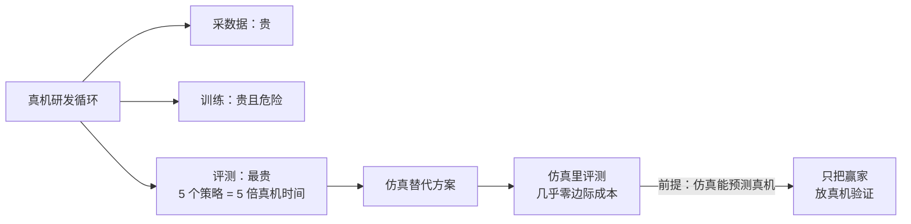
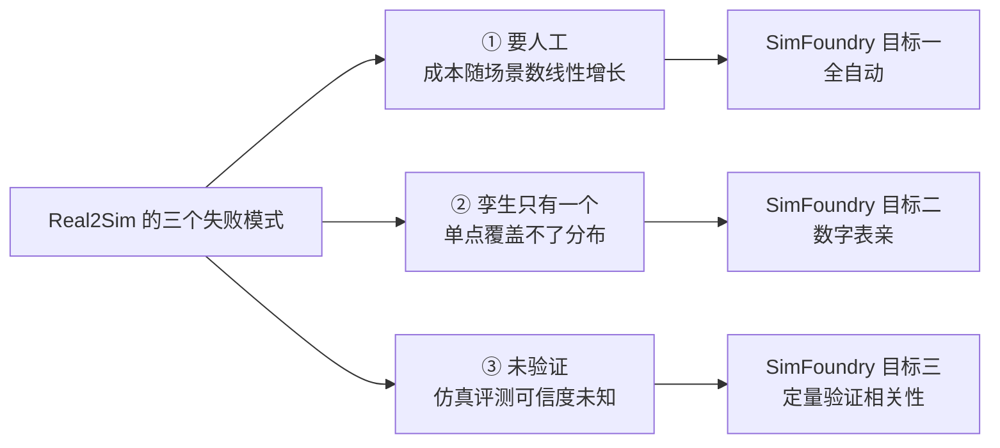
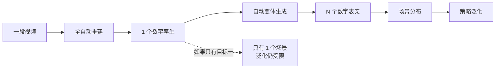

# 第一章：为什么需要一座"仿真场景铸造厂"

> 本章目标：把 SimFoundry 要解决的那堵墙讲清楚——为什么"真机训练真机评测"不可扩展，为什么已有的 Real2Sim 工作只搬走了墙的一半，以及 SimFoundry 的两个核心目标分别对准墙的哪一部分。

**知识链接**：
- [数字表亲与 Real2Sim 数据增广](/前置知识/010b_前置知识_数字表亲与Real2Sim数据增广) — 本系列贯穿始终的核心概念
- [RialTo：手机扫描建数字孪生](/论文综述/114_RialTo_数字孪生RL策略学习) — "人工标注版 Real2Sim"的代表，本章作为对照
- [Sim-to-Real 迁移综述](/论文综述/S04_Sim_to_Real迁移综述) — 域随机化等既有方法论全景

---

## 一、成本墙：问题到底卡在哪一步

机器人策略的研发循环是"采数据 → 训练 → 评测 → 改进"。真机做这个循环，每一环都要花钱花时间：

| 环节 | 真机做法的成本 | 具体表现 |
|------|--------------|---------|
| 采数据 | 遥操作演示 | 一个熟练操作员一小时采不了几十条轨迹；双臂任务还要两人协作 |
| 训练 | 真机强化学习 | 每步都要真实交互，撞坏物体的重置成本极高 |
| **评测** | **真机跑测试** | **这是最容易被低估的一环**：评测一个策略要占用机器人、要重置场景、要人工记录成功率 |

第三条尤其致命。研究者经常需要**在多个候选策略之间选最好的那个**，比如比较 5 种架构、或者比较不同的超参数配置。真机上做这个横向对比，意味着 5 倍 × N 次重复的真机时间。

**仿真的价值就在这里**：如果仿真评测能可靠预测真机排名，那么"选策略"这件事就可以在仿真里以近乎零边际成本完成，只在最后一步把选出的赢家放到真机上验一次。

但这张图里藏着一个前提条件——**"仿真能预测真机"**。这个前提不成立的话，仿真里选出来的"最优策略"可能真机上是倒数第一，那整套替代方案就是负收益。这个前提能不能被验证，是本系列第 07 章的主题，也是 SimFoundry 论文最有分量的贡献之一。

---

## 二、已有的 Real2Sim 路线只搬走了半堵墙

"把真实场景搬进仿真"不是新想法。[RialTo](/论文综述/114_RialTo_数字孪生RL策略学习) 已经验证了完整范式可行：手机扫描真实场景 → 重建数字孪生 → 在仿真里用 RL 打磨策略鲁棒性 → 部署回真机。但这条路线上有三个失败模式，SimFoundry 正是针对性地解决它们。

### 2.1 失败模式一：重建要人工

RialTo 的重建流程里，用户需要在一个交互式界面里手工做几件事：给可移动的部件打刚体标签、给抽屉/柜门手动画关节约束、对齐坐标系。

这个标注比"从零手工建模"快得多，但它**没有消失**——它只是从"3D 建模师的工作"变成了"研究者的工作"。要扩展到 100 个不同场景，就是 100 次标注。**这是一笔随场景数线性增长的人力成本。**

### 2.2 失败模式二：孪生只有一个

即使重建做到完美，产出的是**一个**精确副本——拍摄那一刻的那一个杯子、那一个布局。而真实世界是分布的（详见[数字表亲前置知识](/前置知识/010b_前置知识_数字表亲与Real2Sim数据增广)）。

一个具体的数量级感受：假设一个数字孪生能提供的训练多样性是"1 个单位"，而真实部署需要覆盖的分布假设是"1000 个单位"。那么用孪生训练，覆盖率是 0.1%。RialTo 用仿真内的随机扰动（位置抖动、外力干扰、干扰物）来扩充，但这些都是**在同一个物体集合上做参数级扰动**——杯子还是那个杯子。

### 2.3 失败模式三：没人验证仿真评测的可信度

这是最隐蔽的一个。Real2Sim 工作都在讲"重建得多像"，但很少回答"用这个重建做评测，结果可不可信"。而如果这个不可信，第 1 节里"用仿真替代真机评测"的整个价值就没了。

---

## 三、SimFoundry 的两个核心目标

论文把目标归纳为两条（第三条"验证可信度"是论文的核心实证贡献，但从系统设计角度它更像对前两条成果的检验）。

### 3.1 目标一：全自动的 Real2Sim

**输入**：一段普通的真实世界视频（手机随手拍）。
**输出**：一个 sim-ready 的可交互数字孪生。
**约束**：全程无人工标注。

这里的"全自动"是字面意义的——不需要研究者点选物体、不需要画关节、不需要填物理参数。整条链路由 13 个 stage 串联，每个 stage 都是可以独立替换的模块（下一章详述）。

**为什么强调"模块化"而不是"端到端"**：这是一个刻意的设计选择。如果做成一个端到端的大模型，那么上游任何一个基础模型进步了（比如出现了更好的分割模型），整个系统都要重训。而做成模块化流水线后，替换分割模块不影响其他 12 个 stage——**系统的能力随基础模型进步自动提升，不需要重新设计**。SimFoundry 论文里把这称为"pipeline improves with foundation models"，这是它和早期一体化方案最本质的区别。

### 3.2 目标二：数字表亲的自动生成

在数字孪生基础上，自动生成三类变体：

| 变体类型 | 生成方式 | 提升的是什么 |
|---------|---------|-------------|
| Object Cousin | 用 VLM 提议 + 图像生成模型造出替代物体 | 视觉鲁棒性 |
| Scene Cousin | 用空间谓词重排布局 + 采样干扰物 | 视觉/布局鲁棒性 |
| Task Cousin | 用 VLM 基于物体清单提议新任务 | **动作逻辑的泛化** |

关键点在于：**变体生成是对已有资产的编辑，不是重新走一遍重建**。数字孪生重建完成后，物体是独立的网格资产、场景是结构化 JSON、任务是无谓词表达式——三样东西都可以被程序直接改写和重组。这就是为什么 Pipeline A 必须输出"结构化 + 物体级解耦"的表示，而不是一坨整体网格。

### 3.3 两个目标的乘积效应

单独看每个目标都不算全新：全自动重建有多个工作在推进，场景变体生成也不是 SimFoundry 首创。**两个目标组合起来产生的效果才是新的**：

从一段视频出发可以得到的有效训练多样性：如果只做重建是 1，做了变体生成之后是 1 × N。而变体生成的成本远低于重新采集 N 段视频并分别重建。

---

## 四、贯穿全系列的固定例子

后面每一章都用同一个场景来具象化抽象机制：

> **场景**：你用手机对着家里的餐桌桌面拍了一段 15 秒的视频，平缓地移动视角扫过桌面。桌上有三样东西：一个白色马克杯、一支蓝色记号笔、一个木色浅盘。桌面是浅色木纹，背后是白墙。
>
> 你希望得到：(1) 一个仿真场景，马克杯能被抓起来、能被放进浅盘；(2) 不只是原样，还要自动衍生出"换一个陶瓷质感的条纹杯子""盘子挪到左前方、旁边多一个干扰的瓶盖""任务从'把笔放进杯子'改成'把杯子放到盘子上'"等大量变体，用来训练机器人。

这个例子会在后面各章反复出现：第 03 章看它怎么被拆解成物体掩码，第 04 章看杯子怎么被生成成网格，第 05 章看杯子怎么获得质量和摩擦，第 06 章看"条纹杯子"和"把杯子放到盘子上"怎么被生成出来。

---

## 五、总结

| 问题 | 已有路线的状态 | SimFoundry 的回答 |
|------|--------------|------------------|
| 重建要人工 | RialTo 需要交互式标注 | 13 stage 全自动流水线 |
| 场景只有一份 | 孪生是单点，扰动是参数级 | 三类 digital cousins 的资产级变体 |
| 评测可信度未知 | 很少被验证 | 7 任务 × 5 策略，Pearson 0.911 |
| 上游模型会过时 | 端到端方案需重训 | 模块化，随基础模型进步自动增强 |

读完本章应该能回答：**为什么 SimFoundry 要把"全自动"和"变体生成"这两件事放在同一个系统里做？** ——因为变体生成的原料（物体级解耦的资产、结构化场景描述）只有全自动重建才能提供；而全自动重建的价值（能低成本覆盖场景分布）只有变体生成才能兑现。两者互为前提。

---

## 下章预告

下一章会打开 SimFoundry 的黑盒，看三条流水线（A 重建 / B 增广 / C 应用）如何咬合：A 的 13 个 stage 分别做什么、它们之间的产物契约是什么、B 如何消费 A 的产物、C 为什么必须存在。

---

## 延伸阅读

- [数字表亲与 Real2Sim 数据增广](/前置知识/010b_前置知识_数字表亲与Real2Sim数据增广) — 本章反复引用的核心概念
- [RialTo：手机扫描建数字孪生](/论文综述/114_RialTo_数字孪生RL策略学习) — 人工标注路线的代表
- [SimFoundry：单视频重建可交互仿真场景](/论文综述/132_SimFoundry_单视频重建可交互仿真场景) — 论文层面的精读
- [Sim-to-Real 迁移综述](/论文综述/S04_Sim_to_Real迁移综述) — 域随机化等既有方法
