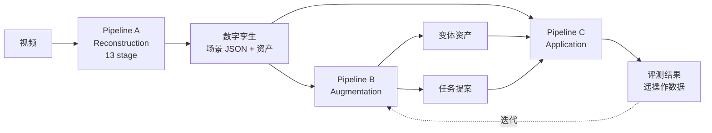
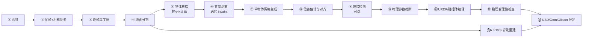
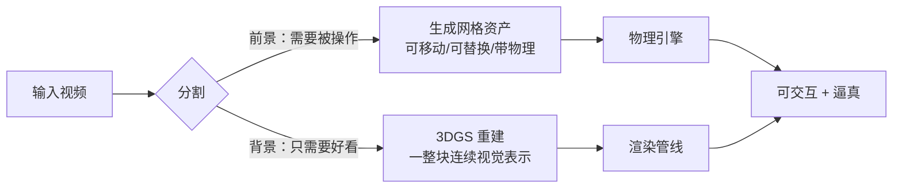
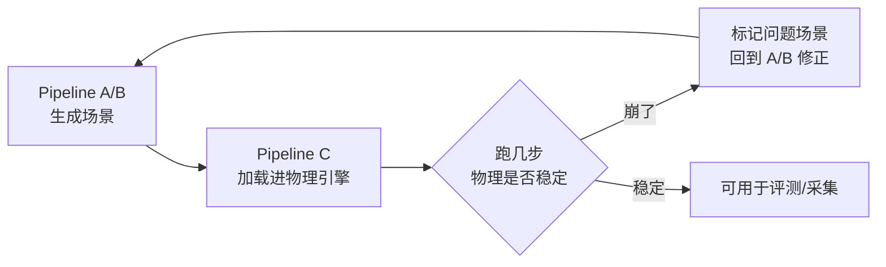
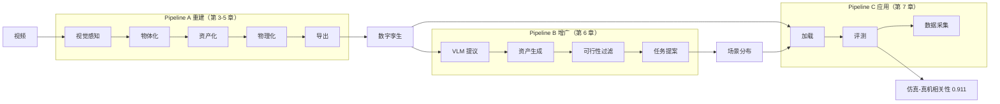

# 第二章：系统全景——三条流水线如何咬合

> 本章目标：建立 SimFoundry 的完整地图。看清 Pipeline A 的 13 个 stage 分别承担什么职责、它们之间用什么产物交接、Pipeline B 如何消费 A 的产物、Pipeline C 为什么是闭环的最后一环。

**知识链接**：
- [OmniGibson 与 BEHAVIOR 基准](/前置知识/010a_前置知识_OmniGibson与BEHAVIOR基准) — Pipeline A 的输出目标格式，读本章前建议先了解
- [3D Gaussian Splatting：用一堆椭球把真实场景搬进电脑](/前置知识/007a_前置知识_3D_Gaussian_Splatting三维场景重建) — Pipeline A 背景重建技术
- [为什么需要一座仿真场景铸造厂](./01_为什么需要仿真场景铸造厂) — 上一章交代的问题背景

---

## 一、三条流水线的分工

SimFoundry 的代码库把全部功能组织成三条流水线。这个名字（Pipeline）不是论文里的修辞，而是**代码目录的真实结构**：

| 流水线 | 职责 | 输入 | 输出 |
|--------|------|------|------|
| **A: Reconstruction** | 把真实视频变成可交互数字孪生 | 一段视频 | OmniGibson 场景 JSON + 物体资产 + 3DGS 背景 |
| **B: Augmentation** | 生成变体场景与新任务 | A 的场景 | 变体资产 + 任务提案 YAML |
| **C: Application** | 使用场景 | A/B 的场景 | 策略评测结果 / 遥操作数据 |

**为什么要有 Pipeline C 这个独立的第三条**：因为 A 和 B 产出的东西（场景、任务）本身不是终点，它们要被**消费**才能产生价值——被物理引擎加载、被机器人策略交互、被评测脚本统计。C 就是"消费者"这一侧的接口层。把它独立成一条流水线的好处是，A/B 只管"造得对不对"，C 只管"用得好不好"，职责不混。

---

## 二、Pipeline A 的 13 个 stage：产物契约

A 是整条链路最重的部分，13 个 stage 串联。与其逐个记名字，不如**按它产出的中间表示来理解**——每个 stage 的本质是"把上一种表示转成下一种更结构化的表示"。

### 2.1 表示的演进链

把 13 个 stage 按"中间表示"归类，能得到一条清晰的演进链，这比记 13 个名字有用得多：

| 阶段组 | 输入表示 | 输出表示 | 增加的语义 |
|--------|---------|---------|-----------|
| 视觉感知（②-③） | 像素序列 | 带深度的点云 | 三维空间位置 |
| 物体化（④-⑤） | 点云 | 逐物体掩码 + 干净背景 | "哪些像素属于同一个物体" |
| 资产化（⑥-⑧） | 物体掩码 | 带位姿的独立网格资产 | "每个物体是一个可搬动的实体" |
| 物理化（⑨-⑪） | 网格资产 | 带物理属性的仿真对象 | "它有多重、怎么动" |
| 校验与导出（⑫-⑬） | 物理对象 | 场景描述文件 | "整个场景是自洽的" |

每一组内部的 stage 细节在后面三章展开（第 03 章讲视觉感知 + 物体化，第 04 章讲资产化，第 05 章讲物理化 + 导出）。

### 2.2 两条并行支线：前景与背景

注意上面的图里有一条支线：**背景走 3DGS 重建（⑬b），前景物体走网格生成（⑦）**。这是 Pipeline A 最重要的架构决策，值得单独说明。

两条路的取舍不同：

| 表示 | 优点 | 缺点 | 适合 |
|------|------|------|------|
| 三角网格 | 语义边界清晰，可单独移动/替换，物理引擎原生支持 | 生成质量参差，纹理可能糊 | 前景可操作物体 |
| 3D 高斯 | 视觉保真度高、重建快 | 是一整块，没有物体边界，物理引擎不直接支持 | 背景、固定结构 |

**如果用统一一种表示会怎样**：

- 全用 3DGS：视觉效果最好，但没法把"杯子"单独拿出来换掉——高斯群是一个整体，Object Cousin 无从下手。
- 全用网格：每个物体都能编辑，但背景（墙面、桌面纹理、光照）用网格重建质量差、成本高，而且背景本来就不需要被操作，浪费了编辑能力。

SimFoundry 的选择是**按需求分配表示**：需要被操作的东西用可编辑的表示，只需要被看的东西用高保真的表示。这个决策直接决定了 Pipeline B 能不能成立。

---

## 三、Pipeline B 在 A 的产物上做什么

B 消费的是 A 的结构化产物。**它能做什么，完全取决于 A 留了哪些"把手"**：

| A 的产物 | 提供的"把手" | B 能做的变体 |
|---------|-------------|-------------|
| 逐物体的独立网格资产 | 可以整体替换某个物体 | Object Cousin |
| 物体在位姿/尺度上的结构化描述 | 可以改位置、可以插干扰物 | Scene Cousin |
| 物体清单 + 目标谓词格式 | 可以定义新目标状态 | Task Cousin |
| 铰接物体的关节定义 | 可以改开合状态 | 状态级变体 |

**如果 A 输出的是"一个整体网格"**：上面四行全部不成立，B 无事可做。这就是为什么第 1 章强调"全自动重建"和"变体生成"互为前提——A 的产物结构决定了 B 的能力上限。

B 内部的机制（VLM 如何提议、如何过滤幻觉、任务 YAML 长什么样）是第 06 章的主题。

---

## 四、Pipeline C：为什么闭环必须在这里合上

C 把场景加载进 OmniGibson，做三件事：策略评测、遥操作数据采集、流水线的冒烟测试。

**冒烟测试（smoke test）的工程意义容易被忽视**：A 和 B 都是生成式流程，它们可能产出一个"看起来对但物理上崩了"的场景——比如一个物体悬在半空、两个碰撞体互相穿插、关节轴方向反了。这些错误在生成阶段检测不出来（生成的网格和 JSON 语法都没问题），只有把场景真正加载进物理引擎跑几步才会暴露。

C 是"生成的产物是否真的能用"这个问题的唯一裁判。第 05 章的物理合理性检查（stage ⑫）和 C 的冒烟测试是两道把关，前者在导出前，后者在加载后。

---

## 五、产物目录结构：一次运行到底留下什么

理解三条流水线最实在的方式是看它留下的文件。一次完整的运行在 `Data/<scene_name>/` 下产生：

| 产物 | 来自 | 用途 |
|------|------|------|
| `reconstructed_og_scene.json` | A 的 stage ⑬ | 最终场景描述，C 的输入 |
| 逐物体网格资产 | A 的 stage ⑦ | Object Cousin 的替换对象、物理引擎的碰撞体 |
| 3DGS 背景 | A 的 stage ⑬b | 渲染 |
| `prompt_cousin_structured/` | B | 变体的图像提议（中间产物） |
| `sim_cousins/` + `usd_cousins/` | B | 仿真可用的变体资产 |
| `proposed_tasks/` | B | 生成的任务定义 YAML |
| `application_smoke/` | C | 冒烟测试的运行视频 |

**这张表本身就是 SimFoundry 的接口文档**：任何想让自己的系统接进来的人，只需要对齐这些产物的格式。这也是"模块化"的具体含义——模块之间靠文件契约交接，不靠内存里的隐式状态。

---

## 六、一张贯穿全系列的地图

后面各章就是逐块展开这张图：第 03 章展开 A1-A2，第 04 章展开 A3，第 05 章展开 A4-A5，第 06 章展开整个 B，第 07 章展开 C 和那个 0.911 的验证结果，第 08 章把整张图放进更大的技术图谱里做对比与选型。

---

## 七、总结

- **三条流水线是职责划分**：A 负责"造得对不对"，B 负责"造得够不够多"，C 负责"用得好不好"。
- **Pipeline A 的 13 个 stage 本质是五种中间表示的演进**：像素 → 点云 → 物体掩码 → 网格资产 → 物理对象 → 场景描述。
- **前景网格 + 背景 3DGS 的分离是核心架构决策**：按"是否需要被操作"分配表示。
- **Pipeline B 的能力上限由 A 的产物结构决定**：A 输出物体级解耦的结构化表示，B 才能做资产级变体。
- **Pipeline C 是唯一能验证"场景真的能用"的环节**：生成的语法正确不等于物理正确。

读完本章应该能回答：**如果删除 Pipeline C，SimFoundry 会失去什么？** ——失去对生成产物的物理正确性把关，也失去证明"仿真评测能预测真机"这件事的场所，而后者是整篇论文最有分量的证据。

---

## 下章预告

下一章进入 Pipeline A 的前半段：一段视频如何被拆解成"场景里有哪几个物体、每个物体在画面里占哪些像素、它们各自在三维空间的什么位置"。这一段的每一步都在为后续的物体级编辑做准备。

---

## 延伸阅读

- [OmniGibson 与 BEHAVIOR 基准](/前置知识/010a_前置知识_OmniGibson与BEHAVIOR基准) — 理解 Pipeline A 输出格式的前置
- [3D Gaussian Splatting：用一堆椭球把真实场景搬进电脑](/前置知识/007a_前置知识_3D_Gaussian_Splatting三维场景重建) — 背景重建支线的技术细节
- [SimFoundry：单视频重建可交互仿真场景](/论文综述/132_SimFoundry_单视频重建可交互仿真场景) — 论文层面的管线描述
- [Splatting Physical Scenes：端到端可微 Real2Sim](/论文综述/140_SplattingPhysicalScenes_端到端可微Real2Sim) — 把前景背景融合进一个可微框架的对比路线
