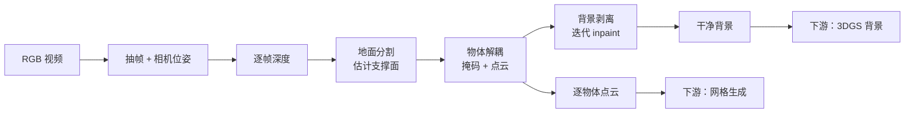
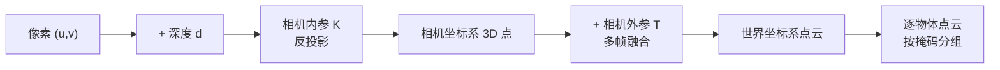
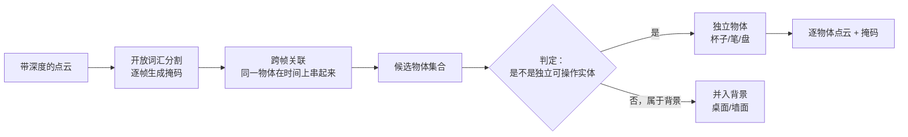
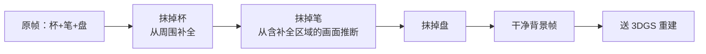

# 第三章：Extraction——从视频里"认出"场景

> 本章目标：看清 Pipeline A 的前半段怎么把一段像素序列变成"场景里有哪几个物体、每个物体在三维空间的什么位置"这样一份结构化中间表示。这一段决定了后面所有环节能不能做物体级编辑。

**知识链接**：
- [OmniGibson 与 BEHAVIOR 基准](/前置知识/010a_前置知识_OmniGibson与BEHAVIOR基准) — 本章的产出最终要落成的格式
- [3D Gaussian Splatting：用一堆椭球把真实场景搬进电脑](/前置知识/007a_前置知识_3D_Gaussian_Splatting三维场景重建) — 背景重建部分的技术基础
- [系统全景：三条流水线如何咬合](./02_系统全景_三条流水线如何咬合) — 上一章的流水线地图

---

## 一、这一段的输入输出契约

Extraction 的边界很清楚：

- **输入**：一段 RGB 视频（我们的例子里是绕着餐桌扫过的 15 秒）。
- **输出**：三样东西——
  1. 场景的**点云**（带三维坐标和颜色）；
  2. 每个物体的**掩码**（哪些像素/哪些点属于同一个物体）和对应点云；
  3. **干净背景**（把物体"抠掉"并补全后面的画面）。

最后一项容易被忽视，但它为什么必要：背景重建要的是**没有物体遮挡的完整背景**。原视频里杯子的位置永远是个杯子，3DGS 拿到的输入里那块区域只有杯子没有桌面纹理。所以必须先把物体区域从背景里抹掉、用图像修复（inpainting）补出"如果杯子不存在，桌面应该长什么样"，背景重建才有完整的输入。

---

## 二、为什么"以物体为中心"是这一段的纲领

在这一段的所有技术选择背后，只有一个目标：**把场景切成一个个可以被独立操作的单位**。

这个目标不是自然成立的。一个原始视频给的是"像素的时间序列"，物理引擎要的是"物体的集合"。中间必须有人回答一个问题：**画面里的这些像素，哪些属于同一个物体？**

对这个问题的不同回答，决定了系统的能力上限：

| 切分粒度 | 得到什么 | 能支持什么 | 不能支持什么 |
|---------|---------|-----------|-------------|
| 全场景一坨 | 一个整体点云/网格 | 渲染 | 任何物体级编辑 |
| 按类别切 | "所有杯子"成一类 | 类别级统计 | 替换某一个具体的杯子 |
| **按实例切** | **每个物理个体一个单位** | **替换/移动/单独标注物理** | — |

SimFoundry 必须做到第三行，因为 Object Cousin 的语义就是"把这**一个**杯子换成另一个"。所以在解耦阶段，判据不是"这是不是杯子"，而是"这**一个**独立可搬动的实体"。

这带来一个微妙的困难：**物体和背景的边界是语义的，不是几何的**。桌面上的杯子和桌面在点云里是连成一片的（接触面处没有间隙），靠几何连续性切不开。必须靠语义线索——"这一块虽然和桌面连着，但它是一个可以被拿走的独立物体"。

---

## 三、深度：把 2D 像素变成 3D 点的桥

有了掩码只能知道"物体在画面的哪个区域"，不知道"它离相机多远"。**单目深度估计模型**（给定一张 RGB 图像，预测每个像素到相机的距离）补上这一维。

为什么用单目而不是双目/结构光：因为输入约定是"一段普通手机视频"，不能假设用户有深度相机。单目深度估计是唯一零额外硬件要求的选择。

拿到逐帧深度后，配合相机位姿，就能把每个像素反投影成三维空间的一个点：

**这一步的一个关键不确定性**：单目深度估计得到的是**相对深度**而不是**绝对尺度**。模型能告诉你"杯子比盘子近"，但不知道"杯子离相机 0.78 米"。绝对尺度的恢复要靠后续的位姿估计阶段（第 04 章会讲），这是整条链路里误差最容易累积的地方之一。

---

## 四、地面分割：给场景一个参照系

在切物体之前，先要找到**地面**（更准确说是支撑面，这里是桌面）。这不是为了渲染，而是为了三件事：

1. **给场景一个物理参照**：物体是要"放在桌上"的，桌子不是可操作物体而是支撑结构。把支撑面识别出来后，物体才能被标注为"静止在桌面上"而不是"悬空"。
2. **给三维重建一个尺度锚点**：知道桌面的高度和范围，能约束相机位姿估计的解空间。
3. **几何先行过滤**：离支撑面很远、或者埋在支撑面以下的点，通常是深度估计的噪声，可以直接剔掉。

**为什么必须显式做这一步，而不是让下游隐式处理**：物理引擎无法容忍"悬空物体"——一个位置估计偏高的杯子会在仿真开始的瞬间掉下来，破坏整个场景的初始状态。在第 05 章你会看到，这种"悬空"正是物理合理性检查专门要抓的错误之一，而在源头约束比在下游修更省事。

---

## 五、物体解耦：这一段的真正难点

这是 Extraction 里技术含量最高的一步。流程是"先分割出候选，再判定哪些是独立物体"：

### 5.1 为什么要"开放词汇"

传统分割模型只有固定的类别表（COCO 的 80 类之类），拍到一个没见过的物体就分不出来。**开放词汇分割**（用自然语言描述要分割什么，模型就能分割什么）的价值在于：Real2Sim 面对的是任意家庭场景，物体类别是不可穷举的。它也让"要不要把某个东西当物体"变成一个可以用语言指定的决策，而不是硬编码在类别表里。

### 5.2 跨帧关联为什么必须做

视频里同一个杯子出现在连续的几十帧里。如果逐帧独立分割，会得到几十个"杯子掩码"，但它们实际是同一个物理对象。**跨帧关联**（用视觉特征匹配把不同帧里的掩码判定为同一个物体）的作用就是把这些观测聚成一个物体——否则最后会得到一堆重复的杯子，物理场景直接崩坏。

这一步的质量决定了物体数量的正确性，而物体数量错误会级联到所有下游环节：多算一个杯子 → 多生成一个网格 → 场景里出现一个原视频里不存在的幽灵物体。

### 5.3 "是不是独立物体"这个判定

这是最微妙的一步，因为它没有纯几何的答案。判据主要来自两路线索：

| 线索 | 例子 | 判断 |
|------|------|------|
| 语义 | 分割模型识别出"这是一个马克杯" | 通常是独立物体 |
| 空间关系 | 该掩码独立浮在支撑面上，和别的结构没有连续接触 | 独立 |
| 反面线索 | 掩码和墙面连成一片、或覆盖整个画面下半部分 | 是背景/结构 |

我们的例子里，"杯子、笔、盘"三个掩码都独立浮在桌面上，判定为独立物体；"桌面本身、背后的白墙"判定为背景。

---

## 六、背景剥离：为什么要"迭代"inpaint

确定物体掩码之后，要从每一帧里把物体区域抹掉、补全背景。这一步叫 **inpainting**（图像修复，用周围像素推断被遮挡区域原本应该是什么）。

**"迭代"的含义**：不是一次抹掉所有物体再补一次，而是逐个物体抹除、逐个补全，边补边检查。原因在于多个物体可能互相遮挡——如果杯子挡在盘子前面，一次性抹掉两个物体，模型需要同时从零推断两块区域，容易补出结构不一致的内容；而逐个处理时，每次只需要从周围的**真实像素**（还没被抹掉的部分）推断一小块，稳定性好得多。

**这一步的产出直接服务 Pipeline B**：一个"如果物体不存在，场景长什么样"的完整背景，是 Scene Cousin（改变背景风格、重排物体）能够自由操作的基础。如果背景里嵌着原物体的残影，任何变体生成都会带着这个残影。

---

## 七、这一段的质量如何传导到下游

Extraction 的每一步误差都会往下传，而且会被放大。整理成一张传导链：

| 这里的误差 | 下游表现 | 最终后果 |
|-----------|---------|---------|
| 深度估计偏差 | 物体位置/尺度不对 | 杯子在空中或嵌进桌面 |
| 分割掩码不完整 | 网格缺一块 | 物体形状错误，抓取点失效 |
| 跨帧关联失败 | 物体重复/漏检 | 幽灵物体或缺失物体 |
| 物体/背景判定错误 | 桌子被当成可搬动物体 | 场景初始状态崩坏 |
| inpaint 残缺 | 背景带残影 | 所有 Scene Cousin 都带残影 |

**这解释了为什么 SimFoundry 反复强调"模块化"**：这条传导链上任何一环都有独立的、可以被替换的模型。当某个环节出现更强的上游模型（比如更准的单目深度估计），只需要换掉那一个 stage，整条链的质量就提升了，而不需要重新设计系统。这也是"pipeline improves with foundation models"这句话在这一段的具体含义。

---

## 八、总结

- **Extraction 的纲领是以物体为中心**：把像素序列切成一个个独立可操作的实体，这是后面所有编辑能力的前提。
- **四个关键动作**：深度估计补第三维、地面分割给参照系、物体解耦切出实体、背景剥离准备干净的背景输入。
- **每个动作都对应一个具体的技术依赖**：单目深度模型、开放词汇分割、跨帧关联、图像修复。它们各自可以被替换。
- **这一段是整条链路误差的主要来源**：位置、尺度、物体数量、背景质量都在这里决定。

读完本章应该能回答：**为什么 SimFoundry 不能跳过"物体解耦"直接对整段视频做重建？** ——因为整段视频重建得到的是一个不可分割的整体表示，而 Object Cousin、物理参数标注、碰撞体编译都需要"物体"这个单位。没有物体级切分，Pipeline B 和物理编译都无从下手。

---

## 下章预告

下一章处理"每个物体怎么变成真正的三维资产"：一张物体裁剪图怎么被生成成带纹理的网格、生成的网格怎么和真实场景对齐位姿、以及为什么背景走的是完全不同的技术路线。

---

## 延伸阅读

- [3D Gaussian Splatting：用一堆椭球把真实场景搬进电脑](/前置知识/007a_前置知识_3D_Gaussian_Splatting三维场景重建) — 背景支线的重建技术
- [OmniGibson 与 BEHAVIOR 基准](/前置知识/010a_前置知识_OmniGibson与BEHAVIOR基准) — 解耦后的物体最终要落成的场景格式
- [RialTo：手机扫描建数字孪生](/论文综述/114_RialTo_数字孪生RL策略学习) — 对比：RialTo 的对应环节需要人工介入
- [SimFoundry：单视频重建可交互仿真场景](/论文综述/132_SimFoundry_单视频重建可交互仿真场景) — 论文中的 Extraction 阶段描述
