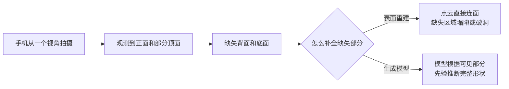
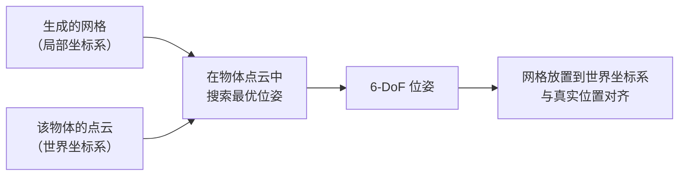
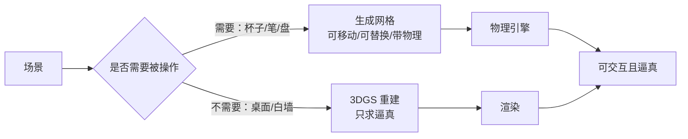

# 第四章：Generation——2D 生成模型如何造出物理网格

> 本章目标：理解每个物体如何从几张二维裁剪图变成一个带纹理、带位姿的三维资产，以及为什么"生成"而不是"重建"是正确的技术选择——包括它的代价。

**知识链接**：
- [Extraction：从视频里认出场景](./03_Extraction_从视频里认出场景) — 上一章产出的逐物体掩码和点云是本章的输入
- [3D Gaussian Splatting：用一堆椭球把真实场景搬进电脑](/前置知识/007a_前置知识_3D_Gaussian_Splatting三维场景重建) — 背景支线的重建技术
- [OmniGibson 与 BEHAVIOR 基准](/前置知识/010a_前置知识_OmniGibson与BEHAVIOR基准) — 物体资产最终要挂上的物理能力

---

## 一、一个反直觉的决策：为什么要"生成"而不是"重建"

Extraction 结束时，每个物体手上已经有了一份点云——三维坐标 + 颜色。看上去直接把这堆点转成网格（比如用泊松重建这类表面重建方法）就够了。为什么 SimFoundry 却要用一个 2D 到 3D **生成模型**来"凭空画"一个网格？

答案在于**点云的覆盖是不完整的**。手机从一个角度扫过桌面，得到的点云只覆盖了物体的**可见面**：

表面重建算法（如泊松重建、Marching Cubes）的假设是"点云覆盖了目标表面的大部分"，它做的是**连面**。对于一个只看到正面的杯子，缺失的背面会在重建结果里表现为一个破洞或者塌成一个扁片——因为你没给它关于背面的任何信息，它也无从推断。

而 2D 到 3D 生成模型的训练数据是海量真实 3D 资产，它从中学到了**"一个马克杯的背面通常长什么样"这类先验**。给定一张正面裁剪图，它能生成一个完整闭合的、看起来合理的杯子——包括它从没被看到的背面。

**这就是"生成"与"重建"的本质区别**：重建忠实于观测（所以缺失部分无解），生成依赖先验（所以缺失部分靠猜，但猜得合理）。

这是一个明确的取舍，SimFoundry 选了生成这一侧：

| 路线 | 优点 | 代价 |
|------|------|------|
| 点云表面重建 | 严格忠实于真实观测 | 遮挡区域无法恢复，常出现破洞或塌陷 |
| 2D→3D 生成 | 输出完整闭合网格，适合物理仿真 | 遮挡部分的几何是"合理猜测"，不是真实值 |

对物理仿真来说，一个**完整闭合**的网格比一个**精确但有洞**的网格更有用——碰撞检测要求网格是封闭的，有洞的网格在物理引擎里会产生穿透。所以宁可接受"背面是猜的"，也要拿到一个完整实体。

---

## 二、完整流程

### 2.1 多帧裁剪：为什么不是只用一帧

物体的可见部分分布在视频的多个帧里——正面在第 30 帧看得最清楚，顶面在第 50 帧。把这些不同帧的裁剪图聚合起来，能让生成模型拿到**多视角的一致性线索**，生成质量明显优于单张图。这也是 SimFoundry 选择**视频**输入而不是像 [ACDC](https://arxiv.org/abs/2410.07408) 那样用**单张图像**输入的直接收益：视频天然提供多视角。

### 2.2 生成模型给出了什么

输出是一个带纹理的三角网格——它包含两样东西：**几何**（顶点的三维位置、面片连接关系）和**外观**（每个面的颜色/纹理贴图）。对物理仿真来说，几何决定碰撞行为，外观决定渲染。两者都要。

论文的图库里展示了这个环节的效果：每个物体的仿真版本都是从它的一张 2D 裁剪图出发，由生成模型自动产出，再编译进物理场景的。这一步用的是第三方开源生成模型（[Hunyuan3D-2](https://github.com/Tencent-Hunyuan/Hunyuan3D-2) 系列），这再次体现了模块化设计——换个更强的生成模型，这一环节直接变强。

### 2.3 尺度问题：生成模型的输出不能直接用

生成模型输出的是**归一化**的网格——它只关心"这看起来像个杯子"，不保证"这个杯子是 12 厘米高"。而物理仿真对尺度极其敏感：一个 2 倍大的杯子和真实的杯子，质心、惯性、抓取点全都不同。

所以生成之后必须做**尺度对齐**：把生成的网格缩放到和真实物体一致的大小。参照物来自 Extraction 阶段的点云——点云虽然有深度估计的误差，但提供了一个"大致多大"的约束。这一步是整条链路里精度最脆弱的地方之一，第 08 章讨论适用边界时会回到它。

---

## 三、位姿估计：把资产放回场景

网格生成好了、尺度对了，还差最后一步：**它应该放在场景的哪个位置、什么朝向**。这就是位姿估计。

位姿是一个六自由度量：三个位置分量（x, y, z）+ 三个旋转分量。求解的方法是：把生成的网格在场景点云里"找一个匹配得最好的摆放姿态"——如果网格是杯子的正确形状，那么把它对齐到点云里杯子那一簇点的位置，就能同时确定它的位置和朝向。

这个环节用到了专门的三维位姿估计方法（如 FoundationPose 这类基于模型对齐的方法）。它的输出精度直接决定场景的初始状态是否合理——位姿偏了，物体就会浮空或穿插。

**为什么位姿估计比尺度对齐更可控**：尺度只需要一个标量（一个缩放因子），而位姿是 6 个自由度，但位姿有一个强约束可用——物体必须落在它点云所在的位置。尺度则没有这样直接的约束，只能靠深度估计的绝对精度，所以尺度是更脆弱的一环。

---

## 四、背景支线：完全不同的技术路线

前景物体走生成，背景走的是**重建**——而且是[3D Gaussian Splatting](/前置知识/007a_前置知识_3D_Gaussian_Splatting三维场景重建)。这是刻意的分工：

为什么背景不也用生成：

| 维度 | 背景用生成 | 背景用 3DGS 重建 |
|------|-----------|-----------------|
| 视觉保真度 | 生成模型对大面积纹理（木纹、墙面渐变）容易失真 | 直接拟合真实像素，保真度高 |
| 一致性 | 逐块生成容易接缝不连续 | 是一整块连续表示，无缝 |
| 成本 | 需要为背景每一块都跑生成 | 一次性优化一堆高斯 |

**为什么前景不也用 3DGS**：3DGS 得到的是一整块连续表示，里面没有物体边界。虽然可以把某个物体的高斯单独删掉，但没法得到一个"闭合的实体"给物理引擎做碰撞检测——高斯椭球是渲染图元，不是碰撞体。

所以分工的本质是：**需要参与物理的用网格，只需要被看的用高斯**。第 02 章讲过这个决策，这里补上了它的技术理由。

---

## 五、"视觉正确"与"物理正确"的分裂

本章最重要的一个认知，是生成式路线带来的一个根本性张力：

> **生成的网格在视觉上可以很正确，在物理上却可能不正确。**

具体表现：

| 现象 | 视觉上 | 物理上 |
|------|--------|--------|
| 杯子的把手生成得偏细 | 看着还行 | 抓取点强度、碰撞体形状不对 |
| 物体内部有自相交面片 | 渲染看不出来 | 物理引擎求解出错或穿透 |
| 背面被"合理猜测"成封闭曲面 | 从正面看完美 | 实际物体可能是中空的（如碗），猜测成了实心 |
| 网格密度不均匀 | 无所谓 | 质心/惯性张量计算偏差 |

**这解释了为什么物理化环节（下一章）不能只做"填参数"，还必须做物理合理性检查**：参数可以凭经验给默认值，但网格本身的几何缺陷是生成阶段带进来的，只有在物理引擎里跑起来才暴露。视觉上的合格不能替代物理上的合格，这是生成式 Real2Sim 路线的固有代价。

**这也是 SimFoundry 与"端到端可微 Real2Sim"路线（如 [Splatting Physical Scenes](/论文综述/140_SplattingPhysicalScenes_端到端可微Real2Sim)）的核心分歧**：后者试图让视觉和物理在同一个可微框架里联合优化，从原理上消除这种分裂；SimFoundry 选择用两条独立管线各管一摊，用后面的检查环节来兜底。两条路线的取舍会在第 08 章系统对比。

---

## 六、总结

- **为什么用生成而不是重建**：手机视频的观测是不完整的，表面重建在遮挡区域无解；生成模型用学到的先验补齐遮挡部分，换来完整闭合的网格。
- **代价是遮挡部分的几何是"合理猜测"**：所以必须做尺度对齐和位姿估计把猜测落回真实约束。
- **前景用生成 + 背景用 3DGS 是刻意的分工**：需要参与物理的用网格，只需要被看的用高斯。
- **视觉正确 ≠ 物理正确**：这是生成式路线的固有张力，也是下一章物理编译必须存在的原因。

读完本章应该能回答：**为什么 SimFoundry 不能只输出一个整体网格、把所有物体和背景一起重建出来？** ——因为物理编译要求每个物体是独立的、闭合的、带正确尺度位姿的实体，而整体重建既提供不了物体边界，也提供不了可单独标注物理属性的单位。

---

## 下章预告

下一章把生成的网格变成物理仿真器真正能跑的东西：物体怎么获得质量、摩擦、碰撞体，抽屉和柜门这种铰接部件怎么被自动识别并赋予关节，以及如何自动检查一个场景"物理上是不是自洽的"。

---

## 延伸阅读

- [Extraction：从视频里认出场景](./03_Extraction_从视频里认出场景) — 本章的输入来源
- [3D Gaussian Splatting：用一堆椭球把真实场景搬进电脑](/前置知识/007a_前置知识_3D_Gaussian_Splatting三维场景重建) — 背景支线
- [Splatting Physical Scenes：端到端可微 Real2Sim](/论文综述/140_SplattingPhysicalScenes_端到端可微Real2Sim) — 与"生成 + 兜底"路线相反的端到端路线
- [RialTo：手机扫描建数字孪生](/论文综述/114_RialTo_数字孪生RL策略学习) — 对比：RialTo 的重建依赖人工标注和传统重建工具
