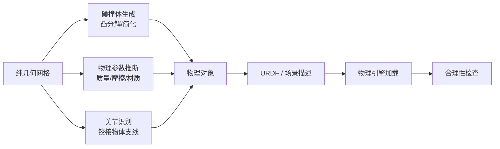
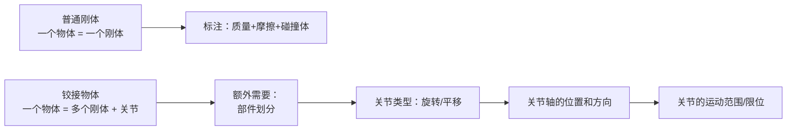
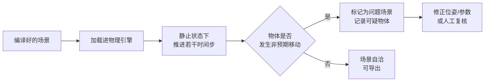

# 第五章：物理编译——从好看网格到能跑起来

> 本章目标：理解一个纯几何网格如何被赋予物理属性（质量、摩擦、碰撞体、关节），铰接物体为什么需要专门处理，以及系统如何自动发现"这个场景物理上不自洽"。

**知识链接**：
- [OmniGibson 与 BEHAVIOR 基准](/前置知识/010a_前置知识_OmniGibson与BEHAVIOR基准) — 本章编译工作的目标格式，尤其是"能力列表"的设计
- [Generation：2D 生成模型如何造出物理网格](./04_Generation_2D生成模型造出物理网格) — 上一章末尾指出"视觉正确 ≠ 物理正确"，本章正是解决它
- [Sim-to-Real 迁移综述](/论文综述/S04_Sim_to_Real迁移综述) — 物理参数误差属于其中的 Physics Gap

---

## 一、一个网格缺了什么

上一章结束，我们手上有三个物体：一个马克杯网格、一支记号笔网格、一个浅盘网格。它们有形状、有纹理、有位姿、有尺度。

把它们直接丢进物理引擎，会发生什么？

| 缺失的信息 | 后果 |
|-----------|------|
| 质量 | 默认值下杯子可能被轻轻一碰就飞出去 |
| 摩擦系数 | 杯子放在倾斜桌面上会自己滑走 |
| 碰撞体 | 没有碰撞体，引擎不知道怎么处理接触 |
| 材质属性（弹性、阻尼） | 物体碰撞后行为反常（不落地弹跳、穿透） |

**物理编译这一步的职责，就是把这三个网格变成三个"物理上完整"的对象**，并且让它们和真实世界的物理行为尽量一致。

---

## 二、碰撞体：网格不能直接当碰撞体用

一个自然的想法是"网格本身就是它的形状，直接拿来做碰撞体不就行了"。实际不行，原因有两个：

**原因一：性能**。碰撞检测的计算量随几何复杂度急剧上升。一个生成模型产出的网格可能有几万个面片，如果每个物体都用完整网格做碰撞检测，实时仿真根本跑不动。真实物体做碰撞检测用的是**凸包或凸分解**得到的简化几何。

**原因二：碰撞检测算法只对凸体有闭式解**。两个任意非凸网格之间的精确接触检测没有高效的通用算法（这也是[分离轴定理](/前置知识/007d_前置知识_分离轴定理与凸多边形碰撞检测)这类经典方法都建立在凸性假设上）。所以标准做法是把非凸物体**分解成若干个凸块**，然后对每对凸块之间的接触分别检测。

**对 SimFoundry 的直接含义**：生成模型产出的网格质量参差不齐，凸分解的结果也会参差。一个形状怪异的网格分解出几十个碎片凸块，不仅慢，接触行为也可能不自然。这是"生成式网格"带进物理层的第二个代价（第一个是尺度）。

---

## 三、物理参数：从视觉能推断出多少

质量、摩擦这些参数没法从视频里直接测量，只能推断。推断依据分三层：

| 依据 | 例子 | 可靠性 |
|------|------|--------|
| 物体类别 | "陶瓷杯" → 密度约 2.4 g/cm³ | 中（类别识别可能不准） |
| 尺寸 | 网格的体积 × 类别密度 = 质量 | 中（依赖尺度对齐精度） |
| VLM 视觉常识 | 看图判断"这是陶瓷还是塑料"、"表面是光滑还是粗糙" | 低-中（模型常识，无标定） |

质量由"密度 × 体积"得到，其中体积从网格直接算，密度从类别/VLM 判断得到。

这里要引入一个重要的区分：**真实物理参数 vs 仿真就绪参数**。SimFoundry 推断出的质量、摩擦不是精确测量值，而是让仿真**行为合理**的估计值。这两者目标不同：

- 如果研究者想量化"仿真和真机的物理差多少"，需要的是精确值 → 这是[系统辨识](/系列/system_identification_deep_dive/index)类工作要解决的。
- 如果研究者想让仿真里的策略迁移到真机、且对参数误差不敏感，需要的是合理范围内的一致值 → 这正是**域随机化**的用武之地：既然值不准，就在一个范围内随机化它，让策略对这个范围都不敏感。

SimFoundry 走的是第二条路。这解释了为什么"物理参数不精确"在它的设计里不是一个致命问题——它不指望参数精确，而是指望后面的域随机化和表亲变体把参数不确定性吸收掉。

**这里涉及 OMniGibson 的"能力列表"设计**（见[前置知识](/前置知识/010a_前置知识_OmniGibson与BEHAVIOR基准)）：物体不需要精确类别，只需要决定挂哪些能力。一个识别不出是"马克杯"还是"玻璃杯"的物体，只要能确定它 `rigid + graspable + 有质量有摩擦`，就足够在仿真里被正常操作了。类别识别的误差被这个设计隔离在物理层之外。

---

## 四、铰接物体：相对刚体的一次复杂度跃升

抽屉、柜门、冰箱门、笔记本电脑这类**铰接物体**（由关节连接的多个刚体），是整个 Pipeline A 里技术最复杂的一支。为什么它们不能按普通刚体处理：

一个抽屉不是一个物体，而是**一个柜体 + 一个可滑出的抽屉**两个刚体，用**一个平移关节**连接。要正确建模它，需要四样额外信息，每一样都要从图像里推断：

| 需要推断的信息 | 推断难度 | 推错了会怎样 |
|---------------|---------|-------------|
| 部件划分（哪里是柜体、哪里是抽屉面板） | 中 | 整块网格被当成一个刚体，抽屉拉不开 |
| 关节类型（旋转 vs 平移） | 低 | 抽屉变成了旋转打开（像门一样转） |
| 关节轴方向（沿哪个方向滑/绕哪个轴转） | 高 | 抽屉斜着滑、门绕着错误的轴翻转 |
| 关节限位（能拉出多远、能转多少度） | 中 | 抽屉能拉出无限远，或者转 360° |

SimFoundry 的做法是：先用网格分割把物体切成部件，再用**视觉语言模型（VLM）**根据图像和部件结构推理关节的语义（"这是一个抽屉，它应该沿水平方向平移，范围大约是物体深度"），最后编译成 URDF（一种标准的机器人描述格式，用 XML 描述刚体和关节）。

**为什么这一步特别依赖 VLM 而不是纯几何分析**：关节信息在几何上是不可见的——一个闭合的抽屉和一个固定的柜子，网格看起来完全一样，唯一区别是"抽屉可以拉出来"这个**语义事实**。这个事实只存在于人类常识里，而 VLM 是当前唯一能调用这类常识的部件。

**为什么建模完还要在物理引擎里跑一遍**：关节参数错了（比如轴方向反了），生成的 URDF 语法是完全正确的，不会报错。只有把它放进 PyBullet 这类物理引擎里实际驱动一下，才能发现"抽屉往墙里推"这种错误。这就是下一节的合理性检查。

---

## 五、物理合理性检查：自动发现不自洽的场景

这是 Pipeline A 的倒数第二个 stage，也是"全自动"这个承诺能不能兑现的关键——**如果没有自动检查，人工检查就不可避免，自动化就只完成了一半**。

检查抓的是这几类错误：

| 错误类型 | 成因 | 检查方式 |
|---------|------|---------|
| 物体悬空 | 位姿估计偏高 | 检查物体是否和支撑面有接触 |
| 物体穿插 | 位姿估计偏低或碰撞体过大 | 检查碰撞体是否互相重叠 |
| 初始状态不稳定 | 参数不合理 | 加载后跑若干步，看场景是否自行扰动 |
| 关节运动异常 | 关节轴/限位推断错误 | 驱动关节，检查是否产生非物理位移 |

**"跑若干步"这个机制值得展开**：一个物理上不自洽的场景，最典型的特征是**它在没有任何外力的情况下自己就会动**——悬空的物体会下落、穿插的物体会被弹开。所以检查方法很直接：把场景加载进物理引擎，让物理时间前进几百步，观测所有物体的位置变化。如果一个本该静止的杯子在 500 步内移动了 10 厘米，说明场景有问题。

**这道关卡和 Pipeline C 的冒烟测试是什么关系**：两者机制相似（都是在物理引擎里跑几步看稳不稳），但位置不同——这里的检查在**导出前**，是 Pipeline A 内部的自我校验；Pipeline C 的冒烟测试在**加载后**，是使用方对场景的最后确认。两道关卡对应"生成方负责"和"使用方验收"两个不同的责任主体。

---

## 六、输出契约：最后落成什么

编译完成，场景被导出成 OmniGibson 的场景描述。第 02 章列出了产物目录，这里把最关键的那个文件——场景 JSON——的字段和本章的各个环节对应起来：

| JSON 字段 | 由本章哪个环节产生 | 具体含义 |
|-----------|------------------|---------|
| `objects[].name` | 第三章的物体解耦 | 物体标识 |
| `objects[].position` / `orientation` | 第四章的位姿估计 | 世界坐标系位姿 |
| `objects[].scale` | 第四章的尺度对齐 | 真实尺度 |
| `objects[].abilities.rigid` | 本章碰撞体生成 | 刚体能力 |
| `objects[].abilities.mass` | 本章参数推断 | 质量 |
| `objects[].abilities.friction` | 本章参数推断 | 静/动摩擦 |
| `objects[].abilities.openable` + 关节定义 | 本章铰接处理 | 可开合能力 |
| `task.activity_conditions` | **Pipeline B** | 任务谓词（下一章） |

**注意最后一行**：场景 JSON 里已经有 `task` 字段了，但它是空的或者只有占位。**任务定义的填充是 Pipeline B 的工作**，这是 A 和 B 之间最直接的产物交接点。

---

## 七、总结

- **网格缺四样东西才能进物理引擎**：质量、摩擦、碰撞体、材质属性。质量由密度 × 体积得到，密度靠类别/VLM 推断。
- **碰撞体必须简化**：性能要求 + 非凸碰撞检测的固有困难，导致"凸分解"是必经步骤，也导致它是误差来源。
- **物理参数是"仿真就绪"值而不是"精确测量"值**：SimFoundry 的策略是用域随机化吸收参数不确定性，而不是追求精确。
- **铰接物体是复杂度的跃升**：需要部件划分、关节类型、关节轴、限位四样信息，其中关节轴和限位在几何上不可见，必须靠 VLM 的常识，且必须在物理引擎里验证。
- **自动化检查是"全自动"承诺的最后一块拼图**：把场景跑几百步看它稳不稳，自动抓出悬空、穿插、关节错误。

读完本章应该能回答：**为什么物理参数不精确不会让 SimFoundry 失效？** ——因为它的目标不是精确仿真，而是让策略学到对参数不敏感的鲁棒性；参数不确定性由域随机化和数字表亲的多样性吸收，而类别识别的误差被 OmniGibson 的"能力列表"设计隔离在物理层之外。

---

## 下章预告

下一章进入 Pipeline B：有了这个结构化的、物体级解耦的数字孪生，系统如何自动生成成百上千个变体——换掉一个杯子、重排布局、提出一个全新的任务，以及如何自动把生成模型编造的、物理上不可行的变体筛掉。

---

## 延伸阅读

- [OmniGibson 与 BEHAVIOR 基准](/前置知识/010a_前置知识_OmniGibson与BEHAVIOR基准) — 本章的输出格式详解
- [分离轴定理与凸多边形碰撞检测](/前置知识/007d_前置知识_分离轴定理与凸多边形碰撞检测) — 为什么碰撞检测要建立在凸性上
- [机器人系统辨识深度解析](/系列/system_identification_deep_dive/index) — 与"合理估计 + 域随机化"相反的路线：精确测量物理参数
- [Sim-to-Real 迁移综述](/论文综述/S04_Sim_to_Real迁移综述) — Physics Gap 在整体方法论中的位置
