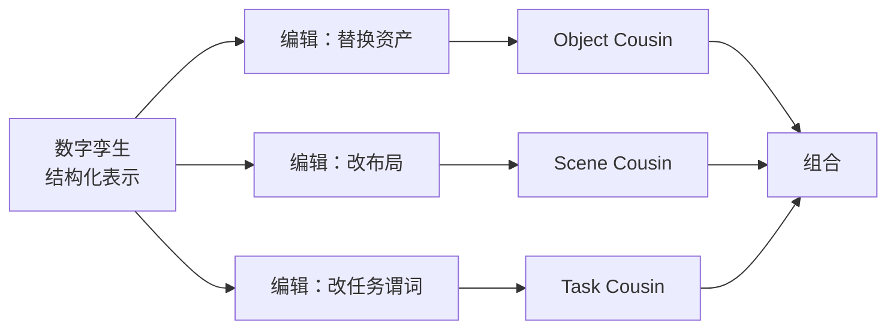
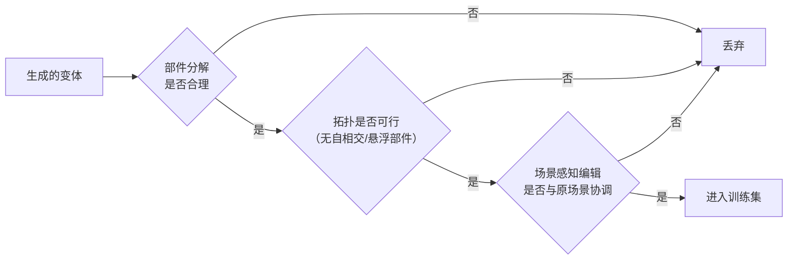
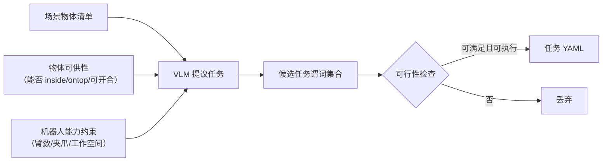

# 第六章：Pipeline B——VLM 驱动的数字表亲生成

> 本章目标：看清一个数字孪生如何被自动扩成一族数字表亲——VLM 如何提议变体、生成模型如何造出资产、系统如何把物理上不可行的幻觉变体筛掉、以及任务变体是怎么被提出的。

**知识链接**：
- [数字表亲与 Real2Sim 数据增广](/前置知识/010b_前置知识_数字表亲与Real2Sim数据增广) — 本章实现的概念，读本章前建议先读
- [物理编译：从好看网格到能跑起来](./05_物理编译_从好看网格到能跑起来) — 上一章产出的结构化场景是本章的操作对象
- [OmniGibson 与 BEHAVIOR 基准](/前置知识/010a_前置知识_OmniGibson与BEHAVIOR基准) — 任务谓词格式

---

## 一、变体生成 = 在结构化表示上做编辑

第 1 章强调过：变体生成能成立的前提，是 Pipeline A 输出了**物体级解耦的结构化表示**。本章就从"编辑"这个视角展开——三类变体本质上是三种不同的编辑操作：

| 变体 | 编辑操作 | 作用对象 |
|------|---------|---------|
| Object Cousin | **替换**某个物体资产 | 单个物体的网格 + 材质 |
| Scene Cousin | **重写**物体的位姿 + 增删干扰物 + 改背景风格 | 场景的空间布局 |
| Task Cousin | **重写**目标谓词 | 场景的 `task` 字段 |



**为什么"编辑"比"从零生成"好**：

- 从零生成一个场景需要重新确定所有物体、位姿、物理参数，质量不可控且容易失败。
- 编辑是在一个已经物理自洽的场景上做局部改动，改动范围小、失败风险可控，而且**改动前的场景已经通过了物理检查**。

这是"孪生 → 表亲"这条路径相对"直接生成场景"的核心优势：它把一个大而难的问题，拆成"先确保一个场景是对的，再在它上面做小改动"。

---

## 二、Object Cousin：换掉一个物体

### 2.1 三轴提议：VLM 提议什么

对场景里的每个物体，系统用一个 VLM 来提议变体方向。提议沿三个轴展开：

| 轴 | 具体变化 | 例子（我们的马克杯） |
|----|---------|-------------------|
| **几何** | 形状、比例、部件结构 | 更细高的杯型、加了杯盖、把手变成方形 |
| **拓扑** | 部件数量、连接关系 | 从"杯子"变成"杯子 + 托盘"的组合 |
| **外观** | 材质、颜色、纹理 | 白瓷 → 深蓝釉、哑光 → 亮面 |

**为什么需要 VLM 而不是随机采样**：随机的形状/外观变化会产生大量无意义的变体——比如一个"六条腿的杯子"。变体要保留可供性，就必须知道"杯子之所以为杯子"的常识，而这个常识在 VLM 里。论文里也提到这些提议会经过校验：检查组件分解是否合理、拓扑是否可行。

### 2.2 从提议到资产

VLM 给出的是**文本描述**（"一个深蓝色釉面的细高马克杯，保留把手"）。把它变成资产需要图像/3D 生成模型：


注意这里复用了 Pipeline A 的 2D→3D 生成能力——**变体资产的生成和初次重建走的是同一套技术**，只是输入从"真实拍摄的裁剪图"变成了"生成的变体图"。这也解释了为什么变体生成的成本远低于重新采集视频并重建：它跳过了采集、分割、位姿估计，直接进了生成环节。

### 2.3 最关键的约束：替换后必须仍然可操作

Object Cousin 最容易出的错，是变体在视觉上很合理、但**物理上不能执行原任务**了。举几个例子：

| 变体 | 视觉上 | 物理/任务上 |
|------|--------|-----------|
| 杯子变高变细 | 很好看 | 原来的夹爪张开度抓不住了 |
| 材质变成超滑的玻璃 | 很真实 | 摩擦系数太低，抓取时滑脱 |
| 把手变成装饰性的镂空 | 很精致 | 抓取点不存在了 |

**所以变体资产不能只是"看起来像"，还要满足任务的可执行性约束**。这是"保持可供性"这个抽象要求的具体落地：变体必须仍然能被场景里机器人的末端执行器以相同方式操作。

这也是为什么变体的生成必须知道**机器人硬件约束**——同一个杯子，对一个两指夹爪和一个五指灵巧手来说，"可操作"的定义不同。这一点在 Task Cousin 的生成里更明显（见第四节）。

---

## 三、可行性过滤：把幻觉筛掉

生成模型会产生幻觉——它可能生成一个物理上不成立、语义上不一致、或者和场景不协调的变体。**如果直接把所有生成的变体塞进训练集，等于往数据里掺噪声**。所以 Pipeline B 有一个明确的过滤环节。

过滤检查几个维度：



| 检查项 | 抓什么问题 | 如果放过会怎样 |
|--------|-----------|--------------|
| 部件分解合理性 | 生成模型把物体切成了无意义的碎片 | 不可操作的伪物体 |
| 拓扑可行性 | 生成出的网格有断开的悬浮部件、自相交 | 物理引擎求解异常 |
| 场景感知一致性 | 变体和它所在场景的尺度/风格严重不匹配 | 视觉上明显不合理，训练信号有害 |

**"场景感知编辑"这个检查值得说明**：变体不是孤立生成的，是"在某个具体场景里"生成的。一个正常大小的马克杯变体，放进一个整体尺度过小的场景里就会显得突兀。所以生成时要把场景上下文一起给模型（"这个物体和这些物体摆在一起，尺度是这样"），过滤时也要检查变体与场景的一致性。

**这是 Pipeline B 与"无条件随机生成"的分野**：随机生成不需要过滤，因为它本来就不承诺合理性；表亲生成承诺"保可供性、保场景协调"，所以必须用过滤来兑现这个承诺。

---

## 四、Scene Cousin：重排与干扰物

Scene Cousin 改变的是**物体之间的空间关系**和背景，保持物体集合不变。机制有两个：

### 4.1 空间谓词约束的重排

物体不能随便挪——挪到互相穿插、挪到桌面外面、挪到机器人工作空间之外，都是无效变体。所以重排受**空间谓词**的约束：

| 谓词 | 含义 | 约束作用 |
|------|------|---------|
| `OnTop` | A 在 B 上面 | 保证支撑关系成立 |
| `RightOf` / `LeftOf` | 相对方位 | 保证布局在语义上合理 |
| `Inside` | A 在 B 里面 | 保证容器关系成立 |
| `Reachable` | 机器人够得到 | 保证任务可执行 |

系统的做法是：先确定要保留哪些空间谓词（比如"杯子必须在盘子右边"），然后在这些约束下采样新的位姿。这样得到的变体在布局上有变化，但语义关系（谁是支撑、谁是容器）仍然成立。

### 4.2 干扰物采样

在场景里加入**和目标任务无关的物体**（distractor），是提升策略鲁棒性的经典手段——它逼着策略学会忽略无关物体。SimFoundry 的干扰物采样不是随机撒点，而是从物体库里有选择地采样，保证干扰物在场景里也是物理合理、语义协调的。

**为什么需要有选择**：随机撒一个"浮在空中的物体"只会给场景引入错误初始状态；而从同类家庭物品库里采样一个"放在桌面上的额外瓶盖"，既增加了干扰，又不破坏场景自洽性。

---

## 五、Task Cousin：提出新任务

Task Cousin 是三类变体里增益最大的（+40%，见第 07 章），机制也最精巧。

### 5.1 任务是怎么被表示的

回顾[前置知识](/前置知识/010a_前置知识_OmniGibson与BEHAVIOR基准)里讲的：任务是**目标谓词的组合**。"把笔放进杯子"不是一段轨迹，而是一个条件：

```json
{
  "activity_conditions": [
    { "condition": "inside", "subject": "marker_1", "target": "mug_1" }
  ]
}
```

所以"提出新任务"= **生成一组新的、当前场景可以满足的谓词组合**。

### 5.2 提议时要用到哪些约束

VLM 提议任务时，输入包含三类信息：

| 输入 | 作用 | 例子 |
|------|------|------|
| 场景物体清单 | 决定任务可以用到哪些物体 | 场景里有杯子、笔、盘 |
| 物体属性 | 决定哪些谓词成立 | 杯子有内腔（可以用 `inside`），盘子是平的（只能用 `ontop`） |
| 机器人约束 | 决定任务是否可执行 | 双臂机器人可以做"同时拿两个物体"，单臂不行 |

第三类约束特别重要，也是"任务变体"和"随机任务生成"的分野：**一个任务只有在当前机器人的能力范围内才是有意义的变体**。提出的任务如果机器人物理上做不到，那它只是一个无法产生有效训练信号的定义。



### 5.3 为什么任务变体的增益最大

这里给出机制层面的解释（第 07 章会给数据）：

- Object / Scene Cousin 主要变化的是**输入的外观分布**。策略面对的是"同一套操作逻辑 + 不同的视觉输入"，提升的是**视觉层面的鲁棒性**。
- Task Cousin 变化的是**从目标到动作的映射**。同一个场景里，"把笔放进杯子"（需要把笔抬起再对准杯口放下）和"把杯子放到盘子上"（需要抓杯子、移动、轻放）要求完全不同的动作序列。策略在这里学到的是"理解目标谓词 → 规划动作"这个更抽象的能力。

后者一旦学到，迁移到真机上新任务时的收益远大于前者——因为它学到的是**任务语义的可泛化结构**，而不是对某类视觉变化的免疫力。这也提示了一个可操作的设计经验：**造数据多样性时，任务目标的多样性可能是比外观多样性更高杠杆的维度。**

---

## 六、产物：变体是怎么交出去的

Pipeline B 结束时留下三样东西（第 02 章的表里出现过）：

| 产物 | 内容 | 用途 |
|------|------|------|
| `prompt_cousin_structured/` | 变体的图像提议 | 中间产物，可人工审核 |
| `sim_cousins/` + `usd_cousins/` | 仿真可用的变体资产 | 直接加载进物理引擎 |
| `proposed_tasks/` | 任务定义 YAML | 挂载到场景上 |

`sim_cousins/` 和 `usd_cousins/` 的并存值得一提：同一批变体资产要同时以两种格式存在——一种给物理引擎（仿真格式），一种给渲染/USD 生态。这再次体现了"物理表示与视觉表示分离"这条贯穿全系统的设计原则（见[OmniGibson 前置知识](/前置知识/010a_前置知识_OmniGibson与BEHAVIOR基准)第 3.2 节）。

**为什么变体数量可以被放大到很大**：三类变体各自独立生成，而且可以组合。如果 Object Cousin 生成 K 个物体变体、Scene Cousin 生成 M 种布局、Task Cousin 生成 N 个任务，那么理论上可以组合出 K × M × N 个不同的训练场景——而它们的生成成本只是 K + M + N 次生成任务。

---

## 七、总结

- **变体生成本质是编辑**：在物理自洽的数字孪生上做局部改动，比从零生成场景成功率高得多，这是"孪生 → 表亲"路径的核心优势。
- **Object Cousin 有三轴提议**（几何/拓扑/外观），由 VLM 给出提议、生成模型造出资产，并且**必须保持可操作性**（含机器人硬件约束）。
- **可行性过滤是承诺的兑现机制**：过滤部件分解、拓扑、场景一致性，防止幻觉变体污染训练集。
- **Scene Cousin 用空间谓词 + 有选择的干扰物采样**保护语义关系不被破坏。
- **Task Cousin 生成的是目标谓词组合**，受物体可供性和机器人能力约束；它增益最大，因为它变化的是"目标到动作的映射"这一更抽象的层次。

读完本章应该能回答：**为什么 Pipeline B 不能省略可行性过滤这一步？** ——因为变体不仅要在视觉上多样，还要在物理上可行、语义上协调、任务上可执行。生成模型只保证"看起来像"，不保证这三件事；过滤是唯一能把"生成的多样性"转化为"可用的训练数据"的环节。

---

## 下章预告

下一章回答整个范式最关键的信任问题：在 SimFoundry 重建的场景里评测出来的策略排名，和在真实世界里的排名一致吗？答案是平均 Pearson 相关系数 0.911——本章会拆解这个数字是怎么测出来的，以及它在什么条件下会失效。

---

## 延伸阅读

- [数字表亲与 Real2Sim 数据增广](/前置知识/010b_前置知识_数字表亲与Real2Sim数据增广) — 本章实现的概念
- [物理编译：从好看网格到能跑起来](./05_物理编译_从好看网格到能跑起来) — 被编辑的对象是如何造出来的
- [OmniGibson 与 BEHAVIOR 基准](/前置知识/010a_前置知识_OmniGibson与BEHAVIOR基准) — 任务谓词与能力列表的设计
- [DreamGen：视频世界模型生成机器人训练数据](/论文综述/131_DreamGen_视频世界模型生成机器人训练数据) — 另一条"造多样性"的路线，在像素空间而非物理空间
