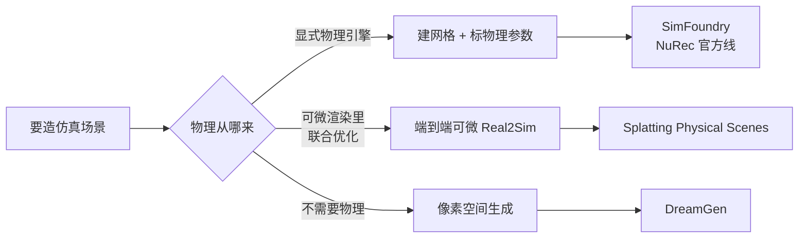
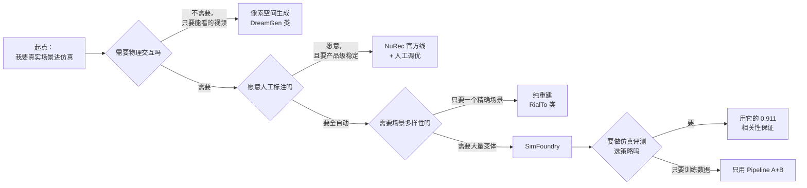
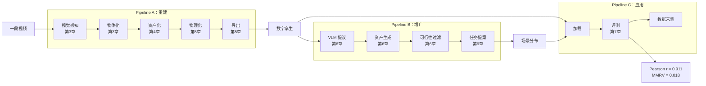

# 第八章：技术图谱、适用边界与选型指南

> 本章目标：把 SimFoundry 放进更大的技术图谱，说清它和其他 Real2Sim / 数据增广路线的关系、它自己的能力边界，以及面对具体需求时该怎么选。

**知识链接**：
- [仿真评测能预测真机吗：0.911 相关性](./07_仿真评测能预测真机吗) — 上一章的实证结果
- [系统全景：三条流水线如何咬合](./02_系统全景_三条流水线如何咬合) — 回顾本系列的地图
- [NVIDIA Real2Sim2Real 工作流深度解析](/系列/nvidia_real2sim2real_deep_dive/index) — 姊妹系列，讲 NVIDIA 官方 NuRec 产品线

---

## 一、先分清四条路线的根本取舍

Real2Sim 这个大方向下有几条技术路线，它们的根本分歧在**"物理从哪来"**这个问题上：

| 路线 | 代表 | 物理来源 | 优势 | 代价 |
|------|------|---------|------|------|
| **结构化重建 + 物理编译** | **SimFoundry** | **显式物理引擎 + 参数推断** | 可交互、可评测、可批量变体 | 重建精度有上限；参数不精确 |
| 官方产品线重建 | [NuRec 工作流](/系列/nvidia_real2sim2real_deep_dive/index) | 显式物理引擎 | 工程成熟、有文档、照片级视觉 | 需专用采集流程；变体能力弱 |
| 端到端可微 | [Splatting Physical Scenes](/论文综述/140_SplattingPhysicalScenes_端到端可微Real2Sim) | 可微渲染 + 物理联合优化 | 消除视觉/物理分裂 | 尚不成熟；难接入通用物理引擎 |
| 像素空间生成 | [DreamGen](/论文综述/131_DreamGen_视频世界模型生成机器人训练数据) | **无物理** | 覆盖仿真难建模的任务 | 物理合理性无保证；伪动作有噪声 |

**SimFoundry 在这张图里的位置**：它是"结构化重建 + 物理编译"这条最主流路线里，**自动化程度最高、变体生成能力最强**的一个实现。它的独特性不在重建（同路线有多个工作），而在于把"重建"和"批量变体生成"做成了同一个系统，并且定量验证了这条链路的评测可信度。

### 1.1 与 NuRec 官方线的关系

这一对比最容易被问，因为它俩名字都挂在 NVIDIA 下，都做 Real2Sim：

| 维度 | SimFoundry（本系列） | NuRec 官方工作流（[姊妹系列](/系列/nvidia_real2sim2real_deep_dive/index)） |
|------|---------------------|-------------------------------------------------|
| 性质 | GEAR 实验室的**开源研究项目** | NVIDIA 的**官方产品线**（Omniverse） |
| 场景表示 | 前景网格 + 背景 3DGS | 以高斯重建为主 |
| 变体生成 | 三类 digital cousins，核心能力 | 不是重点 |
| 评测验证 | 系统性验证相关性（0.911） | 以部署工作流为主 |
| 工程成熟度 | 研究原型，依赖多个外部模型 | 有文档、有产品支撑 |
| 硬件依赖 | 250GB 磁盘 + 高显存 GPU | Isaac Sim 生态 |

**怎么选**：要研究"如何自动生成大量训练场景并验证评测可信度"→ SimFoundry；要把重建能力接进既有的 Isaac Sim / Omniverse 生产管线 → NuRec。两者不是替代关系，而是研究探索与产品落地的分工。

### 1.2 与端到端可微路线的分歧

第 4 章讲过"视觉正确 ≠ 物理正确"这个张力。Splatting Physical Scenes 这类工作的思路是：**不要两条管线各管一摊，让视觉和物理在同一个可微框架里联合优化**，从原理上消除分裂。SimFoundry 的思路是：**接受分裂，用后置的物理检查兜底**。

| 维度 | 端到端可微 | SimFoundry 式分离 |
|------|-----------|------------------|
| 视觉-物理一致性 | 由联合优化保证 | 由合理性检查事后兜底 |
| 可接入性 | 需要专用优化流程 | 直接接入标准物理引擎 |
| 成熟度 | 研究中 | 已能跑通完整链路 |
| 可扩展性 | 换渲染器要重训 | 换任一模块不影响其他 |

**没有谁绝对更好**：端到端是从原理上更优雅，分离式是从工程上更务实、更容易随基础模型进步而升级。SimFoundry 明确选择了后者，这也是它能作为一个"模块化流水线"存在的前提。

---

## 二、SimFoundry 的能力边界

把前面各章的局限汇总成一张表——**这是使用它之前必须知道的**：

| 边界 | 来源 | 具体表现 | 缓解手段 |
|------|------|---------|---------|
| 依赖上游基础模型质量 | 每步都调用现成模型 | 分割差 → 网格缺块；深度差 → 尺度错 | 模块化设计，换更好的模型即可提升 |
| 物理参数是估计值 | 只能从视觉推断 | 质量/摩擦不精确 | 域随机化吸收不确定性 |
| 遮挡区域几何靠生成 | 视频观测不完整 | 背面是"合理猜测" | 物理检查抓出明显不合理 |
| 尺度对齐精度有限 | 单目深度只有相对尺度 | 绝对尺寸有误差 | 用已知物体做校准 |
| 底座仿真器能力的继承限制 | OmniGibson/Isaac Sim | 柔性体、流体支持有限 | 用像素空间生成方法补充（见第一节） |
| 训练侧代码未开源 | 项目发布策略 | 无法直接复现论文的 sim-to-real 训练 | 可用重建与评测部分，训练自行搭建 |
| 第三方依赖许可复杂 | Hunyuan3D 等模型各有许可 | 部分组件非商用 | 商用前逐个核对第三方许可 |

**最后两条是"开源项目"这个身份的固有属性**，不是技术局限。SimFoundry 的代码（Apache-2.0）覆盖的是编排层，它调用的生成模型、VLM 服务各有各的许可条款——这是所有"模块化 + 外部模型"系统的共同特征。

---

## 三、选型指南

面对一个具体的"我要把真实场景搬进仿真"的需求，按下面的问题链决策：

| 你的场景 | 推荐 | 理由 |
|---------|------|------|
| 要在仿真里评测多个策略、筛选最优 | **SimFoundry** | 唯一系统验证过仿真-真机相关性的方案 |
| 需要大量不同场景训练策略泛化 | **SimFoundry** | digital cousins 是核心能力 |
| 要把重建接进既有 Isaac Sim 生产管线 | NuRec 官方线 | 工程成熟、生态完整 |
| 任务涉及柔性体/流体 | 像素空间生成（DreamGen 类） | 物理引擎建不了模 |
| 只需要一个精确的孪生、愿意投入标注 | RialTo 类 | 人工介入保证精度，不需要变体 |
| 追求视觉与物理的联合最优 | 端到端可微路线 | 原理上消除分裂，但成熟度低 |
| 商用部署 | 需逐个核对第三方许可 | Hunyuan3D 等组件可能非商用 |

**一个实操建议**：SimFoundry 的三条流水线可以独立使用。如果你的需求只是"把一段视频变成一个能加载的场景"，只用 Pipeline A；如果还要变体，加 Pipeline B；如果还要评测，用 Pipeline C。不需要全部采用。

---

## 四、这个系统真正教会我们什么

抛开具体的技术细节，SimFoundry 作为一篇系统论文，提供了三个有普遍价值的设计经验：

### 4.1 模块化 > 端到端（在快速演进期）

当上游基础模型每年都在换代时，"模块化流水线"比"端到端大模型"更抗贬值——因为你可以逐块升级。SimFoundry 明确把这个作为设计哲学（"pipeline improves with foundation models"）。这个思路对所有依赖快速迭代的领域都适用。

### 4.2 自动化必须包含自动检查

"全自动"这个承诺如果只覆盖生成、不覆盖验证，那人工检查就还在，自动化只完成了一半。SimFoundry 在 Pipeline A 内部（物理合理性检查）和 Pipeline C（冒烟测试）都设了自动检查关卡——**生成式系统必须自带质检，否则产出的质量是不可控的**。

### 4.3 报"排序相关性"而不是"绝对数值匹配"

这是第 7 章的核心。在仿真与真实有系统性差距的领域，追求绝对数值相等是错的，追求**相对排序一致**才是对的。这个思路可以迁移到很多"用便宜代理替代昂贵真实"的场景。

### 4.4 数据多样性要选对维度

第 7 章的数据表明 Task Cousin（+40%）远高于外观类变体（+17% / +21%）。这提示：**造多样性时，改变"任务语义"比改变"外观"更高杠杆**。这个结论可能有普遍意义，值得在别的数据增广工作里验证。

---

## 五、全系列技术图谱回顾

**一句话总结整个系列**：SimFoundry 用一条模块化流水线把"一段视频"变成了"一个可交互数字孪生 + 一族数字表亲"，并用 0.911 的仿真-真机相关性证明了这条链路产出的场景可用于策略评测——它的价值不只在重建质量，更在于把 Real2Sim 从"能重建"推进到了"能规模化、可验证"。

---

## 六、延伸阅读

- [NVIDIA Real2Sim2Real 工作流深度解析](/系列/nvidia_real2sim2real_deep_dive/index) — 官方 NuRec 产品线的完整工作流
- [3D 高斯溅射从零精通](/系列/3dgs_from_scratch/index) — 背景重建原理的系统教程
- [机器人系统辨识深度解析](/系列/system_identification_deep_dive/index) — 与"估计 + 域随机化"相反的精确参数路线
- [Splatting Physical Scenes：端到端可微 Real2Sim](/论文综述/140_SplattingPhysicalScenes_端到端可微Real2Sim) — 端到端路线的代表
- [DreamGen：视频世界模型生成机器人训练数据](/论文综述/131_DreamGen_视频世界模型生成机器人训练数据) — 像素空间生成路线
- [Sim-to-Real 迁移综述](/论文综述/S04_Sim_to_Real迁移综述) — 全领域方法论全景
- [Sim-and-Real 混训实证分析综述](/论文综述/S33_Sim_and_Real混训实证分析综述) — 混训策略的实证研究

---

## 系列完

本系列共 8 章，从问题背景（第 1 章）到系统全景（第 2 章）到三条流水线的原理（第 3-6 章）到实证验证（第 7 章）到技术图谱与选型（第 8 章）。

配套前置知识：
- [OmniGibson 与 BEHAVIOR 基准](/前置知识/010a_前置知识_OmniGibson与BEHAVIOR基准)
- [数字表亲与 Real2Sim 数据增广](/前置知识/010b_前置知识_数字表亲与Real2Sim数据增广)
