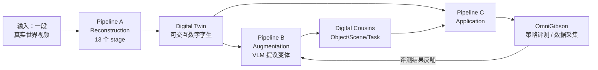

# SimFoundry 深度解析：一段视频自动铸造可交互仿真场景

> 你对着家里桌面拍一段十几秒的手机视频，一小时后，电脑里出现一个物理仿真就位的可交互场景：每个杯子都能被抓起来、每个抽屉都能被拉开、每个物体会按真实的质量和摩擦落地。再往前走一步，系统还会自动"繁殖"出成百上千个这个场景的变体——换个样子的杯子、换个布局的桌面、换一个目标任务的场景——用这一整个**场景分布**去训练机器人策略，策略能零样本直接上真机。

这就是 NVIDIA GEAR 实验室开源的 **SimFoundry**。它的名字是个双关：Foundry 是"铸造厂"，它是一条把真实世界视频**批量铸造成仿真场景**的流水线。

## 系列简介

机器人策略研发有一个绕不开的成本墙：真机上采数据贵、真机上测策略更贵。仿真可以绕开它，但前提是仿真得"像真的"——场景要像、物理要像、而且不能只有一个场景（只在一个场景里训练，策略换个杯子就废了）。

已有的 Real2Sim 工作大多卡在三件事上：

| 卡点 | 具体表现 |
|---|---|
| **要人工** | 重建一个场景需要在交互式界面里手工标注刚体、关节、物理参数（如 [RialTo](/论文综述/114_RialTo_数字孪生RL策略学习)） |
| **是一次性的** | 重建完就是一个冻结的副本，无法批量衍生变体 |
| **不可验证** | 没人系统回答过"仿真里评测出的排名，和真机上的排名一致吗" |

SimFoundry 对这三点的回答分别是：**全自动**（Pipeline A 的 13 个 stage 无人介入）、**可批量衍生**（Pipeline B 的 digital cousins）、**可验证**（7 任务 × 5 策略架构，仿真-真机 Pearson 相关系数 0.911）。

**适合读者**：
- 想做 Real2Sim 但被"手工标注 + 场景单一"劝退的工程师
- 已经在做 sim-to-real，想知道"除了域随机化还能怎么造数据多样性"的研究者
- 想理解"仿真评测到底可不可信"这件事怎么被定量验证的人

**你将获得**：
- 对 SimFoundry 三条流水线（重建 / 增广 / 应用）每一环设计动机的完整理解，包括为什么前景物体要用网格、背景要用 3DGS
- 对 digital cousins 三类变体（Object / Scene / Task）的定义、生成机制和可行性过滤逻辑的清晰认知
- 对"仿真评测预测真机表现"这件事的定量证据，以及它的失效边界
- 对"模块化流水线"这种设计哲学为什么能让系统随基础模型进步自动变强的理解

## 章节目录

| 章节 | 标题 | 简介 |
|------|------|------|
| 01 | [为什么需要一座"仿真场景铸造厂"](./01_为什么需要仿真场景铸造厂) | 真机成本墙、数字孪生路线的三种失败模式、SimFoundry 的两个核心目标 |
| 02 | [系统全景：三条流水线如何咬合](./02_系统全景_三条流水线如何咬合) | A(13 stage)→B(变体)→C(OmniGibson) 的完整数据流与产物契约 |
| 03 | [Extraction：从视频里"认出"场景](./03_Extraction_从视频里认出场景) | 抽帧与相机位姿、单目深度、地面分割、以物体为中心的解耦 |
| 04 | [Generation：2D 生成模型如何造出物理网格](./04_Generation_2D生成模型造出物理网格) | 图像到网格的生成、位姿估计与尺度对齐、前景/背景分离处理的取舍 |
| 05 | [物理编译：从好看网格到能跑起来](./05_物理编译_从好看网格到能跑起来) | 物理参数推断、铰接物体专项、物理合理性检查、输出契约解析 |
| 06 | [Pipeline B：VLM 驱动的数字表亲生成](./06_PipelineB_VLM驱动的数字表亲生成) | 三类表亲的生成机制、结构化提议、可行性过滤、任务提案 |
| 07 | [仿真评测能预测真机吗：0.911 相关性](./07_仿真评测能预测真机吗) | Pearson r 与 MMRV、7 任务 × 5 架构实验设计、三类表亲的迁移增益 |
| 08 | [技术图谱、适用边界与选型指南](./08_技术图谱_适用边界与选型指南) | 与其他 Real2Sim 路线对比、什么条件下会失效、该怎么选 |

## 核心工作流图谱

## 前置知识要求

阅读本系列前建议了解：
- [3D Gaussian Splatting：用一堆椭球把真实场景搬进电脑](/前置知识/007a_前置知识_3D_Gaussian_Splatting三维场景重建) — Pipeline A 背景重建的底层技术
- [OmniGibson 与 BEHAVIOR 基准：一个"物体都有物理属性"的仿真世界](/前置知识/010a_前置知识_OmniGibson与BEHAVIOR基准) — SimFoundry 的输出目标格式
- [数字表亲与 Real2Sim 数据增广](/前置知识/010b_前置知识_数字表亲与Real2Sim数据增广) — 本系列核心概念的概念史
- [Sim-to-Real 迁移综述](/论文综述/S04_Sim_to_Real迁移综述) — 域随机化、系统辨识等基础方法论全景

## 配套论文精读

- [SimFoundry：单视频重建可交互仿真场景](/论文综述/132_SimFoundry_单视频重建可交互仿真场景) — 论文层面的精读，本系列在其基础上展开代码与工程细节
- [RialTo：手机扫描建数字孪生](/论文综述/114_RialTo_数字孪生RL策略学习) — 人工标注版的 Real-to-Sim-to-Real 前作
- [DreamGen：视频世界模型生成机器人训练数据](/论文综述/131_DreamGen_视频世界模型生成机器人训练数据) — 绕开物理仿真的并行数据生成路线
- [Splatting Physical Scenes：端到端可微 Real2Sim](/论文综述/140_SplattingPhysicalScenes_端到端可微Real2Sim) — 另一条"从数据端到端学可仿真场景"的路线
- [MimicGen：少量示教自动合成大规模数据](/工程项目/MimicGen_少量示教合成大规模数据) — SimFoundry 场景转成训练数据后的下游放大环节

## 相关系列

- [NVIDIA Real2Sim2Real 工作流深度解析](/系列/nvidia_real2sim2real_deep_dive/index) — 姊妹系列，讲 NVIDIA **官方产品线** NuRec 的完整工作流；本系列讲 GEAR 实验室的**开源研究项目** SimFoundry，第 08 章会系统对比两者
- [3D 高斯溅射从零精通](/系列/3dgs_from_scratch/index) — 想深入理解背景重建原理的读者
