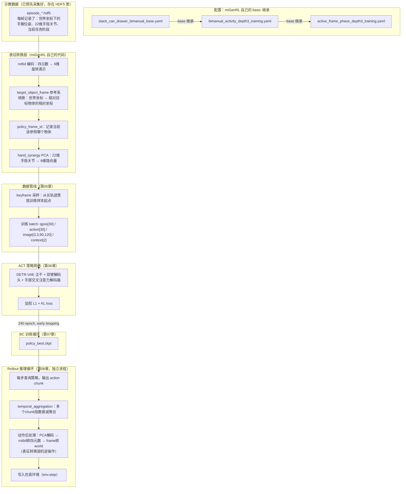

# 第 01 章：全链路总览

> 系列首页在[这里](./index)。本章不深入任何单一环节的实现细节，只把 `miGenRL` 内部"配置 → 数据 → 训练 → 推理"的完整链路铺开，建立后续 8 章都要引用的地图。**这个系列只讲 `source/miGenRL` 这个子系统本身，不讲 embodied-arena 里仿真环境怎么搭、机器人怎么定义、任务怎么判成功——那些是 Isaac Lab 环境侧的工作，`miGenRL` 只是这个环境的一个"消费者"。**

## 1. `miGenRL` 是什么、不是什么

`miGenRL` 是 embodied-arena 里专门负责"用示教数据训练一个操作策略、再让这个策略去控制仿真环境"的子系统，物理位置在 `source/miGenRL/miGenRL/`。它对外的接口很窄：

- **训练侧**：吃进一批 HDF5 格式的示教轨迹，产出一个 checkpoint。
- **推理侧**：加载一个 checkpoint，每一步问它"接下来该输出什么动作"，把动作喂给一个已经搭好的仿真环境。

`miGenRL` 完全不关心桌子上摆的是罐子还是别的什么、机器人有几个关节、任务怎么判定成功——这些都是仿真环境（`env.cfg_path` 指向的那份任务定义）自己的事，`miGenRL` 只是在环境提供的观测和动作接口上做训练和推理。这个边界很重要：本系列后面讲的每一个机制，都是在这个"数据进、动作出"的窄接口内部发生的。

## 2. 一份配置，两条命令

拿到的配置文件是 `config/migenrl/stack_can_drawer_bimanual_base.yaml`：

```yaml
base:
  - bimanual_activity_depth3_training.yaml

env:
  num_envs: 6
  max_episode_steps: 600
  cfg_path: config/dexbench/humanoid/stack_can_into_drawer.yaml   # 只是"去哪个环境"，本系列不展开

data:
  root: runs_base/migenrl/baselines/stack_can_drawer_fixed_baseline
  action_representation: target_object_frame
  action_group: rot6d_processed_actions
  qpos_representation: target_object_frame
  action_context_change_source: policy_frame_id
  hand_synergy_path: runs_base/migenrl/baselines/stack_can_drawer_fixed_baseline/hand_synergy_dim6.pkl
  ...

workflow:
  stages: [bc]

train:
  sample_strategy: keyframe
  num_epochs: 240
  early_stopping: {enabled: true, patience: 40, min_delta: 0.0001}

rollout:
  temporal_aggregation: true
  temporal_aggregation_decay: 0.05
  query_frequency: 1
  num_episodes: 6
```

这份配置驱动的是两条完全独立的命令：

```text
python scripts/migenrl/train_bc.py --config stack_can_drawer_bimanual_base
    → train_bc_from_config(config)   # 本系列第 05-07 章

python scripts/migenrl/rollout_policy.py --config stack_can_drawer_bimanual_base
    → rollout_policy_from_config(config)   # 本系列第 08 章
```

`workflow.stages: [bc]` 只声明了 `bc` 一个阶段——意味着 `train_bc.py` 跑完只会产出一个 checkpoint，不会自动去做 rollout 评估。要评估，需要单独执行 `rollout_policy.py`，这是另一次进程启动、另一次读同一份配置。为什么要拆成两个独立进程：BC 训练是纯 PyTorch 计算，不需要仿真环境；rollout 评估必须启动 Isaac Sim（加载 USD 资产、启动物理引擎、启动渲染器），这部分初始化成本很高且和训练无关。把两者拆开，训练阶段完全不用背负仿真环境的显存开销，一旦训练侧出问题也不会连带搞崩仿真进程。

## 3. `miGenRL` 内部的模块地图

这是本系列真正的地图——不是"从 YAML 到仿真实体"，而是"从示教数据到策略网络再到动作"这条 `miGenRL` 自己的链路：



图里 `REPR` 这一层是整个系列最核心、最容易被低估的部分——它决定了策略网络实际"看到"和"输出"的是什么数字，而不是环境本身发生了什么。表征转换层在训练时是"从仿真观测转成网络输入"的方向，在 rollout 时是完全反过来的"从网络输出转成仿真动作"的方向，两个方向共享同一套数学变换，只是顺序相反。

## 4. 每一章对应地图上的哪一块

| 图中环节 | 对应章节 |
|---|---|
| `miGenRL` 自己的 `base:` 三层继承 | 第 02 章 |
| rot6d 编码、target_object_frame 参考系转换 | 第 03 章 |
| policy_frame_id 动态切换、hand_synergy PCA 降维 | 第 04 章 |
| keyframe 采样、训练 batch 构造 | 第 05 章 |
| ACT 策略网络架构 | 第 06 章 |
| BC 训练循环、loss、checkpoint | 第 07 章 |
| Rollout 推理循环、temporal_aggregation、动作后处理 | 第 08 章 |
| 调参与排错 | 第 09 章 |

## 5. 一张贯穿全系列的速查表

后面几章会反复出现几个容易混淆的表征名词，这里先建立一张对照表：

| 名词 | 是什么 | 出现在哪一章 |
|---|---|---|
| `world frame` | 仿真世界的全局坐标系（本系列不展开怎么来的，只作为表征转换的输入端） | 第 03 章起 |
| `target_object_frame` | 以当前任务目标物体的**初始**位姿为原点的相对坐标系 | 第 03 章 |
| `policy_frame_id` | 一个整数，标记当前用哪个物体作参考系，随任务推进动态切换 | 第 04 章 |
| `rot6d` | 用旋转矩阵前两列（6 个数）表示朝向的连续旋转表征 | 第 03 章 |
| `hand_synergy` | 对 22 维手指关节做 PCA，得到 6 维隐变量 | 第 04 章 |
| `temporal_aggregation` | rollout 时多个动作 chunk 的指数衰减加权聚合 | 第 08 章 |

## 6. 小结与下一章

这一章建立了两个认识：

1. `miGenRL` 是一个边界很窄的子系统——吃 HDF5 示教数据训练，产出 checkpoint 后独立启动一个 rollout 进程做推理评估，两条命令、两次进程。它不管仿真环境内部怎么搭建。
2. 从示教数据到网络输入，中间要经过 rot6d 编码、参考系转换、PCA 降维三层表征转换；rollout 阶段网络输出要按相反顺序逆转这三层转换，才能变成仿真能执行的动作。这是整条链路里最核心的部分，也是后面 03、04 两章的重点。

下一章先把 `miGenRL` 自己的配置继承规则钉死——三层 `base:` 是怎么合并成最终生效配置的。

---

下一章：[第 02 章 配置继承链](./02_配置继承链)
