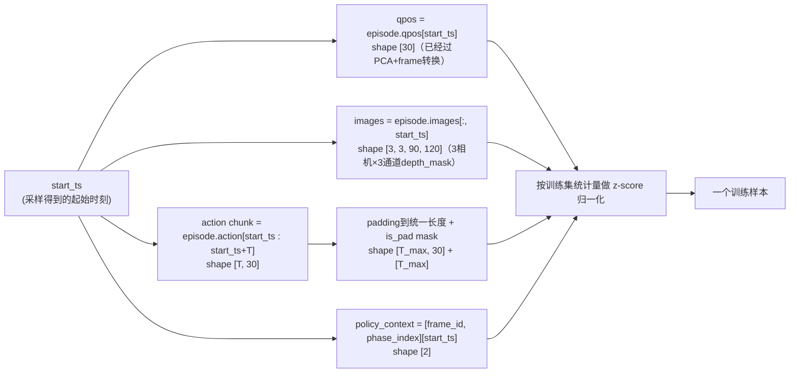

# 第 05 章：数据管线：从 HDF5 到训练 batch

> 前情提要：第 03、04 章讲完了单帧数据"是什么表征"（rot6d、target_object_frame、hand_synergy）。本章讲这些数据是怎么组织成完整的示教轨迹存在磁盘上的，以及训练时怎么从数百步长的轨迹里挑出有代表性的样本。

## 1. 示教数据从哪来

这条链路本身只做训练（`workflow.stages: [bc]`），不负责采集数据——`data.root` 指向的目录里已经预先存放好一批人工遥操作或者其他方式采集的示教轨迹，格式是 HDF5：

```yaml
data:
  root: runs_base/migenrl/baselines/stack_can_drawer_fixed_baseline
  name: replay
```

每条轨迹是一个 `episode_*.hdf5` 文件，内部按帧存储了整条轨迹的所有观测和动作。一条完整的示教轨迹可能长达数百步（本任务 `max_episode_steps: 600`），包含"靠近罐子 → 抓住 → 提起 → 移向抽屉 → 放下 → 松手 → 回到抽屉把手 → 关闭"这一整套连续动作。

## 2. 为什么不能均匀随机采样

行为克隆训练的基本做法是：从示教轨迹里随机挑一个时间点 $t$，把这一帧的观测（qpos、图像）和从 $t$ 开始的未来若干步动作，组成一个训练样本。最简单的采样策略是**均匀随机**——在 `[0, episode_len)` 范围里均匀抽一个起始时刻。

问题在于：一条 600 步的抓取-放置轨迹里，绝大多数时间步是"低信息量"的——比如手已经抓住罐子正在匀速移动、或者已经放下罐子等待抽屉判定成功这类相对静止或者匀速的阶段，占据了轨迹的大部分时长；而真正的"关键动作"——手指刚好合拢完成抓取的瞬间、罐子刚好脱手落入抽屉的瞬间——只占轨迹里很少的几步。如果均匀随机采样，训练数据里绝大多数样本都落在"低信息量"区间，网络会被这些冗余样本主导，学习效率低，且容易在真正需要精细控制的关键时刻表现不佳（因为这些时刻在训练分布里被严重欠采样）。

配置里给出的解法：

```yaml
train:
  sample_strategy: keyframe
  keyframe_sample_prob: 1.0
  keyframe_window_before: 30
  keyframe_window_after: 10
  keyframe_include_episode_end: true
```

即**关键帧偏向采样**——先从轨迹里自动检测出"关键帧"（motion-rich 的时刻），再把训练样本的起始时刻集中采样在这些关键帧附近的窗口里，而不是整条轨迹均匀撒开。

## 3. 关键帧怎么被自动检测出来

关键帧检测不需要人工标注——算法通过统计"相邻两帧之间动作变化的幅度"来自动判定哪些时刻是"运动剧烈的关键时刻"。核心逻辑在 `KeyframeDetector.detect_keyframe_indices`：

### 3.1 逐帧运动得分

**这一步在做什么**：给轨迹里每一帧打一个"运动剧烈程度"的分数，分数越高说明这一帧前后动作变化越大。

```python
score = np.zeros(episode_len, dtype=np.float32)
for key, width in zip(action_keys, action_widths):
    delta = np.linalg.norm(np.diff(values, axis=0), ord=1, axis=1)   # 逐帧L1差值
    if context_changed is not None:
        delta[context_changed] = 0.0    # 参考系切换处清零，避免误判
    if "gripper" in key:
        score[:-1] += delta
    elif key == "right_end_effector_positions":
        score[:-1] += 0.5 * z_delta       # z 轴位移额外加权
```

$$
\text{delta}_t = \sum_{d} \left| a_{t+1,d} - a_{t,d} \right|
$$

**逐项拆解**：

| 符号 | 含义 | 具体是什么 |
|---|---|---|
| $a_{t,d}$ | 第 $t$ 帧、第 $d$ 维的动作分量 | 例如手指关节角度的某一维 |
| $\lvert a_{t+1,d}-a_{t,d}\rvert$ | 相邻两帧在这一维上的变化量 | L1 距离的单项 |
| $\text{delta}_t$ | 对所有维求和后，第 $t$ 帧的总运动量 | 数值越大代表这一步动作变化越剧烈 |

**为什么手指关节（gripper）的变化权重不打折，而右臂 z 轴位移要额外乘 0.5 权重叠加**：手指从张开到闭合是抓取动作里最关键、变化最陡峭的瞬间，直接按原始差值计入得分；而末端 z 轴（垂直方向）位移额外加权，是因为"提起"和"放下"这类垂直运动往往对应任务的关键转折点（离开桌面、放入容器），比纯粴水平移动更值得被识别为关键帧。这是一种**先验知识注入**——工程上根据这个具体任务的动作特点，人为调整了不同动作维度对"关键性"判定的贡献权重。

**上下文切换处清零**（`context_changed` 对应的正是第 04 章讲的 frame_id 切换时刻）：如果不清零，"参考系从一个物体切换到另一个物体"这个纯粹的坐标系跳变会被误判成一次剧烈的物理运动（因为同一个物理位置在两个不同参考系下的坐标值可能相差很大），从而产生一个虚假的高分关键帧。这处理逻辑体现了第 04 章讲的机制和本章采样策略之间存在耦合——理解 keyframe 检测的正确性，离不开先理解 frame_id 切换机制。

### 3.2 筛选运动帧，取得分最高的一部分

```python
moving = valid[valid_score > keyframe_min_delta]              # 过滤掉几乎不动的帧（阈值 1e-4）
top_count = int(round(moving.size * keyframe_top_fraction))    # 取运动帧里得分最高的一部分
selected = moving[np.argpartition(moving_scores, -top_count)[-top_count:]]
```

`keyframe_top_fraction`（本配置继承自 Layer 0 的 0.30）意味着：在所有"确实在运动"的帧里（先排除掉近乎静止的帧），再取得分最高的 30% 作为关键帧候选。这是一个两阶段筛选——先按绝对阈值排除噪声级别的微小抖动，再按相对排名取前 30%，兼顾了"过滤噪声"和"控制关键帧数量比例"两个目标。

### 3.3 展开窗口：一个关键帧变成一段训练样本候选区间

只是知道"第 350 步是关键帧"还不够——训练需要的是"以哪个时间点为起点，能学到有价值的动作片段"。所以每个被选中的关键帧要**展开成一个窗口**：

```python
for keyframe in selected:
    start = max(first_ts, keyframe - keyframe_window_before)   # 关键帧往前 30 步
    stop = min(episode_len, keyframe + keyframe_window_after + 1)  # 关键帧往后 10 步
    indices.extend(range(start, stop))

if keyframe_include_episode_end:
    selected = np.append(selected, episode_len - 1)             # 追加 episode 最后一帧

return np.unique(indices)
```

**这一步在做什么**：把每个孤立的关键帧时刻，扩展成一段连续的候选起始时刻区间，训练时可以从这个区间里的任意一个时刻开始截取动作片段。

**为什么窗口是不对称的**（往前 30 步、往后只有 10 步）：网络在真实推理时看到的是"当前观测"，需要预测"接下来该怎么做"。如果一个训练样本的起始时刻恰好落在关键帧本身（比如手指刚合拢那一瞬间），网络学到的是"已经抓住了，接下来该干什么"，这没有覆盖"还没抓住，需要判断怎么靠近并合拢手指"这个更难、更需要学习的阶段。往前展开 30 步，就能覆盖"关键动作发生之前的准备阶段"——让网络学习到从"准备"到"完成关键动作"的完整决策过程，这才是行为克隆真正需要学到的内容。往后只展开 10 步，是因为关键动作完成之后紧接着的短暂稳定阶段也有学习价值（比如"抓住后要不要继续调整"），但不需要覆盖太长，否则又会退化成"低信息量"区间占比过高的老问题。

`keyframe_include_episode_end: true` 额外把 episode 最后一帧强制加进候选集——这保证了训练数据里一定会覆盖到"任务刚好完成"的终止状态，不会因为随机采样的概率原因完全漏掉这个关键时刻。

## 4. 采样决策：多种策略的优先级

一次训练样本的起始时刻采样，实际走的是一个多策略的决策链（`EpisodeStartSampler._sample_keyframe`）：

```python
def _sample_keyframe(self, episode_len, first_ts, episode_index, ...):
    # 优先级 1：phase_end 采样（本配置概率为 0，不生效）
    # 优先级 2：context_change 采样（本配置概率为 0，不生效）
    # 优先级 3：keyframe 采样（本配置概率 1.0，总是执行）
    if candidates and random() < keyframe_sample_prob:      # 1.0
        return random.choice(candidates)
    # 兜底：均匀随机（本配置概率恒为1.0时永远不会走到这里）
    return random.choice(range(first_ts, episode_len))
```

配置里把 `phase_end_sample_prob` 和 `context_change_sample_prob` 都设成 0.0（回顾第 02 章合并推演，这是 Layer 2 对 Layer 0 默认值 0.35 的覆盖），而 `keyframe_sample_prob` 提到 1.0——**这是一个明确的策略选择：完全放弃均匀采样和上下文切换采样，100% 把训练样本的起始时刻集中在关键帧窗口内**。

这个选择背后隐含的判断是：这个具体任务（双臂协作放置）的关键难点集中在几个精细操作的瞬间，与其让训练样本分散覆盖整条轨迹（包括大量低信息量的过渡阶段），不如把全部训练资源集中在这些精细动作上。这不是没有代价——如果策略在部署时遇到训练数据里覆盖不足的"过渡阶段"状态（比如手已经抓住物体、正在长距离平移过程中的某个随机中间点），网络可能表现得不如在关键帧附近那样精确，因为这类状态在训练数据里的样本密度被人为压低了。第 09 章的调参手册会具体讨论这个权衡该怎么调整。

## 5. 从采样时刻到完整训练样本

确定了起始时刻 `start_ts` 之后，一个训练样本的完整构造过程：



其中动作片段的长度处理值得展开：不同 episode 的剩余长度不同（从 `start_ts` 到 episode 结束的步数不一样），但一个 batch 里所有样本的动作张量需要统一形状才能拼成矩阵送进网络。做法是 padding 到一个固定的最大长度 `T_max`，同时生成一个布尔掩码 `is_pad`（哪些位置是真实数据、哪些是填充的占位值），这个掩码会在第 08、09 章讲到的损失函数计算里被用来排除填充部分对梯度的贡献。

归一化统计量（均值、标准差）在数据加载阶段一次性算好，对训练集的所有样本共享同一组统计量，不会随着每个 batch 变化——这是保证训练稳定性的标准做法，也是为什么第 06 章反复强调 PCA 参数、这里的归一化参数都必须"训练时拟合一次，之后固定复用"。

## 6. 训练/验证集划分

```yaml
data:
  val_episode_count: 8
```

划分逻辑很直接：把全部 episode 文件用固定种子（`split_seed: 0`）打乱顺序，取最后 8 个作为验证集，剩下的全部作为训练集：

```python
def _random_split_episode_files(episode_files, val_count, data_cfg):
    indices = np.random.default_rng(0).permutation(len(episode_files))
    val_indices = indices[-8:]
    train_indices = indices[:-8]
```

固定种子保证了同一批 episode 文件反复运行划分逻辑，得到的训练/验证集划分永远一致——这对复现实验结果和判断"验证集损失变化是否真的反映模型性能改进"很重要，如果每次运行划分结果都不同，验证损失的波动就无法归因到模型本身。

## 7. 小结与下一章

这一章讲的是"训练样本从哪来、怎么挑"：

1. 均匀随机采样会让训练样本被"低信息量"的过渡阶段主导，稀释真正需要精细学习的关键动作。
2. Keyframe 检测通过统计逐帧动作变化幅度（对手指关节和垂直位移额外加权）自动找出运动剧烈的时刻，参考系切换处的虚假峰值会被显式清零排除。
3. 每个关键帧展开成一个不对称窗口（前 30 步、后 10 步），覆盖"准备阶段到关键动作完成"的完整决策过程。
4. 本配置把关键帧采样概率设到 1.0，完全放弃均匀采样，是针对这个具体任务难点分布做出的取舍。

下一章开始看这些训练样本喂进去的网络——ACT 策略的完整架构：DETR-VAE 主干、双臂独立解码头、手部交叉注意力解码器，以及输入输出的完整张量形状走读。

---

上一章：[第 04 章 参考系切换与手部降维](./04_hand_synergy_PCA降维) ｜ 下一章：[第 06 章 ACT 策略网络架构](./06_ACT策略网络架构)
