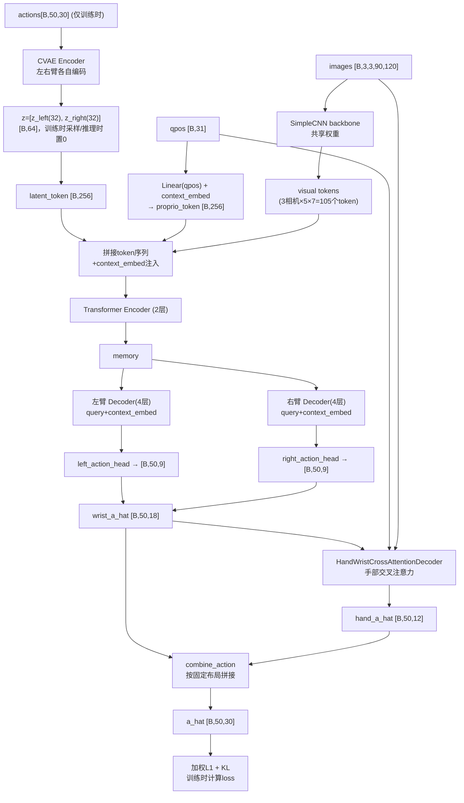

# 第 06 章：ACT 策略网络架构

> 前情提要：第 05 章讲完了训练样本怎么从 HDF5 里采出来，此刻手上已经有了一个 batch：`qpos [B,30]`、`images [B,3,3,90,120]`、`action [B,T,30]`、`context [B,2]`。本章讲这些张量喂进什么网络、网络内部怎么处理它们、最后输出什么。

## 1. 这个网络要解决的问题

**相关阅读**：本章的基础 Transformer Encoder/Decoder 机制（token 序列构造、self-attention、cross-attention、query 的作用）已经在 [ACT Decoder 架构详解](/工程实践/ACT_Decoder架构详解) 里讲得很完整，本章不重复那部分内容，只讲**这个具体项目**在通用 ACT 架构基础上做的三处定制：CVAE Encoder 的双臂拆分、双臂独立解码头、以及手部交叉注意力解码器。如果你还没读过前面那篇通用架构讲解，建议先读一遍再回来看本章。

网络的输入输出边界：

```text
输入：
  qpos    [B, 31]           手腕位姿(15×2=30) + 补充1维（context相关，具体见下文）
  images  [B, 3, 3, 90, 120] 3个相机 × 3通道depth_mask图像
  actions [B, 50, 30]        训练时才有，动作chunk真值（CVAE Encoder用）
  is_pad  [B, 50]            padding掩码
  context [B, 2]             [frame_id, phase_index]

输出：
  a_hat   [B, 50, 30]        预测的动作chunk
  mu, logvar [B, 64]         CVAE隐变量的均值和对数方差（训练时用于计算KL）
```

50 是动作 chunk 的长度（`num_queries`），30 是第 06 章推出的 PCA 后动作维度。网络架构的骨架仍然是 [ACT Decoder 架构详解](/工程实践/ACT_Decoder架构详解) 里讲的 DETR-VAE，但在这个具体项目里，因为要处理双臂 + 灵巧手 + 多阶段任务条件，网络在三个地方做了定制。

## 2. 定制一：CVAE Encoder 按双臂拆分

CVAE（条件变分自编码器）Encoder 只在**训练时**参与，作用是把"这条真实轨迹长什么样"压缩成一个隐向量 $z$，帮助 Decoder 在训练时知道"应该生成哪一种风格的动作"（推理时没有真值动作，$z$ 直接用零向量代替，Decoder 单纯靠视觉和本体感知生成动作）。这套 CVAE 的数学基础（变分下界、重参数化技巧）建议参考 [对数似然与变分下界](/前置知识/000e_前置知识_对数似然与变分下界) 和 [重参数化技巧](/前置知识/002e_前置知识_重参数化技巧)，本节只讲这个具体网络的结构定制。

标准 ACT 的 CVAE Encoder 把整只手臂的动作序列一起编码成一个隐向量。这个项目里，Encoder **对左右臂分别独立编码**：

```python
# 每只臂独立走一遍编码流程
for side in ["left", "right"]:
    action_embed = action_proj[side](actions[side])   # [B, T, 256]
    qpos_embed = qpos_proj[side](qpos[side])           # [B, 1, 256]
    cls = cls_embed[side].weight                        # [1, 1, 256]
    encoder_input = torch.cat([cls, qpos_embed, action_embed], dim=1)  # [T+2, B, 256]
    encoder_output = TransformerEncoder(encoder_input)[0]  # 取 CLS 位置的输出
    latent_info = latent_proj[side](encoder_output)      # [B, 64]
    mu[side], logvar[side] = latent_info.chunk(2, dim=-1) # 各 [B, 32]
```

**为什么要按左右臂拆开编码，而不是把双臂动作拼在一起统一编码成一个隐向量**：这个任务里左右手承担的是不同性质的动作（右手负责操作罐子的精细抓取和放置，左手负责操作抽屉的开合），两只手的动作风格分布可能完全不同。如果强制用同一个隐向量同时表达两只手的"风格"，隐空间要同时容纳两种不相关的变化模式，会让隐向量的语义变得模糊，也让 KL 正则化项的效果打折扣（因为一个统一隐向量很难同时对两种不同分布都保持贴近标准正态先验）。拆开之后，每只手臂各自的隐向量维度是 32，两只手加起来正好是本章开头提到的 64 维隐空间。

## 3. 定制二：双臂独立解码头

Decoder 部分同样按左右臂拆分。视觉记忆（memory）本身是共享的（两只手都能看到同样的 3 路相机画面），但每只手用**独立的一组 Action Query** 去查询这份共享记忆：

```python
# 共享的视觉+本体 memory（构造方式见 ACT Decoder 架构详解 一文）
memory = build_memory(images, qpos, latent_z, context_embed)   # [72, B, 256]

# 左右臂各自的 query 和独立的 Transformer Decoder
left_hs = TransformerDecoder_left(memory=memory, query=left_query_embed)    # [B, 50, 256]
right_hs = TransformerDecoder_right(memory=memory, query=right_query_embed)  # [B, 50, 256]

left_action = left_action_head(left_hs)    # [B, 50, 9]  (pos3 + rot6d6)
right_action = right_action_head(right_hs) # [B, 50, 9]
wrist_a_hat = torch.cat([left_action, right_action], dim=-1)  # [B, 50, 18]
```

这一步只产出**手腕部分**的动作（18 维 = 双臂各 9 维的位置+旋转），手指部分（12 维 hand_latent）留给下一节的专用解码器处理。为什么要把手腕和手指拆成两条独立的解码路径，而不是让同一组 Action Query 直接输出全部 30 维？答案在下一节。

## 4. 定制三：手部交叉注意力解码器

### 4.1 为什么手指需要单独一套解码器

手腕的位姿（要移动到哪、朝向什么方向）主要由**视觉场景的空间结构**决定——看到罐子在哪、抽屉口在哪，就能大致确定手腕该往哪移动。而手指的抓握形态（第 06 章讲的 6 维 hand_synergy 隐向量）更依赖**当前手腕正在做什么动作**——手腕正在靠近罐子时手指该张开，手腕已经贴近罐子表面时手指该开始合拢，这是一种"以手腕动作为条件"的从属关系，而不是独立地由视觉场景直接确定。

`HandWristCrossAttentionDecoder` 正是把这种从属关系显式建模成一次交叉注意力（cross-attention）：**手部的查询（query）去关注（attend）已经生成的手腕动作 token**，而不是重新从头查询整个视觉记忆。

### 4.2 结构走读

```python
class HandWristCrossAttentionDecoder:
    def forward(self, wrist_action, qpos, image, context):
        # wrist_action: [B, 50, 18]  上一步产出的手腕动作序列
        image_feat = self.image_encoder(image)              # 卷积编码，得到紧凑图像特征
        phase_embed = self.context_embedding(context[..., 1])  # phase_index → 16维embedding
        shared_features = self.projection(
            torch.cat([qpos, image_feat, phase_embed], dim=-1)
        )   # [B, 256] 共享的状态特征，作为交叉注意力的辅助条件

        hand_outputs = []
        for side in ["left", "right"]:
            wrist_tokens = self.wrist_proj[side](wrist_action[side])   # [B, 50, 256]
            hand_query = self.hand_query[side] + shared_features       # [B, 50, 256]
            # 交叉注意力：hand_query 去查询 wrist_tokens
            attended = self.cross_attention_blocks[side](query=hand_query, key_value=wrist_tokens)
            hand_action = self.hand_head[side](attended)                # [B, 50, 6]
            hand_outputs.append(hand_action)
        return torch.cat(hand_outputs, dim=-1)   # [B, 50, 12]
```

**关于跨注意力机制本身**（Q/K/V 分别是什么、attention 权重怎么算），如果你还不熟悉，建议参考 [Cross Attention 与交替注意力机制](/前置知识/001e_前置知识_Cross_Attention与交替注意力机制)。这里的关键设计是：`query` 来自"手部专属的可学习参数 + 当前共享状态特征"，`key`/`value` 来自"刚生成的手腕动作序列"——也就是说，手指的每一步预测都能看到对应时间步（以及邻近时间步，因为是对整个 50 步序列做注意力而不是逐步单独处理）的手腕运动状态，让手指的抓握节奏能跟手腕的移动节奏对齐。

### 4.3 最终动作组装

手腕部分（18 维）和手部部分（12 维）分别产出后，按第 06 章定义的固定布局重新拼接、排序：

```python
def combine_action(wrist_18d, hand_12d):
    left_pos, left_rot6d = wrist_18d[..., 0:3], wrist_18d[..., 3:9]
    right_pos, right_rot6d = wrist_18d[..., 9:12], wrist_18d[..., 12:18]
    left_hand, right_hand = hand_12d[..., 0:6], hand_12d[..., 6:12]
    return torch.cat([left_pos, left_rot6d, right_pos, right_rot6d, left_hand, right_hand], dim=-1)
    # [B, 50, 30]，严格对应 DUAL_ARM_PCA_ACTION_DIM 的切片定义
```

## 5. Context Embedding：frame_id 和 phase_index 怎么注入网络

第 06 章讲到 `policy_context = [frame_id, phase_index]` 这个 2 维向量需要被网络利用。具体的注入方式是**查表式 embedding**：

```python
context_embed_table = nn.Embedding(num_embeddings=3, embedding_dim=256)   # 3 = scene_tree里物体数量(can/drawer/table)
context_embed = context_embed_table(context[:, 0].long())                  # [B, 256]
```

`num_embeddings=3` 直接对应第 06 章推出的 `scene_object_id_map` 大小——场景里有几个物体，embedding 表就有几行。这个 embedding 向量在网络里被注入到**四个不同的位置**：

1. 拼进 Encoder 的 token 序列作为额外条件（CVAE Encoder 编码"当前是哪个阶段"）
2. 加到 proprio token 上（本体感知融合参考系信息）
3. 加到 Decoder 的 Action Query 上（告诉每一步查询"当前该参照哪个物体"）
4. 加到手部交叉注意力解码器的 `shared_features` 里（如 4.2 节代码所示）

这种"多处重复注入同一个条件信号"的做法（而不是只在网络最开始注入一次）是一种常见的条件网络设计技巧——保证条件信息不会在层层传递中被"冲淡"或遗忘，每个关键计算节点都能直接访问到当前的任务阶段和参考系信息。

## 6. Loss 函数：加权 L1 + KL

网络最终的训练目标是让预测动作 $\hat{a}$ 尽量接近真值动作 $a$，同时约束隐变量分布贴近标准正态先验。总损失：

$$
\mathcal{L} = \mathcal{L}_{L1}^{\text{weighted}} + \lambda_{KL} \cdot \mathcal{L}_{KL}, \qquad \lambda_{KL}=1
$$

### 6.1 加权 L1 项

**这个公式在做什么**：逐维度计算预测动作和真值动作的绝对差，再按维度重要性加权求平均，得到一个标量损失。

$$
\mathcal{L}_{L1}^{\text{weighted}} = \frac{\sum_{b,t,d} w_d \cdot \lvert a_{b,t,d} - \hat{a}_{b,t,d}\rvert \cdot m_{b,t}}{\sum_{b,t,d} w_d \cdot m_{b,t}}
$$

**逐项拆解**：

| 符号 | 含义 | 具体是什么 |
|---|---|---|
| $b,t,d$ | batch、时间步、动作维度的索引 | $b\in[0,B)$，$t\in[0,50)$，$d\in[0,30)$ |
| $a_{b,t,d}$ | 真值动作 | 来自训练数据 |
| $\hat{a}_{b,t,d}$ | 预测动作 | 网络输出 |
| $m_{b,t}$ | padding 掩码（1=有效，0=填充） | 第 07 章提到的 `is_pad` 取反 |
| $w_d$ | 第 $d$ 维的损失权重 | 见下表 |

**权重表**（`action_weights`）：

| 动作切片 | 内容 | 权重 $w_d$ |
|---|---|---|
| `[0:3]`,`[9:12]` | 双臂末端位置 | 4.0 |
| `[3:9]`,`[12:18]` | 双臂末端旋转（rot6d） | 3.0 |
| `[18:24]`,`[24:30]` | 双手 hand_synergy 隐向量 | 8.0 |

**为什么手部隐向量的权重（8.0）远高于位置（4.0）和旋转（3.0）**：这是第 06 章 PCA 降维带来的一个直接后果——手部隐向量的数值尺度和它对应的物理动作幅度之间不是线性对齐的。PCA 隐空间里一个很小的数值变化，通过解码矩阵放大后可能对应手指关节角度上相当大的变化（因为 PCA 分量本身是按方差大小排序的，携带了大量原始 22 维空间的信息压缩在一个较窄的数值范围内）。如果不额外加权，网络在损失函数的驱动下会优先把误差预算花在数值尺度天然更大的位置和旋转维度上，而对手部隐向量的预测精度相对漠视——但手指姿态误差经过 PCA 解码放大后，恰恰是决定抓取能否成功的最敏感的部分。用更高的权重强制网络更认真地对待这几维，是针对这个具体的降维方式做的补偿性设计。

**代入数字**：假设某一维是手部隐向量（权重 8.0），预测值与真值的绝对误差是 0.02；同一时刻的位置维度（权重 4.0）误差是 0.05。两者对总损失的贡献分别是 $8.0\times0.02=0.16$ 和 $4.0\times0.05=0.20$——虽然位置维度的绝对误差数值更大，但手部维度的权重补偿让它在总损失里也占据了不可忽视的份额，而不会被数值尺度更大的位置误差完全掩盖。

### 6.2 KL 散度项

$$
\mathcal{L}_{KL} = \frac{1}{B}\sum_{b=1}^{B}\sum_{d=1}^{64}\left[-\frac{1}{2}\left(1+\log\sigma_{b,d}^2-\mu_{b,d}^2-\sigma_{b,d}^2\right)\right]
$$

**这个公式在做什么**：衡量 CVAE Encoder 输出的隐变量分布 $\mathcal{N}(\mu,\sigma^2)$ 与标准正态先验 $\mathcal{N}(0,1)$ 之间的差异，作为正则化项防止隐空间退化。

**逐项拆解**：

| 符号 | 含义 | 具体是什么 |
|---|---|---|
| $\mu_{b,d}$ | 第 $b$ 个样本、第 $d$ 维隐变量的均值 | Encoder 输出，64 维（左右臂各 32） |
| $\sigma_{b,d}^2$ | 对应的方差（$\log\sigma^2$ 是网络实际输出的 logvar） | 同上 |
| $-\frac12(1+\log\sigma^2-\mu^2-\sigma^2)$ | 单个维度上，该分布与标准正态分布的 KL 散度解析解 | 这是高斯分布 KL 散度的标准闭式解 |

这一项的具体推导和为什么高斯分布之间的 KL 散度有这样一个闭式解，请参考[对数似然与变分下界](/前置知识/000e_前置知识_对数似然与变分下界)——本项目直接使用了这个标准公式，没有做定制。$\lambda_{KL}=1$ 意味着重建精度（L1 项）和隐空间正则化（KL 项）被同等对待，没有像很多 VAE 变体那样刻意压低 KL 权重来换取更好的重建效果——这符合 ACT 论文本身的设计取向：隐变量的作用主要是在训练时提供"应该生成哪种风格"的信息，不需要像生成模型那样追求隐空间的高质量可采样性。

## 7. 完整前向传播流程图



## 8. 小结与下一章

这一章在通用 ACT/DETR-VAE 架构（参考 [ACT Decoder 架构详解](/工程实践/ACT_Decoder架构详解)）的基础上，讲了这个具体项目做的三处定制：

1. **CVAE Encoder 按左右臂拆分编码**，因为两只手承担不同性质的动作，共用一个隐向量会让隐空间语义模糊。
2. **Decoder 双臂独立解码头**，共享视觉记忆但各自用独立 query 和独立 Transformer Decoder。
3. **手部交叉注意力解码器**——手指的抓握形态以手腕动作为条件，通过一次显式的 cross-attention 让手指预测能"看到"对应的手腕运动节奏。
4. **加权 L1 + KL loss**，权重设计（尤其是手部隐向量的 8.0 高权重）是对 PCA 降维带来的数值尺度失衡的直接补偿。

下一章讲这个网络具体怎么被训练起来——完整的训练循环、优化器和学习率调度、以及 early stopping 和多套 checkpoint 策略是怎么工作的。

---

上一章：[第 05 章 数据管线](./05_数据管线) ｜ 下一章：[第 07 章 BC 训练循环](./07_BC训练循环)
