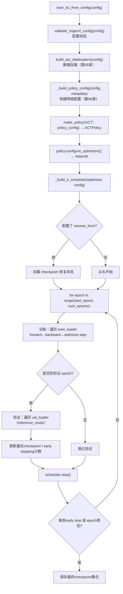

# 第 07 章：BC 训练循环

> 前情提要：第 06 章讲完了网络架构和损失函数的构成。本章讲这个损失函数具体怎么被用来训练网络——完整的训练主循环、优化器和学习率调度、以及决定什么时候停止训练、保存哪个 checkpoint 的具体逻辑。

## 1. 训练入口与整体流程

命令行入口是 `scripts/migenrl/train_bc.py`，核心调用 `train_bc_from_config(config)`（`source/miGenRL/miGenRL/training/bc_trainer.py`）。完整流程：



## 2. 训练主循环内部

单个 epoch 里的训练部分：

```python
for epoch in progress:
    policy.train()
    for data in train_loader:
        forward_dict = forward_pass(data, policy, use_amp, amp_dtype)
        loss = forward_dict["loss"]           # 第08章讲的加权L1 + KL
        scaler.scale(loss).backward()
        if grad_clip_norm > 0:
            scaler.unscale_(optimizer)
            torch.nn.utils.clip_grad_norm_(policy.parameters(), grad_clip_norm)  # 1.0
        scaler.step(optimizer)
        scaler.update()
        if ema_enabled:
            ema_state_dict = _update_ema_state(ema_state_dict, policy.state_dict(), ema_decay)
        optimizer.zero_grad()
```

几个值得注意的工程细节：

**混合精度训练**（`amp=true, amp_dtype=bf16`，继承自 Layer 0）：前向传播在 `bf16` 精度下进行以节省显存和加速计算，`GradScaler` 的存在主要是为了兼容 `fp16` 模式（`fp16` 下小梯度容易下溢为零，需要先放大损失再反向传播、更新后再缩小），`bf16` 本身数值范围和 `fp32` 相当，理论上不需要 scaler，但代码保留了这个接口以支持两种精度模式切换。

**梯度裁剪**（`grad_clip_norm=1.0`）：在梯度更新前，把所有参数梯度的整体 L2 范数裁剪到不超过 1.0。这是防止某个 batch 里出现异常大梯度（比如一次采样恰好覆盖了轨迹里动作变化最剧烈的关键帧，损失和梯度都异常大）导致参数一步跳得太远、破坏已经学到的稳定表示的常规做法。

**EMA（指数移动平均）**：`ema_state = ema_decay × ema_state + (1-ema_decay) × current_state`，在每步梯度更新后额外维护一份权重的滑动平均。EMA 权重通常比原始训练权重更平滑（不会受到最后几步梯度噪声的影响），常常在推理时表现更稳定，这也是为什么最终会单独保存一份 `policy_ema.ckpt`。

## 3. 学习率调度

```yaml
train:
  lr: 5.0e-5
  lr_scheduler: exponential
  lr_gamma: 0.99
  lr_min: 3.0e-7
```

**这个调度公式在做什么**：让学习率随训练进程指数衰减，但设一个下限不让它衰减到接近零。

$$
\text{lr}_{\text{epoch}} = \max\left(\text{lr}_0 \times \gamma^{\text{epoch}},\ \text{lr}_{\min}\right)
$$

**逐项拆解**：

| 符号 | 含义 | 本例取值 |
|---|---|---|
| $\text{lr}_0$ | 初始学习率 | $5\times10^{-5}$ |
| $\gamma$ | 每个 epoch 的衰减系数 | 0.99 |
| $\text{epoch}$ | 当前训练轮数 | 0 到 239 |
| $\text{lr}_{\min}$ | 学习率下限，防止衰减过头导致训练完全停滞 | $3\times10^{-7}$ |

**代入数字**：训练到第 100 个 epoch 时，$\text{lr}_{100} = 5\times10^{-5}\times0.99^{100}$。$0.99^{100}\approx0.366$，所以 $\text{lr}_{100}\approx1.83\times10^{-5}$——大约衰减到初始值的三分之一。到第 240 个 epoch（本配置的 `num_epochs`）：$0.99^{240}\approx0.0902$，$\text{lr}_{240}\approx4.5\times10^{-6}$，仍然大于下限 $3\times10^{-7}$，说明在本配置的 240 轮训练周期内，学习率下限从未真正被触发，衰减曲线全程保持纯指数形式。

**为什么要衰减学习率**：训练初期用较大学习率快速下降到损失曲面的大致区域，训练后期用较小学习率做精细调整，避免在接近最优点附近来回震荡。

## 4. Early Stopping：什么时候该停

```yaml
train:
  early_stopping:
    enabled: true
    patience: 40
    min_delta: 0.0001
```

**这个逻辑在做什么**：持续追踪验证集损失的历史最小值，如果连续多次验证都没有观察到"显著"的改善，就提前终止训练，避免在已经收敛、继续训练只会导致过拟合的阶段继续浪费计算资源。

```python
early_stop_bad_validations = 0
best_val_loss = float("inf")

# 每次验证后：
is_significant_improvement = epoch_val_loss < best_val_loss - min_delta
if is_significant_improvement:
    best_val_loss = epoch_val_loss
    early_stop_bad_validations = 0        # 重置计数
else:
    early_stop_bad_validations += 1        # 累加"未改善"计数

should_stop = early_stop_bad_validations >= patience   # >= 40
```

**逐项拆解**：

| 符号/变量 | 含义 | 本例取值 |
|---|---|---|
| `min_delta` | 判定"改善"是否算"显著"的阈值 | 0.0001 |
| `patience` | 容忍连续多少次"不显著改善"的验证 | 40 |
| `val_every` | 每隔多少个训练 epoch 做一次验证（继承 Layer 0） | 2 |

**注意 `patience` 的单位是"验证次数"不是"epoch 数"**：配置里 `val_every=2`，意味着每 2 个 epoch 才验证一次，`patience=40` 实际对应 $40\times2=80$ 个 epoch 的容忍窗口。这是一个容易被误读的细节——如果只看 `patience: 40` 这个数字，很容易误以为训练会在"40 个 epoch 无改善"后停止，但实际是 80 个 epoch。

**代入数字**：假设训练到第 120 epoch（对应第 60 次验证）时验证损失是历史最低的 0.0850，patience 计数被重置为 0；接下来连续 40 次验证（对应第 122 到第 200 epoch）验证损失都在 0.0849～0.0855 之间波动，没有一次比 0.0850 低出 0.0001 以上——那么在第 200 epoch（第 100 次验证）时，`early_stop_bad_validations` 达到 40，触发提前停止，即使配置里 `num_epochs` 设的是 240，训练也会在第 200 epoch 左右提前结束。

**为什么要用"最小改善阈值"而不是简单地比较"是否变小"**：验证损失天然存在噪声（不同 batch、不同验证样本组合下会有小幅波动），如果只要求"比历史最优严格更小"就重置计数器，几乎每次验证都会因为随机噪声重置一次，导致 early stopping 事实上从来不会触发。`min_delta` 过滤掉这种噪声级别的"伪改善"，只有真正有意义的下降才会被认可。

## 5. 多套 Checkpoint 策略

训练结束（或提前停止）后，会同时保存好几份不同用途的权重文件：

| 文件 | 保存时机 | 含义 |
|---|---|---|
| `policy_best.ckpt` | 每次验证损失创下新低时覆盖保存 | 历史最优权重 |
| `policy_best_val.ckpt` | 训练结束时保存 | 与 `policy_best.ckpt` 相同，训练完成后的确认副本 |
| `policy_best_recent_eps.ckpt` | 验证损失在历史最优的 2% 以内时保存 | "足够接近最优"的近期权重，用于观察是否过拟合了极端的某一次验证 |
| `policy_last.ckpt` | 训练结束时保存 | 最后一个 epoch 的权重 |
| `policy_ema.ckpt` | 训练结束时保存 | 指数滑动平均权重 |
| `policy_swa_plateau.ckpt` | 训练结束时保存 | 对训练后期"平台期"多个 checkpoint 做简单平均（SWA，随机权重平均） |
| `training_state_last.pt` | 每个 epoch 结束保存 | 包含优化器状态、调度器状态、epoch 计数等，用于断点续训 |

保留这么多份权重不是冗余，而是覆盖了不同的使用场景：`policy_best` 是最标准的选择（验证损失最低），但如果验证集本身样本量较小（本配置只有 8 个验证 episode），单次验证损失的最低点可能只是恰好命中了一次有利的随机组合，未必真正代表泛化能力最强的权重——这时候 `policy_ema` 或 `policy_swa_plateau` 这类"平滑多个时刻权重"的版本反而可能更稳健。第 08 章的 rollout 推理阶段最终选哪个 checkpoint 部署，是一个需要结合实际测试结果决定的问题。

## 6. `policy.checkpoint: latest` 的真实含义

配置里这一行容易被误读：

```yaml
policy:
  checkpoint: latest
```

字面上"latest"容易被理解成"最后一个 epoch 的权重"（对应 `policy_last.ckpt`），但代码里的实际解析逻辑是：

```python
def resolve_checkpoint(config):
    checkpoint = config.get("policy", {}).get("checkpoint", "latest")
    if checkpoint in {None, "", "latest", "auto"}:
        return latest_checkpoint_from_output(config)   # 实际指向 policy_best.ckpt
    return Path(checkpoint).expanduser()
```

`latest_checkpoint_from_output` 实际查找的是输出目录下的 `policy_best.ckpt`——即验证损失最低的那个 checkpoint，而不是训练时间上"最新"（最后一个 epoch）的权重。这是一个命名上容易引起误解的地方：`latest` 在这里的语义是"最近一次成功训练所产出的、推荐使用的权重"，而不是"时间戳最新的权重"。如果后续 rollout 阶段（第 08 章）配置里也写了 `checkpoint: latest`，实际加载的是 BC 训练阶段验证损失最优的那个版本，这是符合大多数使用场景期望的默认行为，但如果不知道这个解析细节，容易在"为什么用的不是训练到一半保存的中间权重"这类问题上产生困惑。

## 7. 小结与下一章

这一章讲完了训练循环本身的运作机制：

1. 训练主循环包含混合精度、梯度裁剪、EMA 三个标准工程手段，各自解决不同的稳定性问题。
2. 学习率按指数衰减 $\text{lr}_0\times\gamma^{\text{epoch}}$，配合一个下限防止过度衰减；本配置的 240 轮训练周期内衰减曲线从未真正触底。
3. Early stopping 的 `patience` 单位是"验证次数"而不是"epoch 数"，配合 `val_every` 才能算出真实等待的 epoch 窗口；`min_delta` 用来过滤验证损失的随机噪声，避免每次微小波动都重置计数器。
4. 训练结束后保存的多套 checkpoint 各自对应不同的鲁棒性假设，`policy.checkpoint: latest` 实际解析为验证损失最优的 `policy_best.ckpt`，不是字面理解的"最后一个 epoch"。

到这里，第 05、06、07 三章把 BC 训练阶段（`workflow.stages: [bc]`）完整讲完了。下一章切换到评估阶段——用训练好的 checkpoint 去控制仿真环境，这是一个独立的进程、独立的命令，核心要讲的是 `temporal_aggregation` 时间聚合机制，以及网络输出的动作要经过怎样一套后处理管线才能真正写入仿真物理引擎。

---

上一章：[第 06 章 ACT 策略网络架构](./06_ACT策略网络架构) ｜ 下一章：[第 08 章 Rollout 推理循环](./08_Rollout推理循环)
