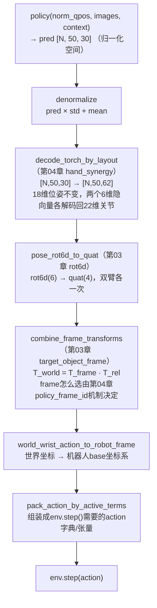

# 第 08 章：Rollout 推理循环

> 前情提要：第 07 章的 BC 训练产出了一个 `policy_best.ckpt`。本章讲这个 checkpoint 怎么被拿来控制真实仿真——这是一个独立的进程（`scripts/migenrl/rollout_policy.py`），核心要讲的是动作输出的时间聚合机制，以及网络输出要经过怎样一套后处理管线才能变成仿真物理引擎能执行的关节指令。

## 1. 一个问题：Chunk 化预测天然会"抖"

第 06 章讲过，ACT 策略每次推理输出的不是单步动作，而是长度 50 的动作 chunk（`num_queries=50`）。最朴素的执行方式是：查询一次策略，把这 50 步动作依次执行完，再重新查询——这样每 50 步才推理一次，计算开销小，但会带来一个明显的问题：**chunk 之间的边界处容易出现动作跳变**。因为每次重新推理时，网络看到的是全新的观测（手臂位置、图像内容都变了），新 chunk 的第一步预测和上一个 chunk 的最后一步之间没有任何约束保证平滑过渡，衔接处经常出现细微的方向突变，这种高频抖动会明显影响机械臂运动的稳定性和最终的抓取精度。

配置给出的解法：

```yaml
rollout:
  temporal_aggregation: true
  temporal_aggregation_decay: 0.05
  query_frequency: 1
```

**核心思路**：每一步都重新查询策略（`query_frequency: 1`），得到一个新的 50 步 chunk；同一个未来时刻 $T$，会被好几个不同起点的 chunk 反复预测到（比如 $t=100$ 查出的 chunk 会预测 $t=100,101,\dots,149$ 这 50 步，而 $t=101$ 查出的新 chunk 又会重新预测 $t=101,\dots,150$——时刻 101 被两个 chunk 都覆盖了）。对每个时刻，把所有覆盖它的历史预测做**指数衰减加权平均**，而不是简单地"用最新一次预测替换旧预测"。

## 2. 加权聚合公式

### 2.1 维护两个累积缓冲区

`RolloutActionPlan` 内部为每个并行环境维护两个缓冲区，形状覆盖整条 episode 的时间轴（`horizon = max_steps + policy_chunk_size + 1`）：

```python
self.temporal_action_sum = torch.zeros((num_envs, horizon, action_dim))    # 累积加权动作和
self.temporal_action_weight = torch.zeros((num_envs, horizon))              # 累积权重和
```

### 2.2 每次新 chunk 到来时的更新规则

**这个公式在做什么**：把新查询到的 chunk 混合进已有的累积缓冲区，历史部分先按衰减系数打折，再叠加新预测（权重恒定为 1）。

```python
decay = math.exp(-temporal_aggregation_decay)     # e^{-0.05} ≈ 0.9512
# 对本次chunk覆盖的时间区间 [step_index, end)：
temporal_action_sum[env, step_index:end]    *= decay      # 历史累积先衰减
temporal_action_weight[env, step_index:end] *= decay
temporal_action_sum[env, step_index:end]    += incoming_actions   # 叠加新chunk，权重视为1.0
temporal_action_weight[env, step_index:end] += 1.0
```

写成数学形式，假设时刻 $T$ 已经被 $n$ 次查询覆盖过（查询顺序 $0,1,\dots,n-1$，越大越新），此刻 $T$ 处累积的加权动作和与权重和满足：

$$
\bar{a}_T = \frac{\sum_{j=0}^{n-1} \lambda^{\,n-1-j}\, a^{(j)}_T}{\sum_{j=0}^{n-1} \lambda^{\,n-1-j}}, \qquad \lambda = e^{-\text{decay}}
$$

**逐项拆解**：

| 符号 | 含义 | 本例取值 |
|---|---|---|
| $a^{(j)}_T$ | 第 $j$ 次查询产出的 chunk 里，对时刻 $T$ 的预测值 | 每次查询覆盖的一段动作序列中的一个切片 |
| $\lambda$ | 单步衰减系数 | $e^{-0.05}\approx0.9512$ |
| $n-1-j$ | 第 $j$ 次预测距离"最新一次预测"隔了几次查询 | 越久远的预测在指数上的幂次越大，衰减越狠 |
| $\bar{a}_T$ | 最终在时刻 $T$ 实际执行的聚合动作 | 归一化加权平均——所有权重之和为分母 |

**代入数字**：假设时刻 $T$ 被最近 3 次查询覆盖过（$n=3$），三次预测值分别是 $a^{(0)}_T=0.10$，$a^{(1)}_T=0.12$，$a^{(2)}_T=0.11$（$j=2$ 是最新一次）：

- 权重分别是 $\lambda^{2}=0.9512^2\approx0.905$（对应 $j=0$，最旧），$\lambda^{1}\approx0.9512$（$j=1$），$\lambda^{0}=1$（$j=2$，最新）
- 加权和：$0.905\times0.10 + 0.9512\times0.12 + 1\times0.11 = 0.0905+0.1141+0.11=0.3146$
- 权重和：$0.905+0.9512+1=2.856$
- $\bar{a}_T = 0.3146/2.856 \approx 0.1102$

三次预测原本的简单平均是 $(0.10+0.12+0.11)/3\approx0.11$，加权平均结果 $0.1102$ 和简单平均非常接近，因为 $\text{decay}=0.05$ 是一个相当温和的衰减率——衰减系数 $\lambda\approx0.95$ 意味着每次新查询只把旧权重压低约 5%，需要连续大约 14 次查询（$0.95^{14}\approx0.49$）才会让最初的预测权重减半。**这是有意为之的设计**：如果衰减系数选得过大（比如衰减到 0.5），聚合结果会几乎完全由最新一次预测决定，退化成"不做时间聚合"；如果选得过小（比如衰减到 0.001，几乎不衰减），历史上几十次查询的预测会被同等对待，聚合结果会对最新观测的响应变得迟钝——极端情况下如果环境发生了突然变化（比如任务阶段切换），聚合结果需要很多步才能"跟上"最新的正确预测。0.05 这个取值是在"平滑抖动"和"保持响应性"之间选择的一个折中点。

### 2.3 提取当前步的实际执行动作

```python
def _select_temporal_action(self, episode_steps):
    weight = self.temporal_action_weight[env_index, step_index]
    if weight > 0:
        action = self.temporal_action_sum[env_index, step_index] / weight   # 归一化平均
    else:
        action = self.planned_actions[env_index, self.planned_action_index]  # 兜底：还没聚合过就直接用原始预测
```

## 3. query_frequency 和 temporal_aggregation 怎么配合

`query_frequency` 决定"多久重新查询一次策略网络"，独立于 temporal aggregation 是否开启。判定要不要重新查询的核心逻辑：

```python
def should_query_policy(self, smoothing_chunk_active):
    return (
        self.planned_actions is None
        or self.planned_action_index >= self.planned_actions.shape[1]     # 当前chunk已用完
        or (
            self.temporal_aggregation and not smoothing_chunk_active
            and self.planned_action_index >= self.query_frequency          # 关键判据
        )
    )
```

`query_frequency=1` 意味着每次 `advance()` 之后 `planned_action_index` 变成 1，立刻满足 `>= 1`，触发下一次查询——**换句话说，本配置下策略网络确实是每一个仿真步都被重新调用一次**，这是能实现前面讲的"多个 chunk 重叠聚合"效果的前提，代价是推理开销是"每 50 步查询一次"方案的 50 倍。

四种组合方式的行为差异：

| `query_frequency` | `temporal_aggregation` | 行为 |
|---|---|---|
| 1 | `true`（本配置） | 每步都查询+聚合，最平滑但计算开销最大 |
| $K$（如 10） | `true` | 每 $K$ 步查询一次，中间步用已有累积缓冲区的加权平均值（不是原始单次预测），仍能部分获得平滑效果，计算开销降到 $1/K$ |
| $K$ | `false` | 每 $K$ 步查询一次，直接顺序执行 chunk 里的第 0、1、2…步，chunk 边界处会有跳变 |
| 1 | `false` | 每步都查询，但只取新 chunk 的第 0 步动作，完全不利用 chunk 后续步的信息 |

本任务选择"每步查询 + 时间聚合"的最高开销方案，符合 `env.num_envs: 6` 这种较小并行规模下评估阶段对动作质量优先于计算效率的取舍——rollout 只评估 6 个 episode，不像训练需要成千上万次前向传播，计算成本的绝对值可以承受。

## 4. 动作后处理管线：从网络输出到仿真指令

策略网络输出的是**归一化后的、PCA 压缩后的、相对参考物体表示的** 30 维动作。要真正驱动仿真，必须依次逆转前面几章讲过的每一层表征转换：



每一步都是前面章节讲过的某个具体转换函数的直接调用，这里不重复推导公式，只强调这条链路的**方向性**——训练阶段是"仿真观测 → 各种表征转换 → 网络输入"，rollout 执行阶段刚好是反方向："网络输出 → 各种表征逆转换 → 仿真动作"。理解了训练阶段每一步转换在干什么，rollout 阶段只是把同一套变换按相反顺序、用逆运算重新走一遍。

其中一个值得单独提的细节是**四元数聚合前的符号对齐**。第 03 章讲过四元数存在 $q$ 和 $-q$ 表示同一个旋转的双重覆盖问题——虽然本项目网络内部用 rot6d 避免了这个问题，但转换回四元数后再做时间聚合（多个 chunk 的四元数预测要加权平均）时，仍然要处理这个问题：如果两个待聚合的四元数一个是 $q$、另一个恰好是 $-q$（数学上代表相同旋转，但数值上是两个几乎相反的向量），直接线性加权平均会得到一个错误的中间结果（甚至可能接近零向量，退化成一个无意义的"旋转"）。代码在聚合前显式检测并对齐符号：

```python
dot = torch.sum(existing_actions[:, start:stop] * incoming_actions[:, start:stop], dim=-1)
flip = has_history & (dot < 0)                     # 点积为负说明两个四元数方向相反
incoming_actions[:, start:stop] *= torch.where(flip, -1.0, 1.0).unsqueeze(-1)   # 翻转符号对齐
```

这一步保证了即使 rot6d→四元数转换过程中偶然产生了符号翻转的四元数，聚合时也不会被误判成两个截然不同的旋转指令。

## 5. 成功率是怎么算出来的

Rollout 循环每一步都会检查任务是否完成：

```python
success_now = _task_success_bools(env)              # 直接调用环境侧暴露的任务成功判定接口
done = terminated | truncated | (episode_steps >= max_episode_steps)
if end_on_success:
    done |= success_now
```

`_task_success_bools` 只是对环境对象的一层薄封装，真正的成功判据（比如"抓住了没有""放进去了没有"）是环境侧任务定义自己的逻辑，`miGenRL` 侧不重新定义一套标准——**训练数据采集时用的成功标准、任务本身的定义、以及 rollout 评估时判断策略好坏的标准，全部是环境侧同一份配置**。这是一个刻意的设计一致性：如果 `miGenRL` 自己再定义一套"评估专用"的成功判据，会出现"训练时环境认为这一条轨迹是成功的，但评估时用另一套更严格的标准判定失败"这种自相矛盾的情况。`miGenRL` 只负责在每一步调用这个接口、统计结果，不关心接口内部具体怎么判定。

`num_episodes: 6` 意味着这次 rollout 只跑 6 个完整 episode 就统计结束，最终的成功率就是这 6 个 episode 里 `success=True` 的比例。这是一个相当小的样本量，第 09 章会讨论这个数字在实际调参和判断策略优劣时需要注意的统计显著性问题。

## 6. 调试工具：trace_actions

```yaml
rollout:
  trace_actions: true
  trace_action_limit: 420
```

启用后，rollout 过程中会把**第 0 号并行环境**每一步的详细中间量写入 `action_trace.jsonl`，`trace_action_limit=420` 限制只记录每个 episode 的前 420 步（避免文件无限增长）。每行 JSON 记录的字段包括原始 qpos、归一化后 qpos、策略输出的归一化动作、解码后的环境动作、当前的参考系 frame_id、以及聚合过程中的 chunk 跳变统计量（`plan_right_pos_jump_max` 等）。

这份日志的典型用途是**定位表征转换链路中的 bug**：比如怀疑 rot6d→四元数转换有问题，可以对比同一步的 `policy_action_*`（网络原始输出）和 `env_action_*`（转换后写入仿真的值），手工验算转换公式是否正确；怀疑 frame_id 切换时机不对，可以看 `current_active_frame_id` 字段在哪一步发生跳变，对照任务实际完成进度判断是否合理。

## 7. Rollout 输出：数据落盘结构

`output.rollout_dataset_dir` 目录下会产出：

```text
rollout_dataset_dir/
├── rollout.hdf5              # 主数据文件，/data/demo_N/ 每组含 actions/states/obs/images + attrs(success, resetid等)
├── action_trace.jsonl        # 前面讲的调试日志（仅env 0）
└── videos/
    ├── episode_000_success.mp4
    ├── episode_001_fail.mp4
    └── groups/grid_head_0.mp4   # 多episode拼接的视频网格，方便快速浏览
```

`rollout.hdf5` 和第 05 章讲的训练用 HDF5 格式完全一致——这不是巧合，而是刻意设计：这份 rollout 产出的数据，本身可以被**筛选出成功的部分，作为下一轮训练的新增数据**。`miGenRL` 的 workflow 配置里还有一种 `workflow.mode: iterative_bc_rollout` 模式正是利用这一点：BC 训练 → Rollout 评估 → 筛选成功 episode → 并入下一轮训练数据 → 重新训练，形成一个自训练闭环。本配置（`workflow.stages: [bc]`）没有启用这套迭代模式，只是单次训练加单次评估，但底层数据格式的一致性为后续切换到迭代模式留出了直接可用的接口。

## 8. 小结与下一章

这一章讲完了训练好的策略怎么被用来控制仿真、产出可评估的结果：

1. Chunk 化预测天然会在 chunk 边界处产生动作跳变，`temporal_aggregation` 通过让每一步都重新查询策略、多个重叠 chunk 的预测按指数衰减加权平均，用增加计算开销换取动作平滑性。
2. 衰减系数 `decay=0.05` 是"平滑性"和"响应性"之间的折中——衰减越慢越平滑但响应越迟钝，反之则接近不做聚合。
3. `query_frequency` 和 `temporal_aggregation` 独立控制"多久查询一次"与"是否聚合多个 chunk"，四种组合对应不同的计算开销和平滑程度取舍。
4. 网络输出要依次逆转 hand_synergy 解码、rot6d 转四元数（含符号对齐处理双重覆盖问题）、参考系转换、机器人坐标系转换，才能变成仿真可执行的动作，这条链路和训练阶段的正向转换完全对称。
5. 成功率判定完全依赖环境侧暴露的接口，`miGenRL` 不重新定义评估标准，避免训练和评估两套标准不一致。

到这里，整条 `miGenRL` 链路——配置合并、数据表征转换、数据管线、网络架构、训练循环，到 rollout 推理——已经完整走完一遍。最后一章从实战角度整理：遇到具体问题该往哪个方向排查、常见参数该怎么调、改配置前有哪些容易踩的坑。

---

上一章：[第 07 章 BC 训练循环](./07_BC训练循环) ｜ 下一章：[第 09 章 实战调参与排错](./09_实战调参与排错)
