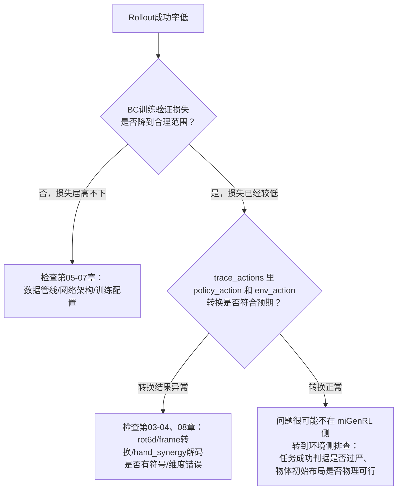

# 第 09 章：实战调参与排错

> 前情提要：前 8 章把 `miGenRL` 自己的链路——配置合并、数据表征转换、数据管线、网络架构、训练循环、rollout 推理——完整拆解了一遍。本章是收尾：把散布在各章的调参知识整理成速查表，并列出改配置时最容易踩的坑。

## 1. 调参速查表

按"如果观察到 X 现象，该往哪个方向调"整理，每一行都能对应回前面某一章的具体机制。

| 观察到的现象 | 可能的原因 | 该调的参数 | 涉及章节 |
|---|---|---|---|
| 抓取动作在关键瞬间（合拢、脱手）不精确 | 训练样本没有充分覆盖这些精细动作 | 提高 `keyframe_top_fraction`（更多关键帧候选）或调整 `keyframe_window_before/after`（覆盖更完整的准备-完成过程） | 第 05 章 |
| 策略在轨迹中段（比如长距离平移）表现变差 | `keyframe_sample_prob=1.0` 导致过渡阶段样本被严重欠采样 | 适当降低 `keyframe_sample_prob`（如 0.7~0.8），让部分样本回退到均匀采样 | 第 05 章 |
| 手指抓握力度或形态不对，但手臂位置基本准确 | hand_synergy 权重不够高，或者 PCA 保留维度不足 | 提高 loss 权重表里手部隐向量的权重（当前 8.0），或重新拟合 `hand_synergy` 保留更多主成分 | 第 04、06 章 |
| 训练损失下降缓慢或震荡 | 学习率不合适 | 调整 `train.lr` 初始值或 `lr_gamma` 衰减速度 | 第 07 章 |
| 训练在还没充分收敛时就提前停止 | `early_stopping.patience` 配合 `val_every` 换算出的实际等待窗口过短 | 增大 `patience`，注意实际等待 epoch 数 = `patience × val_every` | 第 07 章 |
| 验证损失几乎不动、怀疑 early stopping 判定太敏感 | `min_delta` 设置过大，导致真实的小幅改善也被判定为"未改善" | 调低 `min_delta` | 第 07 章 |
| Rollout 时动作明显抖动、机械臂轨迹不平滑 | temporal aggregation 未开启，或衰减系数不合适 | 打开 `temporal_aggregation`；若已开启仍抖动，尝试减小 `temporal_aggregation_decay`（让历史预测保留更久、聚合更充分） | 第 08 章 |
| Rollout 计算太慢、达不到实时要求 | `query_frequency=1` 意味着每步都要推理一次 | 提高 `query_frequency`（如 5 或 10），代价是响应性和平滑度下降 | 第 08 章 |
| Rollout 中动作在参考物体切换的瞬间出现明显跳变 | frame_id 切换机制本身没问题，但切换时机与实际任务进度不同步 | 用 `trace_actions` 输出核对 `current_active_frame_id` 切换是否发生在预期的时刻 | 第 04、08 章 |
| 改了 `qpos_keys`/`action_keys` 后训练报错找不到某个观测字段 | 忘记同步修改表征类型对应的字符串前缀（如 `in_target_` vs `in_active_frame_`） | 检查表征类型（`target_object_frame` vs `geometry_active_frame`）与 key 字符串前缀是否匹配 | 第 02、03 章 |
| 训练/验证集划分感觉总是同一批数据 | `split_seed` 固定，属于预期行为 | 如果确实要换一批验证集，显式修改 `split_seed` | 第 05 章 |

## 2. 改配置前必查的坑位清单

### 2.1 列表字段是整体覆盖，不是拼接

第 02 章讲过，`_deep_merge` 对列表类型字段的处理是整体覆盖。如果只是想在继承的基础上"新增"一个数组项（比如给 `qpos_keys` 加一个新字段），**必须把继承链上所有层的完整列表重新抄一遍**，不能只写新增的那一项，否则会丢失原有内容。同理，`workflow.stages` 这种列表字段如果被某一层不小心重写成子集，会静默地丢失阶段（比如误把 `[bc, rollout]` 写成 `[bc]`，不会报错，只是 rollout 阶段从此不会自动执行）。

### 2.2 维度是隐含推导出来的，不是配置里直接写的

第 02、04 两章反复强调：`state_dim=30`、`action_dim=30` 这两个数字不是配置文件里的某一行，而是 `qpos_keys`/`action_keys` 列表宽度之和，减去 `hand_synergy` PCA 压缩掉的维度，间接算出来的。修改以下任何一处都会改变最终维度，且不会有配置层面的显式提示：

- 增删 `qpos_keys` 或 `action_keys` 里的条目
- 更换 `hand_synergy_path` 指向一个 `latent_dim` 不同的 PCA 文件（比如从 dim6 换成 dim8）
- 切换 `action_representation`/`qpos_representation` 到一个观测字段结构不同的表征模式

修改后如果维度不匹配，通常会在网络第一层线性层构造时直接报错（tensor shape mismatch），报错信息本身能提示问题，但排查时要清楚知道"维度是被推导出来的"这个事实，才能定位到具体是哪个配置项改变导致的。

### 2.3 `policy.checkpoint: latest` 不是"最后一个 epoch"

第 07 章讲过，这个字符串实际解析为验证损失最优的 `policy_best.ckpt`。如果想明确使用训练结束时的最后权重（比如怀疑 `policy_best.ckpt` 是过拟合到了某次偶然的验证低点），需要显式写 `checkpoint: <ckpt_dir>/policy_last.ckpt` 的具体路径，而不是依赖 `latest` 关键字的默认行为。

### 2.4 frame_id 的取值空间由环境侧物体声明顺序决定

第 04 章讲过 frame_id 的整数映射是按环境侧场景里物体的声明顺序静态生成的。这个映射关系完全由环境配置决定，`miGenRL` 只是读取顺序、不参与定义。如果环境侧修改了物体声明顺序，这个映射关系会整体变化，而已经采集好的、按旧映射记录的示教数据里的 `frame_id` 字段会和新的映射不一致——**改动环境侧物体声明顺序前，务必确认没有依赖旧映射关系的既有数据集**，否则需要重新采集数据或者写一个迁移脚本重新映射旧数据里的 `frame_id` 值。这是一个典型的"环境侧改动影响到 `miGenRL` 侧数据有效性"的耦合点，即使 `miGenRL` 本身没有改任何代码或配置。

### 2.5 keyframe 相关参数存在多层默认值覆盖

第 02、05 两章的合并推演显示，`keyframe_sample_prob`、`keyframe_window_before/after` 等参数在三层配置里都可能出现（Layer 0 给通用默认值，Layer 2 给本任务的特化值）。如果要调整这些参数做实验，**要明确知道当前生效的值来自哪一层**，直接在 Layer 2（最终实验配置）里改是最安全的方式——改动 Layer 0 或 Layer 1 会连带影响所有继承自它们的其他任务配置，容易产生意料之外的副作用。

## 3. 排错指南：分阶段定位问题

遇到"训练完但 rollout 效果不好"这类笼统问题时，建议按下面的顺序逐段排查，而不是直接怀疑网络架构或超参数：

这个排查顺序背后的逻辑是**先隔离问题所在的阶段，再深入具体机制**：训练损失都降不下来，说明问题很可能在数据或网络层面，不需要急着看 rollout 的坐标转换代码；训练损失正常但 rollout 表现差，先检查 `miGenRL` 自己的表征转换链路——最常见的就是某个坐标系转换或 PCA 编解码在训练数据预处理时用了一种约定，rollout 时用了另一种，产生了训练/推理不一致。如果连 `trace_actions` 输出核对下来表征转换都正常，问题就已经超出 `miGenRL` 的边界，要去看环境侧的任务判定逻辑和场景布局，而这部分不是本系列的范围。

## 4. 系列回顾：9 章讲了什么

用一张表回顾全系列讲清楚的所有决策点：

| 决策点 | 是什么 | 为什么这样设计 |
|---|---|---|
| miGenRL 的 `base:` 三层继承 | Layer0通用默认 → Layer1双臂通用 → Layer2任务特化 | 关注点分离，避免每个新任务重复配置通用参数 |
| rot6d 旋转表征 | 旋转矩阵前两列，6个数 | 满足SO(3)连续映射所需的最小维度，避开欧拉角万向锁和四元数双重覆盖 |
| target_object_frame | 相对物体初始位姿的相对坐标系 | 兼容环境侧的随机化设计，让策略学到的是相对运动模式而非绝对坐标 |
| policy_frame_id | 参考物体的整数编号，随任务阶段切换 | 让单一网络处理多阶段任务，无需为每阶段单独训练模型 |
| hand_synergy PCA | 22维手指关节→6维隐向量 | 去除人手运动的天然冗余自由度，减轻网络学习负担 |
| keyframe 采样 | 按运动幅度自动检测关键帧+窗口展开 | 避免均匀采样被低信息量过渡阶段主导 |
| CVAE按双臂拆分 | 左右臂独立隐向量 | 两臂动作模式不同，共用隐向量会模糊语义 |
| 手部交叉注意力 | 手指查询手腕token而非独立查询视觉 | 手指姿态以手腕动作为条件，非独立决定 |
| 加权L1+KL loss | 手部隐向量权重8.0 >> 位置4.0/旋转3.0 | 补偿PCA降维带来的数值尺度失衡 |
| early stopping | patience×val_every才是真实等待窗口 | min_delta过滤验证损失的随机噪声 |
| temporal aggregation | 每步查询+指数衰减聚合多个重叠chunk | 平滑chunk边界跳变，用计算开销换取动作质量 |

## 5. 写在最后

这条链路的复杂度不在于任何单一环节有多难，而在于**多个独立设计决策叠加在一起**——配置继承、参考系动态切换、PCA降维、关键帧采样、双臂CVAE拆分、手部交叉注意力、时间聚合——每一个单独看都不复杂，但要理解"改一个配置项会通过哪条路径影响最终的机器人行为"，需要对整条链路有完整的认识。这正是这个系列存在的意义：把分散在 `miGenRL` 各个模块、几层配置继承里的设计决策，按照数据实际流动的顺序重新串起来。

如果你是从头读到这里的，现在应该能够：看着 `stack_can_drawer_bimanual_base.yaml` 的任意一行，说出它在 `miGenRL` 这条链路里具体控制什么、修改它会通过哪条路径影响最终行为、以及改动之后需要同步检查哪些相关联的配置项。这也是本系列开篇提出的目标——同时清楚知道哪些问题已经超出 `miGenRL` 的边界，需要去环境侧排查。

---

上一章：[第 08 章 Rollout 推理循环](./08_Rollout推理循环) ｜ 返回：[系列首页](./index)
