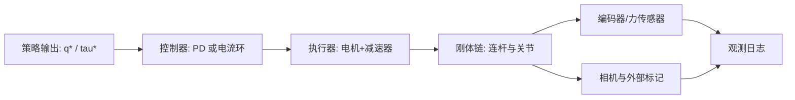

# 第一章：问题定义与参数地图

系统辨识的输入是实验记录和一个可计算的模型，输出是“在给定输入下能预测观测”的参数。参数分层决定需要采集哪些证据；把所有东西塞进一个黑盒优化器，通常会得到互相补偿的错误参数。

## 1.1 先固定系统边界

以双臂机器人为例，边界包括：控制器输出关节目标或电流，驱动器执行控制，机械本体产生运动，编码器和力传感器回传状态，仿真器复现同一条链路。相机、末端工具和桌面也要明确属于系统，否则坐标系会在不同团队手里漂移。

> 辨识边界决定日志字段和模型接口：如果真机控制器内部已有电流环，仿真就不能只调一个“关节力矩”而忽略电流环的饱和和延迟。

## 1.2 参数分层清单

| 层 | 参数 | 典型单位 | 需要什么实验 |
|---|---|---|---|
| 坐标与几何 | DH 的 (a_i,\alpha_i,d_i,\theta_{0,i})，基座/工具/相机外参 | m, rad | 标定板、末端多姿态 |
| 关节约束 | 软硬限位、连续/转动类型、mimic 比例 | rad, N | 全行程慢扫、规格书 |
| 传动 | 齿轮比、方向、编码器零位、回差、弹性 | 无量纲、rad | 正反向往返、静态挂载 |
| 执行器 | 力矩常数、效率、电流限幅、控制周期、时延 | Nm/A, s | 电流阶跃、空载/负载 |
| 动力学 | 质量、质心、转动惯量、库仑/黏性摩擦 | kg, m, kg·m² | 多速度多姿态轨迹 |
| 接触 | 摩擦系数、恢复系数、接触刚度/阻尼、地面高度 | 无量纲、N/m | 推、滑、落、按压 |
| 传感器 | 编码器噪声、力偏置、相机内参、时间偏移 | rad, N, px | 静态采样、同步闪光 |

第一轮只估计能被当前数据激励到的参数。例如没有力传感器和电流记录时，不要声称“辨识了质量和摩擦”；最多只能得到一个包含未建模项的等效关节模型。

## 1.3 观测、输入和隐藏状态

把每个时间戳的记录写成三类：输入 (u_t) 是发送给驱动器的命令，观测 (y_t) 是编码器/力传感器/视觉读数，隐藏状态 (x_t) 是真实关节速度、弹性变形和接触状态。辨识的目标不是让参数解释每个噪声点，而是让模型从 (u_t) 预测 (y_{t+1}) 的趋势。

$$
\hat{y}_{t+1}=g_{\theta}\bigl(x_t,u_t\bigr),\qquad x_{t+1}=f_{\theta}\bigl(x_t,u_t\bigr)
$$

**这个公式在做什么**：用同一组参数 \(\theta\) 同时描述状态如何演化、传感器如何读出，从而把“本体行为”和“观测误差”分开。

::: details 📐 公式详解（点击展开）
| 子表达式 | 它是谁 | 它在干嘛 |
|---|---|---|
| \(f_{\theta}\) | 状态推进器 | 根据控制输入推进关节和刚体状态 |
| \(g_{\theta}\) | 传感器翻译器 | 把隐藏状态转换为编码器、力或像素读数 |
| \(\theta\) | 待辨识参数包 | 几何、动力学、噪声和时延等所有可调量 |
| \(\hat y_{t+1}\) | 模型预测 | 与真实下一时刻观测比较，形成残差 |

**用人话读**：模型先猜机器人下一刻会到哪里，再猜传感器会读到什么，参数通过减少预测误差被校正。

**为什么是这个形式**：把动力学和传感器分成两个函数，才能判断误差究竟来自“机器人没动对”还是“传感器读错了”；只拟合一个端到端黑盒无法把参数写回仿真。
:::

## 1.4 辨识计划的验收门槛

在开始实验前写下三类门槛：几何门槛（末端位置/姿态误差）、动态门槛（速度和力矩误差）、任务门槛（抓取成功率或接触时刻误差）。每个门槛都要有训练集和验证集，验证集轨迹不能参与参数拟合。
