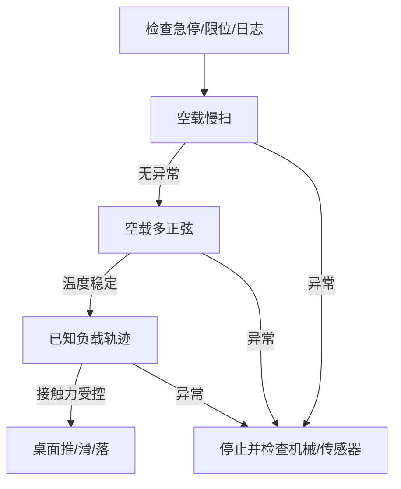

# 第二章：实验设计与数据采集

辨识结果的上限由数据决定。轨迹如果只在一个姿态、一个速度、一个负载下运动，质量、摩擦和零位会互相“冒充”，再复杂的优化器也无法补回缺失信息。

## 2.1 先做安全分级

把实验分成空载慢扫、空载激励、挂载激励、接触实验四级。每级都设置关节角、速度、电流、温度和看门狗阈值；任何一级触发阈值，记录数据并回到上一级，不要边撞限位边继续采样。

## 2.2 激励要覆盖哪些维度

对每个关节至少覆盖：位置范围的 70% 以上、低中高三档速度、正反方向、不同加速度和至少两种负载姿态。多关节动力学还需要改变相邻关节构型，否则惯量耦合项在数据里几乎是常数。

常用轨迹是互不重复频率的多正弦或带限伪随机序列。频率不能高到超过驱动器带宽，否则记录到的是控制器饱和；也不能全是低频，否则摩擦和时延无法分离。工程上先用 0.1、0.3、0.7 倍额定速度做三组，再根据频谱缺口补频率。

不同参数需要不同的“动作证据”，不能用同一条轨迹包打天下：

| 待估参数 | 必须出现的运动 | 为什么 |
|---|---|---|
| 关节零位、连杆几何 | 多个相距较远的静态构型 | 减少动态误差和振动干扰 |
| 重力参数、质心 | 同一关节在多个绝对姿态静止 | 重力矩随姿态改变，摩擦不会同样改变 |
| 库仑摩擦 | 同一速度大小的正反匀速段 | 速度换向后摩擦符号翻转 |
| 黏性摩擦 | 多个匀速档位 | 力矩随速度幅值增长 |
| 惯量 | 多个加速度幅值和方向 | 惯性力矩随加速度改变 |
| 时延、带宽 | 小幅阶跃或扫频 | 响应相位和幅值能暴露延迟与低通特性 |
| 回差 | 低速小幅正反往返 | 换向时的死区最清楚 |
| 接触摩擦 | 不同法向载荷下匀速推滑 | 分离法向力与切向摩擦力 |

### 2.2.1 一次可落地的采集顺序

1. 冷机静止 60 秒，记录所有传感器零偏和噪声。
2. 每个关节单独以额定速度的 5% 慢扫，确认关节索引、方向、零位和限位。
3. 每个关节执行三档正反匀速，其他关节锁定，得到局部摩擦数据。
4. 执行小幅阶跃和扫频，幅值从额定行程的 2% 增加到 10%，得到时延与带宽。
5. 执行全身多正弦轨迹，让相邻关节同时运动，激励惯量耦合。
6. 安装已知质量和质心的标定负载，重复第 3 到第 5 步。
7. 热机后重复一组基准轨迹，确认温度漂移。
8. 自由空间模型通过验证后，执行按压、推滑和小高度落下等接触实验。

每一步使用新的 `run_id`，并记录操作者、负载编号、环境温度和校准文件哈希。这样某组结果异常时能回到原始条件，而不是在文件名中猜“final_v2”代表什么。

## 2.3 时间同步和字段契约

所有设备使用同一个单调时钟；每条记录至少包含 `t_ns`、命令、编码器位置、驱动器速度、电流、力/力矩、温度、相机帧号和急停状态。不要用日志行号对齐相机和关节，网络抖动会让相差几十毫秒的两帧被误认为同时发生。

采样后先做三步清洗：删除急停和饱和区间，按时间戳重采样到统一频率，再用零相位低通滤波估计速度。滤波器只能用于离线辨识；部署仿真时必须使用因果滤波或显式时延，否则会得到“看起来更准但无法实时复现”的模型。

### 2.3.1 推荐的最小日志结构

| 字段 | 形状 | 含义 | 禁止的替代 |
|---|---:|---|---|
| `host_t_ns` | 1 | 主机单调时钟 | 系统墙上时间 |
| `drive_t_ns` | 1 | 驱动器采样时钟 | 消息到达时间 |
| `q_cmd` / `tau_cmd` | DOF | 发送给控制器的原始命令 | 事后重算的命令 |
| `q_meas` | DOF | 原始编码器位置 | 仅保存已滤波位置 |
| `dq_drive` | DOF | 驱动器内部速度估计 | 仅保存一个差分结果 |
| `current` | DOF | 每相或等效 q 轴电流 | 百分比负载 |
| `wrench_raw` | 6 | 未去偏的力/力矩 | 只保存补偿后值 |
| `temperature` | DOF | 电机或驱动器温度 | 单个机箱温度 |
| `frame_id` | camera | 图像帧号及曝光时刻 | 视频容器时间 |

原始值和处理值应存成不同字段。覆盖原始编码器或力数据会让滤波截止频率、偏置处理一旦选错就无法返工。

### 2.3.2 用相关峰估计时间偏移

给一个安全的小幅脉冲，分别计算命令速度与测量速度的互相关，峰值偏移提供总延迟的初值。相机可以让末端 LED 在命令脉冲时闪烁，用图像亮度变化与关节日志对齐。相关峰只是初值；最终时延要和执行器模型一起在验证轨迹上复核。

## 2.4 数据切分与最小样本量

按整条轨迹切分 train/validation/test，不要随机打散单个时间点。建议至少 20 条训练轨迹、5 条验证轨迹和 5 条测试轨迹，覆盖不同初始姿态和负载。每条轨迹都保存原始数据、清洗脚本版本、机器人固件版本和参数快照，保证结果可重放。

这里的数量是起点，不是统计保证。判断数据够不够要看验证误差是否随新增轨迹趋于稳定，以及参数置信区间是否收窄；若第 20 条后质量估计仍大幅漂移，应改变激励构型，而不是机械地采到第 100 条同类轨迹。

## 2.5 采集前的快速可辨识性检查

用一个粗模型仿真激励轨迹，计算每个参数对观测的敏感度。若两个参数产生几乎相同的变化，就要增加新的姿态或固定其中一个参数。这个检查比“采集后发现矩阵病态再返工”便宜得多。
