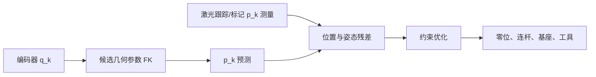
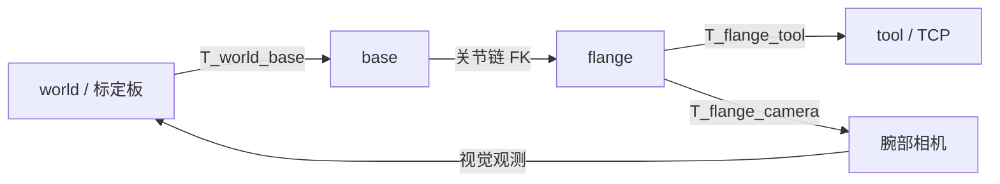

# 第三章：运动学参数辨识

运动学辨识只关心“关节角给定时，刚体应该在哪里”。它应先于动力学辨识完成，因为几何误差会被动力学优化器错误地吸收成质量或摩擦。

## 3.1 关节链参数的完整清单

对每个关节记录：类型（revolute/prismatic/continuous）、父子链接、轴方向、DH 参数 \(a_i,\alpha_i,d_i,\theta_{0,i}\)、编码器零位、旋转正方向、软硬限位和 mimic 关系。URDF 不一定显式使用 DH，但这些量都能映射到 `origin xyz/rpy`、`axis` 和 `limit`。

### 3.1.1 每个运动学字段到底控制什么

| 参数 | 操作定义 | 真机上怎么获得 | 错了会看到什么 |
|---|---|---|---|
| 关节类型 | 关节产生旋转还是平移 | 机械图纸和单关节动作 | 位姿变化模式完全不对 |
| 轴向量 | 子链接绕父链接哪条单位轴运动 | CAD 轴线或小角度差分 | 单关节运动方向倾斜或串轴 |
| `origin xyz` | 父链接坐标到关节原点的平移 | CAD 初值加外部标定 | 末端误差随臂展增长 |
| `origin rpy` | 关节零位时父子坐标的固定旋转 | CAD 装配关系 | 多关节组合时方向错 |
| 零位偏移 | 编码器读数为零时的真实几何角 | 标定姿态或外部测量拟合 | 误差随该关节转动呈周期变化 |
| 正方向 | 正命令是否符合模型右手定则 | 低速点动 | 目标和反馈符号相反 |
| 软硬限位 | 控制器与机械止挡允许的范围 | 规格书加低速验证 | 仿真产生真机不可达姿态 |
| mimic 比例/偏移 | 从动关节相对主动关节的线性关系 | 夹爪同步慢扫 | 两指间距或对称性错误 |
| base 外参 | 世界/桌面到机器人基座的位姿 | 测量基座标记 | 所有末端姿态整体偏移 |
| tool 外参 | 法兰到 TCP 的位姿 | 枢轴标定、工具 CAD | 换姿态时 TCP 绕法兰画圆 |
| 相机外参 | 相机到 base 或 tool 的位姿 | 手眼标定 | 视觉目标与机械位置不重合 |

DH 参数是描述同一几何链的一种紧凑方式，不是 URDF 之外额外的一套物理量。标准 DH 和改进 DH 的乘法顺序不同，必须在参数文件里写明 convention；只给一张 \(a,\alpha,d,\theta\) 表而不注明 convention，数值不能安全复用。

$$
T_{0n}(q)=T_{\text{base}}\prod_{i=1}^{n}T_i\bigl(q_i+\theta_{0,i};a_i,\alpha_i,d_i\bigr)T_{\text{tool}}
$$

**这个公式在做什么**：把基座、每个关节的几何变换和工具坐标依次相乘，得到末端在世界坐标中的位姿。

::: details 📐 公式详解（点击展开）
| 子表达式 | 它是谁 | 它在干嘛 |
|---|---|---|
| \(T_{\text{base}}\) | 基座搬运器 | 把机器人根坐标放到测量世界中 |
| \(T_i\) | 第 \(i\) 节关节变换 | 编码连杆长度、扭转角和当前关节运动 |
| \(q_i+\theta_{0,i}\) | 实际几何角 | 把编码器读数转换为模型零位下的角度 |
| \(T_{\text{tool}}\) | 工具搬运器 | 从法兰坐标转换到夹爪尖端或力传感器中心 |

**用人话读**：从世界原点开始，沿着每节连杆和关节一路走到工具尖端，每一步都乘上对应的位姿变换。

**为什么是这个形式**：变换顺序就是机械装配顺序；零位放在关节变量内部，工具外参放在链尾，才能分别替换编码器标定和末端工具而不改整条链。
:::

## 3.2 多姿态标定实验

在末端安装刚性标定球或 AprilTag 板，用外部测量系统得到末端位置 \(p_k^{meas}\)。让机器人覆盖不同肘部构型和腕部姿态，记录 \(q_k\)。优化目标是所有姿态的几何残差，而不是只拟合一条轨迹。

先固定一个基准连杆长度或基座姿态，避免整条链存在坐标规范的自由度；再逐步放开参数。对于相机外参，使用至少 20 个覆盖视场的标定板姿态，并把相机时间偏移作为单独变量检查。

### 3.2.1 从 CAD 初值到标定结果的完整步骤

1. 从 CAD/URDF 导出名义几何，统一为米和弧度，并保存不可修改的 baseline。
2. 用单关节点动确认拓扑、索引、轴方向和正负号；这些离散错误不交给连续优化器处理。
3. 固定 base 外参和 tool 外参，只估编码器零位，消除最大的装配偏差。
4. 加入连杆平移和固定旋转参数，使用全部多姿态数据拟合。
5. 放开 base 与 tool 外参，但固定一个坐标规范，例如把 base 的 z 轴锁为重力方向。
6. 对参数增量设置制造公差约束，例如连杆长度只能偏离 CAD 数毫米，禁止优化器把 5 cm 的外参错误塞进连杆长度。
7. 在 validation 姿态上计算位置和姿态误差；若只训练误差下降，回到第 4 步减少自由参数或增加姿态。
8. 在 test 姿态上只评估一次，输出最终报告和参数版本，不再依据 test 误差调参。

优化每轮的状态转移也要明确：读取上一轮参数，用当前参数计算全部预测位姿，形成位置和旋转残差，求一个受约束的参数增量，更新参数，再检查验证误差和步长。若增量连续变小但验证误差仍有结构，说明模型缺项或测量偏置尚未处理，而不是“需要更多迭代”。

## 3.3 基座、工具和手眼标定如何分开

基座外参把机器人放进房间，工具外参定义真正执行任务的 TCP，相机外参把像素射线放进机器人坐标。三者都表现为一个刚体变换，但数据来源不同：

> 闭环中的变换乘积能解释标定板观测。若同时自由估计所有变换而没有固定 world/base 的规范，多个解会同样好；至少固定一个已知变换或加入独立基座测量。

工具中心点可以用枢轴标定：让工具尖端固定在同一个物理孔位，改变腕部姿态，拟合法兰到固定点的偏移。眼在手上的相机用多组“机械臂运动 + 标定板观测”做手眼标定；眼在手外的相机则估计 world 到 camera。两类方程方向不同，配置名中应直接写 `T_flange_camera` 或 `T_world_camera`，不要用模糊的 `camera_pose`。

## 3.4 角度零位和方向的快速诊断

让每个关节在低速正负往返，比较模型和编码器的符号。若所有姿态都出现固定方向的末端偏移，优先检查基座/工具外参；若误差随关节角周期性变化，检查零位和连杆长度；若只在反向时跳变，检查回差和编码器量化。

## 3.5 运动学验收指标

分别报告位置 RMSE、最大误差、姿态角误差和不同构型分位数。不要只报平均值：工作空间边缘和腕部奇异附近往往是最大误差，正是仿真策略最容易失效的位置。

验收时至少画四张残差图：误差对每个关节角、误差对末端距离、误差对工具姿态、预测点与测量点的三维散点。若更换工具后只需更新 `T_flange_tool` 就能保持连杆参数不变，说明参数层级划分合理。
