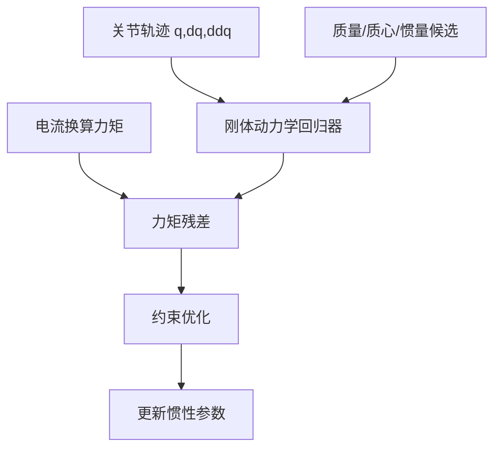

# 第五章：刚体动力学与接触参数

运动学决定“在哪里”，动力学决定“需要多大力矩”。质量、质心和惯量必须通过改变姿态与加速度来激励；接触参数则要用专门的推、滑、落实验辨识，不能从自由空间轨迹反推。

## 5.1 惯性参数的物理含义

每个刚体至少需要质量 $m$、质心 $c$ 和关于质心的惯量矩阵 $I_c$。URDF 的 `<inertial>`、MuJoCo 的 `mass`/`inertia`、Isaac 的刚体属性必须表达同一坐标系下的同一组量。惯量矩阵要满足对称和正定约束。

质量决定同一加速度需要多少合力，质心决定重力和外力产生多大力矩，惯量决定刚体对不同旋转轴加速度的抵抗。CAD 可提供可靠初值，但线缆、传感器、螺钉和工具经常没有建模，因此必须用称重或动态数据校正。

### 5.1.1 惯性字段的坐标陷阱

| 字段 | 必须相对于什么 | 常见错误 |
|---|---|---|
| mass | 与坐标无关的标量 | 把克写成千克 |
| center of mass | link/inertial 坐标原点 | 当成世界坐标 |
| inertia tensor | 指定坐标轴、通常关于质心 | 使用关于 CAD 原点的惯量却不做平行轴变换 |
| principal axes | 惯量主轴相对 link 的旋转 | 只抄三个主惯量，丢掉轴旋转 |

如果仿真格式只接受对角惯量，必须同时写入惯性坐标的旋转，使其轴与主惯量轴重合。直接删掉非对角项会改变真实转动耦合。

## 5.2 负载和姿态的组合实验

准备至少两个已知质量、已知安装位置的负载，在不同伸展程度和关节组合下执行多正弦轨迹。空载与挂载的差异主要激励末端负载的质量和质心；改变肘部姿态则更容易激励连杆惯量耦合。

把重力补偿误差、加速度段误差和匀速段误差分开看：重力相关残差随姿态变化，惯量相关残差随加速度变化，摩擦相关残差随速度方向变化。三者混在一个总 RMSE 里会掩盖问题。

参数估计应以“基参数”或受约束的完整惯性参数进行。串联机械臂的某些单连杆参数只能以组合形式影响关节力矩；若数据只能确定组合，就报告组合参数，不要给每个连杆伪造看似精确的独立质量。

## 5.3 接触参数的独立辨识

接触实验至少包含：不同速度落下测恢复系数，水平推滑测动摩擦，缓慢按压测法向刚度，重复接触测阻尼和力传感器偏置。记录接触前后的相对速度、法向力、穿透深度和接触持续时间。

仿真接触刚度过大时，接触时间会过短并激发高频振动；过小时，物体明显“陷入”桌面。先用单点接触复现力-位移曲线，再验证多点抓取，避免把碰撞检测误差误认为材料参数。

### 5.3.1 四个接触实验分别估什么

1. **斜面临界滑动**：缓慢增加斜面角度，物体刚开始滑动的角度给静摩擦初值。
2. **水平恒速推滑**：在多个法向载荷下测稳定切向力，给动摩擦及其载荷依赖。
3. **小高度落下**：从多个高度落下刚体，比较碰撞前后的速度，给恢复系数和冲击阻尼。
4. **准静态按压**：沿法线缓慢压入软接触，记录力和位移，给接触刚度及非线性指数。

接触几何要先于材料参数检查。凸包过粗、网格法线反向、碰撞体与视觉体不重合，都会让材料参数优化出不合理的补偿值。

## 5.4 温度和载荷变化

电机电阻、摩擦和力传感器零偏会随温度漂移。把温度记录作为协变量，至少在冷机和热机各采一组验证轨迹。若无法在线更新参数，仿真中应围绕辨识中心值做窄范围随机化，并在报告中注明随机化覆盖的物理含义。
