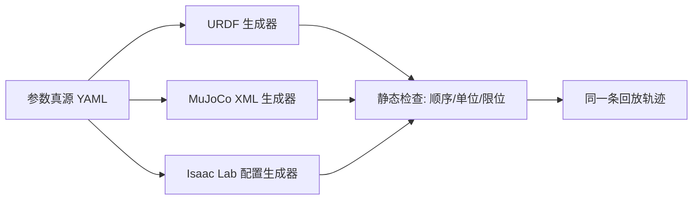

# 第七章：写回仿真与本体对齐

辨识结果只有写进仿真并通过独立轨迹验证才算完成。最常见的失败不是参数估计错，而是单位、坐标系、关节顺序或控制接口映射错。

## 7.1 建立单一参数真源

用一个版本化 YAML/JSON 保存参数，包含单位和坐标系名称，再生成 URDF、MuJoCo XML 和 Isaac Lab 配置。禁止三套文件手工复制数值，否则下一次标定很容易只更新其中一套。

参数文件应把用户可调的物理量和仿真器从物理量推导的数值系数分开。关节索引、轴、零位、惯性和控制器都带单位或来源；例如 `command_delay_s` 是可测的时延，仿真器需要的整数延迟步应由生成脚本按当前控制周期计算，不能把步数保存成跨配置的物理参数。

## 7.2 坐标系和单位检查

明确 `world`、`base`、每个 `link`、`flange`、`tool`、`camera` 和 `contact` 坐标系。所有长度统一用米、角度统一用弧度、时间统一用秒；导入 Blender 或 CAD 时尤其要检查毫米到米的缩放。随机抽一个关节角，用真机测得的末端点手工算一遍变换，确认轴方向和右手系。

## 7.3 关节接口对齐

建立三张表：策略动作索引到仿真关节索引、编码器索引到模型索引、仿真控制量到驱动器命令。每张表都写出符号、零位、缩放、限位和 gripper/mimic 规则。用“只动第 j 个关节”的回放检查串位；这是比看整机视频更快的诊断方法。

| 对齐层 | 真机侧 | 仿真侧 | 最小测试 |
|---|---|---|---|
| 关节名与索引 | 驱动器总线顺序 | articulation DOF 顺序 | 单关节点动 |
| 方向与零位 | encoder sign/offset | joint axis/origin | 正负 0.1 rad |
| 动作语义 | position/velocity/torque | drive target/effort | 恒定小命令 |
| 动作尺度 | rad、rad/s、Nm 或归一化 | 仿真 SI 单位 | 边界值回放 |
| 夹爪耦合 | 主动指/从动指关系 | mimic/tendon | 全开全闭慢扫 |
| 观测顺序 | state vector schema | policy observation schema | 注入唯一数值序列 |

“注入唯一数值序列”是给第 j 个观测维度写入只有它拥有的测试值，经过预处理后检查策略输入位置，用来抓住左右臂交换和夹爪维度错位。

## 7.4 控制器和仿真步进

仿真的 `dt`、控制 decimation、PD 刚度阻尼、动作保持方式必须对应真机控制周期。若真机接收位置目标后在驱动器内部运行 1 kHz 电流环，仿真应使用等效的内环或经过辨识的二阶响应，而不是把策略的 20 Hz 输出直接当理想力矩。

## 7.5 本体视觉对齐

相机内参（焦距、主点、畸变）和外参（相对 base/tool 的位姿）分别标定。回放同一帧图像时，检查仿真投影的标记点像素误差；像素误差大但末端几何误差小，说明问题在内参或时间偏移，不要再改 DH 参数。

## 7.6 接触与求解器设置

先对齐地面高度、碰撞网格和摩擦，再调接触刚度/阻尼，最后才改求解器迭代次数和稳定化参数。求解器参数是数值设置，不是物理参数；把它们当成物理参数拟合会让模型只在某个步长下有效。

### 7.6.1 写回后的冒烟测试

1. 零重力静态检查：关节链不应自行跳变，视觉体与碰撞体重合。
2. 开重力、关控制器：自由落体方向和关节限位正确。
3. 开控制器、发保持命令：静态下垂与真机一致且不振荡。
4. 单关节小阶跃：检查索引、方向、时延、上升时间和超调。
5. 全身无接触回放：检查惯量耦合和动作饱和。
6. 单物体接触：检查地面高度、摩擦和接触力。
7. 同一策略闭环：确认图像、状态和动作接口都未绕过参数真源。
