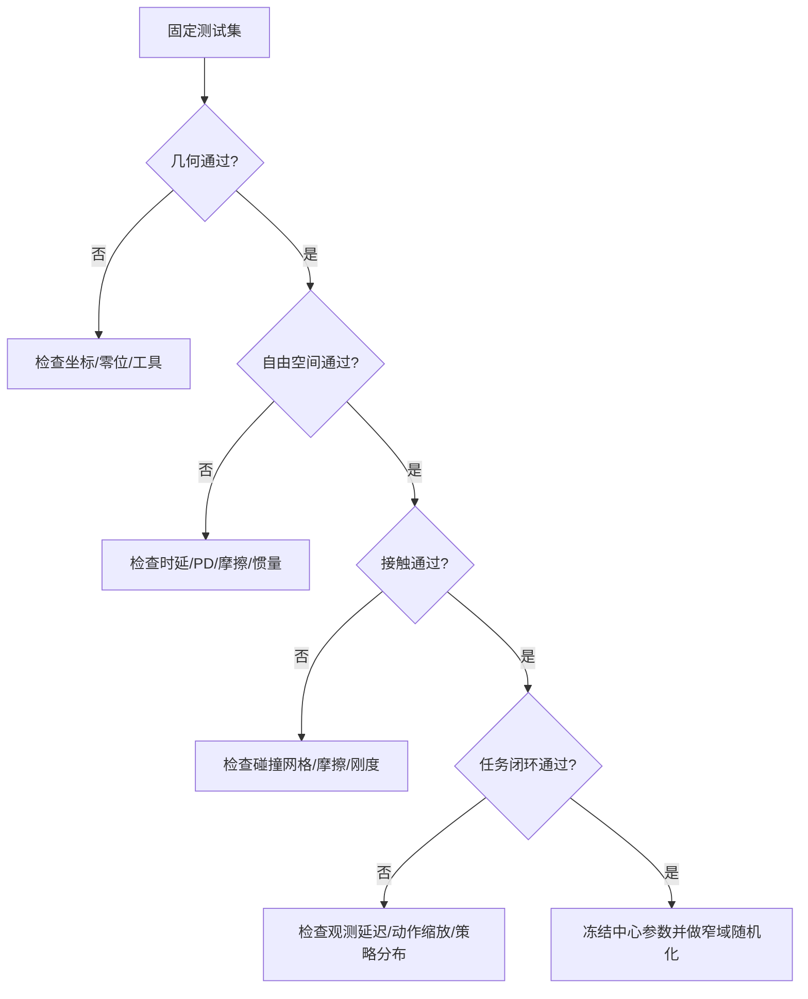

# 第八章：验证闭环与故障定位

验证要回答两个问题：仿真是否复现了真机的状态轨迹，策略是否因此获得了可迁移的行为。只看任务成功率会把几何误差、时延误差和偶然成功混在一起。

## 8.1 四层验证矩阵

| 层级 | 输入 | 对比量 | 通过标准示例 |
|---|---|---|---|
| 几何 | 静态多姿态 | 末端位置/姿态 | 位置 RMSE < 2 mm |
| 自由空间动态 | 无接触回放 | q、dq、电流 | 95% 时间点误差在阈值内 |
| 接触动态 | 推、滑、抓取 | 接触时刻、法向力、穿透 | 接触时刻误差 < 30 ms |
| 任务闭环 | 相同策略和随机种子 | 成功率、失败类型 | 与真机差距 < 5 个百分点 |

## 8.2 残差形状比单个数字更有用

把残差按关节、姿态、速度、方向和时间画出来。固定偏移通常指向零位或外参；随速度变号指向库仑摩擦；随加速度变号指向惯量；只在接触瞬间爆发指向碰撞或时延。每次只修改一个参数组，并在同一测试集上比较前后结果。

| 残差形状 | 首查参数 | 用什么实验确认 |
|---|---|---|
| 所有姿态近似同一方向偏移 | base/tool 外参 | 静态多姿态 |
| 随某关节角呈周期变化 | 该关节零位或连杆尺寸 | 单关节全范围慢扫 |
| 正反向偏差符号相反 | 库仑摩擦、回差 | 等速往返 |
| 高加速度段明显，匀速段较小 | 质量、惯量、带宽 | 多幅值加速度轨迹 |
| 全轨迹固定时间平移 | 通信/控制时延 | 阶跃互相关 |
| 接触前一致、接触后分叉 | 接触几何、摩擦、刚度 | 单点按压/推滑 |
| 图像错位但 FK 正确 | 相机内外参、曝光时间 | 重投影与闪光同步 |

一次修改只针对一行假设，并保存 before/after 残差图。多个参数组同时调整即使指标变好，也无法知道哪个改变有效。

## 8.3 失败案例的最小复现

任务失败时保存失败前 2 秒和后 1 秒的真机/仿真同步片段，包含图像、关节状态、动作和接触力。先用开放环动作回放复现，再打开策略闭环；开放环都复现不了，问题在本体模型，闭环才失败则检查观测和动作接口。

验证状态必须按固定顺序推进：重置到同一初始状态，读取同一条输入，执行一个控制周期，记录预测与真机状态，更新误差累计器，再进入下一周期。每一步都强制写入真机状态是 one-step prediction；让仿真自行滚动则是 closed-loop rollout。前者定位局部模型误差，后者暴露长期漂移，两种指标不能混用。

## 8.4 参数版本的放行规则

新参数只有同时满足三项才进入策略训练：validation/test 指标不退化，所有参数满足物理约束，至少一条真实任务轨迹的失败模式没有新增。放行后冻结中心参数；域随机化范围来自 bootstrap 置信区间、温度漂移和批次差异，而不是随手给每个参数乘 0.8 到 1.2。

## 8.5 最终交付清单

1. 参数真源及版本号，所有字段有单位和坐标系。
2. 原始数据、清洗脚本、训练/验证/测试切分和随机种子。
3. 运动学、动态、接触四层指标及残差图。
4. 真机固件、控制周期、仿真步长和求解器配置。
5. 尚未辨识参数的固定值、置信区间和域随机化范围。

当这五项齐全时，仿真才是可审计的“数字本体”，而不是一份只能在当前机器上运行的 XML 文件。
