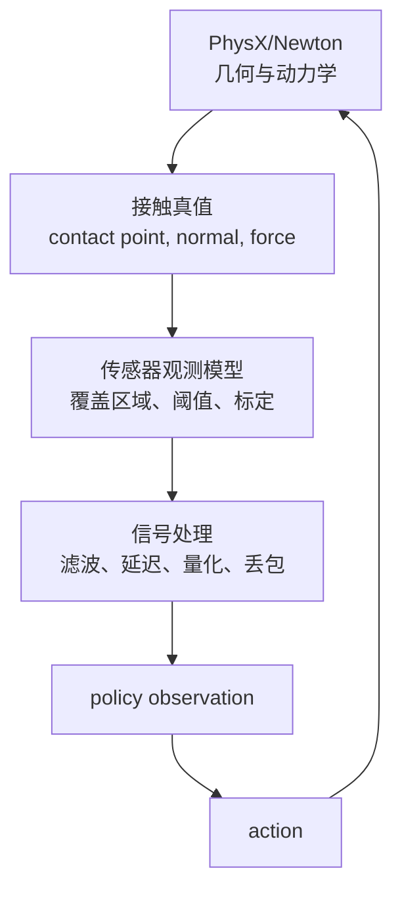

# 触觉仿真全景：真值、观测与策略接口

## 触觉到底在模拟什么

案例是双指夹爪抓住销钉并插孔。求解器知道销钉和指腹的几何重叠、接触法向、冲量和摩擦力；真实传感器却只给出电阻、电压或图像。两者之间隔着一个“观测模型”。把这层省略，策略会偷看真值，在仿真中成功、真机上失效。

> 真值只存在于训练时的仿真后端；部署接口只能消费观测模型的输出。Critic 可以读取真值，Actor 不应读取真值。

## 三种信号表示

**二值接触**把每个触觉单元表示成“是否超过阈值”。它适合全手铺设和接触检测，跨域差距小，但丢失力大小和几何细节。

**低维力/力矩**把一片区域聚合成三轴力和三轴力矩。它计算便宜，适合阻抗或抓取稳定性控制；代价是不同接触分布可能产生相同合力。

**视触觉图像或深度图**保留空间结构，可推断滑移和局部几何。TacSL 用深度到 RGB 的标定映射加速生成，TacMap 则直接使用几何一致的穿透深度表示。

## 时间、坐标和单位必须先定

触觉读数要绑定三个元数据：采样时间戳、传感器坐标系、单位。物理步可能是 240 Hz，触觉相机是 30 Hz，策略是 20 Hz；若只按渲染帧读取，策略会随机看到旧数据。推荐在 observation 中附带“最近一次更新距当前物理步数”，或明确使用固定保持（zero-order hold）。

传感器坐标系应固定在安装 link 上。接触法向从世界系转换到传感器系后，策略才能学习“向指尖法向施力”而不是“向世界 Z 轴施力”。所有力值统一为 N，力矩统一为 N·m，长度统一为 m。

## 训练时谁能看什么

Actor 输入真实部署可得到的关节状态、触觉观测和历史；Critic 可额外读取物体位姿、每个接触点的力和材质参数。这是非对称 Actor-Critic 的边界。把物体真值拼进 Actor 是信息泄漏，不是“帮助训练”。

## 本章落地清单

1. 画出“后端真值→观测模型→策略”的数据流，并为每条边写清单位和频率。
2. 为每个触觉单元记录挂载 link、局部坐标、有效面积和读数阈值。
3. 将策略输入和 Critic 特权输入分成两个字典，代码层面禁止交叉引用。
4. 用一个静态压块场景先验证坐标、符号和时间戳，再进入 RL。
