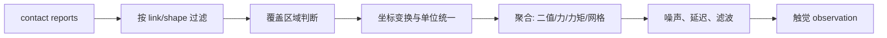

# 接触真值到触觉读数：接触力学与传感器模型

## 先把真值变成可解释的量

对于每个接触点，仿真器通常给出接触位置 `p`、法向 `n` 和接触力 `f`。传感器只覆盖一块区域，因此需要先判断接触点是否落在覆盖区，再把力转换到传感器坐标系，最后施加阈值、噪声和带宽限制。

## 聚合力和力矩

当策略只需要一个六维读数时，所有覆盖区域内接触点的力要合成为一个传感器读数。位置向量 `r_i` 是接触点相对传感器原点的向量，叉乘项表示该力对原点的旋转作用：

$$
\mathbf F=\sum_i\mathbf f_i,\qquad \boldsymbol\tau=\sum_i(\mathbf r_i\times\mathbf f_i)
$$

**这个公式在做什么**：把多个局部接触压缩成传感器原点处的一对合力和合力矩，同时保留“推了多大力”和“力作用在哪一侧”这两种信息。

::: details 📐 公式详解（点击展开）

| 子表达式 | 它是谁 | 它在干嘛 |
|---|---|---|
| `f_i` | 第 i 个接触点的力 | 提供局部推力方向和大小 |
| `sum f_i` | 合力 | 传感器整体受到的平移作用 |
| `r_i x f_i` | 力矩贡献 | 把偏心接触转换成旋转趋势 |
| `sum` | 聚合器 | 将多个接触点累加到同一坐标原点 |

**用人话读**：把每个接触点的推力相加，再把偏离中心的推力换算成扭转作用。

**为什么是叉乘**：只有力的切向分量和偏心距离会造成旋转；沿着 `r_i` 方向的力不会绕原点产生力矩。
:::

## 二值单元的阈值不是物理常数

对第 j 个单元，先求覆盖区域内法向力的绝对值或最大值，再与阈值比较。阈值应来自真机噪声底和最小可检测力，而不是随手写成 0.01 N。训练时可随机化阈值、漏检概率和响应延迟，模拟传感器老化与接线差异。

## 力阵列的空间映射

将传感器表面离散成 `H x W` 单元，每个单元维护中心位置和面积。接触点按最近邻或双线性权重分配到单元；分辨率越高，几何信息越丰富，但 GPU 内存和策略编码器计算量也线性增加。对接触丰富任务，先用 8x8 或 10x10 验证，再扩大分辨率。

## 关键边界

- 法向力符号要统一：规定“压入传感器”为正，或在驱动层统一取绝对值。
- 同一接触可能跨多个 shape，过滤时按传感器 link 而非物体名称。
- `dt` 改变会改变阻尼项和接触冲量，不能只改控制频率而不重新标定读数。
