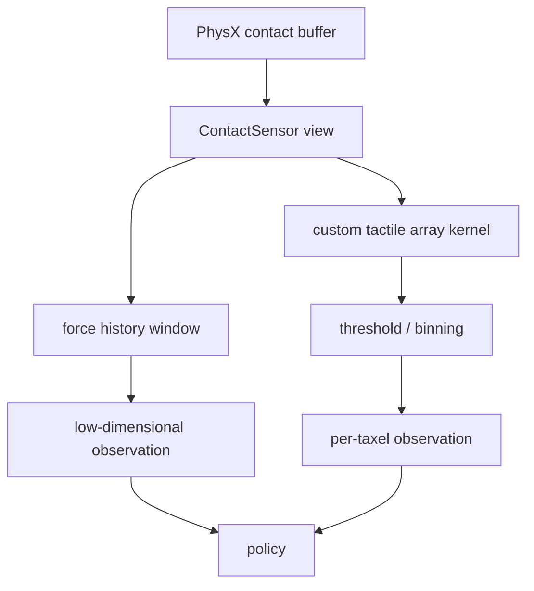
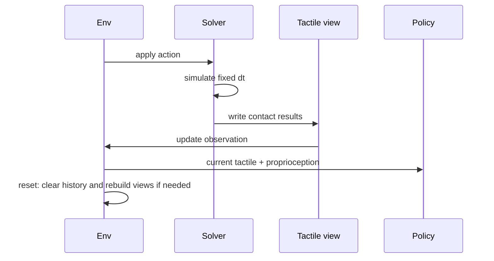

# Isaac Lab 实现：Contact Sensor 与自定义触觉阵列

## 选择内置传感器还是自己聚合

Isaac Lab 的 Contact Sensor 适合“某个 body 在最近窗口内受到多少接触力”这类低维读数；它不等价于视触觉相机，也不会自动知道凝胶的光学形变。若需要 16 个指腹单元或 10x10 力场，就保留一个传感器 link，并在 GPU 张量上按单元位置做二次聚合。



## 配置传感器

下面的骨架声明传感器挂在指腹 link 上，记录接触力历史。先这样做是为了确认 link 路径、单位和符号都正确，再增加自定义阵列；否则问题会被大量张量索引掩盖。

```python
from isaaclab.sensors import ContactSensorCfg

contact_cfg = ContactSensorCfg(
    prim_path="{ENV_REGEX_NS}/Robot/finger_.*",
    history_length=3,
    update_period=0.0,
    track_air_time=True,
)
```

`history_length` 只保存最近三次物理更新，不代表策略一定看到三帧；策略侧还要明确拼接顺序。`update_period=0` 表示每个物理步更新，若策略低频运行，可在环境层固定保持最新读数。

## 接入 observation

接入 observation 前先决定是否做归一化。力值除以额定量程，角度按机器人关节范围缩放，二值信号保持 0/1。归一化常数应写入配置并随 checkpoint 保存，不能在真机端重新猜。

```python
def tactile_observation(sensor, force_scale=20.0):
    # 读取最新合力；具体字段名随 Isaac Lab 版本核对
    force_w = sensor.data.net_forces_w[:, 0, :]
    force_local = force_w  # 若传感器有旋转，应先乘 world->sensor rotation
    return (force_local / force_scale).clamp(-1.0, 1.0)
```

这段代码只实现低维基线。自定义阵列的实现应在 `force_w` 之后完成：为每个 taxel 保存局部中心，将接触点索引映射到最近 taxel，再用 `scatter_add` 聚合，避免 Python 逐环境循环。张量形状建议固定为 `[num_envs, num_taxels, channels]`，这样策略网络和日志工具都不会因触觉单元数量改变而隐式重排。

## 时间顺序和 reset



动作在 pre-step 写入，触觉在 solver 完成后读取。reset 时清空历史缓冲，否则新 episode 的第一帧会混入上一回合的接触力。

## 高频接触的工程取舍

接触传感器和策略不必同频。物理 240 Hz、传感器 120 Hz、策略 30 Hz 是常见组合；传感器频率太低会漏掉冲击，太高则增加日志和网络负担。把“物理频率、传感器更新周期、策略控制周期”分别记录在实验配置中，才能解释迁移差异。
