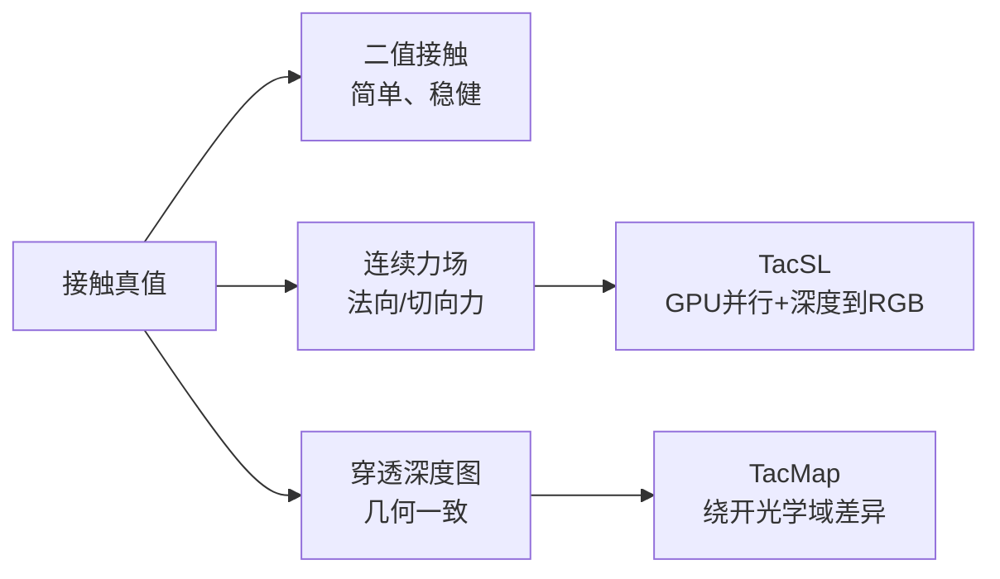

# 视触觉与 GPU 方法：TacSL、TacMap 及表示选择

## 三条路线解决三个不同瓶颈

Touch Dexterity 证明了二值信号足以支持部分手内操作；TacSL 面向需要图像和连续力场的任务；TacMap 直接把仿真和真机都映射到穿透深度表示。选择表示时，先问策略真正需要“接触存在”“力大小”还是“接触几何”，不要默认 RGB 信息越多越好。

## TacSL 的关键工程思想

TacSL 把视触觉仿真放入 GPU 物理循环：接触阶段得到穿透深度和法向，触觉表面采样点并行查询 SDF，再用标定映射把深度转成 RGB。相比把每个环境的数据拷回 CPU 再渲染，这种方式减少了设备往返，适合在线 RL。

TacSL 的“深度到颜色”可以写成一个接口关系：`rgb = lookup(depth)`。查找表不是通用物理定律，而是真实传感器标定得到的观测模型；换一款凝胶、LED 或相机，就必须重新标定。这里最重要的边界是：SDF 负责几何，查找表负责外观，二者不能互相替代。

## TacMap 为什么放弃 RGB

RGB 对光照、曝光、凝胶纹理和相机白平衡敏感。TacMap 采用几何一致的穿透深度图，让仿真和真实传感器共享更接近的中间表示。它牺牲了部分外观信息，却减少了策略学习“颜色差异”的负担。若真机能稳定估计接触形变，几何表示通常比未经校准的 RGB 更容易迁移。

## 表示选择表

| 表示 | 计算 | 迁移风险 | 典型任务 |
|---|---|---|---|
| 二值 | 最低 | 低 | 接触检测、全手覆盖 |
| 6D 力/力矩 | 低 | 中 | 阻抗、抓取稳定 |
| 力阵列 | 中 | 中 | 滑移方向、局部压力 |
| RGB 视触觉 | 高 | 高 | 精细几何、标记点跟踪 |
| 穿透深度图 | 中 | 中低 | 几何对齐、插入 |

## 一个可操作的决策流程

1. 用二值信号做任务可行性基线。
2. 若奖励依赖力大小，增加低维力或力阵列。
3. 若策略需要接触形状，再比较深度图与 RGB；只有真机标定和渲染预算都足够时才上 RGB。
4. 用相同的策略骨干和控制周期做 ablation，避免把表示差异和网络容量差异混在一起。
