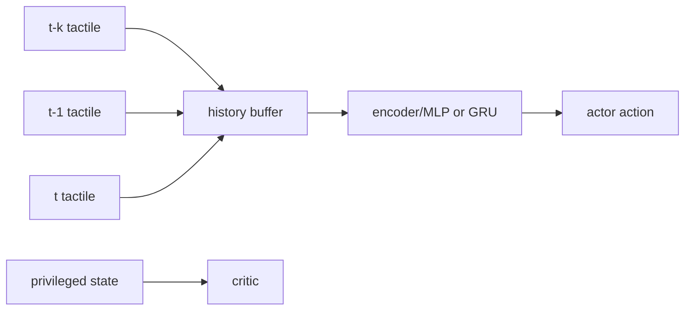
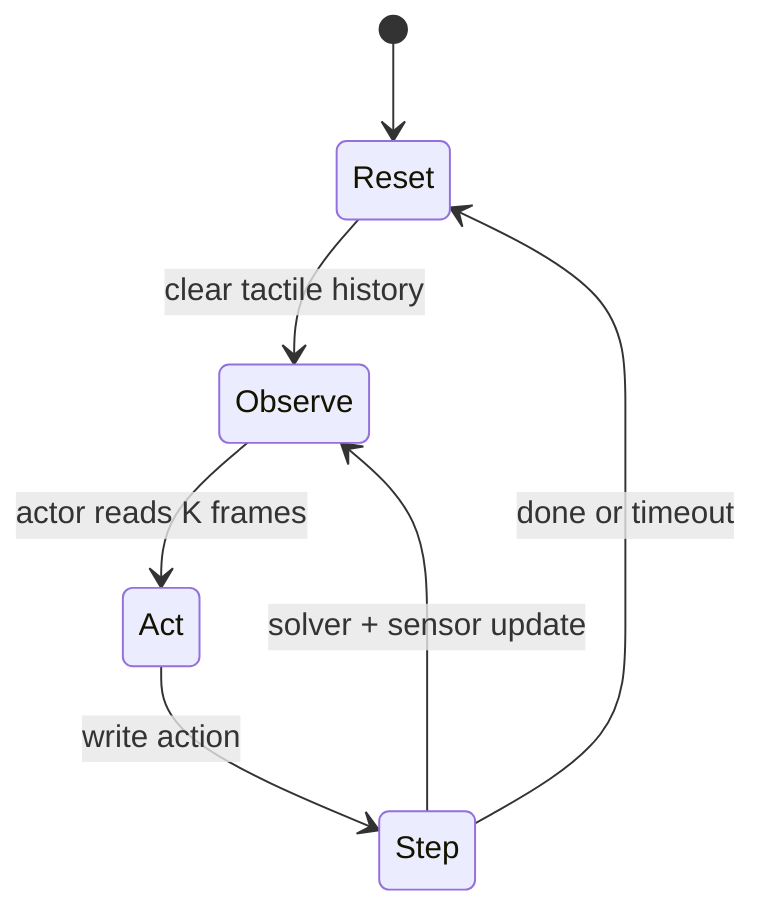

# 触觉策略训练：时间堆叠、蒸馏与接触丰富任务

## 触觉是部分可观测的

销钉刚碰孔壁时，一帧触觉图无法区分“正在滑入”还是“正在滑出”。因此 observation 要带历史，或者使用带隐藏状态的时序编码器。最简单的时间堆叠是把最近 K 帧沿通道拼接；K 应覆盖一次接触变化，而不是盲目增大。

## 三种训练起点

**直接 PPO** 让 Actor 从触觉观测探索。适合奖励密集、接触容易发生的任务；插入任务常因随机策略撞击或放空而没有有效学习信号。

**专家蒸馏**先用物体位姿等特权状态训练低维专家，再用行为克隆或 DAgger 教触觉策略。它把“找到正确接触行为”和“从触觉恢复状态”拆开。

**AACD 风格热启动**先复用低维 Critic，再让高维 Actor 训练。Critic 不应永久冻结，因为高维策略访问的状态分布会逐渐偏离专家轨迹。

## 奖励要围绕可测目标

插入任务的奖励可由孔口距离、姿态误差、插入深度和碰撞冲击组成。接触力惩罚不能简单设得极大，否则策略会学会“永远不接触”。合理做法是对超出安全区间的力施加惩罚，对完成插入给予一次明显的终止奖励，并记录各项奖励的量级。

## 训练循环的状态转换

历史缓冲必须在 reset 清零；否则策略会把上一回合的“接触记忆”当成当前状态。训练日志至少保存成功率、最大接触力、接触持续时间和触觉延迟，而不是只看总回报。

## 训练前先做观测可辨识性检查

固定物体位姿，只改变接触点位置，检查触觉观测是否发生预期变化；固定接触点，只改变法向力，检查力通道是否单调变化。若这些最小测试都不成立，增加网络层数不会修复传感器模型。
