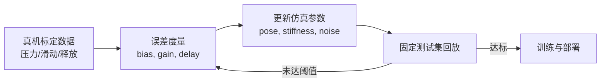

# 仿真到真机对齐：标定、延迟、噪声与随机化

## 对齐不是把一个刚度调到“看起来像”

触觉迁移至少有四个误差源：几何安装、力学参数、电子读数、时间链路。对齐应按“测量→拟合→验证”的顺序推进；直接扩大随机化范围会掩盖坐标或单位错误。

## 四步标定流程

**几何标定**：用已知尺寸的压块在传感器中心和四角接触，检查 taxel 索引、法向方向和覆盖范围。相机式传感器还要标定内参、畸变和无接触背景图。

**静态增益**：施加 0、1、2…N 的已知载荷，拟合传感器输出到力的比例和偏置。仿真侧的 `force_scale` 应由这条曲线决定，不能沿用机械臂末端力传感器的比例。

**动态延迟**：用阶跃压入或快速释放记录命令时间、物理接触时间和传感器响应时间。把延迟拆成控制发送、求解、传感器采样和策略读取四段，分别记录时间戳。

**噪声与丢包**：在无接触和恒定载荷下采样，估计噪声标准差、漂移和异常值比例。对二值传感器还要测漏检率和误触发率。

## 随机化应围绕测量分布

仿真参数随机化不是越宽越好。对每个参数保存真机估计的均值、方差和物理上下界；训练分布覆盖测量不确定性，并保留一组未见过的组合用于验证。优先随机化影响最大的参数：接触摩擦、传感器阈值、延迟、安装位姿和相机曝光。

## 观测处理要在两边共用

真机驱动和仿真环境应复用同一个处理模块：单位转换、坐标变换、低通滤波、裁剪、归一化、时间堆叠都只实现一次。若仿真用“原始力”，真机用“滤波后的电压”，策略看到的不是同一种观测。

## 低通滤波的取舍

滤波能降低噪声，却会增加相位延迟。接触冲击检测应保留一条未滤波或高频通道，稳定抓取控制可使用低通通道。把截止频率和滤波器状态纳入 episode reset，避免滤波器残留上一回合状态。

## 对齐的停止条件

不要用“视频看起来相似”作为停止条件。至少定义：静态力偏差、阶跃响应延迟、接触位置分类准确率、单回合最大冲击力和策略成功率五个指标，并为每个指标设阈值。任何一个指标超限，都应回到对应的测量环节定位原因。
