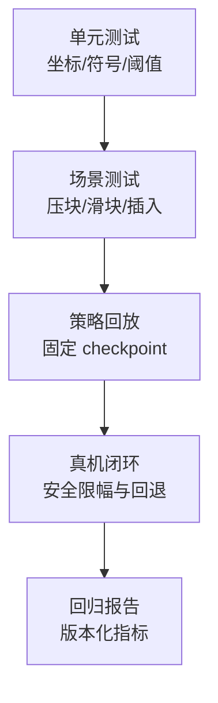

# 验证与排错：从单接触测试到闭环回归

## 四层测试金字塔

越靠下越接近真实、成本越高。先在上层排除确定性错误，再把有限真机时间用于物理和传感器差异。

## 单元测试必须覆盖什么

- 坐标：世界系中沿传感器法向压入，局部坐标的法向通道应为正。
- 叠加：两个对称接触的合力矩应相互抵消；偏心单点应产生预期方向的力矩。
- 阈值：零力不触发，超过阈值触发，边界值行为固定并写进测试。
- 时间：动作写入后第几个 physics step 出现接触，传感器延迟是否符合配置。
- reset：新 episode 第一帧历史全零，旧接触力不残留。

## 三个最小场景

**压块场景**只验证法向力、增益和噪声；**滑块场景**验证切向摩擦、滑移方向和延迟；**插入场景**验证多接触、姿态修正和冲击上限。每个场景都保存随机种子、物理步数和原始接触报告，保证失败可重放。

## 常见症状到原因的映射

| 症状 | 优先检查 |
|---|---|
| 所有 taxel 都为零 | prim 路径、shape 过滤、传感器是否在 post-step 更新 |
| 力方向反了 | world→sensor 旋转、法向符号约定 |
| 仿真比真机快一拍 | 控制发送/传感器读取时间戳、history 对齐 |
| 插入时仿真不撞、真机猛撞 | 摩擦、接触刚度、控制周期和安全限幅 |
| 第一回合成功、后续失败 | reset 没清空历史或缓存了失效 view |
| RGB 迁移差、深度图迁移好 | 光照/材质域差异，改用几何表示或增强标定 |

## 回归报告的最小字段

每次修改记录 Isaac 版本、资产 hash、solver 配置、dt、传感器配置、随机种子、checkpoint、五项对齐指标和失败轨迹路径。报告同时保存仿真原始真值与策略实际 observation，方便判断是物理错、观测错还是策略错。

## 安全闭环

真机评测必须在策略外增加独立安全层：力矩/速度/位置限幅、接触冲击阈值、急停和动作超时回退。触觉仿真用于学习和验证，不能替代硬件急停或经过认证的安全控制器。

## 系列总结

一条可靠路线是：先用内置接触力做二值基线，再增加低维力和空间阵列，最后按需引入 TacSL 或 TacMap 的视触觉表示；每一步都通过固定场景和真机数据回归。真正的 Sim-to-Real 不是一次迁移，而是“测量误差、更新模型、重跑验证”的循环。
