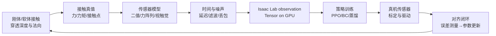

# 触觉仿真深度解析：从接触力到 Isaac Lab 再到真机

触觉仿真不是“给碰撞事件加一个 0/1 标签”。一个可迁移的系统至少要回答三件事：物体在哪里接触、传感器会输出什么、策略在什么时间读到这个输出。本系列用一条贯穿案例把这三层连起来：双指夹爪夹住带姿态误差的圆柱销，并将销插入孔中。

## 系列地图

> 读图时重点看最后一条回边：真机数据不是只用于最终验收，它还会反过来约束接触参数、观测延迟和随机化范围。

## 章节目录

| 章节 | 标题 | 解决的问题 |
|---|---|---|
| 01 | [触觉仿真全景：真值、观测与策略接口](./01_触觉仿真全景_真值观测与策略接口) | 触觉信号的层次、频率和坐标系如何定义 |
| 02 | [接触真值到触觉读数：接触力学与传感器模型](./02_接触真值到触觉读数_接触力学与传感器模型) | 如何从 PhysX 接触结果生成二值、力阵列和力矩 |
| 03 | [Isaac Lab 实现：Contact Sensor 与自定义触觉阵列](./03_IsaacLab实现_ContactSensor与自定义触觉阵列) | 配置传感器、在 GPU 上读数、接入 observation |
| 04 | [视触觉与 GPU 方法：TacSL、TacMap 及表示选择](./04_视触觉与GPU方法_TacSL_TacMap及表示选择) | RGB、深度图、力场和二值表示如何取舍 |
| 05 | [触觉策略训练：时间堆叠、蒸馏与接触丰富任务](./05_触觉策略训练_时间堆叠蒸馏与接触丰富任务) | 触觉观测如何进入 PPO/BC，怎样避免探索失败 |
| 06 | [仿真到真机对齐：标定、延迟、噪声与随机化](./06_仿真到真机对齐_标定延迟噪声与随机化) | 怎样把仿真读数变成真实传感器会产生的读数 |
| 07 | [验证与排错：从单接触测试到闭环回归](./07_验证与排错_从单接触测试到闭环回归) | 用可量化测试定位“仿真成功、真机失败” |

## 已有文章的衔接

- [惩罚法接触模型：弹簧阻尼与摩擦锥](/前置知识/006d_前置知识_惩罚法接触模型_弹簧阻尼与摩擦锥) 提供本系列使用的接触力学基础。
- [Isaac Sim 6.0 物理系统深度解析](/系列/isaacsim_physics_deep_dive/index) 解释 USD、PhysX/Newton、Tensor 和 Fabric 的边界。
- [TacSL：GPU 视触觉仿真库与非对称蒸馏](/论文综述/118_TacSL_GPU视触觉仿真与非对称蒸馏) 是第 4、5 章的论文精读入口。
- [TacMap：几何一致穿透深度图桥接触觉 Sim-to-Real](/论文综述/119_TacMap_几何一致穿透深度图桥接触觉Sim2Real) 展示不依赖 RGB 光学拟合的迁移路线。
- [Touch Dexterity：二值触觉全手覆盖的手内旋转 RL](/论文综述/117_TouchDexterity_二值触觉全手覆盖RL手内旋转) 对应第 2、5 章的低成本表示。

## 版本边界

代码以 Isaac Lab 2.x 风格 API 为主，PhysX 接触张量和传感器字段在不同 Isaac Sim 小版本中可能有命名差异。每个实验都应记录 Isaac Sim、Isaac Lab、GPU 驱动和资产版本；本文把接口边界和测试方法写得比某个具体补丁号更稳定。
