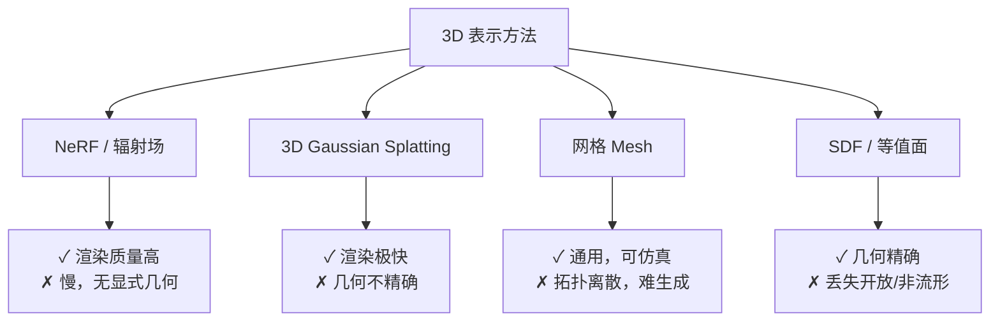
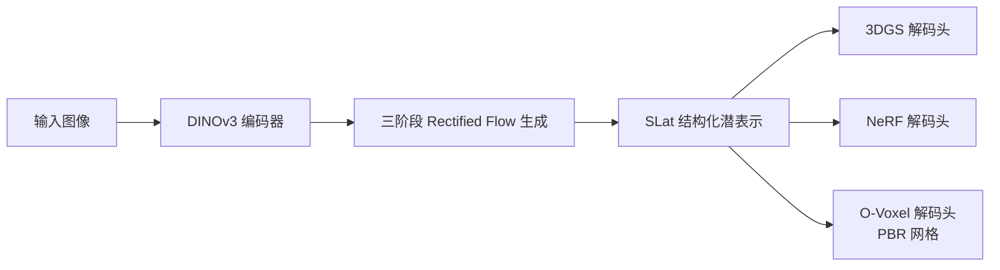

# 为什么 3D 生成这么难：已有表示方法与设计动机

3D 生成比图像生成难一个量级，核心原因不是算力，而是**表示碎片化**：游戏引擎想要网格（Mesh），神经渲染场景想要 NeRF 或 3DGS，物理仿真需要精确的几何体。同一个物体，不同下游应用需要不同格式，而现有生成模型几乎都是"格式绑定"的——为 3DGS 训练的模型输出不了网格，为 SDF 训练的模型渲染不了实时光照。

TRELLIS.2 的出发点：能不能有一个**统一的潜空间**，生成一次，解码成任意格式？

---

## 现有方法各自卡在哪里

### NeRF：精美但封闭

NeRF（神经辐射场）把场景表示为一个连续函数 $f(x,y,z,\theta,\phi) \rightarrow (\text{颜色}, \text{密度})$，通过体积渲染得到图像。优点是重建质量高、支持任意视角。缺点有两个：渲染慢（每个像素要沿光线采样几十次神经网络）；更关键的是，它没有明确的几何结构——你没法从 NeRF 里提取出一个可编辑的网格，也没法直接送进物理引擎。

### 3D Gaussian Splatting：快但几何粗糙

[3DGS](/前置知识/007a_前置知识_3D_Gaussian_Splatting三维场景重建) 把场景表示为一堆三维高斯椭球，每个椭球有位置、旋转、大小、不透明度和球谐颜色系数。渲染极快（实时帧率）、外观质量很高，但几何是隐式的——多个重叠的高斯堆出的表面并不对应一个干净的封闭网格，难以用于需要精确碰撞或物理的场景。

### 网格（Mesh）：最通用但最难生成

网格是游戏、仿真、3D 打印的标准格式。可以直接赋予物理属性、做碰撞检测、贴 PBR 材质。问题是网格的拓扑是离散的、不规则的，难以用连续的生成模型直接建模。早期方法（如 Pixel3D、Occupancy Networks）只能生成低分辨率的类别特定形状，无法处理任意物体的细节。

### 隐式场（SDF/Occupancy）：几何清晰但格式转换有损

有符号距离场（SDF）把几何编码为"到最近表面的有符号距离"，通过 Marching Cubes 算法提取等值面得到网格。几何精度高，容易学习。但 Marching Cubes 有内在限制：**它只能提取封闭流形曲面**。现实世界的资产充满了开放曲面（比如薄薄的叶片、布料边缘、头发丝）和非流形结构（比如两个面共享一条边但方向相反）。用 SDF 表示这些，要么丢失拓扑，要么引入人工的封闭处理。

> 每种表示都有致命短板。现有生成模型被迫选一种绑定，输出格式单一。

---

## TRELLIS 的统一答案：结构化潜空间

原版 TRELLIS（CVPR 2025）的核心思路：**不为某种表示训练生成模型，而是训练一个通用的潜空间，然后为每种输出格式训练独立的解码头**。

这和 2D 潜扩散模型的逻辑相同：Stable Diffusion 不直接生成像素，而是在一个压缩的潜空间里生成，最后用 VAE 解码成像素。同一个潜向量，换一个解码头，就能输出不同的东西。

TRELLIS 的潜空间叫 **SLat（Structured LATents，结构化潜表示）**：一个稀疏的三维体素网格，其中每个被激活的体素携带一个局部的连续潜向量。生成一个 SLat，再分别解码成 3DGS、NeRF 或 Mesh——同一次生成，三种格式都有。

TRELLIS.2 在这个基础上引入了新的表示 **O-Voxel**，彻底解决了网格解码时拓扑丢失的问题，并扩展了输出，支持带 PBR 物理材质的网格（金属度、粗糙度、透明度）。

> 生成一次 SLat，通过不同解码头输出任意格式——这是 TRELLIS 系列与其他方法最本质的区别。

---

## TRELLIS.2 相比原版的具体进步

原版 TRELLIS 的网格解码头基于 FlexiCubes（一种可微的等值面提取方法）。它更精确，但本质上还是等值面提取，开放曲面和非流形拓扑依然有损。

TRELLIS.2 换掉了这个解码头，改用 **O-Voxel**——一种把网格直接存在体素格子里的新表示，不经过等值面。这使得 TRELLIS.2 能准确重建现实资产中常见的开放曲面（布料边缘、植物叶片、薄板）和复杂拓扑，同时原生支持 PBR 材质通道（基础色、金属度、粗糙度、透明度），直接生成游戏/仿真引擎可用的 GLB 文件。

模型规模也从原版最大 2B 升至 **4B 参数**，图像条件编码器从 DINOv2 升级为 **DINOv3**（更强的跨视角一致性），推理流水线从两阶段扩展为**三阶段**（单独的纹理生成阶段）。

| 对比项 | TRELLIS（原版） | TRELLIS.2 |
|-------|--------------|-----------|
| 网格表示 | FlexiCubes（等值面） | O-Voxel（直接存网格） |
| 拓扑支持 | 封闭流形 | 开放/非流形/任意 |
| 材质输出 | 顶点颜色 | PBR（基础色+金属+粗糙+透明） |
| 图像编码 | DINOv2 | DINOv3 |
| 生成阶段 | 2（结构+SLat） | 3（结构+形状+纹理） |
| 最大模型规模 | 2B | 4B |

---

## 下一章

SLat 表示是这整个体系的枢纽——接下来在[第二章](./02_SLat结构化潜表示_稀疏体素与局部潜量设计.md)详细拆解它的设计：为什么选稀疏体素网格，局部潜向量怎么和下游解码器配合，以及这个设计如何自然地支持区域级别的编辑。
