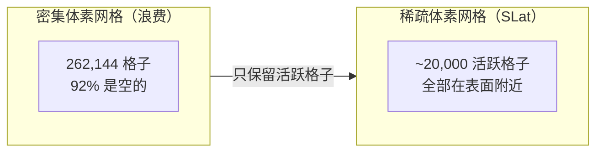
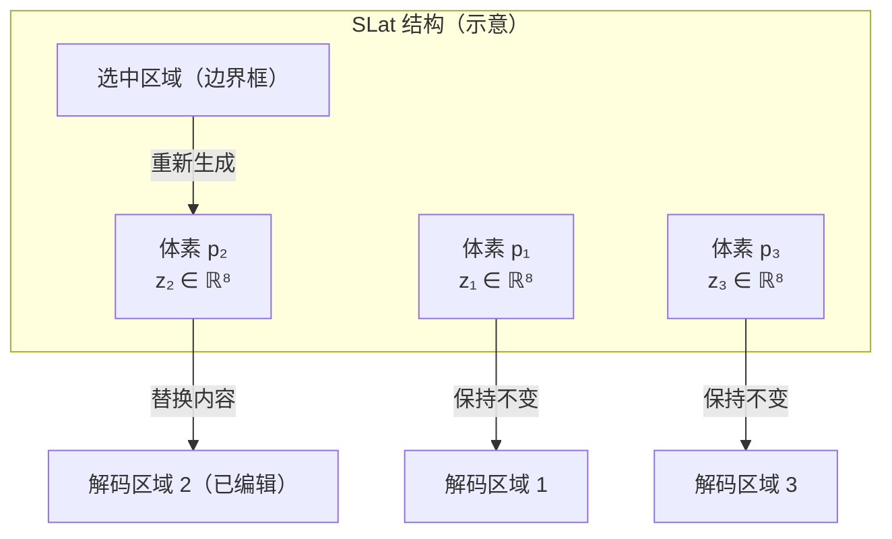
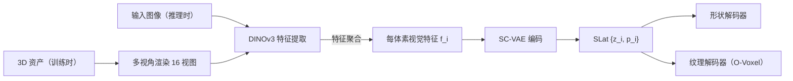

# SLat 结构化潜表示：稀疏体素与局部潜量设计

SLat（Structured LATents）是 TRELLIS 系列的核心数据结构，所有生成和解码都围绕它展开。

SLat 的结构很直接：**一个稀疏的 64³ 体素网格，其中每个"活跃"体素携带一个 8 维的局部潜向量**。活跃体素标记了物体表面经过的位置；潜向量编码了该局部区域的精细几何和外观。

这两部分——稀疏结构和局部潜量——分别由 TRELLIS 生成流水线的不同阶段负责生成，最终组合成完整的 SLat 送入解码头。

---

## 为什么是稀疏的：三维表面本来就稀疏

3D 物体的**表面**是一个二维流形嵌入在三维空间里。如果把空间离散成一个 64×64×64 的体素网格，总格子数是 262,144。但物体表面只经过其中一薄层，典型情况下活跃体素只有约 **20,000 个**，不到总数的 8%。

这意味着：如果用密集的 64³ 张量，92% 的计算都浪费在空格子上。稀疏表示让计算量正比于表面积，而不是包围盒体积。在 TRELLIS 的 Transformer 注意力中，这意味着 token 数量从 262,144 降到约 20,000——使得 Transformer 在高分辨率下可行。

> 稀疏化不是压缩技巧，而是对表面几何内在稀疏性的直接利用。

---

## 为什么是局部的：区域编辑的基础

每个活跃体素有一个 8 维潜向量 $z_i$，它只编码**以 $p_i$ 为中心的局部区域**的信息。解码时，每个潜向量只控制其所在体素邻域内的几何和外观，不会跨区域"污染"。

这个局部性是区域编辑能力的直接来源。当你想修改物体的某个部位时：

1. 用边界框选出对应的体素集合
2. 重新对这些体素运行生成流程（Repaint 策略）
3. 邻近区域的潜向量保持不变，只有边界框内的被替换

如果用全局潜向量（比如把整个物体压成一个向量），区域编辑就必须改动整个表示，很难精确控制。

> 局部性让区域编辑天然成立，无需任何额外设计。

---

## SLat 的两个组成部分

SLat 由两种信息构成，在代码中通常表示为一个 `SparseTensor`（稀疏张量）：

**结构（哪些体素是活跃的）**：一个包含活跃体素坐标 $\{p_i\}$ 的集合，其中每个 $p_i \in \{0,1,...,63\}^3$ 是网格上的整数坐标。这部分是离散的，由生成流水线的**第一阶段**负责生成。

**潜量（每个活跃体素携带什么）**：每个活跃体素有一个连续向量 $z_i \in \mathbb{R}^C$，其中 $C=8$（形状通道数，TRELLIS.2 中纹理通道数为 6）。这部分是连续的，由**第二/三阶段**负责生成，分别对应形状 SLat 和纹理 SLat。

TRELLIS.2 把形状和纹理分开编码：

| 潜量类型 | 通道数 | 编码内容 |
|---------|-------|---------|
| 形状 SLat | 32 | 局部几何（体素内部的表面位置、法线） |
| 纹理 SLat | 6 | PBR 属性（基础色 3ch，金属度 1ch，粗糙度 1ch，透明度 1ch） |

两者共用同一组活跃体素坐标 $\{p_i\}$，因此可以直接拼合（或分阶段生成）。

---

## SLat 在生成流水线中的位置

SLat 不是直接从数据中学习得到的——它需要一个编码过程。对于真实的 3D 资产，编码分两步：

**步骤一**：从 3D 资产渲染多视角图像，用 DINOv3（一个视觉基础模型）提取每张图的特征图，再反投影到活跃体素上，得到每个体素的视觉特征 $f_i$。这一步是无优化的，只需几何投影，不需要 per-asset 训练。

**步骤二**：用稀疏卷积 VAE（SC-VAE）把视觉特征 $\{(f_i, p_i)\}$ 压缩成结构化潜量 $\{(z_i, p_i)\}$。VAE 的 KL 正则让潜空间近似标准正态分布，为后续的生成流模型提供平滑的采样目标。

推理时（生成新物体），不需要真实的 3D 资产，直接从输入图像的 DINOv3 特征条件化地采样 SLat。

> 训练时走上半条路（真实资产→SLat），推理时走下半条路（图像→生成SLat）。

---

## 64³ 分辨率的选择

TRELLIS.2 在级联流水线中使用多个分辨率：初始生成在 512 体素精度，上采样到 1024（或 1536）做最终解码。这里的"分辨率"指的是潜空间的体素精度，不是最终网格的面数——最终通过 O-Voxel 解码出来的网格面数可以远高于体素数。

原版 TRELLIS 的消融实验表明，从 32³ 升到 64³ 时 PSNR 从约 31.8 提升到 32.74，继续增加通道数带来的收益递减。这说明 64³ 是表达能力与计算效率之间合适的平衡点。

---

## 下一章

SLat 告诉我们"每个体素携带一个潜向量"，但 TRELLIS.2 的体素里存的究竟是什么、怎么从潜向量解码回网格？这需要理解 **O-Voxel** 表示——[第三章](./03_O-Voxel_告别等值面的原生三维表示.md)完整讲解这个 TRELLIS.2 最关键的创新。
