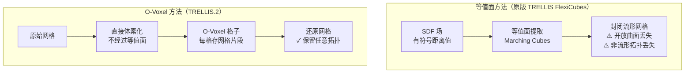
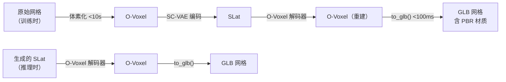

# O-Voxel：告别等值面的原生三维表示

TRELLIS.2 相比原版 TRELLIS 最关键的技术改进，是把网格解码的方式从"等值面提取"换成了 **O-Voxel（开放体素，Open Voxel）**。

等值面提取（SDF + Marching Cubes，或 FlexiCubes）是目前最主流的从隐式场生成网格的方式，但有一个根本缺陷：**它只能生成封闭流形曲面**。现实资产里充满了开放曲面（布料、叶片、头发、薄板）和非流形拓扑（两个面共享一条边，但法线方向相反），这些统统被等值面方法损坏或丢弃。

O-Voxel 的解决方案：**不经过等值面，把网格直接存进体素格子**。

---

## 等值面方法的根本问题

Marching Cubes 的工作原理：在 SDF 场里沿着"零值等值面"插值出三角形。这要求每个三角形的两侧分别是场的正值区域和负值区域——也就是说，曲面必须把空间分隔成内外两侧，即封闭流形的定义。

开放曲面（比如一张布料）没有"内外"之分，SDF 没法表示它；即使强行处理，Marching Cubes 生成的结果是一个被人工封闭的双层曲面，和原始几何差异很大。

非流形拓扑（比如一个 T 型接头，三条边在同一点汇合）也超出了 Marching Cubes 能处理的范围——它总是输出流形网格。

> 关键差异：等值面方法"重建"几何（有损），O-Voxel"存储"几何（无损拓扑）。

---

## O-Voxel 的工作方式

O-Voxel 把网格切割成体素大小的片段，每个活跃的体素格子里存放经过该格子的网格三角形（或三角形片段）。

**网格 → O-Voxel**（训练时预处理）：遍历网格的每个三角形，找出与它相交的所有体素，把三角形片段分配到对应格子。复杂度正比于三角形数量，在单颗 CPU 上对一个典型资产的处理时间不到 **10 秒**，且不需要任何渲染或优化。

**O-Voxel → 网格**（推理时解码）：把每个体素里的三角形片段重新组装成完整网格，消除相邻体素间的重复顶点。通过 CUDA 并行化，这一步只需 **100ms**。

O-Voxel 库在代码库的 `/home/flageval/projects/TRELLIS.2/o-voxel/` 下，是一个 C++/CUDA 扩展。核心文件：

- `o_voxel/postprocess.py` — `to_glb()` 函数：完整的 O-Voxel 转 GLB 流水线，包括 UV 展开和 PBR 纹理烘焙
- `o_voxel/rasterize.py` — `VoxelRenderer`：CUDA 加速的体素直接渲染器，用于可视化和训练时的渲染损失
- `src/ext.cpp` — C++/CUDA 扩展入口

---

## PBR 材质：TRELLIS.2 的独特输出

O-Voxel 不只存几何，**每个体素的三角形片段还带有 PBR 材质属性**：基础色（Base Color，RGB 3 通道）、金属度（Metallic，1 通道）、粗糙度（Roughness，1 通道）、透明度（Alpha，1 通道）。

这 6 个通道直接对应纹理 SLat 的 6 个通道——生成流水线的第三阶段就是在体素级别生成这 6 个 PBR 值，然后通过纹理烘焙（UV 展开 + 重采样）生成标准的 PBR 纹理贴图。

PBR（物理渲染，Physically Based Rendering）是游戏和实时渲染引擎（Unreal、Unity、Blender）的标准材质模型。金属度控制光线是否被金属式地反射；粗糙度控制高光的清晰度（越粗糙越漫散）；透明度支持玻璃、叶片、布料边缘。**原版 TRELLIS 只有顶点颜色，无法表示这些材质特性，TRELLIS.2 的输出才是真正"可以直接用"的 3D 资产。**

| 通道 | 含义 | 可视效果 |
|------|------|---------|
| Base Color (×3) | 固有颜色，不含光照 | 物体本来的颜色 |
| Metallic (×1) | 金属性（0=非金属，1=金属） | 金属的镜面反射 |
| Roughness (×1) | 表面粗糙度（0=镜面，1=完全漫射） | 高光的锐利程度 |
| Alpha (×1) | 不透明度（0=透明，1=不透明） | 玻璃、叶片、布料 |

---

## 双向转换的精确性

O-Voxel 双向转换的一个关键性质：**从网格转到 O-Voxel 再转回来，三角形的拓扑关系被完整保留**——这是等值面方法做不到的。

等值面方法在重建时会"发明"新的三角形来近似等值面，原来的网格拓扑不再存在。O-Voxel 只是切割和重组，拓扑关系是代数意义上保持的（对应顶点的精度受体素分辨率限制，但不改变连接关系）。

这个性质对训练很重要：SC-VAE 的训练损失可以直接在原始网格空间计算，不需要通过渲染来间接监督。

---

## O-Voxel 与 SLat 的配合

O-Voxel 是 SLat 的**解码目标**。训练时：

1. 真实网格 → O-Voxel（体素化）→ SC-VAE 编码 → SLat（这是"真实 SLat"，用于训练）
2. SLat → O-Voxel 解码器 → O-Voxel → `to_glb()` → GLB 网格

推理时没有真实网格，直接用生成流模型从图像条件采样 SLat，然后走步骤 2。

形状 SLat 和纹理 SLat 解码对应不同的 O-Voxel 解码器：形状解码器输出三角形几何，纹理解码器输出每个顶点/片段的 PBR 属性。两者共享同一组活跃体素坐标，所以几何和材质的对齐是精确的。

---

## 下一章

O-Voxel 定义了数据在 3D 空间的存储形式。[第四章](./04_编码器_SC-VAE与DINOv3特征聚合.md)讲解 3D 资产是如何被编码成 SLat 的：DINOv3 如何从多视角图像中提取每个体素的特征，以及 SC-VAE（稀疏卷积 VAE）如何把这些特征压缩成生成流模型可以采样的连续潜空间。
