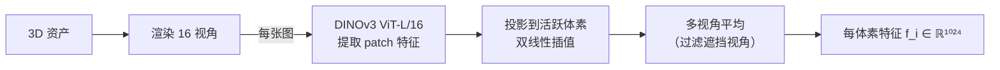

# 编码器：SC-VAE 与 DINOv3 特征聚合

SLat 是生成流水线的输入，但它不是凭空造出来的——训练时需要把真实的 3D 资产编码成 SLat，才能有监督信号。这一章讲编码方向：**如何从一个 3D 物体（或一张图片）得到它对应的 SLat**。

整个编码过程分两步：首先用 DINOv3 从多视角图像里聚合出每个活跃体素的视觉特征，然后用 SC-VAE（稀疏卷积 VAE）把这些特征压缩成 SLat 潜向量。

---

## 为什么用多视角图像，而不是直接处理网格

直接处理 3D 网格需要专门设计的 3D 感知网络，这类网络的预训练数据远比 2D 图像少，泛化能力弱。

TRELLIS 的选择是**绕过 3D 表示，从多视角渲染的 2D 图像里提取特征**。原理：如果一个视觉编码器对 3D 结构有足够的感知能力（即不同视角下同一个表面点的特征是一致的），那么把多个视角的特征投影到 3D 体素上再平均，就能聚合出该体素局部的几何和外观信息。

DINOv2/DINOv3 正是这样的编码器。它通过自监督学习在大量图像上训练，学到了强烈的"3D 感知性"——研究人员观察到，DINOv2 的特征空间里，同一物体不同视角下同一位置的特征距离非常小，远比同物体不同位置或不同物体的特征距离小。这种跨视角一致性使得多视角特征聚合成立。

TRELLIS.2 相比原版把 DINOv2 升级为 **DINOv3**（`facebook/dinov3-vitl16-pretrain-lvd1689m`），使用更大的训练数据集（lvd1689m），在 ViT-L/16 架构下特征维度为 1024。

---

## 多视角特征聚合

训练时，每个 3D 资产渲染 **16 个视角**（TRELLIS.2），均匀分布在球面上。对每张渲染图，DINOv3 提取 patch 特征图（每个 patch 16×16 像素，在 512px 输入下得到 32×32 个特征向量）。

对每个活跃体素 $p_i$，聚合过程是：

1. 把 $p_i$ 的三维坐标投影到每个视角的图像平面上，得到对应的 2D 像素坐标
2. 双线性插值得到该位置的特征向量
3. 对所有可见视角（该体素不被遮挡的视角）的特征取平均，得到聚合特征 $f_i \in \mathbb{R}^{1024}$

遮挡判断：用 O-Voxel 的 CUDA 渲染器做深度测试，深度值不匹配的视角认为该体素被遮挡，不纳入平均。

推理时没有多视角，只有单张输入图像。这时直接用单张图的 DINOv3 特征（patch features）作为条件，通过跨注意力机制让生成网络参考图像信息——不需要真正聚合到 3D 空间，因为生成网络是直接从潜空间采样，而非重建。

---

## SC-VAE：稀疏卷积变分自编码器

有了每个活跃体素的特征 $\{(f_i, p_i)\}$，SC-VAE 把它们压缩成 SLat 潜向量 $\{(z_i, p_i)\}$。

SC-VAE 是一个基于**稀疏卷积**的 VAE，架构类似 VQ-VAE 和 VQGAN，但操作在 3D 稀疏体素网格上。代码路径：`trellis2/models/sparse_structure_vae.py`（形状 VAE 和纹理 VAE 共用同一类）。

训练目标是两项损失的组合：

**重建损失**：从编码得到的 SLat 解码回 O-Voxel，然后用 CUDA 体素渲染器渲染多视角，和原始渲染图计算 L1 + DSSIM + LPIPS 损失。

**KL 散度正则**：把潜向量的分布拉向标准正态，保证潜空间的连续性和可采样性（即后续的生成流模型可以通过从正态分布采样来生成新物体）。

形状 VAE 和纹理 VAE 是分开训练的：

| VAE 类型 | 输入通道 | 输出通道 | 配置文件 |
|---------|---------|---------|---------|
| 形状 SC-VAE | DINOv3 几何特征 | 32 | `scvae/shape_vae_next_dc_f16c32_fp16.json` |
| 纹理 SC-VAE | DINOv3 颜色+材质特征 | 6 | `scvae/tex_vae_next_dc_f16c32_fp16.json` |

文件名中的 `f16c32` 表示特征图下采样倍数 16（从 512³ 到 32³），通道数 32；`fp16` 表示 bfloat16 混合精度。

---

## 稀疏卷积的必要性

标准卷积对稠密的 3D 网格效率极低：512³ 体素 = 1.34 亿格子，其中 95% 以上是空的。SparseTensor（稀疏张量）只对活跃体素存储和计算，计算量正比于活跃体素数 $L$（约 20K），而不是 $N^3$。

TRELLIS.2 用的稀疏卷积实现在 `trellis2/modules/sparse/` 目录下，提供 `SparseTensor` 数据结构、`SparseLinear`、`SparseConv3d` 等基础算子，以及稀疏注意力机制（`ModulatedSparseTransformerCrossBlock`），供 SC-VAE 和生成流模型共用。

---

## 形状特征与纹理特征的分离

TRELLIS.2 把编码过程分成了两路，对应两个独立的 SC-VAE：

**形状 SC-VAE** 处理与几何相关的特征：DINOv3 在低颜色信息下的中间层特征，对法线、凹凸、轮廓更敏感。输出 32 通道形状 SLat，存储在每个体素里。

**纹理 SC-VAE** 处理与外观相关的特征：DINOv3 的最终层特征（对颜色、材质更敏感）。输出 6 通道纹理 SLat，对应 PBR 的 6 个属性。

这种分离的好处：形状 SLat 和纹理 SLat 可以独立生成——推理时先生成形状，再条件化地生成纹理。这使得纹理化流水线（`trellis2/pipelines/trellis2_texturing.py`）可以单独给用户提供的网格生成 PBR 材质，不需要重新生成几何。

---

## 下一章

编码器决定了 SLat 长什么样；生成流模型决定了怎么从图像条件中"召唤"新的 SLat。[第五章](./05_生成骨干_Rectified_Flow_Transformer架构.md)讲生成骨干：Rectified Flow（整流流）为什么比扩散模型更适合这个任务，稀疏 DiT 的具体结构，以及 adaLN 时间步调制和跨注意力图像条件如何协作。
