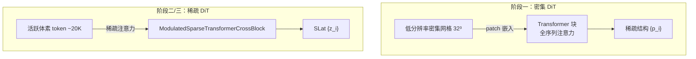

# 生成骨干：Rectified Flow Transformer 架构

TRELLIS.2 的三个生成阶段都使用同一种骨干架构：**基于整流流（Rectified Flow）训练的 DiT（Diffusion Transformer）**，在稀疏体素格式上运行。这一章拆解这个骨干的每一层设计，解释为什么这些选择是对的。

---

## Rectified Flow：为什么不用扩散模型

[Flow Matching](/前置知识/000g_前置知识_Flow_Matching与连续归一化流) 的核心思想是：在干净数据 $x_0$ 和随机噪声 $\epsilon$ 之间画一条路径，训练一个网络来预测"当前位置应该往哪个方向走"。

Rectified Flow（整流流）是 Flow Matching 的一种具体实现，选择**直线路径**：

$$x(t) = (1-t) x_0 + t \epsilon, \quad t \in [0,1]$$

这条路径是直的，意味着速度场处处恒定（速度向量 $= x_0 - \epsilon$，不随 $t$ 变化）。直线路径有一个关键优势：**更少的积分步数**。扩散模型的 DDPM 需要几百步，整流流通常 50 步就够，因为从任意中间点出发，沿速度场走一大步都不会偏离太多。

TRELLIS 在两个阶段上独立做过消融实验，两种情况下整流流都优于 DDPM，在 CLIP 分数和 FD_DINOv2 两个指标上领先。

时间步采样用 logitNorm(1,1)（不是 SD3 的 logitNorm(0,1)），把采样向更嘈杂的时间步倾斜——消融实验证实这对 3D 生成任务更有效。推理时使用分类器自由引导（CFG），引导强度为 3，负条件为零向量。

---

## 整流流训练目标

训练目标是让网络 $v_\theta$ 在噪声路径的任意点上预测正确的速度方向：

$$\mathcal{L} = \mathbb{E}_{t, x_0, \epsilon} \left[ \| v_\theta(x_t, t, c) - (x_0 - \epsilon) \|^2 \right]$$

**这个 loss 在做什么**：在随机选取的噪声混合点 $x_t$ 上，让网络猜"从噪声到干净数据的方向"，猜得越准 loss 越低。

::: details 📐 公式详解
| 子表达式 | 它是谁 | 它在干嘛 |
|---------|--------|---------|
| $x_0 - \epsilon$ | **目标速度** | 从噪声指向干净数据的直线方向，固定不变 |
| $v_\theta(x_t, t, c)$ | **网络的猜测** | 站在路上某点，猜"该往哪走" |
| $\mathbb{E}_{t, x_0, \epsilon}$ | **随机采样** | 随机取时间步、数据点、噪声——覆盖所有情况 |

**用人话读**：从所有可能的噪声混合比例里随机抽一个点，问网络怎么走能最快到达干净数据，方向偏差即为 loss。

**为什么是直线**：直线是从噪声到数据的最短路径（最优传输意义下），速度方向恒定，使得少步推理也精确。
:::

---

## 两种 DiT：密集与稀疏

TRELLIS.2 用了两种 Transformer 变体：

**密集 DiT**（`SparseStructureFlowModel`）：用于阶段一（生成稀疏结构）。操作在低分辨率的密集 3D 网格上（32³ 或 64³），序列长度可控。标准的 ViT patch 嵌入 + Transformer 块，带 adaLN 时间步条件和跨注意力图像条件。

**稀疏 DiT**（`SLatFlowModel` / `ElasticSLatFlowModel`）：用于阶段二和阶段三。只对活跃体素的 token 进行注意力计算，序列长度 = 活跃体素数（约 20K），而不是全格子数（512³ = 1.34 亿）。`ModulatedSparseTransformerCrossBlock` 是其核心注意力块，`trellis2/models/structured_latent_flow.py` 实现。

---

## adaLN：时间步如何调制激活

adaLN（自适应层归一化，Adaptive Layer Normalization）是 DiT 把时间步信息注入特征的方式，来自 [DiT 论文](https://arxiv.org/abs/2212.09748)的设计。

标准 LayerNorm 归一化后，adaLN 用一个小型 MLP 把时间步嵌入映射成两个向量 $\gamma$ 和 $\beta$，对归一化后的激活做仿射变换：

$$\text{adaLN}(h, t) = \gamma(t) \cdot \text{LayerNorm}(h) + \beta(t)$$

每个 Transformer 块都有自己的 adaLN 参数，所以不同块可以以不同方式对时间步做响应。这比把时间步嵌入加到 token 上更灵活——后者只能全局地移动所有特征，而 adaLN 可以同时控制方向和尺度。

---

## 跨注意力图像条件

图像条件通过**跨注意力（Cross-Attention）**注入：体素 token 作为 Query，DINOv3 图像特征作为 Key 和 Value。

每个 `ModulatedSparseTransformerCrossBlock` 包含三个子层：
1. 带 adaLN 的自注意力（体素 token 之间互相看）
2. 跨注意力（体素 token 查询图像特征）
3. 带 adaLN 的前馈网络

这个结构确保体素之间能互相交流（自注意力），同时每个体素都能直接参考图像里对应区域的特征（跨注意力）。

推理时 CFG 实现：同一个批次里跑两次前向，一次带图像条件，一次带零条件，最终输出：

$$v = v_\text{uncond} + s \cdot (v_\text{cond} - v_\text{uncond})$$

其中引导强度 $s=3$。

---

## Elastic Memory Controller：弹性显存管理

4B 参数的 TRELLIS.2 在推理时对显存压力较大。`ElasticSLatFlowModel`（`trellis2/models/sparse_elastic_mixin.py`）引入了弹性显存控制：

按当前可用显存量，动态决定对多大比例的 Transformer 块开启梯度检查点（gradient checkpointing）。梯度检查点用重新计算换显存：前向时不保存中间激活，反向时重新计算。对于推理来说，这里利用的是类似机制：在显存不足时，对部分块做"分段前向"而不是全部同时在显存里展开。

`LinearMemoryController` 是一个简单的线性映射：把当前可用显存映射到 0.0–1.0 的比例，0.0 = 不开启检查点，1.0 = 所有块都开启。

---

## 阶段一、二、三的规模

三个阶段的生成模型规模接近，全部约 1.3B 参数（配置文件名中的 `1_3B` 表示）：

| 阶段 | 模型 | 配置 |
|------|------|------|
| 稀疏结构 | `SparseStructureFlowModel` | `ss_flow_img_dit_1_3B_64_bf16.json` |
| 形状 SLat | `SLatFlowModel` / `ElasticSLatFlowModel` | `slat_flow_img2shape_dit_1_3B_512_bf16.json` |
| 纹理 SLat | `SLatFlowModel` / `ElasticSLatFlowModel` | `slat_flow_imgshape2tex_dit_1_3B_512_bf16.json` |

纹理阶段与形状阶段的唯一区别是条件输入：纹理阶段额外把形状 SLat 拼接进条件（`concat_cond`），使生成的纹理与几何对齐。

---

## QK 归一化：防止注意力崩塌

TRELLIS 在所有 Transformer 块中加入 QK 归一化（RMSNorm 作用在 Query 和 Key 上，然后再计算点积注意力）。这是 SD3 发现的技巧，解决大规模训练中注意力分数爆炸的问题——没有 QK 归一化，长时间训练后注意力矩阵的方差会持续增大，导致梯度爆炸。

---

## 下一章

有了生成骨干，下一章把三个阶段串起来看完整的推理流水线：[第六章](./06_三阶段推理流水线_从图像到完整三维资产.md) 讲稀疏结构生成 → 形状 SLat 生成 → 纹理 SLat 生成的完整调用链，以及级联上采样如何在控制计算量的前提下提升分辨率。
