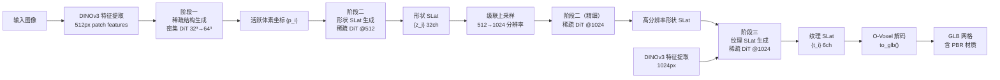

# 三阶段推理流水线：从图像到完整三维资产

TRELLIS.2 的推理流水线代码在 `trellis2/pipelines/trellis2_image_to_3d.py`。用一张图片调用 `pipeline.run(image)` 之后，内部发生了三件事：先确定"哪些体素是活跃的"（阶段一），再在这些体素上生成形状潜量（阶段二），再叠加纹理潜量（阶段三），最后解码成 GLB 网格。

---

## 全局流程



---

## 阶段一：稀疏结构生成

**任务**：决定哪些体素是活跃的，即物体表面在哪里。

输入是 DINOv3 在 512px 下提取的 patch 特征（32×32 个向量，每个 1024 维）。密集 DiT 在一个压缩的 32³ 空间里运行整流流采样，最后用 `SparseStructureDecoder`（3D CNN VAE 解码器）上采样并预测 64³ 二值占用图，从中取阈值得到活跃体素集合 $\{p_i\}$。

典型资产的活跃体素数约 20K，远小于 64³ = 262K 的总格子数。

阶段一运行 50 步整流流采样（DDIM ODE 求解器），CFG 强度 3.0。采样步数可以在 `run()` 调用时通过 `sparse_structure_sampler_params` 传入。

---

## 阶段二：形状 SLat 生成（含级联上采样）

**任务**：在阶段一的活跃体素上，生成描述局部形状的潜向量。

TRELLIS.2 默认用 `1024_cascade` 模式，分两步做：

**低分辨率粗采样**：`shape_slat_flow_model_512` 在 512³ 分辨率下运行，生成 32 通道的粗形状 SLat。输入是阶段一的 ~20K 个活跃体素坐标 + DINOv3 512px 特征。

**级联上采样**：用 shape SC-VAE 解码器（配置文件 `shape_vae_next_dc_f16c32_fp16_ft_512.json`）把 512³ 的粗 SLat 上采样到 1024³，预测新的（更多的）活跃体素坐标——高分辨率下表面会出现更多体素，原来合并成一个体素的细节会被分开。

**高分辨率精细采样**：`shape_slat_flow_model_1024` 在 1024³ 上重新运行生成，但以低分辨率结果作为初始条件（warm start），只需比从头采样少得多的步数。使用 DINOv3 1024px 更高分辨率的特征图（DINOv3 支持可变分辨率输入，patch 数从 32×32 增加到 64×64）。

这个设计的意图：直接从头在 1024³ 做全精度采样会有 ~80K token，计算量极大。先在 512³ 粗采样确定主体形状，再在 1024³ 细化，总计算量比纯粗采样多约 50%，但输出质量远优于直接粗采样。

还有 `1536_cascade` 模式，进一步上采样到 1536³，适合需要极精细几何的场景，代价是更长推理时间。

---

## 阶段三：纹理 SLat 生成

**任务**：在阶段二确定的高分辨率活跃体素上，生成 6 通道 PBR 纹理潜量。

`tex_slat_flow_model_1024` 接受两路条件：

- **图像条件**：DINOv3 1024px 特征（和阶段二精细步骤相同），通过跨注意力注入
- **形状条件**：阶段二的高分辨率形状 SLat，通过 `concat_cond` 拼接到每个 token 上

形状条件的拼接保证纹理和几何对齐——如果不提供形状条件，生成的纹理可能在几何分界处产生错位，尤其是高金属度或高粗糙度等材质属性在物体边缘需要和形状一致。

输出是每个体素的 6 维纹理潜量 $t_i$，解码后得到 6 个 PBR 通道（基础色×3、金属度、粗糙度、透明度）。

---

## 两个 pipeline 模式的对比

| 模式 | 阶段二分辨率 | 最终分辨率 | 推理时间 | 适用场景 |
|------|------------|----------|---------|---------|
| `512` | 512（单阶段） | 512 | 快 | 快速预览 |
| `1024_cascade` | 512→1024 | 1024 | 中等 | 标准质量 |
| `1536_cascade` | 512→1024→1536 | 1536 | 慢 | 最高质量 |

---

## 纹理化 Pipeline：给已有网格贴材质

`trellis2/pipelines/trellis2_texturing.py` 是一个独立的流水线，**只做阶段三**——用户提供自己的网格，pipeline 把它体素化为 O-Voxel，再运行纹理 SLat 生成，输出带 PBR 材质的版本。

使用场景：用户已有一个高质量的网格（例如从 3D 扫描或 CAD 软件得到），只需要自动生成符合某张参考图风格的材质。

```python
# example_texturing.py
from trellis2.pipelines import Trellis2TexturingPipeline
pipeline = Trellis2TexturingPipeline.from_pretrained("microsoft/TRELLIS.2-4B")
outputs = pipeline.run(image=ref_image, mesh_path="my_mesh.glb")
```

---

## CFG 的实现方式

TRELLIS.2 在所有三个阶段都用分类器自由引导。训练时随机丢弃 10% 的条件，让网络学会无条件生成。推理时：

每个采样步运行两次网络前向：一次有图像条件 $c$，一次条件置为零向量 $\varnothing$。引导后的速度场：

$$v_\text{guided}(x_t, t) = v_\theta(x_t, t, \varnothing) + s \cdot \left[ v_\theta(x_t, t, c) - v_\theta(x_t, t, \varnothing) \right]$$

其中 $s=3$ 是引导强度。实现上把有条件和无条件的 batch 拼在一起同时前向，用一次矩阵运算完成两次推理。

---

## 下一章

三阶段生成完成后，拿到了形状 SLat 和纹理 SLat。[第七章](./07_解码与导出_O-Voxel转GLB网格.md) 讲解码侧：O-Voxel 解码器怎么把这两个 SLat 变成网格，UV 展开和 PBR 纹理烘焙怎么工作，最终生成的 GLB 文件包含什么。
