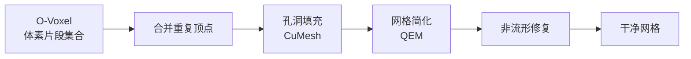

# 解码与导出：O-Voxel 转 GLB 网格

三阶段生成完成后，手里有两样东西：形状 SLat（32 通道，每体素一个）和纹理 SLat（6 通道，每体素一个）。把这两样东西变成一个用户可以在 Blender、Unity、Unreal 里直接打开的 GLB 文件，是 `to_glb()` 的工作，代码在 `o-voxel/o_voxel/postprocess.py`。

整个解码流程分四步：SLat → O-Voxel → 网格合并与修复 → UV 展开 → PBR 纹理烘焙。

---

## 步骤一：SLat → O-Voxel

SC-VAE 的解码器把形状 SLat 转回 O-Voxel 格式。解码器是编码器的逆变换：稀疏卷积上采样网络，把压缩的 32 通道潜向量还原为每个体素里的三角形片段（包含顶点坐标和法线）。

纹理 SC-VAE 解码器同样把 6 通道纹理 SLat 还原为每个体素片段对应的 PBR 属性值（基础色 RGB + 金属度 + 粗糙度 + 透明度）。

两个解码过程共享同一组活跃体素坐标，所以几何和材质在体素级别天然对齐。

---

## 步骤二：网格合并与修复

O-Voxel 转网格的过程中，相邻体素的边界处会产生重复顶点——两个相邻体素各有自己的三角形，在它们的共享边上出现两组完全重合的顶点。`to_glb()` 的第一步是合并这些重复顶点，确保网格的连通性是正确的（不是一堆孤立的体素片段拼在一起）。

之后调用 CuMesh（外部 CUDA 网格工具库）做一系列修复：

**孔洞填充**：因为体素分辨率有限，某些极细的结构（比如一根头发）可能产生几何孔洞。CuMesh 的孔洞填充算法检测边界边（只被一个三角形引用的边），沿边界生成填充三角形。

**网格简化**：对分辨率 1024³ 的输出，每个体素对应的三角形数量可能很多，合并后的网格可能有几百万个面。CuMesh 用二次误差度量（QEM）简化，把面数降到不影响视觉质量的范围（通常 50–200 万面，取决于物体复杂度）。

**非流形修复**：O-Voxel 在极端情况下（如两个体素只在一个顶点接触）可能产生非流形边。CuMesh 检测并修复这些情况，确保后续 UV 展开可以正常工作。



---

## 步骤三：UV 展开

UV 展开把三维网格的表面"展平"到二维的 UV 空间，建立一个从 3D 表面点到 2D 纹理坐标的映射。这个映射是后续纹理烘焙的基础——只有有了 UV，才能把每个体素上的 PBR 属性值"画"到一张纹理图上。

TRELLIS.2 用 CuMesh 的 BVH 加速 UV 展开，算法基于 **xatlas**（一种工业界广泛使用的参数化算法）的 CUDA 实现。主要步骤：

1. **分图表（Chart segmentation）**：把网格按曲率和连通性分成若干"平坦"的区块，每块对应 UV 空间里的一个 chart（图表）。尖锐折痕和接缝处会切割 chart 边界。

2. **参数化（Parameterization）**：对每个 chart 内部，计算使角度失真最小的 UV 坐标（ABF/LSCM 类算法）。

3. **装箱（Packing）**：把所有 chart 紧密排布到 [0,1]² 的 UV 空间里，最大化纹理利用率。

UV 展开是整个流程中最耗时的步骤，对一个复杂网格可能需要 1–5 秒。

---

## 步骤四：PBR 纹理烘焙

有了 UV 坐标，可以把体素级别的 PBR 属性值烘焙成 2D 纹理图。烘焙过程：

对纹理图的每个像素，找到对应的 UV 坐标，反映射到 3D 网格上的对应表面点，再找到该表面点所在的 O-Voxel 体素，取出该体素的 PBR 属性值写入像素。这用 nvdiffrec（英伟达的可微分渲染库）的 split-sum PBR 烘焙器实现，支持子体素级别的插值（相邻体素之间平滑过渡）。

最终生成四张纹理图，分辨率 1024×1024 或 2048×2048：

| 纹理贴图 | 通道 | 内容 |
|---------|------|------|
| Base Color | RGB + A | 固有颜色 + 透明度 |
| Metallic-Roughness | R = metallic, G = roughness | 金属/粗糙度打包图（glTF 标准） |
| Normal map | RGB | 法线方向（切线空间，从几何计算） |

法线贴图不是从纹理 SLat 生成的——它直接从几何计算（体素表面的法线向量），用于在低面数网格上表现高频表面细节。

---

## GLB 打包

`to_glb()` 最后把网格 + 纹理 + 材质定义打包成 GLB（二进制 glTF 2.0）文件。glTF 是 Khronos Group 定义的开放 3D 资产标准，支持 PBR 材质、骨骼动画、多 LOD 等，被 Blender、Three.js、Unity、Unreal 等主流工具链直接支持。

GLB = gLTF 的 binary 格式，把网格数据（顶点、法线、UV、索引）和纹理图片打包进单个 `.glb` 文件，便于传输和加载，无需管理外部纹理依赖。

```python
# o-voxel/o_voxel/postprocess.py（简化示意）
def to_glb(shape_slat, tex_slat, resolution=1024, simplify_ratio=0.95):
    # 1. SC-VAE 解码
    mesh = shape_decoder.decode(shape_slat)   # O-Voxel → 三角形集合
    pbr  = tex_decoder.decode(tex_slat)       # 纹理 SLat → 体素 PBR 属性

    # 2. 网格合并与修复
    mesh = cumesh.merge_vertices(mesh)
    mesh = cumesh.fill_holes(mesh)
    mesh = cumesh.simplify(mesh, ratio=simplify_ratio)

    # 3. UV 展开
    uvs = cumesh.unwrap_uv(mesh)

    # 4. 纹理烘焙
    textures = nvdiffrec.bake_pbr(mesh, uvs, pbr, size=resolution)

    # 5. 打包 GLB
    return pack_glb(mesh, uvs, textures)
```

---

## 解码时间

在单张 A100 GPU 上，典型资产的解码时间：

| 步骤 | 时间 |
|------|------|
| SC-VAE 解码（形状 + 纹理） | ~0.5s |
| 网格合并与修复 | ~0.5s |
| UV 展开 | 1–5s |
| PBR 纹理烘焙 | ~0.5s |
| GLB 打包 | <0.1s |
| **总计** | **~3–7s** |

三阶段生成本身约 10s（50 步整流流 × 3 阶段），解码占总推理时间的 20–40%，UV 展开是瓶颈。

---

## 下一章

解码是推理侧最后一步。[第八章](./08_训练流程_数据准备与流匹配目标.md)回到训练侧：Objaverse-XL 数据的预处理流水线，SC-VAE 和生成流模型各自怎么训练，以及流匹配的 CFG 目标函数。
