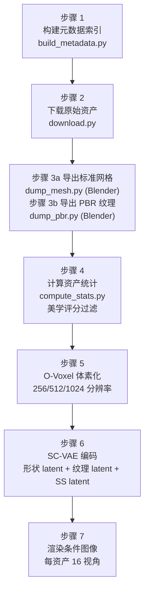

# 训练流程：数据准备与流匹配目标

TRELLIS.2 的训练分两个大阶段：先训练 SC-VAE（编码器/解码器），再训练三个生成流模型。两个阶段都依赖一个精心设计的 7 步数据预处理流水线，把 Objaverse-XL 里的原始 3D 资产转化为可供训练消费的格式。

---

## 数据来源：Objaverse-XL

训练数据主要来自 **Objaverse-XL**（Sketchfab + GitHub 子集），加上 ABO、3D-FUTURE 和 HSSD 三个数据集，总计约 **500K 个 3D 资产**。

原版 TRELLIS 用了一个质量过滤步骤：对每个资产从 4 个视角渲染，用预训练的美学评分模型打分，只保留平均分超过阈值的资产（Sketchfab 阈值 5.5，其他数据集 4.5）。TRELLIS.2 延续这个过滤，同时引入更严格的几何质量筛选（剔除退化网格、极低面数的资产）。

测试集是 Toys4k（约 4K 个玩具类物体，105 个类别），完整地从训练数据里排除，用于评测。

---

## 数据预处理流水线（7 步）

流水线代码在 `data_toolkit/`，每一步都支持 `--rank` / `--world_size` 分布式并行处理。

**步骤 3（Blender 脚本）** 是最重，需要把各种格式的原始 3D 资产（`.obj`、`.fbx`、`.blend`、`.glb` 等）标准化成统一的网格格式，并提取 PBR 材质。`data_toolkit/blender_script/` 下的脚本用无头 Blender（headless Blender）批量处理。

**步骤 5（O-Voxel 体素化）** 调用 `data_toolkit/dual_grid.py` 和 `voxelize_pbr.py`，把网格分别体素化到 256³、512³、1024³ 三个分辨率，存储为 `.npz` 文件。不同分辨率对应级联流水线的不同阶段使用。

**步骤 6（SC-VAE 编码）** 用训练好的 SC-VAE 把每个资产的 O-Voxel 编码成形状 SLat、纹理 SLat 和稀疏结构 latent，以 `.npy` 格式预先缓存。这样生成流模型的训练就不需要在线运行 SC-VAE，节省大量 GPU 时间。

**步骤 7（渲染条件图像）** 用 `nvdiffrast` 渲染每个资产的 16 视角条件图像（固定相机位置），作为训练时的图像条件。

---

## SC-VAE 训练

形状 SC-VAE 和纹理 SC-VAE 分开训练，配置在 `configs/scvae/`。

训练目标是重建损失和 KL 散度的加权和。重建损失在渲染空间计算：从重建的 O-Voxel 渲染多视角图像，和原始渲染比较 L1 + D-SSIM + LPIPS（LPIPS 是一种感知相似度损失，比像素级损失更接近人眼感受）。

$$\mathcal{L}_\text{VAE} = \mathcal{L}_\text{recon} + \beta \cdot \mathcal{L}_\text{KL}$$

KL 散度项把潜向量的分布拉向标准正态 $\mathcal{N}(0, I)$，$\beta$ 是权衡重建精度和潜空间规整度的超参数，通常取 $10^{-4}$ 量级。

训练流程：先在 512³ 分辨率训练到收敛，再用 `*_ft_512.json` 配置在更高分辨率微调。混合精度 bfloat16，AdamW 优化器。

---

## 生成流模型训练

三个生成阶段的流模型用相同的训练框架，对应训练器类 `ImageConditionedSparseFlowMatchingCFGTrainer`（在 `trellis2/trainers/` 下）。

### 流匹配训练目标

训练目标是整流流的速度预测损失：

$$\mathcal{L}_\text{flow} = \mathbb{E}_{t \sim \text{logitNorm}(1,1),\, x_0 \sim p_\text{data},\, \epsilon \sim \mathcal{N}(0,I)} \left[ \| v_\theta(x_t, t, c) - (x_0 - \epsilon) \|^2 \right]$$

**这个 loss 在做什么**：在噪声混合样本 $x_t = (1-t)x_0 + t\epsilon$ 上，让网络预测从噪声指向干净数据的方向。时间步 $t$ 从 logitNorm(1,1) 采样，比均匀分布更集中在中间时间步，经过实验验证对 3D 生成更有效。

::: details 📐 公式详解
| 子表达式 | 它是谁 | 它在干嘛 |
|---------|--------|---------|
| $x_0 - \epsilon$ | **目标方向** | 从当前噪声混合点"回到"干净数据的正确方向 |
| $v_\theta(x_t, t, c)$ | **网络的预测** | 网络站在噪声中间位置，猜应该往哪走 |
| $t \sim \text{logitNorm}(1,1)$ | **时间步采样** | 倾向于采中间时间步，比均匀采样更难、更有效 |
| $\mathbb{E}$ | **期望近似** | mini-batch 内平均（不是全量），标准随机梯度 |

**用人话读**：随机在噪声→干净数据的直线路上抽一个点，问网络怎么走最短到达终点，偏差平方就是 loss。

**为什么 logitNorm(1,1) 而不是均匀分布**：1,1 参数让分布略偏向 $t=0.5$（最嘈杂的中间区域），这些时间步的预测难度最高、对质量贡献最大。均匀采样花了过多计算在容易的端点时间步上。
:::

### 分类器自由引导（CFG）训练

训练时随机以 10% 的概率把图像条件 $c$ 替换成零向量，强迫网络同时学会有条件和无条件两种生成。推理时用引导公式：

$$v_\text{guided} = v_\text{uncond} + s \cdot (v_\text{cond} - v_\text{uncond}), \quad s=3$$

无条件 dropout 概率 0.1 是一个经验值，在生成多样性和遵从度之间取得平衡。

### 梯度裁剪策略

训练器用 `AdaptiveGradClipper`：不使用固定阈值，而是维护历史梯度范数的滑动窗口，每步取 95% 分位数作为裁剪阈值，上限 1.0。这避免了固定阈值在训练早期过度裁剪（损失收敛慢）或在训练晚期裁剪不足（不稳定）的问题。

---

## 训练规模

| 阶段 | 模型参数量 | 训练步数 | 硬件 |
|------|----------|---------|------|
| SC-VAE（形状+纹理各一个） | ~300M each | ~200K | 32× A100 |
| 稀疏结构流 | 1.3B | 400K | 64× A100 |
| 形状 SLat 流 | 1.3B | 400K | 64× A100 |
| 纹理 SLat 流 | 1.3B | 400K | 64× A100 |
| 高分辨率微调（1024/1536） | 1.3B | ~100K | 64× A100 |

批量大小 256，全部 bfloat16 混合精度，AdamW 优化器。

---

## 下一章

[第九章](./09_代码实战_从图像到3D的完整链路.md) 把所有内容串成可运行的代码：从 `example.py` 出发，完整走一遍推理链路，附上关键参数的调试指南和常见问题。
