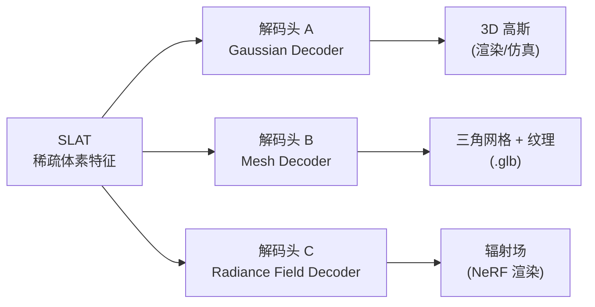
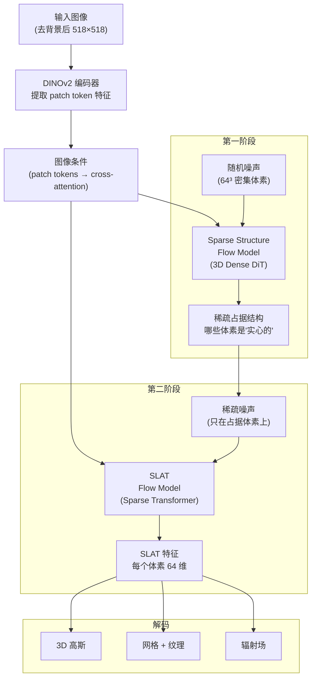
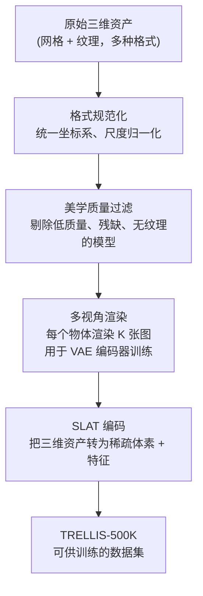

# 全景图：TRELLIS 在解决什么问题？

给定一张物体照片，自动生成可以直接送进游戏引擎、仿真器或机器人场景的三维资产——这是 TRELLIS 想解决的核心问题。本章交代为什么这件事难、TRELLIS 选择了什么设计路线，以及整个系统的两阶段流程是怎么运转的。

## 三维生成为什么比图像生成难？

图像生成已经成熟，原因之一是所有图像共享同一种表示：像素网格。不管是猫还是风景，一张图都是 H×W 个像素，可以统一送进神经网络处理。

三维世界没有这样的统一表示。常见的格式包括：

- **网格（Mesh）**：三角面片 + 顶点，渲染高效，物理引擎友好，但拓扑结构不规则，难以直接用神经网络生成
- **NeRF / 辐射场**：隐式表示，任意视角渲染质量高，但推理慢，无法直接用于物理仿真
- **点云**：无序点集，稀疏，缺少连续表面信息
- **3D 高斯（3D Gaussian Splatting）**：渲染极快，外观细腻，但椭球数量和位置不规则，也难以直接生成

历史上大多数三维生成方法选定一种格式，针对它设计生成网络，输出也只有这一种格式。用户需要不同格式就要重新跑不同的模型，或者通过格式转换（往往有质量损失）才能得到想要的结果。

TRELLIS 的核心思路是：**在生成阶段不绑定任何输出格式，推迟到解码阶段再按需选择**。这需要一种中间表示，它既能编码几何和外观，又足够结构化以支持神经网络处理。这就是 SLAT。

## SLAT：把三维空间结构化

SLAT（Structured LATent，结构化潜变量）的直觉很简单：把三维空间划成一个固定分辨率的体素网格（类似把空间切成 64³ 个小方块），只保留物体表面附近有内容的体素——"稀疏"就在这里——然后给每个有内容的体素赋予一个高维特征向量，这个特征向量编码了该位置的几何形状和外观信息。

```
三维物体
    ↓
划分体素网格（如 64³）
    ↓
只保留非空体素（稀疏占据）
    ↓
每个非空体素 → 高维特征向量（如 64 维）
    ↓
SLAT = 稀疏体素坐标 + 特征向量集合
```

这个稀疏张量既保留了三维空间的结构（体素坐标携带位置信息），又在每个位置存储了丰富的特征（特征向量携带外观和局部几何信息）。解码时，不同的解码头读取同一份 SLAT，输出不同格式：



> 三个解码头共享同一份 SLAT 输入，独立输出三种格式，互不干扰。用户可以只要网格、只要高斯，或者三种都要，一次推理全部得到。

## 两阶段生成流程

有了 SLAT 作为目标表示，生成的问题变成：如何从图像（或文字）条件出发，生成一个高质量的 SLAT？

TRELLIS 把这个过程拆成两个阶段，每个阶段都用 Rectified Flow 模型（一种基于直线路径插值的生成模型，参见[前置知识：Flow Matching](/前置知识/000g_前置知识_Flow_Matching与连续归一化流)）来完成。



> 两个阶段串联：第一阶段决定"哪里有东西"（稀疏结构），第二阶段决定"每个位置长什么样"（SLAT 特征）。图像条件通过 cross-attention 注入两个阶段的生成主干。

**为什么要拆成两阶段？**

直接生成 SLAT 的难点是：网络需要同时学会"在哪里生成体素"和"每个体素长什么样"这两件完全不同的事。第一件事是离散的结构决策，第二件事是连续的外观生成。把它们解耦，分别用适合各自问题的网络架构处理，比混在一起更容易训练、效果也更好。

第一阶段的输入是密集的 64³ 体素噪声，输出是二值化的占据掩码——这适合用标准的三维卷积/全注意力网络处理。第二阶段只在非空体素上操作，用专门设计的稀疏 Transformer 处理这个不规则点集，在计算上比处理整个密集空间高效得多。

## 训练数据：TRELLIS-500K

TRELLIS 的生成质量很大程度上来自训练数据的规模和质量管理。TRELLIS-500K 是专门为这个项目整理的三维资产数据集，共收录 50 万个物体，从多个来源聚合后经过统一处理和质量过滤。

### 数据来源

| 来源 | 规模 | 特点 |
|------|------|------|
| [Objaverse](https://objaverse.allenai.org/) | ~800K（取子集） | 众包贡献，覆盖品类极广，几何和纹理质量参差不齐 |
| [ABO（Amazon Berkeley Objects）](https://amazon-berkeley-objects.s3.amazonaws.com/index.html) | ~147K | 亚马逊真实商品的三维扫描，高质量几何和 PBR 材质 |
| [3D-FUTURE](https://tianchi.aliyun.com/specials/promotion/alibaba-3d-future) | ~16K | 精细家居家具模型，几何细节丰富 |
| [HSSD（Habitat Synthetic Scenes Dataset）](https://3dscenegraph.stanford.edu/) | ~18K 对象实例 | 室内场景中的物体实例，适合室内场景生成 |
| [Toys4k](https://github.com/rehg-lab/lowshot-shapegen) | ~4K | 玩具类物体，形状多样 |

Objaverse 是数量最大的来源，但原始质量高低不一；ABO 质量最高但数量有限。混合多个来源的目的是同时获得**规模**（模型能见到足够多的形状变化）和**质量**（有足够多的高保真样本拉高分布的下限）。

### 数据处理流程

原始数据不能直接用于训练 TRELLIS，需要经过以下处理：



**格式规范化**：来自不同来源的资产用不同坐标系和尺度，需统一（Z 轴朝上、物体尺度归一化到单位立方体内）。

**质量过滤**：剔除几何残缺、纹理缺失、UV 展开错误、或美学评分过低的模型。官方使用了基于美学评分的自动过滤，参考了 LAION 等图像美学评分方法在三维领域的变体。过滤掉低质量资产是防止模型学到错误几何习惯的关键步骤。

**多视角渲染**：每个物体在球面上均匀采样若干视角，用渲染器生成 RGB 图像（以及深度和法线，用于几何对齐）。这些图像既用于训练 VAE 编码器（把三维资产转成 SLAT latent），也用于训练生成模型的图像条件分支。

**SLAT 编码**：每个资产通过 VAE 编码器转成 SLAT 稀疏体素特征——这是生成模型实际学习的目标。

### 预训练模型

| 模型 | 条件 | 参数量 |
|------|------|--------|
| TRELLIS-image-large | 图像 | 1.2B |
| TRELLIS-text-base | 文本 | 342M |
| TRELLIS-text-large | 文本 | 1.1B |
| TRELLIS-text-xlarge | 文本 | 2.0B |

文本条件版本额外需要文本-三维配对数据（从 Objaverse 的物体描述中获得），而图像条件版本只需要三维资产本身。图像到三维的映射比文本到三维确定得多（一张图里已经包含了形状和外观的完整视觉信息），所以图像条件模型生成质量更高，官方也推荐优先使用图像版本。

## 本系列接下来的路线

全局图有了，后续章节逐层深入：

- **第 2 章**：SLAT 的设计细节——体素分辨率怎么选、特征怎么初始化、和其他三维表示相比的具体优劣
- **第 3 章**：第一阶段的稀疏结构生成——SparseStructureFlowModel 的架构
- **第 4 章**：第二阶段的 SLAT 生成——稀疏 Transformer 和 SLAT VAE 的编解码
- **第 5 章**：三种解码头的内部结构
- **第 6 章**：DINOv2 图像条件如何注入生成主干
- **第 7 章**：完整 Pipeline 代码走读和采样参数调优
