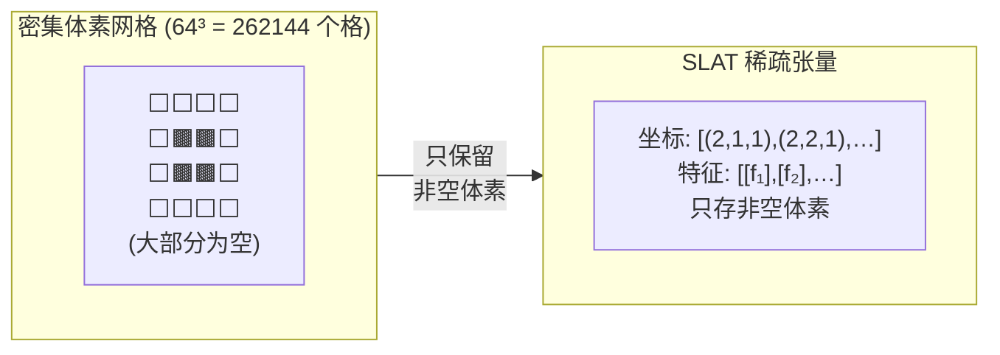
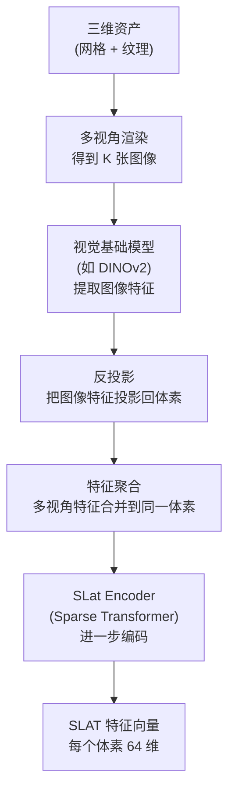

# SLAT 表示设计：为什么是稀疏体素 + 多视角特征

SLAT 是 TRELLIS 所有设计决策的起点。这一章解释它的具体数据格式、为什么选这种表示而不是点云或隐式场、以及 SLAT VAE 如何把原始三维资产压缩成可供生成模型使用的 latent。

## SLAT 是什么，具体长什么样

从数据结构的角度，SLAT 是一个稀疏张量：

- **坐标部分**：若干个体素的三维整数坐标 `(x, y, z)`，范围在 `[0, resolution-1]³` 内，通常 `resolution=64`
- **特征部分**：每个坐标对应一个 C 维向量（默认 `C=64`），编码该位置的几何和外观信息

稀疏体素数量远小于 `64³=262144`。一个普通物体的表面体素大约只占整个网格的 3%–8%，所以只存非空体素大幅节省了内存和计算。



> 左侧密集网格里大多数格子是空的；SLAT 只记录有物体的那些格子的坐标和特征，内存占用远小于密集表示。

在代码层面，TRELLIS 用 `sp.SparseTensor` 类封装这个结构：
- `sp_tensor.coords`：形状 `(N, 4)` 的整数张量，第一列是 batch index，后三列是 `(x, y, z)` 坐标
- `sp_tensor.feats`：形状 `(N, C)` 的浮点张量，每行对应一个非空体素的特征向量

## SLAT 里的特征向量从哪里来

初始 SLAT 特征不是手工设计的，而是由 SLAT VAE 的**编码器**从已有三维资产中学到的。编码器是一个 Sparse Transformer，读取把三维资产渲染成多视角图像后提取的视觉特征，把这些特征聚合到对应体素上，然后输出每个体素的 latent 向量。

为什么用多视角图像特征而不是直接用几何？原因很实际：高质量的三维资产本来就有纹理和材质，这些信息天然地体现在图像上；而几何表示（顶点、面片、SDF）往往不携带外观，需要额外设计外观的编码方式。从多视角图像出发，几何和外观被同时编码进一个特征向量里，没有信息分离的问题。

编码流程如下：



> 关键步骤是"反投影"：对每个体素，找出它在各视角图像上的投影位置，取出对应的图像特征，然后聚合（平均或拼接）成一个向量。这个向量同时携带了"这里有什么形状"（可见于遮挡关系、深度变化）和"这里是什么颜色/材质"（可见于像素颜色、纹理模式）两类信息。

## SLAT VAE：编码与重建

SLAT VAE 是一个变分自编码器（VAE），目的是把三维资产压缩成可供扩散模型处理的 latent 空间，并确保这个空间分布接近标准正态分布。

**编码器（SLatEncoder）**接受稀疏张量，输出每个体素的均值（mean）和对数方差（logvar），然后通过重参数化采样出 latent 向量 `z`。代码里：

```python
# encoder.py: SLatEncoder.forward()
h = super().forward(x)          # Sparse Transformer 主干
h = h.replace(F.layer_norm(h.feats, h.feats.shape[-1:]))
h = self.out_layer(h)           # 线性层: model_channels → 2 * latent_channels

mean, logvar = h.feats.chunk(2, dim=-1)
std = torch.exp(0.5 * logvar)
z = mean + std * torch.randn_like(std)  # 重参数化
z = h.replace(z)
```

输出 `z` 的形状和输入 `x` 完全一样——同样的稀疏体素坐标，只是每个体素的特征维度变成了 latent 维度（`latent_channels`）。这意味着 SLAT VAE **不改变空间结构**，只压缩每个体素的特征表示。

三个解码器（`SLatGaussianDecoder`、`SLatMeshDecoder`、`SLatRadianceFieldDecoder`）都接受同一份 latent `z`，各自输出不同格式。解码器也是 Sparse Transformer，读取体素特征后，通过一个输出线性层预测目标格式所需的参数（比如高斯解码器预测每个体素内多个高斯椭球的位置、旋转、缩放、颜色、透明度）。

## 为什么这个设计比其他方案好

对比几种常见方案：

| 表示 | 空间规则性 | 几何+外观统一 | 多格式解码 | 缺点 |
|------|-----------|--------------|-----------|------|
| 点云 | 无序，不规则 | 需要额外外观 | 困难 | 无拓扑，渲染质量差 |
| 密集体素 | 规则 | 可以 | 较易 | 内存 O(N³)，空间极大 |
| NeRF/SDF | 隐式，无结构 | 隐式编码 | 需要重新训练 | 生成速度慢，难以编辑 |
| **SLAT** | **稀疏，有序坐标** | **多视角特征** | **共享 latent** | 需要稀疏算子支持 |

SLAT 的核心优势是把三个需求统一在一个表示里：
1. 空间上有结构（体素坐标），可以用 Transformer 直接处理位置关系
2. 只存非空体素，内存可控
3. 特征向量里同时携带几何和外观，不同解码头可以各自提取需要的信息

代价是需要专门的稀疏算子（稀疏卷积、稀疏注意力），依赖 `spconv`、`kaolin` 等库，安装比标准 PyTorch 稍复杂。

## 推理时 SLAT 如何被规范化

训练完 SLAT VAE 后，生成模型需要在 latent 空间里做扩散采样。为了让 latent 分布更接近标准正态（扩散模型的初始噪声假设），TRELLIS 对 SLAT 特征做了全局均值/方差归一化。这个归一化的参数（`slat_normalization` 中的 `mean` 和 `std`）存在模型权重里，推理时在采样完成后反向应用：

```python
# trellis_image_to_3d.py: sample_slat()
# 采样完 latent 后，用存储的统计量还原真实尺度
std = torch.tensor(self.slat_normalization['std'])[None].to(slat.device)
mean = torch.tensor(self.slat_normalization['mean'])[None].to(slat.device)
slat = slat * std + mean
```

这一步在送入解码头之前完成——生成模型看到的是规范化空间，解码器看到的是原始 latent 尺度。

下一章进入生成流程的第一阶段：稀疏占据结构的 Rectified Flow 生成。
