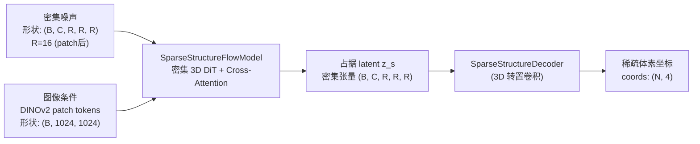

# 第一阶段：稀疏占据结构的 Rectified Flow 生成

生成流程的第一阶段只做一件事：决定哪些体素是有物体的。输入是图像条件和随机噪声，输出是一张二值化的三维占据图——"这个格子有内容"或"这个格子是空的"。本章拆解 `SparseStructureFlowModel` 的结构，以及它如何用 Rectified Flow 从噪声里生成这张占据图。

## 为什么要把占据结构单独生成

SLAT 表示里，体素坐标和体素特征是两件不同性质的事。坐标决定了"哪里有东西"——这是一个关于形状轮廓的离散决策；特征决定了"那里是什么样子"——这是一个连续的外观/细节生成问题。把两件事混在一个模型里，网络需要同时学会两种截然不同的能力，训练难度大。

拆开之后，第一阶段的模型只需要学会生成合理的三维形状轮廓，第二阶段的模型则拿到已经确定的体素位置，专注于填充细节。这个解耦在实践中显著改善了生成质量，尤其是对形状复杂或细节丰富的物体。

## 第一阶段的输入输出



> 注意这里用的是**密集**体素网格，不是稀疏的——第一阶段还不知道哪里有体素，所以必须在整个空间上操作。稀疏只在第二阶段才用上。

模型输入是分辨率 `resolution=16`（patch size 为 2，对应原始分辨率 32 的体素空间）的密集噪声张量，经过若干步 Euler 积分采样后，解码器把连续的 latent 转化为二值化的占据掩码，`argwhere` 取出非零坐标：

```python
# trellis_image_to_3d.py: sample_sparse_structure()
flow_model = self.models['sparse_structure_flow_model']
reso = flow_model.resolution
noise = torch.randn(num_samples, flow_model.in_channels, reso, reso, reso).to(self.device)

z_s = self.sparse_structure_sampler.sample(
    flow_model, noise, **cond, **sampler_params, verbose=True
).samples

decoder = self.models['sparse_structure_decoder']
coords = torch.argwhere(decoder(z_s) > 0)[:, [0, 2, 3, 4]].int()
```

`decoder(z_s) > 0` 这一步把连续输出二值化：大于 0 的体素认为是有物体的，取出坐标后作为第二阶段的输入。

## SparseStructureFlowModel 的结构

这个模型是一个密集三维 DiT（Diffusion Transformer），设计上和二维图像生成里的 DiT 非常相似，只是操作的是三维体素空间。

```mermaid
flowchart TD
    subgraph 输入处理
        NOISE["密集噪声 (B, C, R³)"]
        PATCH["patchify\n把 2³ 小块展平\n→ (B, (R/2)³, C·8)"]
        PROJ["输入投影层\n(B, (R/2)³, D)"]
        POS["绝对位置编码\n(APE) 或 RoPE"]
    end

    subgraph 时间步编码
        T["时间步 t ∈ [0,1]"]
        TEMB["TimestepEmbedder\n正弦编码 → MLP\n→ D 维向量"]
        ADA["AdaLN 调制\n(6D → scale/shift/gate)"]
    end

    subgraph 主干 Block × L
        CA["Cross-Attention\n以图像条件为 KV"]
        SA["Self-Attention\n体素间关系"]
        MLP["SwiGLU MLP"]
    end

    OUT["输出层\nunpatchify\n→ (B, C, R, R, R)"]

    NOISE --> PATCH --> PROJ --> POS
    T --> TEMB --> ADA
    POS --> 主干 Block × L
    ADA --> 主干 Block × L
    主干 Block × L --> OUT
```

几个关键设计：

**Patchify/Unpatchify**：模型不在原始分辨率 32³ 上操作，而是先用 patch size=2 把每个 2×2×2 小块展平成一个 token，把空间分辨率降到 16³，再在这 4096 个 token 上做自注意力。推理结束后用 unpatchify 还原到原始分辨率。这样做的原因是在 32³=32768 个位置上做全注意力计算量太大，patch 化后降到 4096 可接受。

**共享 AdaLN 调制（share_mod）**：配置里有个 `share_mod` 选项。开启时，所有 Block 共用一套 AdaLN 参数，只用时间步 embedding 调制，参数量更小；关闭时每个 Block 有独立的调制参数。

**图像条件通过 Cross-Attention 注入**：每个 Block 里，体素 token 作为 Query，DINOv2 提取的图像 patch token 作为 Key 和 Value。这样每个体素位置在生成时都能看到图像的局部和全局外观信息。

**Classifier-Free Guidance（CFG）**：采样时使用 CFG，负条件是全零的 `neg_cond`（对应无图像条件）。CFG 强度 `cfg_strength` 控制生成结果和输入图像的一致程度。

## Rectified Flow 采样过程

Rectified Flow 的基本思想：把噪声 `x_1` 和真实数据 `x_0` 之间的路径定义为直线插值 `x_t = (1-t)·x_0 + t·x_1`，训练网络预测这条直线的速度方向 `v = x_0 - x_1`，推理时用 Euler 积分沿速度场走回去。

采样时，`FlowEulerSampler` 在时间步 `t` 从 1 走到 0，每一步：

```
x_{t-Δt} = x_t - Δt · v_θ(x_t, t, cond)
```

默认用 12 步，质量够用且速度合理。`cfg_strength` 默认 7.5，较高的值让形状更贴合输入图像但多样性降低。

## 解码器：latent 转占据掩码

`SparseStructureDecoder` 是一个轻量的三维转置卷积网络，把 Rectified Flow 采样出的 latent `z_s` 映射到每个体素的占据概率。阈值 0 把连续输出二值化——这是一个硬决策，决定第二阶段能在哪里生成特征。

这个硬决策是生成质量的重要影响因素：如果第一阶段漏了某些体素（误判为空），第二阶段就无法在那里补充细节，导致局部形状缺失。反之，如果第一阶段多生成了虚假体素，第二阶段会在那里产生噪声细节。所以第一阶段的 Flow 模型需要对形状轮廓有足够精确的把握。

下一章进入第二阶段：在已知占据结构的基础上，用 SLAT Flow Model 生成每个体素的特征向量。
