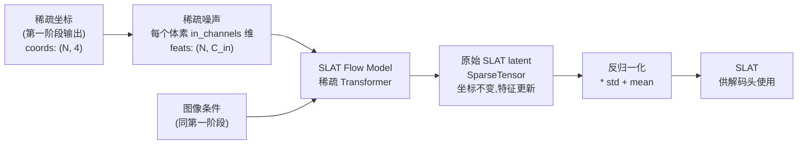

# 第二阶段：SLAT 特征的 Rectified Flow 生成

拿到第一阶段的体素坐标后，第二阶段的任务是：在这些稀疏位置上生成有意义的特征向量，让后续解码头能从中提取高斯参数、网格、或辐射场。本章拆解 SLAT Flow Model 的稀疏 Transformer 结构，以及 SLAT VAE 编解码器的工作原理。

## 第二阶段输入输出



关键区别在于这里处理的是**稀疏张量**，不是密集体素网格。`SparseTensor` 的坐标在整个第二阶段保持不变，只有特征（feats）随 Euler 积分更新。这使得模型可以只在有物体的位置做计算，避免了对空体素的无谓运算。

## SLAT Flow Model 的稀疏 Transformer

`StructuredLatentFlowModel` 的架构和第一阶段的密集 DiT 高度相似，但把所有操作替换成了稀疏版本：

```mermaid
flowchart TD
    subgraph 输入处理
        SP["稀疏噪声\n(N, C)"]
        PROJ["SparseLinear\n输入投影\n→ (N, D)"]
        PE["位置编码\n坐标 → APE 或 RoPE\n注入空间信息"]
    end

    subgraph 时间 & 调制
        T["时间步 t"]
        TEMB["TimestepEmbedder"]
        ADA["AdaLN 调制系数"]
    end

    subgraph Block × L
        SA_SP["稀疏自注意力\nSwin 窗口注意力\n(shift_window/swin 模式)"]
        CA_SP["稀疏跨注意力\nQ=体素 token\nKV=图像 patch token"]
        MLP_SP["SparseLinear MLP\n(SwiGLU)"]
    end

    OUT_SP["SparseLinear 输出层\n→ (N, C_out)"]

    SP --> PROJ --> PE
    T --> TEMB --> ADA
    PE --> Block × L
    ADA --> Block × L
    Block × L --> OUT_SP
```

**稀疏窗口注意力（Swin 模式）**：密集 DiT 可以做全局自注意力（4096 个 token），稀疏 Transformer 的非空体素分布不规则，全局注意力的计算量无法预测。TRELLIS 使用 Swin 风格的窗口注意力（`attn_mode="swin"`），把体素空间分成大小为 `window_size=8` 的局部窗口，每个窗口内做自注意力。这样每次注意力的 token 数量有上界，计算量可控。

**稀疏 SparseLinear 替代 nn.Linear**：普通线性层操作密集张量（批次维度 × 特征维度），稀疏线性层操作 `(N, C)` 形状的特征矩阵，其中 N 是非空体素数。其他操作（归一化、激活函数）也都有对应的稀疏版本，在 `trellis/modules/sparse/` 下实现。

## SLAT VAE 编码器的角色

在训练阶段，真实三维资产需要先通过 SLAT VAE 编码成 latent，才能作为 Rectified Flow 的训练目标。SLAT VAE 的编码器（`SLatEncoder`）是另一个稀疏 Transformer，输入是从真实资产提取的多视角视觉特征构成的稀疏张量，输出是每个体素的 latent 均值和方差（用于 VAE 的重参数化）：

```python
# encoder.py: SLatEncoder.forward()
h = super().forward(x)         # Sparse Transformer 主干
h = h.replace(F.layer_norm(h.feats, h.feats.shape[-1:]))
h = self.out_layer(h)          # → (N, 2 * latent_channels)

mean, logvar = h.feats.chunk(2, dim=-1)
std = torch.exp(0.5 * logvar)
z = mean + std * torch.randn_like(std)   # 重参数化采样
z = h.replace(z)               # 保留坐标，替换特征
```

输出 `z` 的坐标和输入完全相同，只有每个体素的特征维度从原始视觉特征维度压缩到了 `latent_channels`（默认 64）。

训练 SLAT Flow Model 时，真实数据就是这些 `z`；推理时，Flow Model 从标准正态噪声出发，生成同样分布的 `z`，再喂给三种解码头。

## 采样完成后的反归一化

Rectified Flow 在规范化空间里采样（均值接近 0，方差接近 1）。采样完成后，需要把结果还原到 SLAT VAE 的真实 latent 尺度，才能送给解码头：

```python
# trellis_image_to_3d.py: sample_slat()
std = torch.tensor(self.slat_normalization['std'])[None].to(slat.device)
mean = torch.tensor(self.slat_normalization['mean'])[None].to(slat.device)
slat = slat * std + mean
```

`slat_normalization` 的均值和方差是在训练数据的 SLAT latent 上统计的全局值，模型权重中存储。

## 为什么稀疏 Transformer 在这里比密集 3D 卷积好

第一阶段用密集 DiT 是因为那时候还不知道哪里有体素，必须在全空间操作。第二阶段体素位置已知，非空体素只占全空间的几个百分点。如果继续用密集网络，绝大多数计算都浪费在空体素上。

稀疏 Transformer 只对非空体素的特征做变换，计算量和非空体素数 N 成线性关系，而不是和 `resolution³` 成正比。对于一个 64³ 空间里约 5000 个非空体素的典型物体，稀疏处理比密集处理快约 50 倍。

下一章看三种解码头如何把同一份 SLAT latent 转换成高斯、网格和辐射场三种不同格式。
