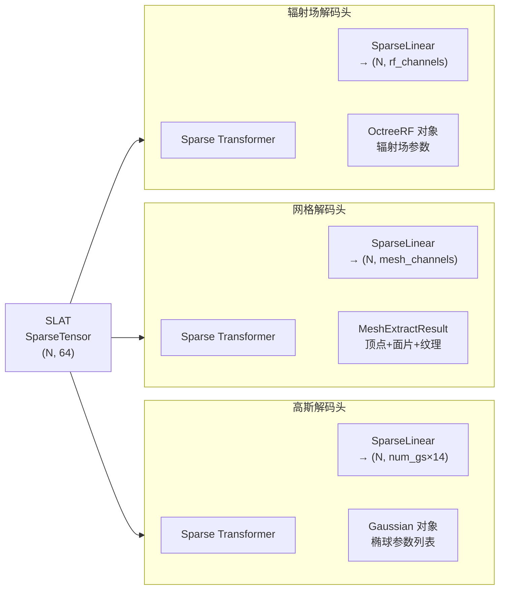

# 三种解码头：高斯、网格、辐射场的输出机制

同一份 SLAT latent，接上不同的解码头，输出三种格式。本章解释每个解码头的输入、输出参数，以及它们各自的设计取舍。

## 共同结构

三个解码头（`SLatGaussianDecoder`、`SLatMeshDecoder`、`SLatRadianceFieldDecoder`）都共享同一套骨架：

1. 继承 `SparseTransformerBase`，主干是稀疏 Swin Transformer
2. 接受同一份 SLAT SparseTensor 作为输入
3. 末尾接一个 `SparseLinear` 输出层，把每个体素的特征映射到该格式所需的参数
4. `to_representation()` 方法把网络输出转换为对应的 Python 对象



## 高斯解码头

每个体素内放多个三维高斯椭球（`num_gaussians`，默认约 8–32 个，具体见配置），每个高斯椭球需要以下参数：

| 参数 | 维度 | 含义 |
|------|------|------|
| `_xyz` | 3 | 椭球中心位置（相对体素中心的偏移，通过 tanh 限制在体素内） |
| `_features_dc` | 3 | 颜色（0 阶球谐系数，RGB） |
| `_scaling` | 3 | 三轴缩放（椭球大小） |
| `_rotation` | 4 | 旋转（四元数） |
| `_opacity` | 1 | 不透明度 |

每个高斯共 14 个参数，`num_gaussians` 个高斯共需 `num_gaussians × 14` 维输出。

**偏移量的处理**是这里的有趣细节。网络不直接预测绝对坐标，而是预测相对于一组预先计算好的"初始扰动"（`offset_perturbation`）的残差。初始扰动用 Hammersley 序列均匀分布在体素内，保证高斯椭球初始就在体素内部均匀分布，再由网络微调到正确位置：

```python
# decoder_gs.py: _build_perturbation()
perturbation = [hammersley_sequence(3, i, self.rep_config['num_gaussians'])
                for i in range(self.rep_config['num_gaussians'])]
perturbation = torch.tensor(perturbation).float() * 2 - 1  # 映射到 [-1, 1]
perturbation = perturbation / self.rep_config['voxel_size']
perturbation = torch.atanh(perturbation)  # 反 tanh，配合 forward 里的 tanh
```

`to_representation()` 把网络输出的参数组装成标准的 `Gaussian` 对象（兼容 3D Gaussian Splatting 的渲染接口），可以直接用 3DGS 渲染器渲染或导出为 `.ply` 文件。

## 网格解码头

网格解码头基于改进版 **FlexiCubes**——一种从体素特征提取三角网格的可微方法。每个体素输出顶点位置（以及顶点属性，用于纹理和法线），FlexiCubes 算法把相邻体素的输出拼合成连续的三角面片。

额外引入 `SparseSubdivideBlock3d` 对稀疏张量做细分（把一个体素拆成 8 个子体素），提升网格的细节分辨率，再通过上采样块逐步恢复到更高分辨率。

输出是 `MeshExtractResult`，包含顶点坐标、面片索引和顶点属性。在 pipeline 层面，`postprocessing_utils.to_glb()` 把高斯的外观（颜色/纹理）烘焙到网格上，最终导出 `.glb`：

```python
# example.py
glb = postprocessing_utils.to_glb(
    outputs['gaussian'][0],   # 提供外观（纹理颜色）
    outputs['mesh'][0],       # 提供几何（顶点面片）
    simplify=0.95,            # 简化掉 95% 的三角形
    texture_size=1024,
)
glb.export("sample.glb")
```

这个两步流程（高斯提供外观 + 网格提供几何）是 TRELLIS 获得高质量 GLB 的关键：纯网格解码头的纹理分辨率受体素网格分辨率限制，但用高斯渲染烘焙的纹理可以捕获更细腻的颜色细节。

## 辐射场解码头

辐射场解码头输出的是基于**八叉树**的辐射场表示（`OctreeRF`），由 `diffoctreerast`（TRELLIS 团队自研的 CUDA 实时可微八叉树渲染器）渲染。

每个体素输出辐射场参数（颜色、密度等），八叉树渲染器支持实时渲染和视角合成，可以处理复杂的透明度和次表面散射效果。辐射场在视觉质量上通常比高斯更平滑，但渲染速度略慢。

## 三种格式的取舍

| 格式 | 渲染速度 | 视觉质量 | 物理仿真 | 下游工具 |
|------|---------|---------|---------|---------|
| 3D 高斯 | 极快（实时） | 高，细腻 | 不支持 | 3DGS 渲染器、`.ply` |
| 网格 + 纹理 | 快 | 中（受分辨率限） | 支持 | 所有游戏引擎、仿真器 |
| 辐射场 | 中等 | 高，平滑 | 不支持 | NeRF 渲染器 |

机器人和仿真场景通常需要网格（用于碰撞检测和物理引擎），游戏和实时渲染偏好高斯，纯视觉渲染任务可以选辐射场。一次推理，三种格式随取随用。

下一章看图像条件如何注入生成主干。
