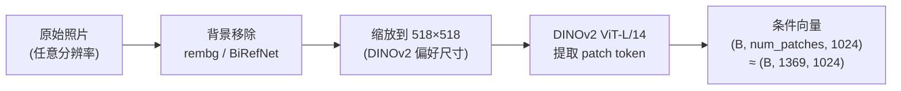
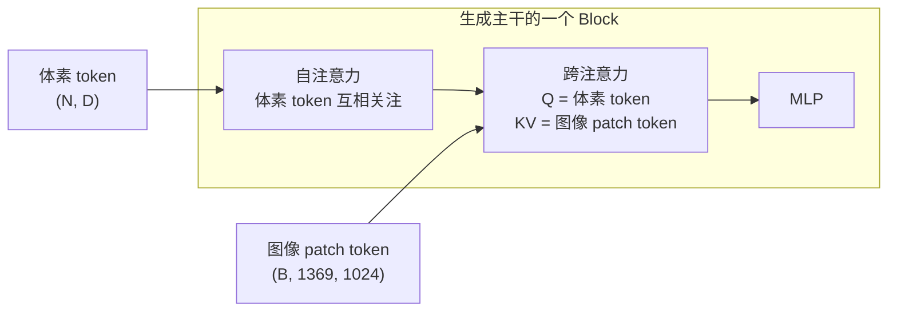

# 图像条件：DINOv2 如何把一张照片转化成生成的控制信号

给定一张物体照片，TRELLIS 生成出来的三维形状和外观必须和照片对应。这件事靠图像条件（image conditioning）完成——从照片里提取信息，再注入生成主干的每个 Transformer 块。本章解释 DINOv2 如何提取条件特征，以及 cross-attention 和 CFG 怎么把它们变成对生成过程的控制。

## 从照片到条件向量

TRELLIS 用 DINOv2 提取图像特征，而不是 CLIP 或 SigLIP。这个选择有理由：DINOv2 是纯视觉自监督模型，patch token 携带大量空间结构信息（哪里有边缘、哪里有纹理、对象的部位在哪里），而不只是语义类别。对于三维重建任务，空间结构比类别更重要——模型需要知道物体的轮廓、曲面、材质细节，而不只是"这是一把椅子"。

图像处理流程：



`518 / 14 ≈ 37`，所以 518×518 的图像被分成约 37×37=1369 个 patch，每个 patch 对应一个 1024 维向量。这 1369 个向量保留了完整的空间布局信息——左上角的 patch 向量描述照片左上角，右下角的 patch 向量描述右下角，中间区域的 patch 向量描述中间区域。

> 背景移除是重要的预处理步骤：带背景的图像会导致 DINOv2 把背景特征也编码进条件，影响生成的三维形状。去掉背景后，patch token 更纯粹地描述目标物体本身。

在代码里，`encode_image()` 完成这一步：

```python
# trellis_image_to_3d.py: encode_image()
image = self.image_processor(image)          # 去背景 + 缩放
image = image.to(self.device)
cond = self.models['image_feature_extractor'](image)  # DINOv2
cond = cond.last_hidden_state                # 取所有 patch token
```

## Cross-Attention：每一步生成都看一眼图像

DINOv2 提取出来的 patch token 通过 cross-attention 注入生成主干。两个阶段的流程完全相同：在每个 Transformer block 里，体素/patch token 作为 Query，图像 patch token 作为 Key 和 Value：



这个设计让每个体素位置在每次前向传播里都能访问到整张图像的全部视觉信息——它可以关注最相关的图像区域（attention 权重自动决定），而不是强行聚合一个全局向量。

两个阶段的 cross-attention 实现方式一样，只是 Q 的来源不同：
- 第一阶段（`SparseStructureFlowModel`）：密集体素 token 作为 Q
- 第二阶段（`StructuredLatentFlowModel`）：稀疏体素 token（SparseTensor）作为 Q

## CFG：控制"跟图像多紧"

Classifier-Free Guidance（CFG）是控制生成结果和条件一致程度的标准手段。采样时同时跑两次前向传播：一次带图像条件（`cond`），一次带空条件（`neg_cond`）：

$$\hat{v} = v_\theta(x_t, t, \emptyset) + \text{cfg\_strength} \cdot \left(v_\theta(x_t, t, \text{cond}) - v_\theta(x_t, t, \emptyset)\right)$$

空条件用全零张量表示（`neg_cond = zeros_like(cond)`）。`cfg_strength` 越大，生成结果越贴近输入图像，但多样性降低、细节可能过度强化；越小则结果更自由，和图像可能出现偏差。

两个阶段分别有各自的 `cfg_strength` 参数，可以独立调节：

```python
# trellis_image_to_3d.py: sample_sparse_structure()
z_s = self.sparse_structure_sampler.sample(
    flow_model, noise,
    **cond,                         # 带图像条件
    cfg_strength=ss_guidance_strength,   # 第一阶段 CFG，默认 7.5
    ...
)

# sample_slat()
slat = self.slat_sampler.sample(
    flow_model, noise,
    **cond,
    cfg_strength=slat_guidance_strength,  # 第二阶段 CFG，默认 3.0
    ...
)
```

第一阶段 CFG 较强（7.5）是因为形状轮廓需要和图像紧密一致；第二阶段 CFG 较弱（3.0）是因为外观细节有更多合理的变化空间，过强的 CFG 会让纹理过饱和。

## 多图像输入

TRELLIS 支持多张图像作为条件，在 pipeline 里通过简单的 token 拼接实现：

```python
# 多图像：把多张图像的 patch token 拼接在一起
cond_list = [self.encode_image(img) for img in images]
cond = torch.cat(cond_list, dim=1)   # (B, n_imgs × 1369, 1024)
```

Cross-attention 的 KV 维度随图像数量线性增长，模型不需要任何特殊修改就能处理多视角输入。多图像输入通常能显著改善被遮挡区域（单张图看不到的背面）的生成质量。

下一章是完整 pipeline 的代码走读和参数调优指南。
