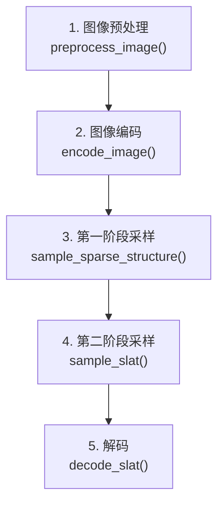

# 完整 Pipeline 走读与参数调优

前六章分别拆解了 TRELLIS 的各个组件。本章把它们串起来，沿 `TrellisImageTo3DPipeline.run()` 的执行顺序走一遍完整流程，同时说清楚每个参数的作用和调节思路。

## Pipeline 的五个阶段



整个 pipeline 是一个线性执行链，没有分支。下面按顺序走每一步。

## 阶段 1：图像预处理

```python
# trellis_image_to_3d.py: preprocess_image()
image = self.image_processor(image)
```

`image_processor` 做两件事：去除背景（默认用 `rembg` 或 `BiRefNet`），然后把图像缩放到 518×518 并归一化到 DINOv2 的期望输入范围。

去背景的质量对最终结果影响较大。如果输入图像背景复杂或物体边缘不清晰，可以考虑用质量更高的分割模型预处理，再把去背景后的图像传给 pipeline，跳过 pipeline 内部的去背景步骤：

```python
# 跳过内部去背景，直接传已去背景的 RGBA 图像
pipeline.preprocess_image = lambda img: img  # monkey-patch 绕过
```

## 阶段 2：图像编码

```python
# trellis_image_to_3d.py: encode_image()
cond = self.models['image_feature_extractor'](image).last_hidden_state
neg_cond = torch.zeros_like(cond)  # CFG 用的空条件
```

这一步没有用户可调参数。`neg_cond` 是全零张量，对应"无图像条件"，用于 CFG 的对比采样。

多图像输入在这里扩展：把多张图像的 patch token 拼接：

```python
cond = pipeline.encode_image(images)  # 传 list[Image]，自动拼接
```

## 阶段 3：第一阶段采样（稀疏结构）

```python
outputs = pipeline.run(
    image,
    seed=42,
    # -- 第一阶段参数 --
    sparse_structure_sampler_params={
        "steps": 12,          # Euler 积分步数
        "cfg_strength": 7.5,  # CFG 强度
    },
    ...
)
```

| 参数 | 默认值 | 作用 |
|------|--------|------|
| `steps` | 12 | Euler 积分步数。步数越多形状越精确，但耗时线性增加。超过 20 步边际收益很小 |
| `cfg_strength` | 7.5 | CFG 强度。越高越贴近图像轮廓，但可能过度锐化；越低形状更自由但可能偏离 |

形状偏离输入图像时，先尝试提高 `cfg_strength`（到 10–12）而不是增加步数。

## 阶段 4：第二阶段采样（SLAT 特征）

```python
    slat_sampler_params={
        "steps": 12,
        "cfg_strength": 3.0,
    },
```

| 参数 | 默认值 | 作用 |
|------|--------|------|
| `steps` | 12 | 同第一阶段 |
| `cfg_strength` | 3.0 | 明显低于第一阶段。外观细节比轮廓有更多合理变化空间，过高会导致纹理过饱和、颜色失真 |

纹理颜色和图像对不上时，可小幅上调（到 4–5）；颜色过于鲜艳/失真时下调（到 2–2.5）。

## 阶段 5：解码

```python
outputs = pipeline.run(image, ...)
# outputs 包含三种表示：
outputs['gaussian']        # list[Gaussian]，每个样本一个
outputs['mesh']            # list[MeshExtractResult]
outputs['radiance_field']  # list[OctreeRF]
```

解码本身没有用户参数。后处理在导出时控制：

```python
# 导出高斯（.ply）
outputs['gaussian'][0].save_ply("output.ply")

# 导出网格（.glb），用高斯外观烘焙纹理
glb = postprocessing_utils.to_glb(
    outputs['gaussian'][0],
    outputs['mesh'][0],
    simplify=0.95,     # 三角形简化率：0 = 不简化，0.95 = 保留 5%
    texture_size=1024, # 烘焙纹理分辨率，1024 或 2048
)
glb.export("output.glb")

# 导出视频（渲染旋转视角）
video = render_utils.render_video(outputs['gaussian'][0])['color']
imageio.mimwrite("output.mp4", video, fps=30)
```

`simplify` 和 `texture_size` 是调优 GLB 质量和文件体积的两个关键旋钮：
- 机器人仿真：`simplify=0.9`（保留更多几何），`texture_size=512`（仿真器通常不需要高分辨率纹理）
- 游戏资产：`simplify=0.95–0.98`，`texture_size=2048`

## 多样本生成

生成多个候选，选最好的：

```python
outputs = pipeline.run(
    image,
    num_samples=4,  # 同时生成 4 个
    seed=0,
)
# outputs['gaussian'] 是长度 4 的 list，逐个查看选择最好的
```

`num_samples > 1` 时 GPU 显存消耗线性增加。2B 模型单样本需要约 24 GB，4 个样本约 40 GB（批处理有部分共享）。

## 参数速查表

| 问题现象 | 推荐调整 |
|---------|---------|
| 形状和图像不像 | 提高 `ss_cfg_strength`（7.5 → 10） |
| 形状过于锐利/棱角 | 降低 `ss_cfg_strength`（7.5 → 5） |
| 纹理颜色偏差大 | 小幅提高 `slat_cfg_strength`（3.0 → 4.5） |
| 纹理过饱和/失真 | 降低 `slat_cfg_strength`（3.0 → 2.0） |
| 形状细节不够 | 增加 `steps`（12 → 25），效果有限 |
| GLB 文件过大 | 提高 `simplify`（0.95 → 0.98），降低 `texture_size`（1024 → 512） |
| 背面/遮挡区域质量差 | 增加输入视角（多图像输入） |
| 每次结果不一样 | 固定 `seed` 值 |

## 完整调用示例

```python
from trellis.pipelines import TrellisImageTo3DPipeline
from trellis.utils import render_utils, postprocessing_utils
from PIL import Image

pipeline = TrellisImageTo3DPipeline.from_pretrained("JeffreyXiang/TRELLIS-image-large")
pipeline.cuda()

image = Image.open("object.png")

outputs = pipeline.run(
    image,
    seed=42,
    num_samples=1,
    sparse_structure_sampler_params={"steps": 12, "cfg_strength": 7.5},
    slat_sampler_params={"steps": 12, "cfg_strength": 3.0},
)

# 按需导出
glb = postprocessing_utils.to_glb(
    outputs['gaussian'][0],
    outputs['mesh'][0],
    simplify=0.95,
    texture_size=1024,
)
glb.export("output.glb")
```

这七章覆盖了 TRELLIS 从表示设计到推理参数的完整链路。如果想深入某个组件——比如 Rectified Flow 的训练细节、SLAT VAE 的损失函数设计，或者稀疏算子的实现——可以从各章末尾的链接跳入相关前置知识文章。
