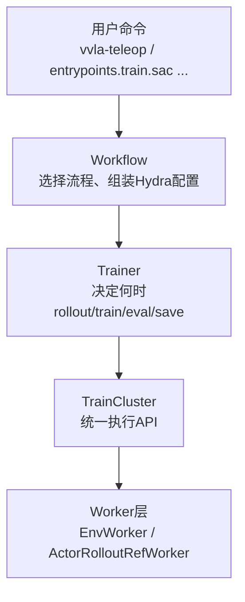

# 第 01 章 全景图：verl-vla 在解决什么问题

> 本章回答三个问题：verl-vla 是什么、它在解决什么工程矛盾、整体架构分几层。

## 知识链接

- [SAC (Soft Actor-Critic)](/前置知识/000k_前置知识_SAC_Soft_Actor_Critic)
- [行为克隆与 RL 微调范式](/前置知识/000d_前置知识_行为克隆与RL微调范式)
- [系列目录](./index)

---

## 1. verl-vla 一句话定义

verl-vla 是字节跳动在开源分布式训练框架 [verl](https://github.com/verl-project/verl)（专注 LLM 的 RLHF 训练引擎）基础上，扩展出的**面向机器人 VLA（Vision-Language-Action）策略的统一后训练框架**。

"后训练"（post-training）在这里指的是：拿到一个预训练好的机器人策略之后，接下来要做的所有事情——收集人类演示数据、做监督微调、跑强化学习提升成功率、评估策略、必要时人工介入纠正错误动作。verl-vla 把这一整条链路用**一套共享的执行架构**串起来。

## 2. 它解决什么工程矛盾

机器人策略的后训练比 LLM 的 RLHF 复杂在一个地方：**LLM 的"环境"就是自己的 tokenizer 和采样器，而机器人策略的环境是真实的物理仿真器或者真机**。这带来两个直接后果：

**后果一：环境的计算特征和模型完全不同。** 模型推理是 GPU 密集型的张量计算；环境交互（物理仿真步进、渲染、真机通信）往往是 CPU 密集型甚至需要独占硬件资源（一台真机只能被一个进程控制）。两者需要不同的并行策略和资源分配。

**后果二：训练全流程不是单一模式。** 同一个机器人任务，可能需要：先跑人机协同遥操作采集示教数据，再用这些数据做监督微调（SFT），再用强化学习（SAC/PPO）继续提升，中间还要不停跑评估（eval）看策略有没有变好，遇到策略卡住的场景还要允许人工实时接管纠正（intervention）。

如果每种模式都单独写一套"环境+模型+分布式"的代码，会导致环境适配代码、模型适配代码在 SFT/RL/eval/遥操作四套流水线里各写一遍——四倍的维护成本，而且四套代码之间的行为很容易不一致（比如 eval 时环境的 reset 逻辑和 SFT 训练时对不上）。

verl-vla 的解法是：把"模型执行"和"环境执行"都抽象成统一契约，用同一个 `TrainCluster` 抽象承载所有训练模式共用的分布式执行逻辑（worker 编排、资源分配、权重同步、checkpoint），让 SFT、RL、评估、数据采集调用同一套底层组件，只是组合方式不同。

## 3. 三层架构：Workflow → Trainer → TrainCluster

verl-vla 把"用户想跑什么"和"每种训练算法怎么更新模型"和"分布式系统怎么执行"拆成三层，职责边界非常清晰：

**Workflow（工作流层）**：每个用户入口对应一个 workflow。它负责组合 Hydra 配置、创建所需的 `TrainCluster`、选定并配置 trainer、在多阶段流程里传递数据集和 checkpoint。比如最简单的 SFT workflow 只创建一个 cluster、挂一个 SFT trainer、跑 `fit()`；而 RECAP workflow（第 09 章详解）要串联评估、采集、训练 value model、训练 policy 四个阶段的 cluster。

**Trainer（训练器层）**：专注"这个算法怎么推进"——什么时候该采集数据、什么时候该更新参数、什么时候评估、什么时候存 checkpoint、什么时候该停。它通过 `TrainCluster` 暴露的高层操作（`rollout()`/`train()`/`eval()`）来表达这套逻辑，不直接管理 worker 的分布式细节。

**TrainCluster（执行抽象层）**：核心执行抽象，第 02 章详细展开。它把模型训练、策略推理、环境交互、评估、数据录制、checkpoint 这些操作统一成一套简洁 API，屏蔽掉底层 Ray worker group、资源池、模拟器进程等细节。

这个分层带来的好处是**可复用性**：同一个 SAC trainer 可以在不同的 `TrainCluster` 拓扑（第 02 章的四种集群拓扑）上运行而不用改代码；同一套环境集成代码同时服务于训练 rollout、评估、人机协同数据采集——因为它们都走同一个 `BaseEnv` 契约（第 07 章）。

## 4. 支持的模型、环境与算法一览

verl-vla 目前内置的集成（README 明确列出）：

| 领域 | 支持项 |
|---|---|
| 模型 | ACT、Pi0.5、GR00T N1.6 |
| 环境/机器人 | LIBERO（仿真基准）、Isaac Lab Arena（大规模仿真）、Piper（真机机械臂） |
| 训练算法 | SFT、SAC 系（含 DSRL 扩散/流策略微调）、RECAP |
| 人机输入设备 | 键盘、游戏手柄、XR 控制器、LeRobot leader arm |

这个列表看起来是四个独立维度，但正是三层架构让它们能自由组合：任何一个模型都可以插到任何一种环境上跑 SAC 或者 SFT，只要模型实现了对应的训练契约（第 05 章）、环境实现了 `BaseEnv` 契约（第 07 章）。

## 5. 后续章节的阅读路线

接下来的路线沿着"分布式执行核心 → 模型与算法 → 数据与训练循环"展开：

- 第 02-04 章讲 `TrainCluster`、`EnvLoop` 流水线、Worker 体系——回答"分布式系统怎么把 model 和 env 粘合起来跑"
- 第 05-06 章讲模型集成契约和 Flow-SDE/DSRL——回答"一个天生没有随机性的生成式策略，是怎么被改造成能做 SAC 的 actor-critic"
- 第 07-09 章讲环境集成、SAC 训练循环细节、RECAP 工作流——回答"数据从哪来、怎么流动、算法具体怎么用这些数据"
- 第 10 章是配置与实战速查

下一章从 `TrainCluster` 的四种集群拓扑开始，看它是怎么用一套 API 覆盖从"纯离线 SFT"到"在线人机协同 RL"的全部场景。

## 下章预告

[第 02 章](./02_TrainCluster四种集群拓扑与生命周期) 讲 `TrainCluster` 的四种集群拓扑（`actor_cluster`/`env_cluster`/`env_actor_rollout_cluster`/`env_rollout_cluster`）分别对应什么训练场景，以及它的 `start()`/`rollout()`/`train()`/`eval()` 等核心 API 具体做了什么。
