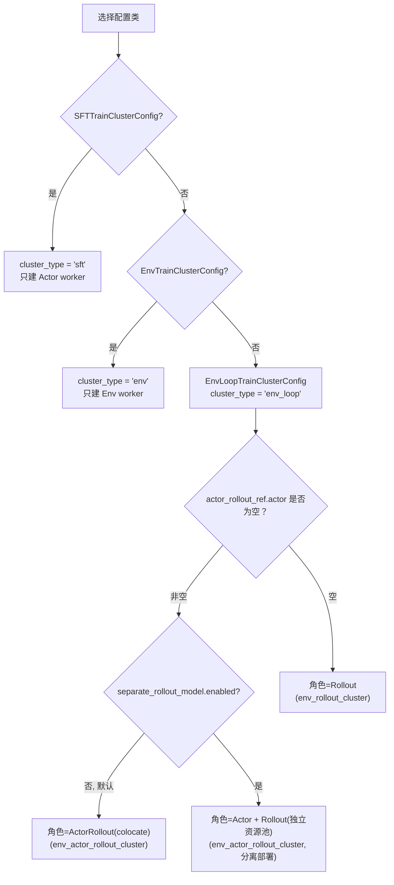

# 第 02 章 TrainCluster：四种集群拓扑与生命周期

> 前情提要：第 01 章讲了 workflow → trainer → TrainCluster 的三层架构。这一章把 TrainCluster 打开，看它怎么用一套 API 覆盖训练、评估、遥操作、纯环境交互四种截然不同的场景。

## 知识链接

- 上一章：[全景图：verl-vla 在解决什么问题](./01_全景图_verl-vla在解决什么问题)
- 下一章：[EnvLoop 流水线：异步 rollout 与部署形态](./03_EnvLoop流水线_异步rollout与部署形态)
- [系列目录](./index)
- 如果对 Ray 分布式计算的 Placement Group、Actor 概念不熟悉，可以把它们简单理解为"一组预留的 CPU/GPU 资源"和"运行在这组资源上的一个长驻进程"

---

## 1. 为什么需要一个统一的执行抽象

设想不用这个抽象会怎样：SFT trainer 要直接调用 Ray API 创建 worker group、算好 placement group、管理 checkpoint 路径；SAC trainer 除了这些还要额外管理环境 worker、处理 rollout 和训练的异步调度、处理 actor 和 rollout 权重是否需要同步。这些逻辑几乎不依赖具体算法，纯粹是"分布式系统怎么把资源用起来"的问题，理应被抽出去一层。

`TrainCluster`（`train_cluster/cluster.py`）就是这一层。它把上述所有分布式细节封装成 8 个核心方法：`start()`、`shutdown()`、`rollout()`、`train()`、`eval()`、`record()`、`replay()`、`update_weights()`、`load_checkpoint()`/`save_checkpoint()`。Trainer 只需要按顺序调用这些方法，不用知道底层到底起了几个 Ray actor、模拟器跑在哪个进程里。

## 2. 四种集群拓扑，对应四种使用场景

`TrainCluster` 支持四种"角色组合"，通过传入不同的配置类自动决定：

| 拓扑 | 包含角色 | 典型场景 |
|---|---|---|
| `actor_cluster` | 仅 Actor | 离线 SFT 式训练——只需要喂数据训模型，不用跟环境交互 |
| `env_actor_rollout_cluster` | Env + Actor(+Rollout) | 在线交互式强化学习（SAC/PPO）——既要跑环境采数据，又要用采到的数据更新模型 |
| `env_rollout_cluster` | Env + Rollout（无 Actor） | 纯推理场景：评估、自主采集、DAgger 数据收集——只跑策略推理，不更新参数 |
| `env_cluster` | 仅 Env | 人机协同遥操作、演示录制、轨迹回放——完全不需要模型 worker |

一个直觉：**拓扑越"重"，包含的角色越多**，从"只有环境"到"环境+推理"再到"环境+训练+推理"。选择哪种拓扑取决于这次运行到底要不要更新模型参数、要不要跟环境交互。

代码层面，这四种拓扑其实收敛成**三条内部执行路径**（`cluster_type` 取值 `"sft"`/`"env"`/`"env_loop"`），值得专门讲清楚：



也就是说 `env_actor_rollout_cluster` 内部还分两种子形态——**colocate**（Actor 和 Rollout 共享同一批 worker、同一份权重）和**disaggregated**（Actor 和 Rollout 是物理上独立的两组 worker，需要显式同步权重）。这个区分对性能影响很大，第 03、04 章会展开讲。

## 3. 资源池怎么落到 Ray Worker

`TrainCluster._build_resource_pool_plan()` 是拓扑到具体资源池的翻译层，核心逻辑（简化版）：

```python
if self.cluster_type == "sft":
    self._add_resource_pool(pool_name="train_rollout_pool", resource=self.config.resource.model)
    self.role_to_pool = {Role.Actor: "train_rollout_pool"}

elif self.cluster_type == "env":
    env_pool_name = "env_cpu_pool" if resource.env.device == "cpu" else "env_gpu_pool"
    self._add_resource_pool(pool_name=env_pool_name, resource=resource.env)
    self.role_to_pool[Role.Env] = env_pool_name

elif self.cluster_type == "env_loop":
    # 先建 env 池（总是独立）
    self._add_resource_pool(pool_name=env_pool_name, resource=resource.env)
    self.role_to_pool[Role.Env] = env_pool_name
    if resource.separate_rollout_model.enabled:
        # disaggregated: 两个独立池
        self._add_resource_pool(pool_name="train_pool", resource=resource.model)
        self._add_resource_pool(pool_name="rollout_pool", resource=resource.separate_rollout_model)
        self.role_to_pool[Role.Actor] = "train_pool"
        self.role_to_pool[Role.Rollout] = "rollout_pool"
    else:
        # colocate: 一个池，角色取决于有没有 actor
        self._add_resource_pool(pool_name="train_rollout_pool", resource=resource.model)
        role = Role.ActorRollout if self.config.actor_rollout_ref.actor is not None else Role.Rollout
        self.role_to_pool[role] = "train_rollout_pool"
```

**这段代码在做什么**：把"用户在配置里选的拓扑"翻译成"需要几个资源池、每个池装什么角色"。`Role` 是个枚举（`Actor`/`Rollout`/`ActorRollout`/`Env`），每个角色最终对应到一个 Ray Worker 类（第 04 章详细展开 `VLAActorRolloutRefWorker`/`EnvWorker` 的具体实现）。

`ResourceConfig`（`train_cluster/config.py`）描述一个资源池的物理规格：

```python
@dataclass
class ResourceConfig(BaseConfig):
    device: str = "cuda"                # "cpu" | "cuda"
    resource_label: str | None = None   # Ray 自定义资源标签，用于节点亲和性调度
    nnodes: int = 1
    gpus_per_node: int = 1
    workers_per_node: int = 1           # 仅 device="cpu" 时生效
```

worker 总数的计算规则很直接：GPU 池 = `nnodes * gpus_per_node`（每个 worker 独占一块 GPU）；CPU 池 = `nnodes * workers_per_node`。`resource_label` 允许把某个池强制调度到带特定标签的 Ray 节点上——比如把渲染密集的仿真环境放到有渲染卡的节点，把训练放到纯算力节点。

拿到 `resource_pool_spec`（池名 → 每节点进程数的映射）之后，`resource_pool.py::VLARayResourcePool.get_placement_groups()` 才真正调用 Ray 的 `placement_group()` API 申请物理资源：

```python
resource_bundle = {"CPU": self.max_colocate_count}
if self.use_gpu:
    resource_bundle[ray_device_name] = 1     # 每个 worker 占 1 块 GPU
if self.accelerator_type is not None:
    resource_bundle[self.accelerator_type] = 1e-4   # 极小配额实现"软约束"节点标签
bundle_groups = [[resource_bundle.copy() for _ in range(process_count)] for process_count in self._store]
placement_groups = [placement_group(bundles=bundles, strategy=strategy, ...) for bundles in bundle_groups]
ray.get([pg.ready() for pg in placement_groups])   # 阻塞等待资源真正到位
```

值得注意的细节：`resource_label` 对应的自定义资源只占 `1e-4` 的极小配额——这是个常见技巧：Ray 的自定义资源本身不表示真实算力，只用来做"这个 bundle 必须调度到带此标签的节点"的软约束，塞一个极小值既能满足约束又不会额外抢占配额。

在真正建池之前，`VLAResourcePoolManager._check_resource_available()` 会用 `ray._private.state.available_resources_per_node()` 汇总集群当前可用的 GPU/NPU 总数，跟本次拓扑需要的总数比较，不够就直接报错——**快速失败**而不是等到调度阶段才因为资源不足挂起。

## 4. 生命周期：`start()` 与 `shutdown()`

`start()` 依次做四件事：

1. 调 `_build_resource_pool_plan()` 算出资源池方案
2. 用 `VLAResourcePoolManager` 真正建 Ray placement group
3. `_init_workers()`：给每个角色建 `RayWorkerGroup`，对模型类 worker 调 `init_model()`（触发权重加载/FSDP 初始化），对 env worker 调 `init_worker()`（触发模拟器子进程启动）
4. 若是 `env_loop` 拓扑，额外构造 `EnvLoop`（第 03 章的重点）和（disaggregated 场景下的）`CheckpointEngineManager`

`shutdown()` 做的事情正好相反，但有个容易忽略的细节——**去重 kill**：

```python
seen_actor_ids = set()
for worker_group in self.worker_groups.values():
    for worker in getattr(worker_group, "_workers", []):
        actor_id = ...
        if actor_id in seen_actor_ids:
            continue    # colocate 场景下 actor_rollout 组和其他角色可能共享同一批 Ray actor
        ray.kill(worker, no_restart=True)
```

原因是 colocate 拓扑下，`worker_groups["actor"]` 和 `worker_groups["actor_rollout"]` 可能指向**同一批 Ray actor**（因为它们本来就是一组进程扮演两个角色），不去重会导致对同一个已经被杀死的 actor 再次调用 `ray.kill` 报错。

## 5. 训练与交互操作

### `rollout(async_rollout=False)`：同步与异步两条路

同步模式直接调 `_rollout_once()`：拿上一轮缓存的 `reset_future`（如果没有就现场发一次环境 reset）、调用 `env_loop.generate_sequences()` 跑一批交互、返回轨迹（`DataProto` 格式）、收集到的 LeRobot 数据集、以及 rollout 指标。

异步模式（要求 `separate_rollout_model.enabled=True`，即 disaggregated 部署）实现了一个**双缓冲流水线**：

```python
def rollout(self, *, async_rollout=False):
    if async_rollout:
        if self._pending_rollout_ref is None:
            self._pending_rollout_ref = ray_rollout_once.remote(self.env_loop, self.config, self.rollout_state)
        output, collected_datasets, metrics, self.rollout_state = ray.get(self._pending_rollout_ref)
        self.update_weights()          # 取到上一轮结果后，顺手把最新权重同步给 rollout worker
        self._pending_rollout_ref = ray_rollout_once.remote(self.env_loop, self.config, self.rollout_state)  # 立刻发起下一轮，不等它跑完
        return output, collected_datasets, metrics
```

**这段代码在做什么**：先取回"上一次调用时已经在后台跑的那一轮 rollout"的结果，立刻发起"下一轮 rollout"（不等待，后台继续跑），中间趁机把 actor 最新的权重同步给独立的 rollout worker。效果是——训练循环调用 `rollout()` 拿到数据的时候，下一批数据已经在另一批 GPU 上开始采集了，训练时间和采集时间重叠。这只有在 actor 和 rollout 物理上是不同 worker（disaggregated）时才有意义，因为 colocate 场景下同一批 GPU 不能同时做训练和推理。

### `train(data, async_update=True)`：转发给 actor worker group

```python
def train(self, data: DataProto, *, async_update: bool = True) -> Any:
    actor_wg = self.actor_worker_group
    return actor_wg.update_actor_async(data) if async_update else actor_wg.update_actor(data)
```

真正的算法逻辑（SAC 的 critic/actor 更新、SFT 的 loss 计算）在 worker 层实现（第 04、08 章），`TrainCluster.train()` 只是统一入口。

### `update_weights()`：一套 API 兼容两种部署形态

```python
def update_weights(self) -> None:
    assert self.cluster_type == "env_loop"
    if self.config.resource.separate_rollout_model.enabled:
        self.checkpoint_engine_manager.update_weights()
    # colocate 场景：什么都不做
```

这是本章最值得记住的设计范式：**colocate 模式下 `update_weights()` 是纯 no-op**，因为 actor 和 rollout 共享同一份权重内存，天然同步，不需要显式操作；**disaggregated 模式下才真正触发权重广播**（通过 `CheckpointEngineManager` 把 actor 侧导出的 tensor 逐个拷贝到独立的 rollout worker）。调用方永远只需要调 `update_weights()`，不用关心当前是哪种部署形态——这正是"用一套 API 屏蔽底层差异"的典范。

### `eval(max_episodes)`：跑评估 benchmark

按每个任务的 benchmark 规模均分 `target_episodes` 配额，循环调用 `env_wg.reset_env(mode="eval")` + `env_loop.generate_sequences(eval=True)`，用环境返回的 `eval_episode_id` 去重（避免同一个评估用例被重复计入），直到收集够指定数量的完整轨迹，最后统计整体和分任务的成功率、回报、episode 长度。

### `record()` / `replay()`：人机协同专用

两者都要求 `cluster_type == "env"` 且**只能有一个** env worker（多副本并行遥操作没有意义，人只能同时操作一个环境）。`record()` 触发阻塞式的人工操作/脚本采集循环，完成后拉取各 rank 产生的 LeRobot 数据集并合并；`replay()` 直接转发到环境的 `replay_episode()`，用于验证录制/回放的正确性。

## 6. Checkpoint：谁的职责边界在哪

`load_checkpoint()`/`save_checkpoint()` 转发到 `CheckpointHelper`（第 04 章会看到它只服务 actor worker），职责边界很清晰：**`TrainCluster` 决定"什么时候该 load/save"，`CheckpointHelper` 决定"具体路径解析和恢复策略"，Worker 决定"怎么把这份 checkpoint 序列化成磁盘文件"**。有一个细节值得记住：disaggregated 模式下 `load_checkpoint()` load 完必须手动调一次 `update_weights()`，因为独立的 rollout worker 不会自动感知到 actor checkpoint 发生了变化：

```python
def load_checkpoint(self):
    checkpoint_state = self.checkpoint_helper.load()
    if self.cluster_type == "env_loop" and self.config.resource.separate_rollout_model.enabled:
        self.update_weights()
    return checkpoint_state
```

## 小结

| 概念 | 要点 |
|---|---|
| 四种拓扑 | actor_cluster / env_cluster / env_actor_rollout_cluster / env_rollout_cluster，内部收敛成 3 条执行路径（sft/env/env_loop） |
| env_loop 二次分叉 | colocate（默认，省显存但训练/推理串行）vs disaggregated（独立资源，可并行但需同步权重） |
| ResourceConfig | device/nnodes/gpus_per_node/workers_per_node 四个字段决定 worker 总数 |
| resource_label | 通过极小配额（1e-4）实现节点软约束，不真实占用算力 |
| 快速失败 | 建池前检查集群总资源是否够，不够立刻报错 |
| update_weights() | colocate 下是 no-op，disaggregated 下才真正广播权重——一套 API 兼容两种部署形态 |
| 异步 rollout | 要求 disaggregated；用"取上轮结果+立刻发下一轮+顺手同步权重"实现训练与采集重叠 |

## 下章预告

[第 03 章](./03_EnvLoop流水线_异步rollout与部署形态) 深入 `EnvLoop`——它是真正驱动"模型推理→环境执行→模型推理"交替循环的调度器。会讲清楚 `pipeline_stage_num` 到底是什么、为什么两个 stage 能让 GPU 推理和 CPU/物理仿真时间重叠、以及 colocate 模式下 FSDP 权重是怎么在"训练态"和"推理态"之间切换的。
